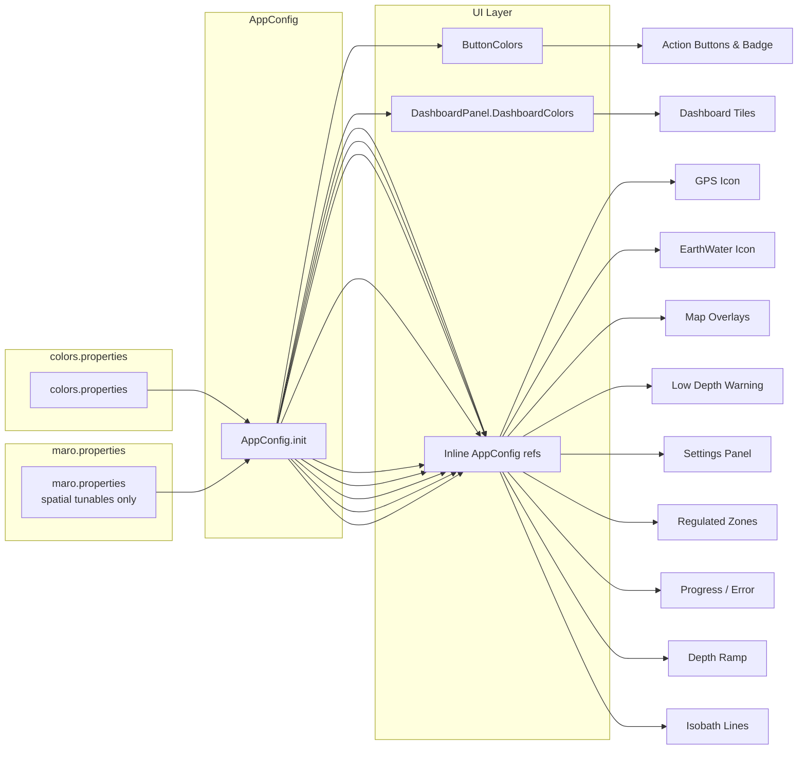

<!-- scope: reference -->
# Maro-II Color Scheme

> Canonical reference for all colour tokens used in the Maro-II app.
> All colours are loaded at runtime from
> [`colors.properties`](../app/src/main/assets/colors.properties) via
> [`AppConfig.init()`](../app/src/main/java/ykws/android/maro/config/AppConfig.kt).
> Edit the `.properties` file, rebuild the APK — no code changes needed.
>
> 🎨  Swatches show the actual colour.

---

## 1. Dashboard Palette

**Property prefix:** `ui.dashboard.*`
**Source:** [`colors.properties`](../app/src/main/assets/colors.properties) → `AppConfig.uiDashboard*`

### Backgrounds & Text

| Token | Value | Swatch | Usage |
|---|---|---|---|
| `ui.dashboard.background` | `#1A1A2E` |  | Dashboard outer panel, settings overlay fullscreen bg |
| `ui.dashboard.card.background` | `#16213E` |  | Dashboard tile cards, exit-toast surface |
| `ui.dashboard.text.primary` | `#E0E0E0` |  | Dashboard tile labels and values |
| `ui.dashboard.text.muted` | `#90A4AE` |  | Secondary/muted text labels |

### Semantic Status Colours

| Token | Value | Swatch | Usage |
|---|---|---|---|
| `ui.dashboard.status.success` | `#CC4CAF50` |  | General OK, validation passed |
| `ui.dashboard.status.warning` | `#CCEF6C00` |  | Caution, validation warning |
| `ui.dashboard.status.error` | `#CCB71C1C` |  | Error / alert (dark red) |
| `ui.dashboard.status.neutral` | `#AA4FC3F7` |  | Neutral/informational (cyan, 67% alpha) |
| `ui.dashboard.status.absent` | `#AA37474F` |  | Absent/no-data (blue-grey, 67% alpha) |

### Aliased Tokens

| Token | Resolves To | Usage |
|---|---|---|
| `ui.dashboard.zone.safe` | `${ui.dashboard.status.success}` → `#CC4CAF50` | Zone status: speed-safe |
| `ui.dashboard.zone.compliant` | `${ui.dashboard.status.success}` → `#CC4CAF50` | Zone status: speed-compliant |
| `ui.dashboard.zone.normal` | `${ui.dashboard.status.absent}` → `#AA37474F` | Zone status: normal (no-data) |
| `ui.dashboard.distance.exit` | `${ui.dashboard.status.success}` → `#CC4CAF50` | Exiting to open sea |
| `overlay.lowDepth.color` | `${ui.dashboard.status.error}` → `#CCB71C1C` | Low-depth warning overlay |
| `status.gps.healthy` | `${ui.dashboard.status.success}` → `#CC4CAF50` | GPS healthy |
| `status.earthWater.land` | `${ui.dashboard.status.success}` → `#CC4CAF50` | On land |
| `regulatedZone.type.environmental` | `${ui.dashboard.status.success}` → `#CC4CAF50` | Environmental zones |
| `map.zoneAhead.line` | `${ui.dashboard.status.success}` → `#CC4CAF50` | Zone-ahead direction line |
| `map.isobar.litto3d.color` | `${ui.dashboard.status.success}` → `#CC4CAF50` | Litto3D isobath lines |

### Zone / Speed Status Colours

| Token | Value | Swatch | Usage |
|---|---|---|---|
| `ui.dashboard.zone.caution` | `#EF6C00` |  | Speed borderline inside zone |
| `ui.dashboard.zone.danger` | `#C62828` |  | Speed > limit inside zone |
| `ui.dashboard.zone.dangerDark` | `#B71C1C` |  | In-zone danger (dark red) |
| `ui.dashboard.distance.entry` | `#E65100` |  | Zone boundary ahead (amber) |

### Alpha Constants

| Token | Value | Usage |
|---|---|---|
| `ui.dashboard.dullAlpha` | `0.33` | Subdued dashboard states: no-data, on-land, far-from-zone |

### Depth Readout Tints

| Token | Value | Swatch | Usage |
|---|---|---|---|
| `ui.dashboard.readout.collision` | `#FFEF5350` |  | Depth ≤ 5 m (collision band) |
| `ui.dashboard.readout.shallow` | `#FFFFB74D` |  | Depth ≤ 10 m (shallow tier) |
| `ui.dashboard.readout.deep` | `#FF4FC3F7` |  | Depth > 10 m (profiling cyan) |

---

## 2. Round Action Button Colours

**Property prefix:** `ui.button.*`
**Source:** [`colors.properties`](../app/src/main/assets/colors.properties) → `AppConfig.buttonAction*` → [`ButtonColors`](../app/src/main/java/ykws/android/maro/ui/map/FanIconComponents.kt:30)

Affects right-edge control-stack buttons (settings gear, zoom +/−, layer toggles), the fan parent button, and the active-child badge.

| Token | Value | Swatch | Usage |
|---|---|---|---|
| `ui.button.background` | `#CC16213E` |  | Button circle fill (80% dark blue) |
| `ui.button.icon` | `#E0E0E0` |  | Icon symbols (gear, +/−, layer glyphs, layer stripes) |
| `ui.button.icon.active.alpha` | `1.0` | — | Icon opacity when toggle is ON |
| `ui.button.icon.inactive.alpha` | `0.25` | — | Icon opacity when toggle is OFF |
| `ui.button.badge.text` | `#E0E0E0` |  | Badge count text |
| `ui.button.badge.active.alpha` | `1.0` | — | Badge opacity when enabled (≥1 active child) |
| `ui.button.badge.inactive.alpha` | `0.25` | — | Badge opacity when disabled (0 active children) |

**Badge rendering:** Badge background uses `ui.button.background` (same as button fill). Alpha multiplies with the baked-in 80% opacity. Enabled = 80% opaque, disabled = 20% opaque.

**Toggle state logic:** Active = `icon` at full alpha; Inactive = `icon` at 25% alpha. Same hue, alpha-only distinction.

---

## 3. Navigation Aids

**Property prefix:** `map.navigation.*`
**Source:** [`colors.properties`](../app/src/main/assets/colors.properties) → `AppConfig.mapNavigation*`
**Usage:** [`MapScreen.kt`](../app/src/main/java/ykws/android/maro/ui/map/MapScreen.kt)

| Token | Value | Swatch | Usage |
|---|---|---|---|
| `map.navigation.arrow.color` | `#1565C0` |  | Heading/speed cap arrow (boat marker) |
| `map.navigation.line.color` | `#4D1565C0` |  | Direction line from boat center (30% alpha blue) |

---

## 4. Map Overlay Colours

**Source:** [`colors.properties`](../app/src/main/assets/colors.properties) → `AppConfig.*`

### Coastlines

| Token | Value | Swatch | Usage |
|---|---|---|---|
| `map.coastline.mainland.color` | `#1545C0` |  | Mainland coastline stroke |
| `map.coastline.island.color` | `#08805C` |  | Island coastline stroke |

### Hazard Discs

| Token | Value | Swatch | Usage |
|---|---|---|---|
| `map.hazard.disc.fill` | `#FFE800` |  | Vivid yellow fill for offshore danger discs |
| `map.hazard.outline` | `#000000` |  | Black outline ring + cross |

### Zone-Ahead Line & Cone

| Token | Value | Swatch | Usage |
|---|---|---|---|
| `map.zoneAhead.line` | `${ui.dashboard.status.success}` → `#CC4CAF50` |  | Dashed line to zone intersection |
| `map.zoneAhead.cone.fill` | `#FFEB00` |  | Translucent yellow cone fill |
| `map.zoneAhead.cone.outline` | `#FFC800` |  | Cone outline |

### 300 m Band

| Token | Value | Swatch | Usage |
|---|---|---|---|
| `map.zone300.fill` | `#30E53935` |  | Water-only fill (~19% alpha) |
| `map.zone300.boundary` | `#E53935` |  | Seaward boundary line |

### Depth Overlay

| Token | Value | Swatch | Usage |
|---|---|---|---|
| `map.depth.nodata.color` | `#60FFF59D` |  | NoData cells (pale yellow, ~38% alpha) |
| `overlay.lowDepth.color` | `${ui.dashboard.status.error}` → `#CCB71C1C` |  | Low-depth warning (alpha depth-graded at runtime) |
| `overlay.lowDepth.minOpacity` | `25` | — | Minimum opacity % at threshold depth |

---

## 5. Depth Colour Ramp

**Property prefix:** `map.depth.ramp.*`
**Source:** [`colors.properties`](../app/src/main/assets/colors.properties) → `AppConfig.mapDepthRamp*`

The hypsometric ramp interpolates between shallow (pale cyan) and deep (navy) endpoints, with a red-orange warning blend in the 0–5 m collision band.

| Token | Default | Usage |
|---|---|---|
| `map.depth.ramp.shallow.r` | `200` | Shallow end red channel |
| `map.depth.ramp.shallow.g` | `232` | Shallow end green channel |
| `map.depth.ramp.shallow.b` | `255` | Shallow end blue channel |
| `map.depth.ramp.deep.r` | `10` | Deep end red channel |
| `map.depth.ramp.deep.g` | `30` | Deep end green channel |
| `map.depth.ramp.deep.b` | `90` | Deep end blue channel |
| `map.depth.ramp.warning.r` | `255` | Collision warning blend red |
| `map.depth.ramp.warning.g` | `80` | Collision warning blend green |
| `map.depth.ramp.warning.b` | `60` | Collision warning blend blue |
| `map.depth.ramp.alpha` | `160` | Overlay alpha (0–255) |

---

## 6. GPS & EarthWater Status Icons

**Property prefix:** `status.gps.*` / `status.earthWater.*`
**Source:** [`colors.properties`](../app/src/main/assets/colors.properties) → `AppConfig.status*`
**Usage:** [`MapScreen.kt`](../app/src/main/java/ykws/android/maro/ui/map/MapScreen.kt)

44×44 dp rounded square in top-left of the map.

### GPS Icon

| State | Token | Default | Swatch | Alpha |
|---|---|---|---|---|
| DEMO | `status.gps.demo` | `#FFFFFF` |  | `status.gps.alpha.dimmed` = 0.50 |
| ACQUIRING | `status.gps.acquiring` | `#FFA726` |  | `status.gps.alpha.active` = 0.75 |
| HEALTHY | `status.gps.healthy` | `${ui.dashboard.status.success}` = `#CC4CAF50` |  | `status.gps.alpha.active` = 0.75 |
| IDLE | `status.gps.idle` | `#1565C0` |  | `status.gps.alpha.active` = 0.75 |
| STALE | `status.gps.stale` | `#F44336` |  | `status.gps.alpha.active` = 0.75 |

| Alpha Token | Default | Usage |
|---|---|---|
| `status.gps.alpha.active` | `0.75` | GPS active states + Earth/Water active background |
| `status.gps.alpha.dimmed` | `0.50` | GPS DEMO state + informational regulated zone icons |

### Earth/Water Icon

| State | Token | Default | Swatch | Alpha |
|---|---|---|---|---|
| Water (active) | `status.earthWater.water` | `#1565C0` |  | `status.gps.alpha.active` = 0.75 |
| Land (active) | `status.earthWater.land` | `${ui.dashboard.status.success}` = `#CC4CAF50` |  | `status.gps.alpha.active` = 0.75 |
| Inactive | `status.earthWater.inactive` | `#EEFFFFFF` |  | — |

---

## 7. Settings Overlay

**Property prefix:** `ui.settings.*`
**Source:** [`colors.properties`](../app/src/main/assets/colors.properties) → `AppConfig.uiSettings*`

### Background & Layout

| Token | Default | Swatch | Usage |
|---|---|---|---|
| `ui.settings.background` | `#1A1A2E` |  | Fullscreen settings overlay background |
| `ui.settings.card.background` | `#1AFFFFFF` |  | Section card surfaces (~10% white) |
| `ui.settings.divider` | `#14FFFFFF` |  | Dividers between sections (~8% white) |

### Text

| Token | Default | Swatch | Usage |
|---|---|---|---|
| `ui.settings.text.primary` | `#FFFFFFFF` |  | Section titles, primary labels |
| `ui.settings.text.muted` | `#FFB0BEC5` |  | Descriptive text, switch labels |
| `ui.settings.text.secondary` | `#FF78909C` |  | Tab inactive text, secondary info |
| `ui.settings.footer.text` | `#FF546E7A` |  | Version footer text |

### Interactive Elements

| Token | Default | Swatch | Usage |
|---|---|---|---|
| `ui.settings.accent` | `#FF1565C0` |  | Switch thumb/track, slider, buttons, selected tab indicator |
| `ui.settings.switch.track.inactive` | `#33FFFFFF` |  | Switch track when unchecked (20% white) |
| `ui.settings.input.border` | `#66FFFFFF` |  | Unfocused text field border (40% white) |
| `ui.settings.danger` | `#FFE53935` |  | Delete/danger buttons |

### Toast

| Token | Default | Swatch | Usage |
|---|---|---|---|
| `ui.settings.toast.background` | `#16213E` |  | Exit-toast surface |
| `ui.settings.toast.text` | `#FFFFFF` |  | Exit-toast text |

---

## 8. Regulated Zone Type Colours

**Property prefix:** `regulatedZone.type.*`
**Source:** [`colors.properties`](../app/src/main/assets/colors.properties) → `AppConfig.regulatedZoneType*`
**Usage:** [`RegulatedZoneIconProvider.kt`](../app/src/main/java/ykws/android/maro/ui/map/RegulatedZoneIconProvider.kt), [`MapScreen.kt`](../app/src/main/java/ykws/android/maro/ui/map/MapScreen.kt)

| Token | Default | Swatch | Zone Type |
|---|---|---|---|
| `regulatedZone.type.speedLimit` | `#FF1565C0` |  | Speed limit zones |
| `regulatedZone.type.anchoringProhibited` | `#FFFF8F00` |  | Anchoring prohibited |
| `regulatedZone.type.accessProhibited` | `#FFE53935` |  | Access prohibited |
| `regulatedZone.type.environmental` | `${ui.dashboard.status.success}` → `#CC4CAF50` |  | Environmental protection |
| `regulatedZone.type.mooring` | `#FF00897B` |  | Mooring areas |
| `regulatedZone.type.fishingProhibited` | `#FFFDD835` |  | Fishing prohibited |
| `regulatedZone.type.navigationRestriction` | `#FF8E24AA` |  | Navigation restriction |
| `regulatedZone.type.other` | `#FF78909C` |  | Other / uncategorised |

---

## 9. Progress & Error Overlay

**Property prefix:** `ui.progress.*` / `ui.error.*`
**Source:** [`colors.properties`](../app/src/main/assets/colors.properties) → `AppConfig.uiProgress*` / `uiError*`

### Progress Bar

| Token | Default | Swatch | Usage |
|---|---|---|---|
| `ui.progress.accent` | `#FF1565C0` |  | Progress bar fill, title, percentage text |
| `ui.progress.track` | `#401565C0` |  | Progress bar track background (~25% accent) |

### Error Card

| Token | Default | Swatch | Usage |
|---|---|---|---|
| `ui.error.card` | `#CCC62828` |  | Error card background (dark red, 80%) |
| `ui.error.text` | `#EEFFFFFF` |  | Error message text (93% white) |
| `ui.error.button.background` | `#FFFFFFFF` |  | Retry button background |
| `ui.error.button.text` | `#FFC62828` |  | Retry button text |

---

## 10. Isobath Colours & Stroke Widths

**Property prefix:** `map.isobar.*`
**Source:** [`colors.properties`](../app/src/main/assets/colors.properties) → `AppConfig.isobarColors` / `isobarWidthBonuses`

| Token | Default | Swatch | Usage |
|---|---|---|---|
| `map.isobar.litto3d.color` | `${ui.dashboard.status.success}` → `#CC4CAF50` |  | Litto3D isobath lines |
| `map.isobar.emodnet.color` | `#FF00008B` |  | EMODnet isobath lines |
| `map.isobar.default.color` | `#FF37474F` |  | Fallback for unlisted sources |
| `map.isobar.litto3d.width` | `+1` | — | Litto3D line width bonus (px) |
| `map.isobar.emodnet.width` | `-1` | — | EMODnet line width bonus (px) |

---

## 11. Colour Flow Diagram

Change a colour: edit `colors.properties`, rebuild APK. No code changes needed.
