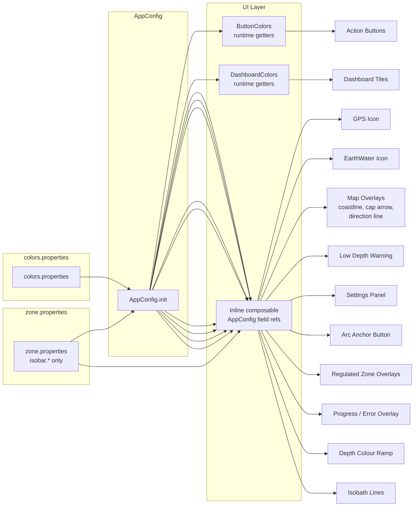

<!-- scope: reference -->
# Maro-II Color Scheme

> Canonical reference for all colour tokens used in the Maro-II app.
> All colours are now loaded at runtime from
> [`colors.properties`](../app/src/main/assets/colors.properties) via
> [`AppConfig.init()`](../app/src/main/java/ykws/android/maro/ui/map/AppConfig.kt:126).
> Edit the `.properties` file, rebuild the APK — no code changes needed.
>
> 🎨  Swatches show the actual colour.

---

## 1. Dashboard Palette (hardcoded)

**Source:** [`DashboardPanel.kt:46`](../app/src/main/java/ykws/android/maro/ui/map/DashboardPanel.kt:46) — `DashboardColors` object.

### Backgrounds & Text

| Token | Value | Swatch | Usage |
|---|---|---|---|
| `background` | `0xFF1A1A2E` |  | Dashboard outer panel, Settings overlay fullscreen bg |
| `cardBg` | `0xFF16213E` |  | Dashboard tile cards, exit-toast Surface |
| `textPrimary` | `0xFFE0E0E0` |  | Dashboard tile labels and values |
| `textMuted` | `0xFF90A4AE` |  | Secondary/muted text labels |

### Semantic Status Colours

| Token | Value | Swatch | Usage |
|---|---|---|---|
| `success` | `0xCC4CAF50` |  | General OK, validation passed |
| `warning` | `0xCCEF6C00` |  | Caution, validation warning (orange) |
| `error` | `0xCCB71C1C` |  | Error / alert (dark red) |
| `neutral` | `0xAA4FC3F7` |  | Neutral/informational (cyan, 67% alpha) |
| `absent` | `0xAA37474F` |  | Absent/no-data (blue-grey, 67% alpha) |
| `validationOk` | → `success` = `#CC4CAF50` |  | Code alias to `success` |
| `validationWarn` | → `warning` = `#CCEF6C00` |  | Code alias to `warning` |
| `zoneNormal` | → `absent` = `0xAA37474F` |  | Code alias to `absent` |
| `overlay.lowDepth` | → `error` = `0xCCB71C1C` |  | Low-depth warning overlay aliased to `error` |

### Zone / Speed Status Colours

| Token | Value | Swatch | Usage |
|---|---|---|---|
| `zoneDanger` | `0xFFB71C1C` |  | In-zone danger (dark red) |
| `zoneNormal` | → `ui.dashboard.status.absent` = `0xAA37474F` |  | In-zone normal/default (alias to absent) |
| `zoneCompliant` | → `ui.dashboard.status.success` = `#CC4CAF50` |  | Inside zone, speed-compliant (green) |
| `speedSafe` | → `ui.dashboard.status.success` = `#CC4CAF50` |  | Speed ≤ limit inside zone (green) |
| `speedCaution` | `0xFFEF6C00` |  | Speed borderline inside zone (orange) |
| `speedDanger` | `0xFFC62828` |  | Speed > limit inside zone (red) |

### Distance Tile Colours

| Token | Value | Swatch | Usage |
|---|---|---|---|
| `zoneEntry` | `0xFFE65100` |  | Amber — zone boundary ahead (entry distance tile) |
| `zoneExit` | → `ui.dashboard.status.success` = `#CC4CAF50` |  | Green — exiting to open sea (exit distance tile) |

### Alpha Constants

| Token | Value | Usage |
|---|---|---|
| `dullAlpha` | `0.33f` | Subdued dashboard states: no-data, on-land, far-from-zone, deep-water placeholder |

### Depth Readout Tints

**Property prefix:** `ui.dashboard.readout.*`
**Source:** [`colors.properties`](../app/src/main/assets/colors.properties) → `AppConfig.uiDashboardReadout*`

| Property | AppConfig field | Default | Swatch | Usage |
|---|---|---|---|---|
| `ui.dashboard.readout.collision` | `uiDashboardReadoutCollision` | `#FFEF5350` |  | Depth readout ≤ 5 m (collision band) |
| `ui.dashboard.readout.shallow` | `uiDashboardReadoutShallow` | `#FFFFB74D` |  | Depth readout ≤ 10 m (shallow tier) |
| `ui.dashboard.readout.deep` | `uiDashboardReadoutDeep` | `#FF4FC3F7` |  | Depth readout > 10 m (profiling cyan) |

---

## 2. Action Button Colours (runtime)

**Property prefix:** `ui.button.*`
**Source:** [`colors.properties`](../app/src/main/assets/colors.properties) → `AppConfig.uiButton*` → [`ButtonColors`](../app/src/main/java/ykws/android/maro/ui/map/FanIconComponents.kt:28)

Affects all right-edge control-stack buttons: Settings gear, fan parent, fan children (depth, regulated zones, 300m zone, danger), zoom +/−, and the active-child badge.

| Property | Default | AppConfig field | Swatch | Usage |
|---|---|---|---|---|
| `ui.button.background` | `#CCFFFFFF` | `buttonActionBgColor` |  | Button circle fill (80% opaque white) |
| `ui.button.icon` | `#1565C0` | `buttonActionIconColor` |  | All icon symbols (gear, +/−, layer glyphs, badge) |
| `ui.button.iconActiveAlpha` | `1.0` | `buttonActionIconActiveAlpha` | — | Opacity when toggle is ON or icon is static |
| `ui.button.iconInactiveAlpha` | `0.25` | `buttonActionIconInactiveAlpha` | — | Opacity when toggle is OFF |

**Toggle state logic:** Active = `icon` @ `iconActiveAlpha`; Inactive = `icon` @ `iconInactiveAlpha`. Same hue, alpha-only distinction.

---

## 3. Configurable Map Colours (runtime from `maro.properties`)

**Source:** [`AppConfig.kt`](../app/src/main/java/ykws/android/maro/ui/map/AppConfig.kt) — loaded from both `zone.properties` and `maro.properties`.

### Arrow & Direction Line

| Property | AppConfig field | Default | Swatch | Usage |
|---|---|---|---|---|
| `cap.arrow.color` | `capArrowColor` | `0xFF1565C0` |  | Heading/speed cap arrow (boat marker) |
| `direction.line.color` | `directionLineColor` | `0x4D1565C0` |  | Direction line from boat center (30% alpha blue) |

### Depth Overlay

| Property | AppConfig field | Default | Swatch | Usage |
|---|---|---|---|---|
| `overlay.lowDepth.color` | `overlayLowDepthColor` | → `ui.dashboard.status.error` = `0xCCB71C1C` |  | Low-depth warning overlay (dark red, 80% opacity) — alpha is depth-graded at runtime |
| `overlay.lowDepth.minOpacity` | `overlayLowDepthMinOpacity` | `25` | — | Minimum opacity % at the threshold depth (0–100) |
| `map.depth.nodata.color` | `mapDepthNodataColor` | `0x60FFF59D` |  | NoData cells (pale yellow, ~38% alpha) |

### Depth Colour Ramp

**Property prefix:** `map.depth.ramp.*`
**Source:** [`colors.properties`](../app/src/main/assets/colors.properties) → `AppConfig.mapDepthRamp*`

The hypsometric ramp interpolates between shallow (pale cyan) and deep (navy) endpoints, with a red-orange warning blend in the 0–5 m collision band.

| Property | AppConfig field | Default | Usage |
|---|---|---|---|
| `map.depth.ramp.shallow.r` | `mapDepthRampShallowR` | `200` | Shallow end red channel |
| `map.depth.ramp.shallow.g` | `mapDepthRampShallowG` | `232` | Shallow end green channel |
| `map.depth.ramp.shallow.b` | `mapDepthRampShallowB` | `255` | Shallow end blue channel |
| `map.depth.ramp.deep.r` | `mapDepthRampDeepR` | `10` | Deep end red channel |
| `map.depth.ramp.deep.g` | `mapDepthRampDeepG` | `30` | Deep end green channel |
| `map.depth.ramp.deep.b` | `mapDepthRampDeepB` | `90` | Deep end blue channel |
| `map.depth.ramp.warning.r` | `mapDepthRampWarningR` | `255` | Collision warning blend red |
| `map.depth.ramp.warning.g` | `mapDepthRampWarningG` | `80` | Collision warning blend green |
| `map.depth.ramp.warning.b` | `mapDepthRampWarningB` | `60` | Collision warning blend blue |
| `map.depth.ramp.alpha` | `mapDepthRampAlpha` | `160` | Overlay alpha (0–255) |

---

### Icon Background Opacity

| Property | AppConfig field | Default | Usage |
|---|---|---|---|
| `icon.back.active.transparency` | `iconBackActiveAlpha` | `75` (→ 191/255) | GPS status icon and EarthWater icon active state bg opacity % |
| `icon.back.inactive.transparency` | `iconBackInactiveAlpha` | `50` (→ 128/255) | GPS DEMO icon bg opacity % |

### Isobath Colours

| Property | Default | Swatch | Usage |
|---|---|---|---|
| `isobar.color.litto3d` | → `ui.dashboard.status.success` = `#CC4CAF50` |  | Litto3D isobath lines |
| `isobar.color.emodnet` | `0xFF00008B` (dark blue) |  | EMODnet isobath lines |
| `isobar.color.default` | `0xFF37474F` (blue-grey) |  | Fallback for any unlisted source |
| `isobar.width.litto3d` | `+1px` | — | Litto3D line width bonus |
| `isobar.width.emodnet` | `-1px` | — | EMODnet line width bonus |

---

## 4. GPS Status Icon States (hardcoded)

**Source:** [`colors.properties`](../app/src/main/assets/colors.properties) (`status.gps.*`) → [`MapScreen.kt:1646`](../app/src/main/java/ykws/android/maro/ui/map/MapScreen.kt:1646)

44×44 dp rounded square in top-left of the map.

| State | Property | AppConfig field | Default | Swatch | Alpha | Usage |
|---|---|---|---|---|---|---|
| `DEMO` | `status.gps.demo` | `statusGpsDemo` | `#FFFFFF` |  | `statusGpsAlphaDimmed` | GPS off, dimmed |
| `ACQUIRING` | `status.gps.acquiring` | `statusGpsAcquiring` | `#FFA726` |  | `statusGpsAlphaActive` | Searching for fix |
| `HEALTHY` | `status.gps.healthy` | `statusGpsHealthy` | → `ui.dashboard.status.success` = `#CC4CAF50` |  | `statusGpsAlphaActive` | GPS fix good |
| `IDLE` | `status.gps.idle` | `statusGpsIdle` | `#1565C0` |  | `statusGpsAlphaActive` | GPS fix but stationary |
| `STALE` | `status.gps.stale` | `statusGpsStale` | `#F44336` |  | `statusGpsAlphaActive` | GPS lost / error |

---

## 5. EarthWater Icon (hardcoded)

**Source:** [`MapScreen.kt:824`](../app/src/main/java/ykws/android/maro/ui/map/MapScreen.kt:824)

44×44 dp rounded square in top-left, beside GPS icon.

| State | Property | AppConfig field | Default | Swatch | Alpha | Emoji |
|---|---|---|---|---|---|---|
| Water (active) | `status.earthWater.water` | `statusEarthWaterWater` | `#1565C0` |  | `statusGpsAlphaActive` | 🌊 |
| Land (active) | `status.earthWater.land` | `statusEarthWaterLand` | → `ui.dashboard.status.success` = `#CC4CAF50` |  | `statusGpsAlphaActive` | 🏔️ |
| Inactive | `status.earthWater.inactive` | `statusEarthWaterInactive` | `#EEFFFFFF` |  | — | — |

---

## 6. Map Overlay Colours (runtime)

**Source:** [`colors.properties`](../app/src/main/assets/colors.properties) → `AppConfig` map fields.

### Coastlines

| Property | AppConfig field | Default | Swatch | Location |
|---|---|---|---|---|
| `map.coastline.mainland.color` | `mapCoastlineMainlandColor` | `#1545C0` |  | [`MapScreen.kt:3137`](../app/src/main/java/ykws/android/maro/ui/map/MapScreen.kt:3137) |
| `map.coastline.island.color` | `mapCoastlineIslandColor` | `#08805C` |  | [`MapScreen.kt:3138`](../app/src/main/java/ykws/android/maro/ui/map/MapScreen.kt:3138) |

### Hazard Discs (isolated offshore dangers)

| Property | AppConfig field | Default | Swatch | Usage |
|---|---|---|---|---|
| `map.hazard.disc.fill` | `mapHazardDiscFill` | `#FFE800` |  | Vivid yellow fill for isolated offshore danger discs |
| `map.hazard.outline` | `mapHazardOutline` | `#000000` |  | Black outline ring + cross on hazard markers |

### Zone-Ahead Line & Cone

| Property | AppConfig field | Default | Swatch | Usage |
|---|---|---|---|---|
| `map.zoneAhead.line` | `mapZoneAheadLine` | → `ui.dashboard.status.success` = `#CC4CAF50` |  | Dashed line from boat to zone intersection (green) |
| `map.zoneAhead.cone.fill` | `mapZoneAheadConeFill` | `#FFEB00` |  | Translucent yellow cone fill (search area) |
| `map.zoneAhead.cone.outline` | `mapZoneAheadConeOutline` | `#FFC800` |  | Cone outline (search area) |

### 300 m Band

| Property | AppConfig field | Default | Swatch | Usage |
|---|---|---|---|---|
| `map.zone300.fill` | `mapZone300Fill` | `#E53935` |  | Translucent red fill for 300 m band (water only) |
| `map.zone300.boundary` | `mapZone300Boundary` | `#E53935` |  | Seaward boundary line of the 300 m band |

---

## 7. Settings Overlay (runtime)

**Property prefix:** `ui.settings.*`
**Source:** [`colors.properties`](../app/src/main/assets/colors.properties) → `AppConfig.uiSettings*`

### Background & Layout

| Property | AppConfig field | Default | Swatch | Usage |
|---|---|---|---|---|
| `ui.settings.background` | `uiSettingsBackground` | `#1A1A2E` |  | Fullscreen settings overlay background |
| `ui.settings.card.background` | `uiSettingsCardBackground` | `#1AFFFFFF` |  | Section card surfaces (~10% white) |
| `ui.settings.divider` | `uiSettingsDivider` | `#14FFFFFF` |  | Dividers between sections (~8% white) |

### Text Colours

| Property | AppConfig field | Default | Swatch | Usage |
|---|---|---|---|---|
| `ui.settings.text.primary` | `uiSettingsTextPrimary` | `#FFFFFF` |  | Section titles, primary labels |
| `ui.settings.text.muted` | `uiSettingsTextMuted` | `#B0BEC5` |  | Descriptive text, switch labels |
| `ui.settings.text.secondary` | `uiSettingsTextSecondary` | `#78909C` |  | Tab inactive text, secondary info |
| `ui.settings.footer.text` | `uiSettingsFooterText` | `#546E7A` |  | Version footer text |

### Accent & Interactive Elements

| Property | AppConfig field | Default | Swatch | Usage |
|---|---|---|---|---|
| `ui.settings.accent` | `uiSettingsAccent` | `#1565C0` |  | Switch checked thumb/track, slider thumb/track, buttons, selected tab indicator |
| `ui.settings.switch.track.inactive` | `uiSettingsSwitchTrackInactive` | `#33FFFFFF` |  | Switch track when unchecked (20% white) |
| `ui.settings.input.border` | `uiSettingsInputBorder` | `#66FFFFFF` |  | Unfocused text field border (40% white) |
| `ui.settings.danger` | `uiSettingsDanger` | `#E53935` |  | Delete/danger action button backgrounds |

### Toast

| Property | AppConfig field | Default | Swatch | Location |
|---|---|---|---|---|
| `ui.settings.toast.background` | `uiSettingsToastBackground` | `#16213E` |  | Exit-toast surface, system window background |
| `ui.settings.toast.text` | `uiSettingsToastText` | `#FFFFFF` |  | Exit-toast text |

---

## 8. Arc Anchor Button (runtime)

**Property prefix:** `ui.arc.anchor.*`
**Source:** [`colors.properties`](../app/src/main/assets/colors.properties) → `AppConfig.uiArcAnchor*`
**Usage:** [`ArcLayoutToggle.kt:60`](../app/src/main/java/ykws/android/maro/ui/map/ArcLayoutToggle.kt:60)

| Property | AppConfig field | Default | Swatch | Usage |
|---|---|---|---|---|
| `ui.arc.anchor.color` | `uiArcAnchorColor` | `#FF1565C0` |  | Arc anchor icon and badge background |
| `ui.arc.anchor.background` | `uiArcAnchorBackground` | `#CCFFFFFF` |  | Arc anchor button circle fill |

---

## 9. Regulated Zone Type Colours (runtime)

**Property prefix:** `regulatedZone.type.*`
**Source:** [`colors.properties`](../app/src/main/assets/colors.properties) → `AppConfig.regulatedZoneType*`
**Usage:** [`RegulatedZoneIconProvider.kt:31`](../app/src/main/java/ykws/android/maro/ui/map/RegulatedZoneIconProvider.kt:31), [`MapScreen.kt:3364`](../app/src/main/java/ykws/android/maro/ui/map/MapScreen.kt:3364)

| Property | AppConfig field | Default | Swatch | Zone Type |
|---|---|---|---|---|
| `regulatedZone.type.speedLimit` | `regulatedZoneTypeSpeedLimit` | `#1565C0` |  | Speed limit zones |
| `regulatedZone.type.anchoringProhibited` | `regulatedZoneTypeAnchoringProhibited` | `#FF8F00` |  | Anchoring prohibited |
| `regulatedZone.type.accessProhibited` | `regulatedZoneTypeAccessProhibited` | `#E53935` |  | Access prohibited |
| `regulatedZone.type.environmental` | `regulatedZoneTypeEnvironmental` | → `ui.dashboard.status.success` = `#CC4CAF50` |  | Environmental protection |
| `regulatedZone.type.mooring` | `regulatedZoneTypeMooring` | `#00897B` |  | Mooring areas |
| `regulatedZone.type.fishingProhibited` | `regulatedZoneTypeFishingProhibited` | `#FDD835` |  | Fishing prohibited |
| `regulatedZone.type.navigationRestriction` | `regulatedZoneTypeNavigationRestriction` | `#8E24AA` |  | Navigation restriction |
| `regulatedZone.type.other` | `regulatedZoneTypeOther` | `#78909C` |  | Other / uncategorised |

These colours are also used for the **display category** background in the warning strip (via `RegulatedZoneIconProvider.colorForCategory`), where most categories use `regulatedZoneTypeSpeedLimit` (blue) as a uniform background, and `SEAPLANE` uses `regulatedZoneTypeOther` (grey).

---

## 10. Progress / Error Overlay (runtime)

**Property prefix:** `ui.progress.*` / `ui.error.*`
**Source:** [`colors.properties`](../app/src/main/assets/colors.properties) → `AppConfig.uiProgress*` / `uiError*`
**Usage:** [`MapScreen.kt:1045`](../app/src/main/java/ykws/android/maro/ui/map/MapScreen.kt:1045)

### Progress Bar

| Property | AppConfig field | Default | Swatch | Usage |
|---|---|---|---|---|
| `ui.progress.accent` | `uiProgressAccent` | `#1565C0` |  | Progress bar fill, title, percentage text |
| `ui.progress.track` | `uiProgressTrack` | `#401565C0` |  | Progress bar track background (~25% accent) |

### Error Card

| Property | AppConfig field | Default | Swatch | Usage |
|---|---|---|---|---|
| `ui.error.card` | `uiErrorCard` | `#CCC62828` |  | Error card background (dark red, 80% opaque) |
| `ui.error.text` | `uiErrorText` | `#EEFFFFFF` |  | Error message text |
| `ui.error.button.background` | `uiErrorButtonBackground` | `#FFFFFF` |  | Retry button background |
| `ui.error.button.text` | `uiErrorButtonText` | `#C62828` |  | Retry button text |

---

## 11. Colour Flow Diagram

Change a colour: edit `colors.properties` (or `zone.properties` for isobaths), rebuild APK. No code changes needed.
