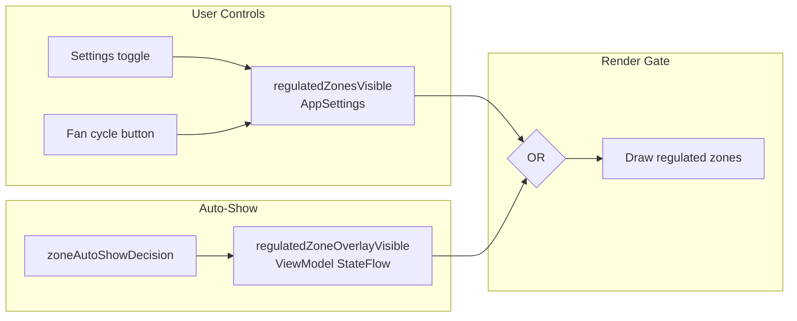

# Auto-Show Settings Decoupling — Design

## Problem

The regulated zone overlay auto-show currently writes directly to `regulatedZonesVisible` in AppSettings:

```kotlin
AutoShowAction.REVEAL -> settingsManager.update { it.copy(regulatedZonesVisible = true) }
AutoShowAction.HIDE   -> settingsManager.update { it.copy(regulatedZonesVisible = false) }
```

This changes the user's persistent setting and the fan button state — both should reflect **user intent only**, not auto-show state.

## Solution

Introduce a separate memory-only `regulatedZoneOverlayVisible` StateFlow in the ViewModel that the auto-show controls independently of the user setting.

## Design



### Changes needed

**1. CoastlineViewModel** — add separate StateFlow for auto-show overlay visibility:

```kotlin
private val _regulatedZoneOverlayVisible = MutableStateFlow(false)
val regulatedZoneOverlayVisible: StateFlow<Boolean> = _regulatedZoneOverlayVisible.asStateFlow()
```

In the regulated zone auto-show block, write to this flow instead of `regulatedZonesVisible`:

```kotlin
when (regDecision.action) {
    AutoShowAction.REVEAL -> _regulatedZoneOverlayVisible.value = true
    AutoShowAction.HIDE   -> _regulatedZoneOverlayVisible.value = false
    AutoShowAction.NONE   -> {}
}
```

**2. MapScreen.kt** — change render gate to use OR between user setting and auto-show state:

```kotlin
val regulatedZoneOverlay by viewModel.regulatedZoneOverlayVisible.collectAsState()
val showRegZones = appSettings.regulatedZonesVisible || regulatedZoneOverlay
val visibleRegulatedZones = if (showRegZones) {
    filterRegulatedZones(regulatedZones, appSettings.boatSizeM) { appSettings.isCategoryVisible(it) }
} else null
```

Pass `regulatedZoneOverlayVisible` to the warning strip composable as well, so the strip also appears during auto-show.

**3. Fan button** — stays driven by `appSettings.regulatedZonesVisible` only. The fan shows "Reg" as active only when the user manually toggled it on. Auto-show doesn't change the fan state.

### Behavior matrix

| User setting | Auto-show state | Visual result | Fan shows |
|---|---|---|---|
| OFF | OFF | Hidden | Off |
| OFF | ON (approaching) | **Shown** | Off |
| ON | OFF | Shown | On |
| ON | ON (approaching) | Shown | On |

### What doesn't change

- The `regulatedZoneAutoShowGps/Demo` toggles in Settings → Navigation (still control whether auto-show is enabled)
- The `toggleRegulatedZonesVisibility()` and `cycleZoneLayers()` methods (still control user setting)
- The `regulatedZoneManuallyHidden` tracking (still works, but only suppresses auto-show when user manually toggled off)
- The `insideZoneReveal`/`exitedZone`/`locationUnknown` logic in `zoneAutoShowDecision()` (unchanged)
