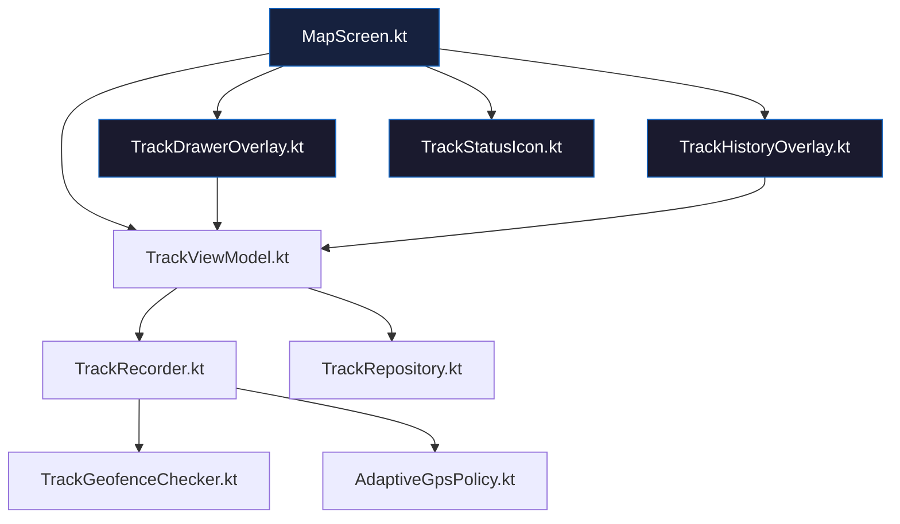

# BoatTrace — Track History UI Refinement Plan

## Problem Summary

The BoatTrace UI (TrackHistoryOverlay, TrackDrawerOverlay, TrackStatusIcon) was implemented
but has several misalignments with the established app UI principles:

1. **Icons use emoji/unicode text** instead of the Material Icons family used everywhere else
   (Settings button → `Icons.Default.Settings`, Back → `Icons.AutoMirrored.Filled.ArrowBack`)
2. **Hardcoded colors** (`Color(0xFF1A1A2E)`, `Color(0x1AFFFFFF)`) instead of `AppConfig` tokens
3. **TrackHistoryOverlay card layout** doesn't match Settings card patterns
4. **Snackbar undo** is emoji-based and lacks actual undo support
5. **TrackStatusIcon** uses 👣 emoji instead of a Material icon
6. **Hamburger button** (MapScreen.kt) uses `\u2630` unicode instead of `Icons.Default.Menu`

## Target UI Alignment (Settings Page Reference)

| Token | Settings Value | Current (Track list) |
|---|---|---|
| `AppConfig.uiSettingsBackground` | `0xFF1A1A2E` | `Color(0xFF1A1A2E)` ✅ but should use AppConfig |
| `AppConfig.uiSettingsCardBackground` | `0x1AFFFFFF` | `Color(0x1AFFFFFF)` ✅ but should use AppConfig |
| `AppConfig.uiSettingsTextPrimary` | `0xFFFFFFFF` | `Color.White` ✅ but should use AppConfig |
| `AppConfig.uiSettingsTextMuted` | `0xFFB0BEC5` | `Color(0xFFB0BEC5)` ✅ but should use AppConfig |
| `AppConfig.uiSettingsAccent` | `0xFF1565C0` | Hardcoded in TrackDrawerOverlay |
| `AppConfig.uiSettingsDivider` | `0x14FFFFFF` | Not used in track UI |
| `AppConfig.uiSettingsSwitchTrackInactive` | `0x33FFFFFF` | Not used in track UI |
| `AppConfig.uiSettingsDanger` | `0xFFE53935` | Not used (delete uses `0xFFFF5252`) |

## Icon Migration

| Location | Current | Target Material Icon |
|---|---|---|
| Hamburger (MapScreen.kt) | `\u2630` text | `Icons.Default.Menu` |
| TrackHistoryOverlay back | `\u2190` text | `Icons.AutoMirrored.Filled.ArrowBack` |
| TrackHistoryOverlay visibility | `👁️` / `👁️‍🗨️` emoji | `Icons.Default.Visibility` / `Icons.Default.VisibilityOff` |
| TrackHistoryOverlay share | `↗️` emoji | `Icons.Default.Share` |
| TrackHistoryOverlay delete bg | `🗑️` text | `Icons.Default.Delete` |
| TrackHistoryOverlay stats | 🏁 ⚡ ⛵ ⏸️ emoji | Text labels only (no icons) |
| TrackDrawerOverlay back | Already `Icons.AutoMirrored.Filled.ArrowBack` | ✅ Keep |
| TrackStatusIcon | 👣 emoji | `Icons.Default.Footprint` (or DirectionsWalk) |
| All icon tints | hardcoded | `ButtonColors.icon` / `ComposeColor(AppConfig.uiSettingsTextPrimary)` |

## Implementation Steps

### Step 1: Rewrite `TrackHistoryOverlay.kt`

**File:** `app/src/main/java/ykws/android/maro/ui/map/TrackHistoryOverlay.kt`

Changes:
- Replace emoji/unicode icons with Material Icons:
  - Back: `Icons.AutoMirrored.Filled.ArrowBack` via `Icon()` composable with 48dp circle Button
  - Visibility: `Icons.Default.Visibility` / `Icons.Default.VisibilityOff` via `IconButton`
  - Share: `Icons.Default.Share` via `IconButton`
  - Delete background: `Icons.Default.Delete` with red circle background
- Use `AppConfig` color tokens for all colors
- Use `ButtonColors.bg` / `ButtonColors.icon` for consistency
- Add Snackbar undo with `SnackbarDuration.Short` and actual undo callback
- Add `onUndoDelete: (String) -> Unit` callback parameter
- Card layout: match Settings card pattern (`RoundedCornerShape(12.dp)`, `AppConfig.uiSettingsCardBackground`)
- Stats row: use text labels ("Dist", "Max", "Under way", "Still") instead of emoji
- Add `BackHandler` at overlay level
- Add `windowInsetsPadding(WindowInsets.statusBars)` like Settings overlay

### Step 2: Rewrite `TrackDrawerOverlay.kt`

**File:** `app/src/main/java/ykws/android/maro/ui/map/TrackDrawerOverlay.kt`

Changes:
- Keep existing structure mostly intact (already partially aligned)
- Replace any remaining hardcoded colors with `AppConfig` tokens
- Section header "TRACK RECORDING" → use `AppConfig.uiSettingsAccent`
- Ensure all `Switch` colors match Settings pattern
- Stats card background → `AppConfig.uiSettingsCardBackground`
- Add proper `BackHandler` (already present)
- Switch colors: `AppConfig.uiSettingsAccent` with 0.4alpha track

### Step 3: Rewrite `TrackStatusIcon.kt`

**File:** `app/src/main/java/ykws/android/maro/ui/map/TrackStatusIcon.kt`

Changes:
- Replace `👣` emoji (U+1F463) with `Icons.Default.DirectionsWalk` (or custom footprint Canvas icon matching FanIconComponents style)
- Background colors: use `ButtonColors.bg` with state-dependent alpha
- Keep pulse animation for RECORDING state
- Indicator dot: keep drawBehind circle (works well)
- Overall size: keep 32dp to match other status icons

### Step 4: Update `MapScreen.kt` hamburger button

**File:** `app/src/main/java/ykws/android/maro/ui/map/MapScreen.kt`

Changes:
- Line ~1165-1172: Replace `Text(text = "\u2630", ...)` with `Icon(imageVector = Icons.Default.Menu, ...)` inside the `MapControlButton` icon slot
- Use `ButtonColors.icon` tint like the Settings button

### Step 5: Verify GPX FileProvider setup

**Files:**
- `app/src/main/res/xml/provider_paths.xml` (new — create if missing)
- `app/src/main/AndroidManifest.xml` (verify `<provider>` is registered)

### Step 6: Build validation

```bash
gradlew assembleDebug
```

## Data Layer — No Changes Needed

The data layer (Track, TrackPoint, TrackEvent, TrackRecorder, TrackRepository, TrackViewModel,
GpxExporter, TrackGeofenceChecker) is well-implemented and does not require changes for this
UI refinement pass.

## Test Files

The following test files exist but are out of scope for this UI-only refinement:
- TrackGeofenceCheckerTest.kt
- TrackRecorderTest.kt
- TrackRepositoryTest.kt
- TrackSerializerTest.kt
- TrackViewModelTest.kt

These should be implemented in a separate pass focused on test coverage.

## Key Design Decisions

1. **Stat chips use text labels not emoji** — The Settings page never uses emoji for data display;
   stats should show clean text like "4.2 nm", "8.7 kn", "1h 12m", "8min" without decorative emoji.

2. **Delete uses Snackbar undo not dialog** — The current implementation has swipe-to-delete with
   just a snackbar notification. Add a proper undo mechanism: pending delete list in ViewModel,
   4-second Snackbar with Undo action, permanent delete on timeout.

3. **IconButton rather than raw clickable Text** — Action icons (visibility, share) should use
   Material3 `IconButton` for proper touch target size and ripple, matching the app's other
   interactive elements.

4. **TrackHistoryOverlay uses Settings overlay pattern** — Full-screen overlay with
   `windowInsetsPadding(WindowInsets.statusBars)`, background from AppConfig, back button
   matching the Settings overlay style exactly.

## Mermaid: Component Dependencies


