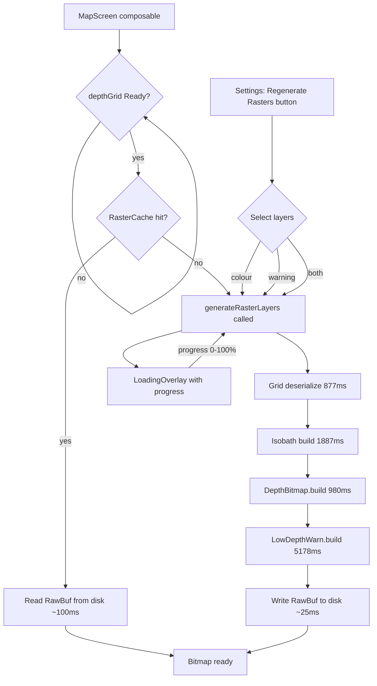

# RawBuf Raster Cache — Implementation Plan

<!-- scope: feature -->

## Goal

Replace the 6-second cold-launch raster rebuild with a ~100 ms RawBuf disk cache read, plus a settings-driven regeneration control with progress UI.

## Architecture Overview



## Files to Create / Modify

### New: [`data/depth/RasterCache.kt`](../app/src/main/java/ykws/android/maro/data/depth/RasterCache.kt)

```kotlin
object RasterCache {
    // Cache key components
    data class Key(
        val gridTimestampMs: Long,
        val emodnetCutoffM: Float,
        val lowDepthMaxM: Float,
        val lowDepthMinOpacityPct: Int
    )
    
    // Persist: IntArray → ByteBuffer → FileChannel.write()
    fun write(context: Context, layer: RasterLayer, key: Key, pixels: IntArray, w: Int, h: Int)
    
    // Read: FileChannel.read() → ByteBuffer → IntArray → Bitmap
    fun read(context: Context, layer: RasterLayer, key: Key): Bitmap?
    
    // Check if cached file exists and matches key
    fun has(context: Context, layer: RasterLayer, key: Key): Boolean
    
    // Delete stale caches (called when key changes)
    fun evict(context: Context, layer: RasterLayer)
}

enum class RasterLayer { DEPTH_COLOUR, LOW_DEPTH_WARNING }
```

**Cache file path:** `context.cacheDir / "raster_${layer.name}_${key.hashCode()}.buf"`
**File format:** 8B header (w:Int, h:Int) + raw ARGB_8888 pixel data (w×h×4 bytes)

### New: [`data/model/RasterProgress.kt`](../app/src/main/java/ykws/android/maro/data/model/RasterProgress.kt)

Weighted progress computation using measured timings:

```kotlin
data class RasterProgress(
    val phase: String,
    val progress: Int,        // 0–100 for current step
    val globalProgress: Int   // 0–100 weighted across all steps
)

object RasterTimings {
    // Measured medians (2 cold launches, 2026-06-09)
    const val GRID_LOAD_MS = 877
    const val ISOBATH_MS = 1887
    const val COLOUR_RASTER_MS = 980
    const val WARNING_RASTER_MS = 5178
    val TOTAL_MS = GRID_LOAD_MS + ISOBATH_MS + COLOUR_RASTER_MS + WARNING_RASTER_MS // 8922
    
    // Weight of each step in the total
    val GRID_WEIGHT = GRID_LOAD_MS.toFloat() / TOTAL_MS   // ~9.8%
    val ISOBATH_WEIGHT = ISOBATH_MS.toFloat() / TOTAL_MS   // ~21.2%
    val COLOUR_WEIGHT = COLOUR_RASTER_MS.toFloat() / TOTAL_MS // ~11.0%
    val WARNING_WEIGHT = WARNING_RASTER_MS.toFloat() / TOTAL_MS // ~58.0%
    
    fun globalProgress(step: RasterStep, stepProgress: Int): Int {
        // stepProgress: 0–100 within the step
        // Returns: 0–100 weighted global progress
    }
}

enum class RasterStep { GRID_LOAD, ISOBATH, COLOUR_RASTER, WARNING_RASTER, DONE }
```

### Modify: [`DepthViewModel.kt`](../app/src/main/java/ykws/android/maro/ui/map/DepthViewModel.kt)

New method:

```kotlin
/** Builds one or more raster layers, caches them to RawBuf disk, and reports progress. */
suspend fun generateRasterLayers(
    context: Context,
    layers: List<RasterLayer>,
    isWater: (Double, Double) -> Boolean
) {
    val key = RasterCache.Key(
        gridTimestampMs = grid.metadata.fetchTimestampMs,
        emodnetCutoffM = settings.emodnetShallowCutoffM,
        lowDepthMaxM = settings.lowDepthWarningMaxM,
        lowDepthMinOpacityPct = settings.lowDepthWarningMinOpacityPct
    )
    
    for (layer in layers) {
        if (RasterCache.has(context, layer, key)) continue // skip cached
        
        // Build raster (with progress reporting via _rasterProgress)
        // Write to RawBuf cache
        // Update _rasterProgress
    }
    
    _rasterProgress.value = RasterProgress("Done", 100, 100)
}
```

### Modify: [`MapScreen.kt`](../app/src/main/java/ykws/android/maro/ui/map/MapScreen.kt)

**Lazy instantiation on start:**

```kotlin
// After depthGrid is Ready, check cache and build missing rasters
LaunchedEffect(depthGrid, appSettings.emodnetShallowCutoffM, 
               appSettings.lowDepthWarningMaxM, appSettings.lowDepthWarningMinOpacityPct) {
    val grid = depthGrid ?: return@LaunchedEffect
    val missing = mutableListOf<RasterLayer>()
    val key = RasterCache.Key(...)
    if (!RasterCache.has(context, RasterLayer.DEPTH_COLOUR, key)) missing.add(RasterLayer.DEPTH_COLOUR)
    if (!RasterCache.has(context, RasterLayer.LOW_DEPTH_WARNING, key)) missing.add(RasterLayer.LOW_DEPTH_WARNING)
    if (missing.isNotEmpty()) {
        depthViewModel.generateRasterLayers(context, missing, waterTest)
    }
}
```

**LoadingOverlay during generation:**

```kotlin
val rasterProgress by depthViewModel.rasterProgress.collectAsState()
// Show LoadingOverlay when rasterProgress is not null and not Done
if (rasterProgress != null && rasterProgress.globalProgress < 100) {
    LoadingOverlay(
        progress = GenerationProgress(rasterProgress.phase, rasterProgress.globalProgress),
        modifier = Modifier.align(Alignment.BottomCenter)
    )
}
```

**Settings control:**

Add a "Regenerate raster layers" button in the settings panel (advanced section) that opens a dialog with checkboxes:
- [x] Depth colour map
- [x] Low-depth warning overlay
- [Regenerate] button → calls `depthViewModel.generateRasterLayers(context, selected, waterTest)`

### Modify: [`SettingsManager.kt`](../app/src/main/java/ykws/android/maro/data/settings/SettingsManager.kt)

No new persisted setting needed — the regeneration is a one-shot action, not a toggle. The button lives in the settings UI but doesn't persist state.

## Progress Weighting Formula

Using the measured medians (total 8,922 ms):

| Step | Weight | Cumulative |
|---|---|---|
| Grid load | 9.8% | 0–10% |
| Isobath derivation | 21.2% | 10–31% |
| Colour raster | 11.0% | 31–42% |
| Warning raster | 58.0% | 42–100% |

During each step, progress interpolates linearly within its band. For example, during the colour raster (rows 0..h), progress goes from 31% to 42% as `row/h` goes from 0 to 1.

## Cleanup After Implementation

- Remove `simulateCacheFormats()` helper from MapScreen.kt
- Remove `Log.d("Perf", ...)` timing lines (or gate behind a debug flag)
- Remove `ByteArrayOutputStream`, `BitmapFactory`, `ByteBuffer` imports if no longer used

## Related

- Feature: [`DepthSafety`](../xTrack/FEATURE_SCOPE_DepthSafety.md)
- Subfeature: `caching`
- Measurements: [`plans/caching.md`](../plans/caching.md)
