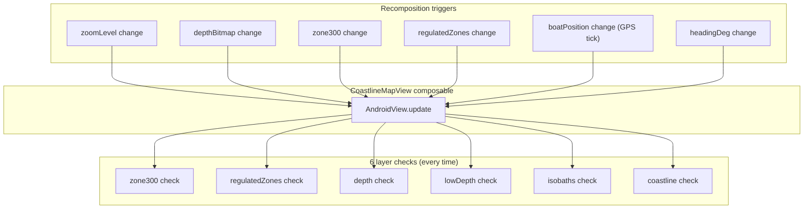
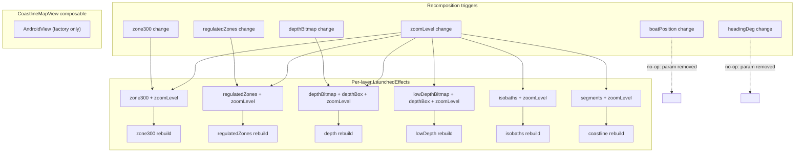

# CoastlineMapView — Per-Layer Independent Update Triggers

## Problem

[`CoastlineMapView`](../app/src/main/java/ykws/android/maro/ui/map/MapScreen.kt:2079) uses a single `AndroidView.update` lambda (line 2164) that fires on **every** recomposition — any parameter change triggers all 6 layer identity checks + removeAll/clear/draw cycles.

### Waste sources

| Trigger | What changes | Layers actually needing rebuild | Layers checked wastefully |
|---------|-------------|-------------------------------|--------------------------|
| Zoom gesture | `zoomLevel` | All 6 (zoom-dependent) | 0 — but all 6 run anyway |
| `depthBitmap` finishes loading | `depthBitmap` | Depth only | 5 |
| GPS tick | `boatPosition` | **None** (boatPosition is unused inside the map view!) | 6 |
| Heading change | `headingDeg` | **None** (headingDeg is unused inside the map view!) | 6 |

**Dead params**: [`boatPosition`](../app/src/main/java/ykws/android/maro/ui/map/MapScreen.kt:2090) and [`headingDeg`](../app/src/main/java/ykws/android/maro/ui/map/MapScreen.kt:2091) are passed to `CoastlineMapView` but never read inside the `AndroidView` factory or `update` lambda. Every GPS tick (1 Hz) triggers a full 6-layer check with zero work done.

## Current architecture



**All roads lead to all 6 checks.** Even when only one layer's data changed.

## Proposed architecture

Replace the monolithic `update` lambda with per-layer `LaunchedEffect` blocks, each keyed on only the data that layer depends on. Drop `boatPosition` and `headingDeg` from the parameter list (they're unused).



## Per-layer settings & filters audit

Each layer's data is computed at the call site ([lines 1617–1631](../app/src/main/java/ykws/android/maro/ui/map/MapScreen.kt:1617)), visibility-gated by user toggles and/or auto-show overlays. The gated value is what `CoastlineMapView` receives.

### 1. Coastline — `segments: List<CoastlineSegment>`

| Setting / filter | How it reaches the layer | Mechanism |
|-----------------|------------------------|-----------|
| `coastlineVisible` | Gated at line 1618: `if (coastlineVisible) allSegments else emptyList()` | `segments` identity changes (non-empty ↔ empty) → LaunchedEffect key changes |
| Coastline data (`allSegments`) | From `CoastlineState.Ready.polylines` | New state instance → new list → key changes |

**Rendering constants** (no runtime settings): `mapCoastlineMainlandColor`, `mapCoastlineIslandColor`, `mapCoastlineMainlandWidth`

**LaunchedEffect keys**: `segments, zoomLevel`

---

### 2. Zone300 — `zone300: Zone300Data?`

`Zone300Data` is a `@Serializable data class` → structural `equals()`.

| Setting / filter | How it reaches the layer | Mechanism |
|-----------------|------------------------|-----------|
| `zone300Visible` | Gated at line 1620–1621: `if (showZone300) zone300 else null` | `zone300` goes null → LaunchedEffect key changes |
| `zone300OverlayVisible` | Same gate — OR'd with user toggle | Auto-show overlay triggers same null ↔ data transition |
| Raw zone300 data | From `viewModel.zone300` StateFlow | New `Zone300Data` instance → structural change → key changes |

**Rendering constants**: `mapZone300Fill`, `mapZone300Boundary`, `ZONE_MIN_ZOOM`

**LaunchedEffect keys**: `zone300, zoomLevel`

---

### 3. RegulatedZones — `regulatedZones: RegulatedZoneSet?`

`RegulatedZoneSet` is a `@Serializable data class` → structural `equals()`. Filtered via [`filterRegulatedZones()`](../app/src/main/java/ykws/android/maro/ui/map/RegulatedZoneComponents.kt:488) which returns `zones.copy(zones = filtered)` — a new instance.

| Setting / filter | How it reaches the layer | Mechanism |
|-----------------|------------------------|-----------|
| `regulatedZonesVisible` | Gated at line 1623–1626: `if (showRegZones) filterRegulatedZones(...) else null` | null ↔ data transition → key changes |
| `regulatedZoneOverlayVisible` | Same gate — OR'd with user toggle | Same mechanism |
| `boatSizeM` | Passed to `filterRegulatedZones()` at line 1625 | Different filter output → structurally different `RegulatedZoneSet` → key changes |
| Category visibility toggles | Lambda `{ appSettings.isCategoryVisible(it) }` passed to filter | Different filter output → structurally different `RegulatedZoneSet` → key changes |
| Raw regulated zones data | From `produceState<RegulatedZoneSet?>` at line 499 | New instance → key changes |

**Rendering constants**: `regulatedZoneColor()` per type, `REGULATED_ZONE_MIN_ZOOM`

**LaunchedEffect keys**: `regulatedZones, zoomLevel`

---

### 4. Depth colour map — `depthBitmap: Bitmap?`

Bitmap produced by [`produceState`](../app/src/main/java/ykws/android/maro/ui/map/MapScreen.kt:461).

**Current keys** (line 462–463): `depthGrid`, `lowDepthWarningMaxM`, `lowDepthWarningMinOpacityPct`, `emodnetShallowCutoffM`, `coastlineReady`

**Which are actually used** inside the lambda body:

| Key | Used? | How |
|-----|-------|-----|
| `depthGrid` | ✓ | Cache lookup + `DepthBitmap.build()` |
| `emodnetShallowCutoffM` | ✓ | `DepthBitmap.build(g, emodnetShallowCutoffM, ...)` |
| `lowDepthWarningMaxM` | ✗ | Not read — only affects low-depth warning |
| `lowDepthWarningMinOpacityPct` | ✗ | Not read — only affects low-depth warning |
| `coastlineReady` | ✗ | `waterTest` lambda not passed to `DepthBitmap.build()` |

**Fix**: Remove the 3 unused keys. The produceState should be keyed on only `depthGrid, appSettings.emodnetShallowCutoffM`.

**Why this matters for the per-layer refactor**: With the current over-keying, changing the low-depth warning slider restarts BOTH produceStates (depth + lowDepth) → two LaunchedEffects fire when only lowDepth should. After the fix, only the lowDepth LaunchedEffect fires.

> **Note on `RasterCache.Key`**: `readCached()` at [DepthViewModel.kt:207](../app/src/main/java/ykws/android/maro/ui/map/DepthViewModel.kt:207) uses a single key class with `lowDepthMaxM`/`lowDepthMinOpacityPct` for ALL raster steps. This means changing low-depth settings invalidates the depth colour cache. However, since the produceState won't restart after removing those keys, the cache miss never triggers — the lambda doesn't re-run. A step-aware cache key is a separate future optimization.

| Setting / filter | How it reaches the layer | Mechanism |
|-----------------|------------------------|-----------|
| `depthLayerVisible` | Gated at line 1630: `if (depthLayerVisible) depthBitmap else null` | null ↔ bitmap transition → key changes |
| `emodnetShallowCutoffM` | Key in produceState → triggers `DepthBitmap.build()` with new cutoff | New `Bitmap` instance → key changes |
| `depthGrid` | Key in produceState | New grid → new bitmap → key changes |

**Rendering constants**: `mapDepthNodataColor`, `DEPTH_OVERLAY_BANDS`, `DEPTH_MAP_MIN_DRAW_ZOOM`

**LaunchedEffect keys**: `depthBitmap, depthBox, zoomLevel`

---

### 5. Low-depth warning — `lowDepthWarningBitmap: Bitmap?`

Bitmap produced by [`produceState`](../app/src/main/java/ykws/android/maro/ui/map/MapScreen.kt:478) keyed on `depthGrid`, `lowDepthWarningMaxM`, `lowDepthWarningMinOpacityPct`, `coastlineReady`, `emodnetShallowCutoffM`.

| Setting / filter | How it reaches the layer | Mechanism |
|-----------------|------------------------|-----------|
| `lowDepthWarningVisible` | Gated at line 1628: `if (lowDepthWarningVisible) lowDepthWarningBitmap else null` | null ↔ bitmap transition → key changes |
| `lowDepthWarningMaxM` | Key in produceState → triggers `LowDepthWarningBitmap.build()` | New `Bitmap` instance → key changes |
| `lowDepthWarningMinOpacityPct` | Key in produceState → triggers rebuild with new opacity | New `Bitmap` instance → key changes |
| `emodnetShallowCutoffM` | Key in produceState → triggers rebuild with new cutoff | New `Bitmap` instance → key changes |
| `depthGrid` | Key in produceState | New grid → new bitmap → key changes |

**Rendering constants**: `DEPTH_OVERLAY_BANDS`, `DEPTH_MAP_MIN_DRAW_ZOOM`

**LaunchedEffect keys**: `lowDepthWarningBitmap, depthBox, zoomLevel`

---

### 6. Isobaths — `isobaths: List<Isobath>`

From [`depthRender?.isobaths`](../app/src/main/java/ykws/android/maro/ui/map/MapScreen.kt:452).

| Setting / filter | How it reaches the layer | Mechanism |
|-----------------|------------------------|-----------|
| `depthLayerVisible` | Gated at line 1631: `if (depthLayerVisible) isobaths else emptyList()` | non-empty ↔ empty list transition → key changes |
| Raw isobaths data | From `depthRender?.isobaths` | New list instance → structural change → key changes |

**No runtime settings affect isobath styling** — all are constants: `ISOBATH_MIN_DRAW_ZOOM`, `SHALLOW_ISOBATH_MIN_ZOOM`, line colors/widths.

**LaunchedEffect keys**: `isobaths, zoomLevel`

---

### Summary: settings → layer mapping

```
coastlineVisible        → Coastline (visibility gate)
zone300Visible          → Zone300 (visibility gate)
zone300OverlayVisible   → Zone300 (visibility gate)
regulatedZonesVisible   → RegulatedZones (visibility gate)
regulatedZoneOverlayVisible → RegulatedZones (visibility gate)
boatSizeM               → RegulatedZones (filterRegulatedZones)
category toggles        → RegulatedZones (filterRegulatedZones)
depthLayerVisible       → Depth + Isobaths (visibility gate)
emodnetShallowCutoffM   → Depth + LowDepth (produceState)
lowDepthWarningVisible  → LowDepth (visibility gate)
lowDepthWarningMaxM     → LowDepth (produceState)
lowDepthWarningMinOpacityPct → LowDepth (produceState)
```

**All settings that affect rendering already flow through the data parameter** — either via visibility gating (null/empty ↔ data) or via produceState/filterRegulatedZones producing new instances. The LaunchedEffect keys `data + zoomLevel` are sufficient; no additional settings need to be added as separate keys.

## Per-layer key mapping (final)

| LaunchedEffect | Keys | Only fires when |
|---------------|------|-----------------|
| Zone300 | `zone300`, `zoomLevel` | zone300 data changes OR zoom changes |
| RegulatedZones | `regulatedZones`, `zoomLevel` | regulated zones data changes OR zoom changes |
| Depth | `depthBitmap`, `depthBox`, `zoomLevel` | depth bitmap/box changes OR zoom changes |
| LowDepth | `lowDepthWarningBitmap`, `depthBox`, `zoomLevel` | low-depth bitmap/box changes OR zoom changes |
| Isobaths | `isobaths`, `zoomLevel` | isobath list changes OR zoom changes |
| Coastline | `segments`, `zoomLevel` | segment list changes OR zoom changes |

### What happens per scenario

| Scenario | Before | After |
|----------|--------|-------|
| Zoom gesture | 6 checks | 6 LaunchedEffects fire (correct — all zoom-dependent) |
| depthBitmap loads | 6 checks | **1** LaunchedEffect fires (depth only) |
| zone300 toggled on | 6 checks | **1** LaunchedEffect fires (zone300 only) |
| GPS tick (boatPosition) | 6 checks | **0** (boatPosition removed from params) |
| Heading change | 6 checks | **0** (headingDeg removed from params) |
| boatSizeM slider | 6 checks | **1** (regulatedZones only) |

## OverlayTracker changes

Each layer needs its own `lastZoom` for independent dirty-checking. Per-layer last-known data replaces the single shared `lastZoom`/`lastDepthBox`.

```kotlin
class OverlayTracker {
    // Per-layer overlay lists (unchanged)
    val depth = mutableListOf<GroundOverlay>()
    val lowDepth = mutableListOf<GroundOverlay>()
    val isobaths = mutableListOf<Polyline>()
    val regulatedZones = mutableListOf<Polygon>()
    val zone300 = mutableListOf<Any>()
    val coastline = mutableListOf<Any>()

    // Per-layer last-known data + zoom (replaces single lastZoom/lastDepthBox)
    var lastDepthBitmap: Bitmap? = null
    var lastDepthBox: BoundingBox? = null
    var lastDepthZoom: Double = -1.0

    var lastLowDepthBitmap: Bitmap? = null
    var lastLowDepthZoom: Double = -1.0

    var lastIsobaths: List<Isobath> = emptyList()
    var lastIsobathZoom: Double = -1.0

    var lastRegulatedZones: RegulatedZoneSet? = null
    var lastRegZoneZoom: Double = -1.0

    var lastZone300: Zone300Data? = null
    var lastZone300Zoom: Double = -1.0

    var lastSegments: List<CoastlineSegment> = emptyList()
    var lastCoastlineZoom: Double = -1.0
}
```

## Implementation steps

0. **Fix depth produceState over-keying** at [MapScreen.kt:461–463](../app/src/main/java/ykws/android/maro/ui/map/MapScreen.kt:461): remove `appSettings.lowDepthWarningMaxM`, `appSettings.lowDepthWarningMinOpacityPct`, and `coastlineReady` from the produceState keys. Only `depthGrid` and `appSettings.emodnetShallowCutoffM` are needed. This ensures the per-layer refactor doesn't cause spurious depth LaunchedEffect fires when adjusting low-depth warning sliders.

1. **Remove dead params** from `CoastlineMapView`: drop `boatPosition` and `headingDeg` from the function signature and the call site in `MapContent` (lines 1645–1646).

2. **Update `OverlayTracker`**: replace single `lastZoom`/`lastDepthBox` with per-layer zoom tracking as shown above.

3. **Split `AndroidView`**: remove the `update` lambda entirely. The `factory` still creates the MapView and draws all layers initially, seeding the tracker.

4. **Add 6 `LaunchedEffect` blocks** after the `AndroidView`, each with:
   - Keys matching only its layer's data (as per the mapping table above)
   - First-line guard: compare against tracker's per-layer last-known state, return early if unchanged
   - `mapView.overlays.removeAll(tracker.[layer])` + `tracker.[layer].clear()`
   - Call the corresponding `draw*()` function
   - Update tracker's per-layer last-known state
   - `mapView.invalidate()`

5. **Update call site** in `MapContent` (line 1634): remove `boatPosition` and `headingDeg` arguments.

6. **Build & smoke test**: verify layers toggle on/off independently, zoom rebuilds all layers, GPS ticks don't trigger map view recomposition.

## Risk analysis

- **Concurrency**: Multiple LaunchedEffects fire simultaneously on zoom change. Since all draw functions run on `Dispatchers.Main` without suspension points, each runs atomically. They operate on disjoint `tracker.[layer]` sub-lists, so `mapView.overlays.removeAll()` calls targeting different sub-lists don't conflict.

- **Frame delay**: `LaunchedEffect` runs after composition, unlike the current synchronous `update`. A 1-frame delay before overlay rebuild is acceptable — the map tiles are already rendered, overlays update in the next frame.

- **Initial draw**: Factory still draws all layers on first composition. LaunchedEffects won't fire on initial composition because keys haven't changed from their seeded tracker values.

- **Layer removal** (visibility toggle off): When `zone300` goes `null`, the LaunchedEffect fires (key changed), `drawZone300` handles `null` by clearing the sink and returning early (line 155–156). Same for all other layers.

- **Key comparison semantics**: `LaunchedEffect` uses structural `equals()` for keys. All data types are `data class`es or standard types (`Bitmap`, `List`) with proper `equals()`. The internal guard still uses referential `===` for Bitmap identity — a structural Bitmap duplicate is practically impossible (each produceState run creates a new object).
