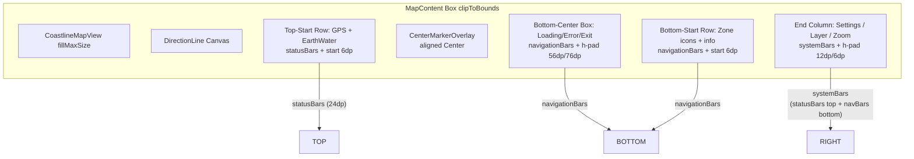

# Map Overlay Layout Rationalization

## User's Proposed Layout

```
┌───────────────────────────────────┐
│╔═ top                ═╗ ╔═ctrls═╗│
│                         ║╔═ct ═╗║│     ct  = controls top
│                         ║       ║│          Settings gear (will grow)
│╚═                    ═╝ ║╚═   ═╝║│
│╔═ middle             ═╗ ║╔═cm ═╗║│     cm  = controls middle
│                         ║       ║│          Layer fan (will grow)
│                         ║       ║│
│                         ║       ║│
│                         ║       ║│
│                         ║       ║│
│                         ║       ║│
│                         ║       ║│
│                         ║       ║│
│                         ║       ║│
│                         ║       ║│
│╚═                    ═╝ ║╚═   ═╝║│
│╔═ btm                ═╗ ║╔═cb ═╗║│     cb  = controls bottom
│                         ║       ║│          Zoom +/- (fixed)
│                         ║╚═   ═╝║│
│╚═                    ═╝ ╚═     ═╝│
├───────────────────────────────────┤
│    Dashboard                      │
└───────────────────────────────────┘
```

### Layout zones defined

| Zone | Anchor | Width | Height | Contents |
|---|---|---|---|---|
| **`top`** | TopStart | fills remaining after `ctrls` | sized to content | GPS icon + EarthWater icon |
| **`ctrls`** | End (right) | sized to content | full height | Column: ct / cm / cb |
| ├─**`ct`** | Top of ctrls | sized to content | sized to content | Settings gear + future |
| ├─**`cm`** | Middle of ctrls | sized to content | fills leftover | Layer fan + future fans |
| └─**`cb`** | Bottom of ctrls | sized to content | sized to content | Zoom +/- |
| **`middle`** | fills all | fills remaining | fills remaining | MapView (OSMdroid) |
| **`btm`** | BottomStart | fills remaining after `ctrls` | sized to content | 3 stacked layers: |
| ├─ behind | BottomStart | — | sized to content | Zone tags (left) + info text (right) |
| ├─ middle | BottomCenter | — | sized to content | Progress dialog (conditional) |
| └─ top | BottomCenter | — | sized to content | Exit toast (conditional) |

> **Key insight:** This is essentially a **2-column layout** (main area + controls rail) with a dashboard footer and a bottom zone that stacks multiple conditional overlays.

---

## Mapping Proposed Zones → Current Code

### `ctrls` Column (proposed) vs Right-Edge Column (current)

| Aspect | Current (lines 938-1035) | Proposed |
|---|---|---|
| **Width** | Fixed horizontal padding `start=12dp, end=6dp` | Sized to content |
| **Height** | `fillMaxHeight()` | `fillMaxHeight()` |
| **Insets** | `windowInsetsPadding(WindowInsets.systemBars)` on whole Column | Split: ct gets `statusBars`, cb gets `navigationBars` |
| **Top section** | `ControlSection.TOP` → `ControlSectionContent` (wraps SettingsButton) | `ct` — simple Box with `statusBars` inset, content-sized height |
| **Middle section** | `ControlSection.MIDDLE` → `ControlSectionContent` with `weight(1f)` | `cm` — `weight(1f)` Column, content vertically positioned |
| **Bottom section** | `ControlSection.BOTTOM` → `ControlSectionContent` (wraps Zoom buttons) | `cb` — simple Box with `navigationBars` inset, content-sized height |
| **Control abstraction** | `ControlItem` data class + `ControlSection` enum + `ControlSectionContent` (~70 lines) | None needed — just inline composables in a Column |
| **Spacer(136.dp)** | Placeholder where 2nd fan goes (line 1016) | Remove — `cm` fills naturally with weight(1f) |

**What stays the same:** The three-section Column structure (top/middle/bottom) already matches the proposed `ct`/`cm`/`cb` — just needs inset fix and abstraction removal.

**What changes:**
1. Remove `ControlItem`/`ControlSection`/`ControlSectionContent` (~70 lines)
2. Split `systemBars` into `statusBars` on ct + `navigationBars` on cb
3. Width sized to content (remove fixed h-padding, move to children)
4. Remove `Spacer(136.dp)` — cm handles empty space naturally

### `top` (proposed) vs Top-Left Row (current)

| Aspect | Current (lines 815-830) | Proposed |
|---|---|---|
| **Inset** | `windowInsetsPadding(statusBars)` | Same |
| **Start pad** | `padding(start = 6.dp)` | Same |
| **Width** | sized to content (Row) | fills remaining after `ctrls` |
| **Height** | sized to content | sized to content |

**What changes:** Width constraint — currently `Modifier.align(TopStart)` makes it auto-width. With the 2-column layout, it should explicitly fill the remaining width after `ctrls`. Using a `Row` with `weight(1f)` or placing it in the left column.

### `btm` (proposed) vs Bottom-Left + Bottom-Center (current)

This is the biggest consolidation. Currently there are **4 separate** bottom-aligned composables in MapContent:

| Current | Lines | Proposed slot |
|---|---|---|
| Loading/Error overlay | 846-867 | `btm` middle layer (conditional) |
| Exit toast | 872-896 | `btm` top layer (conditional) |
| Zone icon strip | 907-919 | `btm` behind layer, left-aligned (`tags`) |
| Zone info text | 920-931 | `btm` behind layer, right-aligned (`txt`) |

All 4 share `.windowInsetsPadding(WindowInsets.navigationBars)` and overlapping horizontal padding. Currently they're separate `Box` composables with `Alignment.BottomCenter` / `Alignment.BottomStart`. Consolidating into a single `btm` zone means:
- **One** `navigationBars` inset instead of 4
- Layers naturally stack (behind → middle → top) via z-order in a single Box
- The `tags`+`txt` Row and the conditional overlays share the same bottom-safe zone

### `middle` (proposed) vs MapView (current)

No change needed — the OSMdroid `MapView` already fills `Modifier.fillMaxSize()` within `CoastlineMapView` (line 803). The center marker and direction line are overlaid on top.

---

## Inset Allocation Per Zone

| Zone | Inset | Why |
|---|---|---|
| `top` | `statusBars` | Pushes below status bar |
| `ct` (controls top) | `statusBars` | Pushes below status bar → **matches top gap** |
| `cb` (controls bottom) | `navigationBars` | Pushes above nav bar → **matches bottom gap** |
| `btm` | `navigationBars` | Pushes above nav bar |
| `middle` | none | Map fills full screen |

With `ct` getting the same `statusBars` inset as `top`, and `cb` getting `navigationBars`, the gap asymmetry is eliminated — top and bottom gaps are independently correct for their respective edges. The overall vertical distribution is:

```
top statusBar gap  ─┐
                     ├─ symmetric with
ct sized content   ─┘

cm (weight=1, fills middle)

cb sized content   ─┐
                     ├─ symmetric with
btm sized content  ─┘
bottom navBar gap  ─┘
```

---

## Schematic: Proposed Compose Structure

```kotlin
Box(fillMaxSize) {                    // ← Root, no bottom padding
    CoastlineMapView(fillMaxSize)     // ← Map fills everything
    
    // ── 2-column layout: left column + ctrls rail ──
    Row(fillMaxSize) {                 // ← Horizontal split
        // LEFT COLUMN (weight=1, fills remaining)
        Column(Modifier.weight(1f).fillMaxHeight()) {
            
            // top zone: status icons
            Row(Modifier.windowInsetsPadding(statusBars)) {
                GpsStatusIcon()
                EarthWaterIcon()
            }
            
            // middle zone: fills remaining (map behind this, but
            // the map is placed at the Box level, not here)
            // Actually — this is the tricky part. The map needs to
            // fill the entire Box, with overlays on top.
        }
        
        // CTRLS RAIL (width sized to content)
        Column(Modifier.fillMaxHeight().width(intrinsicSize)) {
            // ct: top section with statusBars
            Column(Modifier.windowInsetsPadding(statusBars)) {
                SettingsButton()
                // ... future top controls
            }
            
            // cm: middle section (weight=1)
            Column(Modifier.weight(1f), Arrangement.Center) {
                FanLayout(...)
                // ... future middle controls
            }
            
            // cb: bottom section with navigationBars
            Column(Modifier.windowInsetsPadding(navigationBars)) {
                ZoomButtons()
                // ... future bottom controls
            }
        }
    }
    
    // ── btm zone: overlaid on bottom-left, stacked layers ──
    Box(Modifier.align(BottomStart).windowInsetsPadding(navigationBars)) {
        // Behind layer: tags + txt
        Row(Modifier.align(BottomStart)) {
            RegulatedZoneWarningStrip(...)
            if (infoVisible) RegulatedZoneInfoText(...)
        }
        // Middle layer: progress (conditional)
        if (showProgress) LoadingOverlay(Modifier.align(BottomCenter))
        // Top layer: toast (conditional)
        if (showBanner) ExitBanner(Modifier.align(BottomCenter))
    }
    
    // ── Dashboard overlay ──
    if (isLandscape) DashboardPanel(Modifier.align(CenterStart)...)
    else DashboardPanel(Modifier.align(BottomCenter)...)
    
    // ── Settings overlay ──
    if (showSettings) SettingsOverlay(Modifier.fillMaxSize())
}
```

### The `Row` split issue

There's a subtlety: the map (CoastlineMapView) must fill the **entire** Box, not just the left column. So the 2-column `Row` can't contain the map — only the overlays. The structure should be:

```kotlin
Box(fillMaxSize) {
    // Layer 0: Map (fills everything)
    CoastlineMapView(Modifier.fillMaxSize())
    
    // Layer 1: Overlays (2-column Row)
    Row(Modifier.fillMaxSize()) {
        // Left column: top + btm
        Column(Modifier.weight(1f).fillMaxHeight()) {
            top(Modifier.windowInsetsPadding(statusBars))
            Spacer(Modifier.weight(1f))  // middle = map area, no overlay
            btm(Modifier.windowInsetsPadding(navigationBars))
        }
        // Right column: ctrls
        ctrlsColumn()
    }
    
    // Layer 2: Dashboard
    DashboardPanel(...)
    
    // Layer 3: Settings
    if (showSettings) SettingsOverlay(...)
}
```

This is cleaner — the map is on its own layer, the overlay Row is on top, and the left column simply has `top` at the top, `btm` at the bottom, and a `Spacer(weight(1f))` in the middle (no overlay needed there).

---

## Final Layout — Visual Render

```
┌──────────────────────────────────────────────────┐
│ OSMdroid MapView (fills entire Box)               │
│                                                    │
│ ╔══════════════════════════════════╗ ╔═ctrls════╗ │
│ ║  top zone (statusBars inset)     ║ ║ ct zone  ║ │
│ ║  ┌────┐ ┌────┐                  ║ ║ ┌──────┐ ║ │
│ ║  │📡  │ │🌊  │                  ║ ║ │  ⚙️  │ ║ │
│ ║  └────┘ └────┘                  ║ ║ └──────┘ ║ │
│ ╚══════════════════════════════════╝ ║ (status ║ │
│                                      ║  Bars)  ║ │
│                                      ╠═════════╣ │
│          middle (no overlay)         ║ cm zone ║ │
│          ─── map fills here ───      ║ ┌──────┐ ║ │
│                                      ║ │  🍔  │ ║ │
│                                      ║ └──────┘ ║ │
│                                      ║ (weight ║ │
│                                      ║  = 1f)  ║ │
│                                      ╠═════════╣ │
│ ╔══════════════════════════════════╗ ║ cb zone ║ │
│ ║  btm zone (navigationBars inset) ║ ║ ┌──────┐ ║ │
│ ║  ┌───┐ ┌──────────────────────┐  ║ ║ │  ➕  │ ║ │
│ ║  │🔴 │ │ Zone info text       │  ║ ║ │  ➖  │ ║ │
│ ║  │🌿 │ │ (auto-wraps)         │  ║ ║ └──────┘ ║ │
│ ║  └───┘ └──────────────────────┘  ║ │(navBar) │ │
│ ║  [loading/error overlay]          ║ └─────────╜ │
│ ║  [exit toast overlay]             ║             │
│ ╚══════════════════════════════════╝             │
├──────────────────────────────────────────────────┤
│  Dashboard (portrait: bottom, landscape: left)    │
└──────────────────────────────────────────────────┘
```

## Final Code Structure

```kotlin
// In MapContent, replacing the current ad-hoc overlays:
Box(modifier = modifier.clipToBounds()) {

    // Layer 0: Map
    CoastlineMapView(..., modifier = Modifier.fillMaxSize())
    DirectionLine(Modifier.fillMaxSize())
    CenterMarkerOverlay(Modifier.align(Alignment.Center))

    // Layer 1: Overlays in 2-column Row
    Row(modifier = Modifier.fillMaxSize()) {

        // ── Left column: top + btm ──
        Column(modifier = Modifier.weight(1f).fillMaxHeight()) {

            // top zone: GPS + EarthWater
            Row(
                modifier = Modifier
                    .windowInsetsPadding(WindowInsets.statusBars)
                    .padding(start = 6.dp)
            ) {
                GpsStatusIcon(state = gpsIconState)
                EarthWaterIcon(...)
            }

            // middle (no overlay)
            Spacer(modifier = Modifier.weight(1f))

            // btm zone: tags + txt + overlays
            Box(
                modifier = Modifier
                    .fillMaxWidth()
                    .windowInsetsPadding(WindowInsets.navigationBars)
            ) {
                // Behind layer: zone tags + info text
                Row(modifier = Modifier.align(Alignment.BottomStart)) {
                    RegulatedZoneWarningStrip(...)
                    if (appSettings.regulationInfoVisible) {
                        RegulatedZoneInfoText(
                            ...,
                            modifier = Modifier
                                .weight(1f)
                                .padding(start = 4.dp)
                                .align(Alignment.Bottom)
                        )
                    }
                }
                // Middle layer: loading/error (conditional)
                if (rasterProgress != null && ...) {
                    LoadingOverlay(modifier = Modifier.align(Alignment.BottomCenter))
                }
                if (state is CoastlineState.Error) {
                    ErrorOverlay(modifier = Modifier.align(Alignment.BottomCenter))
                }
                // Top layer: exit toast (conditional)
                if (showExitBanner) {
                    ExitBanner(modifier = Modifier.align(Alignment.BottomCenter))
                }
            }
        }

        // ── Right column: ctrls (width sized to content) ──
        Column(
            modifier = Modifier
                .fillMaxHeight()
                .padding(start = 12.dp, end = 6.dp),
            horizontalAlignment = Alignment.CenterHorizontally
        ) {
            // ct: controls top — statusBars inset
            Column(
                modifier = Modifier.windowInsetsPadding(WindowInsets.statusBars),
                horizontalAlignment = Alignment.CenterHorizontally
            ) {
                SettingsButton(onClick = onOpenSettings)
                // ... future top controls here
            }

            // cm: controls middle — fills remaining space
            Column(
                modifier = Modifier.weight(1f),
                verticalArrangement = Arrangement.Center,
                horizontalAlignment = Alignment.CenterHorizontally
            ) {
                FanLayout(/* layer toggle fan */)
                // ... future middle controls here (2nd fan, etc.)
            }

            // cb: controls bottom — navigationBars inset
            Column(
                modifier = Modifier.windowInsetsPadding(WindowInsets.navigationBars),
                horizontalAlignment = Alignment.CenterHorizontally
            ) {
                if (mapView != null) {
                    Column(verticalArrangement = Arrangement.spacedBy(8.dp)) {
                        MapControlButton(onClick = { mapView.controller.zoomIn() }) { PlusIcon() }
                        MapControlButton(onClick = { mapView.controller.zoomOut() }) { MinusIcon() }
                    }
                }
                // ... future bottom controls here
            }
        }
    }
}
```

## What's Removed vs What's Kept

### Removed (simplification)
- `ControlItem` data class (lines 672-677)
- `ControlSection` enum (lines 662-663)
- `ControlSectionContent` composable (lines 687-727) — ~40 lines
- `Spacer(Modifier.height(136.dp))` (line 1016) — hardcoded placeholder
- `.padding(bottom = 6.dp)` on root Box (line 506) — band-aid
- `.windowInsetsPadding(WindowInsets.systemBars)` on right Column (line 942) — root of asymmetry
- Duplicate `.windowInsetsPadding(WindowInsets.navigationBars)` — 4 copies → 1 in btm zone
- `widthIn(max = screenWidth - 82dp)` constraint on zone info Row (line 912) — handled by column weight

### Kept (unchanged)
- All control composables: `SettingsButton`, `FanLayout`, `MapControlButton`, `GpsStatusIcon`, `EarthWaterIcon`
- All bottom composables: `RegulatedZoneWarningStrip`, `RegulatedZoneInfoText`, `LoadingOverlay`, `ErrorOverlay`, `ExitBanner`
- `CoastlineMapView` and all map rendering
- `DashboardPanel` overlay (positioning unchanged)
- `SettingsOverlay` (unchanged)
- `CenterMarkerOverlay` and `DirectionLine`
- All fan animation/alpha logic from `ControlSectionContent` moves into `cm` section

### Inset handling summary

| Zone | Inset | Effect |
|---|---|---|
| `top` | `statusBars` | ~24dp below map top |
| `ct` | `statusBars` | ~24dp below map top → **matches top** |
| `cb` | `navigationBars` | ~48dp above map bottom → **matches bottom** |
| `btm` | `navigationBars` | ~48dp above map bottom → **matches cb** |
| `cm` | none | Fills between ct and cb |

The gaps from ctrls to map edges are now:
- **Top gap** = `statusBarHeight` (ct's inset)
- **Bottom gap** = `navigationBarHeight` (cb's inset)
- **Symmetric** — each side gets its semantically correct inset
- **No band-aid** — root `bottom = 6.dp` removed

## The Problem

The [`MapScreen.kt`](app/src/main/java/ykws/android/maro/ui/map/MapScreen.kt) overlay layout has grown organically. Each piece handles its own WindowInsets, positioning, and padding independently. This causes:

1. **Asymmetric gaps** (the original issue) — `systemBars` on the right-edge Column applies different heights at top vs bottom
2. **Duplicated inset logic** — bottom overlays (loading, error, exit toast, zone icons) all repeat `.windowInsetsPadding(WindowInsets.navigationBars)`
3. **Hard-to-trace spacing** — root `bottom = 6.dp` is a band-aid with no clear semantic meaning
4. **Monolithic file** — `MapScreen.kt` at 3811 lines mixes the map, overlays, settings, control logic, and rendering helpers

---

## Current Overlay Zones (in `MapContent`, lines 765–1036)



---

## Proposed Architecture: Slot-Based Overlay Layout

### Core Idea

Define **named screen-edge slots** where each slot has a **built-in inset policy** for its edge. Content is just dropped into slots. This eliminates per-component inset management.

### Edge Inset Rules

| Slot | Alignment | Top Inset | Bottom Inset | Start Pad | End Pad |
|---|---|---|---|---|---|
| `topStart` | `TopStart` | `statusBars` | — | 6dp | — |
| `endEdge` | `CenterEnd` | `statusBars` | `navigationBars` | 12dp | 6dp |
| `bottomStart` | `BottomStart` | — | `navigationBars` | 6dp | — |
| `bottomCenter` | `BottomCenter` | — | `navigationBars` | 56dp | 76dp |
| `center` | `Center` | — | — | — | — |

### Slot-based API

```kotlin
@Composable
fun MapOverlayLayout(
    modifier: Modifier = Modifier,
    // ── Named slots with automatic edge inset policies ──
    topStart:     @Composable ColumnScope.() -> Unit = {},
    endEdge:      MapOverlayEdgeScope.() -> Unit = {},
    bottomStart:  @Composable RowScope.() -> Unit = {},
    bottomCenter: @Composable BoxScope.() -> Unit = {},
    center:       @Composable BoxScope.() -> Unit = {},
    // ── Dashboard and settings are full overlays ──
    dashboard:    @Composable BoxScope.() -> Unit = {},
    settings:     @Composable BoxScope.() -> Unit = {},
)
```

### How `MapContent` would look

```kotlin
@Composable
private fun MapContent(..., modifier: Modifier = Modifier) {
    MapOverlayLayout(
        modifier = modifier.clipToBounds(),
        topStart = {
            GpsStatusIcon(state = gpsIconState)
            EarthWaterIcon(...)
        },
        endEdge = {
            top { SettingsButton(onClick = onOpenSettings) }
            middle(weight = 1f) {
                FanLayout(...)
            }
            bottom { ZoomButtons(mapView, onZoomChanged) }
        },
        bottomStart = {
            RegulatedZoneWarningStrip(...)
            if (appSettings.regulationInfoVisible) {
                RegulatedZoneInfoText(...)
            }
        },
        bottomCenter = {
            if (rasterProgress != null && ...) LoadingOverlay(...)
            if (state is CoastlineState.Error) ErrorOverlay(...)
            if (showExitBanner) ExitBanner(...)
        },
        center = {
            CenterMarkerOverlay(...)
            if (moving && appSettings.headingLineVisible) {
                DirectionLine(Modifier.fillMaxSize())
            }
        },
        dashboard = {
            if (isLandscape) DashboardPanel(modifier = Modifier
                .align(Alignment.CenterStart)
                .width(landscapeDashboardWidth).fillMaxHeight())
            else DashboardPanel(modifier = Modifier
                .align(Alignment.BottomCenter)
                .fillMaxWidth().height(portraitDashboardHeight))
        }
    )
}
```

### The `MapOverlayEdgeScope` for the right-edge column

```kotlin
// Provides a three-section Column with auto insets
class MapOverlayEdgeScope {
    fun top(weight: Float = 0f, content: @Composable ColumnScope.() -> Unit)
    fun middle(weight: Float = 1f, content: @Composable ColumnScope.() -> Unit)
    fun bottom(weight: Float = 0f, content: @Composable ColumnScope.() -> Unit)
}
```

Implementation:
- **`top`** section → wrapped in `.windowInsetsPadding(WindowInsets.statusBars)` 
- **`bottom`** section → wrapped in `.windowInsetsPadding(WindowInsets.navigationBars)`
- **`middle`** section → `Modifier.weight(1f)` between them

This automatically solves the gap asymmetry because top and bottom gaps are now exactly `statusBarHeight` and `navigationBarHeight` respectively — no mismatched `systemBars` on the whole Column.

---

## Options Roadmap

### Option 1 — Minimal fix (just the gap)

- Remove root `bottom = 6.dp`
- Split right-edge Column into 3 sections with separate `statusBars`/`navigationBars`
- Keep everything else as-is

**Effort:** Low. **Risk:** Low. **Result:** Fixes the asymmetry but doesn't simplify the architecture.

### Option 2 — Slot-based overlay layout (recommended)

- Extract `MapOverlayLayout` composable
- Move all edge-aware positioning into the layout, out of `MapContent`
- Simplify `MapContent` to just data gating + slot calls

**Effort:** Medium. **Risk:** Low-Medium (pure restructure, no logic change). **Result:** Clean separation of layout from content.

### Option 3 — Full extraction (ambitious)

- Extract `MapOverlayLayout` into its own file
- Extract settings-related composables (`SettingsOverlay`, all tabs) into a separate file
- Reduce `MapScreen.kt` from 3811 lines to ~500 lines of orchestration + 2-3 focused files

**Effort:** High. **Risk:** Medium (potential regressions from moving code between files). **Result:** Most maintainable long-term.

---

## Recommended Approach

**Go with Option 2** — the slot-based `MapOverlayLayout`. It:

1. **Fixes the gap** as a natural consequence of correct inset partitioning
2. **Eliminates** the `bottom = 6.dp` band-aid
3. **Simplifies adding new controls** — just add a new slot or content in an existing slot
4. **Keeps all code in `MapScreen.kt`** initially (extraction to separate files can be done later)
5. **Is backward-compatible** — no changes to the control composables themselves, only their positioning

### Implementation Steps

1. Define `MapOverlayEdgeScope` with `top()`/`middle()`/`bottom()` methods
2. Define `MapOverlayLayout` composable with all 6 slots + their edge inset policies
3. Rewrite `MapContent` to use `MapOverlayLayout`
4. Remove `.padding(bottom = 6.dp)` from the root `Box` in `MapScreen()`
5. Delete the old `ControlItem`/`ControlSection`/`ControlSectionContent` machinery
6. Verify both portrait and landscape
