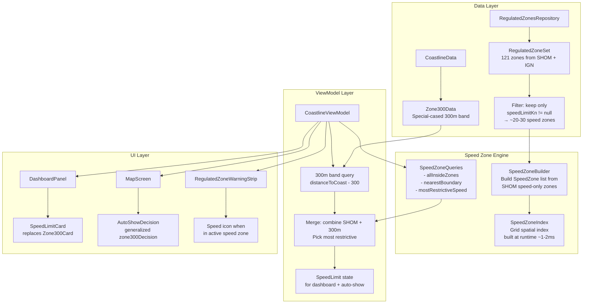
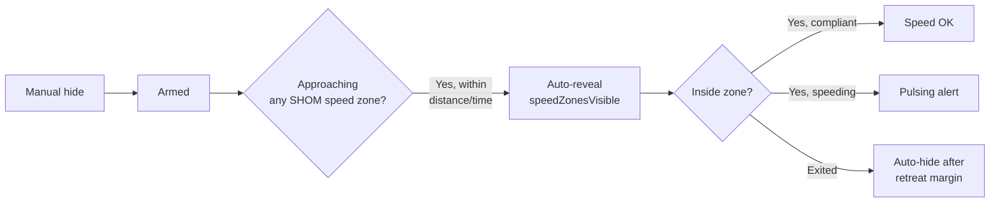

# Speed Zones — Design Plan

## Feature: SpeedZones (subfeature of RegulatedZones)

**Goal:** Incorporate all speed restrictions from regulated zones along the 300M zone mechanism into a unified speed-limit system — compute distance to nearest speed zone boundary, display the most restrictive speed under the boat in the dashboard, and auto-show speed zones when approaching.

---

## Key Design Decisions

| Decision | Choice | Rationale |
|----------|--------|-----------|
| 300m band treatment | **Special-cased** — not folded into polygon model | ~30 disconnected `BandPolygon` regions; distance semantics differ (`distanceToCoast - 300` vs polygon nearest-edge) |
| Speed zone spatial index | **Runtime build** (~1-2ms), not prebaked | Only ~20-30 speed zones (~800 edges); build is negligible; no bake pipeline changes |
| Boundary tolerance | Hysteresis deadband ±5m configurable | Prevents GPS jitter flapping at zone edges |
| Overlapping zones | `allInsideZones: List<SpeedZone>` sorted by speed | Dashboard picks most restrictive; auto-switches when that zone is exited |
| Loading order | `combine()` flow | Build index when both coastline (`Zone300Data`) and regulated zones are loaded |
| Auto-show toggle | Separate `speedZonesVisible` (not `regulatedZonesVisible`) | Approaching a speed zone doesn't reveal anchoring/environmental/etc. zones |
| Settings location | Navigation tab, alongside existing Z300 alert | User preference |
| Auto-show default | ON by default | Same as current 300m zone behavior |
| Distance/time threshold | Shared with 300m zone (global settings) | Simpler UX, adjustable later |

## 1. Architecture Overview



## 2. Speed Zone Models

### 2a. SpeedZone — SHOM speed zones only (no 300m band)

Created from `RegulatedZoneSet`, filtered to zones with `speedLimitKn != null`:

```kotlin
data class SpeedZone(
    val id: String,            // sourceRef from SHOM
    val name: String,          // display name e.g. "Cap d'Antibes"
    val speedLimitKn: Double,  // always non-null
    val outerRing: List<LatLng>,
    val holes: List<List<LatLng>>,
    val source: String         // "SHOM", "SEED"
)
```

### 2b. Runtime query result

```kotlin
data class SpeedZoneQuery(
    val allInsideZones: List<SpeedZone>,  // all zones containing the current position
    val nearestZone: SpeedZone?,           // closest zone boundary (any direction)
    val distanceToBoundaryM: Double?,     // signed: + outside, - inside
    val insideAnyZone: Boolean,
    val mostRestrictiveSpeedKn: Double?,   // min of all inside zone speed limits
    val approaching: Boolean              // distance decreasing over ticks
)
```

### 2c. 300m band handled separately

The 300m band is NOT part of the polygon model. It keeps its existing fast-path:

```kotlin
// Existing, unchanged:
val in300mZone = isOnWater && distanceToCoast <= 300.0
val distTo300mExit = distanceToCoast - 300.0  // signed: + outside, - inside
```

At the dashboard level, the 300m result is merged with the SHOM `SpeedZoneQuery`:

```kotlin
// Merge logic — pick most restrictive:
val allLimits = mutableListOf<Double>()
if (in300mZone) allLimits.add(5.0)
allLimits.addAll(speedQuery.allInsideZones.map { it.speedLimitKn })
val mostRestrictive = allLimits.minOrNull()

// Active zone for title display:
val activeZoneName = when {
    in300mZone && mostRestrictive == 5.0 -> "Bande 300m"
    speedQuery.allInsideZones.isNotEmpty() -> speedQuery.allInsideZones.first().name
    speedQuery.nearestZone != null -> speedQuery.nearestZone.name
    else -> null
}
```

## 3. Speed Zone Spatial Index (Performance)

### Scope: SHOM speed-related zones only

The index covers only zones with `speedLimitKn != null` from `RegulatedZoneSet` — ~20-30 zones (~800-1200 edges). The 300m band is NOT indexed (uses `distanceToCoast`).

### Why a spatial index (ELI16)

The existing [`CoastlineSpatialIndex`](app/src/main/java/ykws/android/maro/spatial/CoastlineSpatialIndex.kt) already solves this exact pattern: it organizes coastline segments into a grid so that distance queries check only ~3-5 nearby segments instead of thousands. **Reuse this pattern.**

Compare to `Zone300Builder` which runs marching squares over a full grid (~2-5s). The speed zone index is just binning existing polygon edges — **~1000× cheaper** (~1-2ms).

### Implementation

**New file:** [`app/src/main/java/ykws/android/maro/spatial/SpeedZoneIndex.kt`]

```kotlin
class SpeedZoneIndex(
    private val zones: List<SpeedZone>  // speed-related zones only
) {
    // Grid index over polygon edges (outer rings + holes) of speed zones only
    //   - Collect all line segments from speed zones
    //   - Bin them into a grid (cell size ~100m x 100m)
    //   - Associate each segment with its parent zone ID

    fun query(lat: Double, lon: Double): SpeedZoneQuery
    // 1. Find candidate cells (current position grid cell + neighbours)
    // 2. Check segments in those cells
    // 3. Compute point-to-segment distance for each candidate
    // 4. Run contains() on candidate zones → populate allInsideZones
    // 5. Return nearest zone + all inside zones + distances
}
```

### Runtime build (not prebaked)

~1-2ms for 20-30 speed zones is negligible. Build at device load time from the already-deserialized `RegulatedZoneSet`. Trigger via `combine()` flow: wait for both coastline data (`CoastlineState.Ready`) and regulated zones (`RegulatedZoneSet` loaded), then build.

### Performance budget
- Build time: **~1-2ms** (at load, background coroutine — imperceptible)
- Query time: ~0.01-0.05ms (well within the 150ms shore pipeline budget)
- Memory: **~20-40 KB** (only ~20-30 speed zones, ~800-1200 edges)
- Battery: **zero additional drain** — same as existing `distanceToCoast`

### Inside/Outside detection

For each candidate zone, use the existing [`RegulatedZone.contains()`](app/src/main/java/ykws/android/maro/data/regulation/RegulatedZone.kt:355) (even-odd ray casting) to determine if the boat is inside. This is already implemented and fast.

### Distance query: heading-aware in both modes

Both GPS and demo mode derive heading data, so both use heading-aware distance:

| Mode | Heading source | Available when? |
|------|---------------|-----------------|
| **GPS** | GPS COG or compass azimuth | Always after first fix |
| **Demo** | Pan velocity direction (bearing between successive `computeDemoSpeed()` calls) | While map is panning (~500ms window) |

When heading IS available → heading-aware distance (ray-march/cast) → zone name + limit + "→ Xm · ETA XmXs"
When heading is NOT available (GPS lost, demo stopped, first launch) → tile shows "LIBRE" / `--` (no restriction info)

#### Heading-aware distance — 300m band (ray-march)

The 300m band is a distance-field contour, not a polygon edge. Step forward along heading in small increments (10m), checking `distanceToCoast` at each step. When `distanceToCoast ≤ 300`, binary-search between the last two steps for meter precision.

```kotlin
fun distanceTo300mAlongHeading(lat, lon, headingDeg, currentDistToCoast): Double? {
    if (currentDistToCoast <= 300.0) return 0.0  // already inside
    // March forward until inside band, then binary search
    for (d in 0..maxSearch step 10) {
        val p = pointAlongBearing(lat, lon, headingDeg, d)
        if (distanceToCoast(p) <= 300.0) return binarySearch(lat, lon, headingDeg, d-10, d, 300.0)
    }
    return null  // no band along this heading
}
```

Cost: ~20-30 spatial index queries = **~0.1ms**.

#### Heading-aware distance — SHOM speed zones (ray-polygon intersection)

For polygon speed zones, cast a ray from the boat along heading and find the first crossing with any polygon edge (standard computational geometry):

```kotlin
fun firstSpeedZoneAhead(lat, lon, headingDeg): SpeedZone? {
    for (zone in speedZones) {
        val t = rayPolygonIntersection(lat, lon, headingDeg, zone.outerRing)
        if (t != null && t > 0) track closest
    }
    return closestZone
}
```

Cost: ~800 edge intersections = **~0.1ms**.

#### Combined pipeline

```kotlin
fun querySpeedZoneAhead(lat, lon, headingDeg, sogKn, currentDistToCoast):
    // Both GPS and demo: heading-aware
    val bandDist = distanceTo300mAlongHeading(lat, lon, headingDeg, currentDistToCoast)
    val shomDist = firstSpeedZoneAhead(lat, lon, headingDeg)
    return closestOf(bandDist, shomDist) + ETA = distance / sogKn
```

#### Card display

When OUTSIDE any zone, heading in GPS mode:
```
┌──────────────────────┐
│     BANDE 300M       │  ← which zone first along heading
│       5 kn           │  ← that zone's speed limit
│    → 180 m           │  ← distance AHEAD (not closest point)
│  Vit 4.5 · ETA 1m18s │  ← speed + time to zone
└──────────────────────┘
```

When heading is unavailable (GPS lost, demo stopped, first launch):
```
┌──────────────────────┐
│       LIBRE          │  ← no restriction info
│        --            │  ← no speed limit value
│  Aucune limite       │
└──────────────────────┘
```

## 4. Dashboard — Unified Speed Limit Card

### Replace Zone300Card with SpeedLimitCard

The top-right dashboard tile changes from:

```
┌─────────────┐
│  ZONE 300M  │
│   DANS LA   │
│  ZONE 5 kn  │  ← current Zone300Card
│   Speed 4.5 │
└─────────────┘
```

To:

```
┌─────────────┐
│ BANDE 300M  │  ← zone name as title (or "CAP D'ANTIBES")
│   5 kn      │  ← speed limit (most restrictive) — replaces "DANS LA"
│  → 180 m    │  ← distance AHEAD along heading (arrow = heading-aware)
│  · ETA 1m   │  ← time to zone at current speed
└─────────────┘
```

### Card states

Color-coding follows the zone's own speed limit, not hardcoded 5/10 kn thresholds:

| Condition | Color | Meaning |
|-----------|-------|---------|
| Outside any zone | Normal blue | No speed context |
| Inside, speed ≤ zone limit | Dark green | Compliant |
| Inside, limit < speed ≤ limit × 1.4 | Orange + pulsing | Moderate over-speed |
| Inside, speed > limit × 1.4 | Red + pulsing border | Significant over-speed |

Examples:
- 300m band (5 kn): green ≤5, orange 5→7, red >7
- Cap d'Antibes (10 kn): green ≤10, orange 10→14, red >14

| State | Title | Value | Subtitle | Background |
|-------|-------|-------|----------|------------|
| No data / loading | — | — | — | Grey (dull) |
| On land | — | "TERRE" | subdued | Grey (dull) |
| On water, no speed zone near | "LIBRE" | — | "Aucune limite" | Normal blue |
| Heading available, zone ahead | Zone name (first ahead) | Speed limit | "→ 180 m · ETA 1m18s" | Blue |
| No heading / no zone ahead | "LIBRE" | -- | "Aucune limite" | Normal blue |
| Inside, compliant | Zone name | Speed limit | "-45 m · ✓ 3.2 kn" | Dark green |
| Inside, moderate over-speed | Zone name | Speed limit | "-12 m · ⚠ 7.8 kn" | Orange + pulsing |
| Inside, significant over-speed | Zone name | Speed limit | "-8 m · 🔴 14.2 kn" | Red + pulsing border |

The existing `SpeedCard` (bottom-right tile) also adopts this logic: it references the active zone's `speedLimitKn` instead of the hardcoded 300m-only check.

### Data flow to dashboard

```
_mapCenter.sample(150ms)
    .mapLatest { center ->
        // Existing: distance to coast, isWater, 300m zone
        val coast = repository.distanceToCoast(...)
        val water = repository.isOnWater(...)
        val inZone300 = water && coast <= 300
        val distTo300m = if (coast != null) coast - 300 else null

        // NEW: SHOM speed zone query
        val speedQuery = speedZoneIndex.query(center.lat, center.lon)

        // Merge: 300m band + SHOM speed zones
        val allLimits = buildList {
            if (inZone300) add(5.0)
            speedQuery.mostRestrictiveSpeedKn?.let { add(it) }
        }
        val mostRestrictive = if (allLimits.isEmpty()) null else allLimits.min()

        SpeedZoneShoreState(
            distanceMeters = coast,
            isWater = water,
            inZone300 = inZone300,
            distTo300mZone = distTo300m,
            speedQuery = speedQuery,
            mostRestrictiveSpeedKn = mostRestrictive
        )
    }
```

**New StateFlows in CoastlineViewModel:**
- `speedLimitKn: StateFlow<Double?>` — most restrictive speed (300m + SHOM combined)
- `activeSpeedZone: StateFlow<SpeedZone?>` — nearest SHOM speed zone (or null)
- `distanceToSpeedZone: StateFlow<Double?>` — signed distance to nearest SHOM speed zone edge
- `approachingSpeedZone: StateFlow<Boolean>` — closing on a speed zone

## 5. Auto-Show for Speed Zones

### Reuse `zone300Decision()` logic

The existing pure function [`zone300Decision()`](app/src/main/java/ykws/android/maro/ui/map/CoastlineViewModel.kt:794) handles:
- **Reveal** when: armed (manually hidden) AND approaching AND (within distance OR time-to-band at SOG)
- **Hide** when: stopped, compliant inside, exited seaward, or retreated past margin

**Change:** Generalize to work with *any* speed zone (SHOM speed zones only, not the 300m band which has its own auto-show).

A new separate `speedZonesVisible` setting controls the SHOM speed zone overlay. Auto-show toggles this setting independently from the master `regulatedZonesVisible` and the 300m band's `zone300Visible`.

### Auto-show logic map



## 6. Files to Create/Modify

### New files

| File | Purpose |
|------|---------|
| [`app/src/main/java/ykws/android/maro/data/regulation/SpeedZone.kt`](app/src/main/java/ykws/android/maro/data/regulation/SpeedZone.kt) | `SpeedZone` data class + `SpeedZoneQuery` result class |
| [`app/src/main/java/ykws/android/maro/spatial/SpeedZoneIndex.kt`](app/src/main/java/ykws/android/maro/spatial/SpeedZoneIndex.kt) | Grid spatial index over SHOM speed zone polygon edges (~20-30 zones) |
| [`app/src/main/java/ykws/android/maro/data/regulation/SpeedZoneBuilder.kt`](app/src/main/java/ykws/android/maro/data/regulation/SpeedZoneBuilder.kt) | Filters `RegulatedZoneSet` to speed-only zones, builds `SpeedZone` list |

### Modified files

| File | Changes |
|------|---------|
| [`CoastlineViewModel.kt`](app/src/main/java/ykws/android/maro/ui/map/CoastlineViewModel.kt) | Add `combine()` to build index when both data sources ready. Extend shore pipeline with merged 300m + SHOM speed zone query. New StateFlows. Generalize auto-show to speed zones (separate `speedZonesVisible` toggle) |
| [`DashboardPanel.kt`](app/src/main/java/ykws/android/maro/ui/map/DashboardPanel.kt) | Replace `Zone300Card` with `SpeedLimitCard`. Add `speedLimitKn`/`activeZoneName`/`distanceToSpeedZone` params. Update `SpeedCard` to relative thresholds |
| [`MapScreen.kt`](app/src/main/java/ykws/android/maro/ui/map/MapScreen.kt) | Wire new StateFlows → DashboardPanel. Wire auto-show to `speedZonesVisible` |
| [`SettingsManager.kt`](app/src/main/java/ykws/android/maro/data/settings/SettingsManager.kt) | Add `speedZonesVisible` field + `speedZoneAutoShowGps`/`speedZoneAutoShowDemo` toggles (Navigation tab) |
| [`maro.properties`](maro.properties) | Add `speedZone.hysteresisM` key (default 5m) |

## 7. Implementation Phases

### Phase 1 — Data unification
1. Create [`SpeedZone.kt`] — runtime model + `SpeedZoneQuery` with `allInsideZones: List<SpeedZone>`
2. Create [`SpeedZoneBuilder.kt`] — filters `RegulatedZoneSet` to `speedLimitKn != null`, builds `SpeedZone` list
3. Unit test: verify speed zone filtering, correct `SpeedZone` construction

### Phase 2 — Spatial index
4. Create [`SpeedZoneIndex.kt`] — grid index over speed zone polygon edges (reuse `CoastlineSpatialIndex` pattern)
5. Unit test: query returns correct nearest zone + all inside zones for known test points
6. Performance test: verify query time < 0.05ms per call

### Phase 3 — ViewModel integration
7. Modify [`CoastlineViewModel.kt`] — add `combine()` for loading order, build index when both data sources ready
8. Extend shore pipeline: query speed zone index, merge with 300m band result
9. Add new StateFlows: `speedLimitKn`, `activeSpeedZone`, `distanceToSpeedZone`, `approachingSpeedZone`
10. Generalize auto-show to work with SHOM speed zones (separate `speedZonesVisible` toggle)
11. Unit test: `SpeedZoneDecisionTest` (reuse pattern from `Zone300DecisionTest`)

### Phase 4 — Dashboard UI
12. Create `SpeedLimitCard` composable replacing `Zone300Card` — zone name as title, speed limit as value, distance + speed compliance as subtitle
13. Wire new parameters through `DashboardPanel`
14. Handle all states: no data, on land, no zone, approaching, inside-compliant, inside-speeding
15. Update `SpeedCard` color-coding to use relative thresholds (limit × 1.4)
16. String resources for French/English

### Phase 5 — Auto-show + settings
17. Add `speedZonesVisible` and auto-show toggles in Settings → Navigation (alongside existing Z300 alert)
18. Wire auto-show to `speedZonesVisible` setting
19. Add `speedZone.hysteresisM` to `maro.properties`
20. On-device verify: approach a 10-kn zone, see it auto-reveal

## 8. Edge Cases and Boundary Tolerance

### Hysteresis deadband for zone edges

SHOM polygon edges are survey-grade exact, but GPS jitter (±5-10m) would cause boundary flapping.

**Solution:** Configurable hysteresis deadband:

| Scenario | Distance | Action |
|----------|----------|--------|
| Approaching zone | > +5m outside | Show "outside, approaching" |
| Entering threshold | ≤ -5m inside | Flip to "inside" state |
| Inside zone | < -5m inside | Show "inside, distance to exit" |
| Exit threshold | ≥ +5m outside | Flip to "outside" state |

The ±5m hysteresis gap prevents flapping. Configurable via `maro.properties` key `speedZone.hysteresisM` with default 5m, exposed in Settings → Avancé.

### Edge cases handled

| Case | How |
|------|-----|
| **Overlapping zones** | `allInsideZones` from index + 300m check → `min()` of all speed limits. Dashboard shows most restrictive zone's name |
| **Exit one zone, stay in another** | `allInsideZones` auto-switches active zone when container list changes |
| **Zone with no speed limit** | Filtered out by `SpeedZoneBuilder` (`speedLimitKn != null` only) |
| **No regulated zones baked** | Degrades to 300m-band-only — SpeedLimitCard still works (shows 300m info) |
| **No coastline loaded** | All distances null — card shows loading/dull state |
| **GPS jitter at boundary** | ±5m hysteresis deadband prevents flapping |
| **Speed outside any zone** | Card shows "LIBRE / Aucune limite" in normal blue |
| **Warning strip** | Shows speed-limit icon when inside any active speed zone (reuses `ZoneDisplayCategory.SPEED_LIMIT`) |

### SpeedCard (bottom-right) adopts relative thresholds

```kotlin
// Before: hardcoded 300m-only check
val cardColor = if (inZone300) {
    when {
        speedKnots < 5f -> green
        speedKnots <= 10f -> orange
        else -> red
    }
} else cardBg

// After: relative to active speed zone limit
val cardColor = if (activeSpeedLimitKn != null) {
    when {
        speedKnots <= activeSpeedLimitKn -> green
        speedKnots <= activeSpeedLimitKn * 1.4f -> orange
        else -> red
    }
} else {
    cardBg // normal blue
}
```

## 9. Not in Scope (v1)

- Speed zone boundary lines on the map overlay (the 300m red line already exists; SHOM speed zone outlines are already drawn by `drawRegulatedZones()` in [`MapScreen.kt`](app/src/main/java/ykws/android/maro/ui/map/MapScreen.kt))
- Over-speed audio alerts

## 10. Git workflow

Per [`docs/GIT_WORKFLOW.md`](docs/GIT_WORKFLOW.md) §29:
- `#new feature/speed-zones` — fetches `origin/develop`, creates `feature/speed-zones` tracking it
- All work on this branch
- Merge via `#merge` when complete
