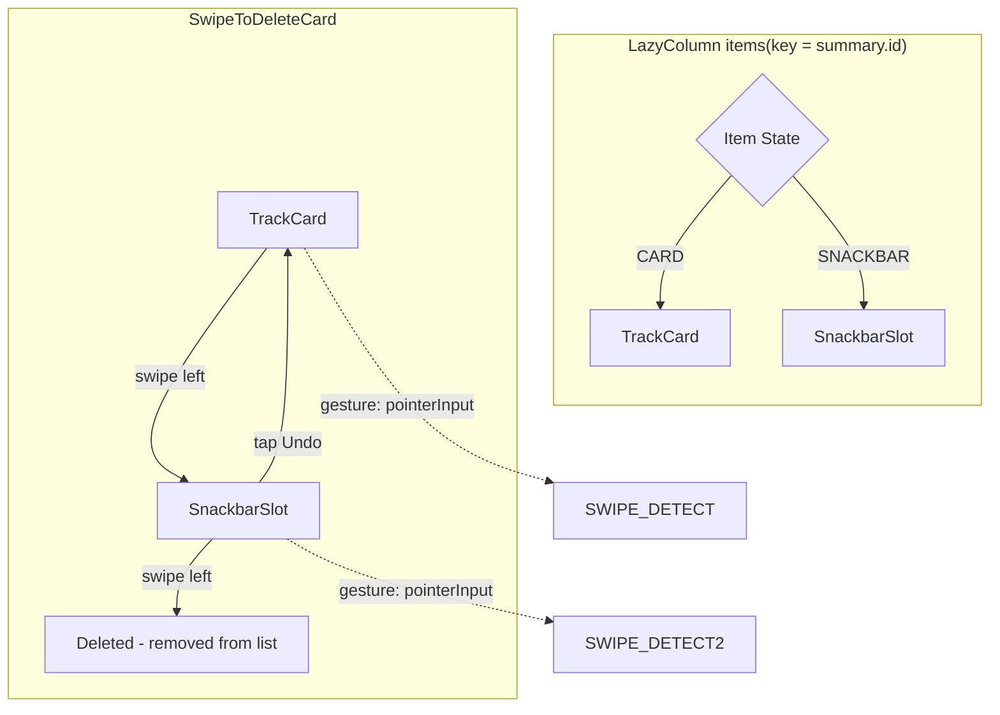

<!-- scope: feature -->
# Track List UI — Requirements & Design

> **Feature:** BoatTrace | **Scope:** Track History Overlay swipe-to-delete UX
> **Status:** Design — awaiting implementation

---

## 1. Requirements

### 1.1 Swipe-to-Delete (Card → Snackbar)

| # | Requirement | Detail |
|---|------------|--------|
| R1 | No red delete background | Swiping a track card must NOT reveal a red delete background. Only the card itself is visible during the drag. |
| R2 | Card slides out in swipe direction | On threshold reached, the card animates out to the **left** (direction of swipe) via `slideOutHorizontally`. |
| R3 | Snackbar slides in from opposite side | Simultaneously, a snackbar composable slides in from the **right** via `slideInHorizontally`. |
| R4 | Snackbar occupies card's list slot | The snackbar is embedded **inline** in the LazyColumn slot — not a floating overlay. It replaces the card at the same list position. |
| R5 | Snackbar is shorter than card | Card height ≈ 170dp. Snackbar height is 48–80dp (dynamic based on text). |
| R6 | List reflows smoothly | Remaining items below reflow upward via `animateContentSize()` + `animateItemPlacement()`. |

### 1.2 Snackbar Appearance

| # | Requirement | Detail |
|---|------------|--------|
| R7 | Background matches card with reduced alpha | Card bg = `uiSettingsCardBackground` (`0x1AFFFFFF`, alpha ≈ 10.2%). Snackbar bg = same color with alpha × 0.75 → `0x13FFFFFF` (alpha ≈ 7.6%). |
| R8 | Message shows track name | Format: `"{TrackName}" deleted` — no ellipsis, text wraps within snackbar width. |
| R9 | Undo button | Material3 `TextButton` with `uiSettingsAccent` color, labeled "Undo". |
| R10 | Height adapts to content | Snackbar height = `max(textHeight, 48dp).coerceAtMost(80dp)`. Uses `IntrinsicSize.Min` + max height cap. If text doesn't fit at 80dp, it overflows (single scrollable line max). |

### 1.3 Undo Behavior

| # | Requirement | Detail |
|---|------------|--------|
| R11 | Undo = card re-appears from **opposite** direction | On Undo tap: snackbar collapses (shrink to 0dp), slot height expands to card height via `animateContentSize()`, card slides in from the **opposite direction** of the original swipe (swiped left → reappears from right, sliding into its place). |
| R12 | Items reflow down | `animateItemPlacement()` moves items below back down as the slot grows. **ELI16:** When the short snackbar expands back to a tall card, the freed space closes — items below slide upward. On undo, the space reopens and items below slide back down, like sticky notes on a wall rearranging to fill gaps. |

### 1.4 Swiping the Snackbar

| # | Requirement | Detail |
|---|------------|--------|
| R13 | Swipe snackbar = permanent delete | The snackbar itself has a swipe gesture. Swiping it left triggers `onPermanentDelete()` immediately. No second undo. |
| R14 | Snackbar exit = only on swipe, not on panel close | **If swiped:** same as card — `slideOutHorizontally` in the swipe direction (left). **If panel closes:** no exit animation — the entire overlay is removed from composition instantly, pending delete commits silently. |
| R15 | Item removed from list | On permanent delete, the item is removed from `trackSummaries`, causing the LazyColumn to remove the composable. The slot disappears and items below reflow up. |

### 1.5 Panel Close

| # | Requirement | Detail |
|---|------------|--------|
| R16 | Pending deletes commit on dismiss | When the back button is pressed or the overlay is dismissed, any items still in "snackbar" (pending delete) state are permanently deleted. |

### 1.6 Inline Editing

| # | Requirement | Detail |
|---|------------|--------|
| R19 | Auto-focus + keyboard on edit | Tapping name or comment auto-requests focus via `FocusRequester` and opens the IME keyboard. Full text is selected via `TextFieldValue(text, TextRange(0, length))`. |
| R20 | Only one field editable at a time | Name and comment use a shared `EditingField` enum (`NAME` \| `COMMENT`); selecting one automatically closes the other. No two fields can be edited simultaneously in the same card. |
| R21 | IME Done = commit | Pressing the keyboard's Done/Validate action commits the edit (`onUpdateTrack`) and hides the keyboard. |
| R22 | Back gesture = revert | System back or keyboard dismiss while editing reverts to the original value (stored via `originalName`/`originalComment`), closes the editor, and hides the keyboard. No data is saved. |
| R25 | Comment wraps on card | The comment (description) field wraps text both when displayed (max 3 lines) and when editing (multi-line). Not truncated with ellipsis. |
| R26 | Edit field height = font height | TextField container height matches the text font height — no oversized container. Uses `Modifier.heightIn(min = 0.dp)` and single-line density for the inline edit fields. |

### 1.7 Icons

| # | Requirement | Detail |
|---|------------|--------|
| R23 | Canvas-drawn Material-style icons | Visibility (eye), VisibilityOff (eye+slash), Share (arrow-up-right) — all **28dp** (matching `ICON_SIZE_DP` in FanIconComponents.kt), drawn via `Canvas`, tinted with `ButtonColors.icon`. |
| R24 | No `material-icons-extended` dependency | All icons must use base Material3 icons (`Icons.Default.*`, `Icons.AutoMirrored.*`) or custom Canvas drawing. |

---

## 2. Design

### 2.1 Component Architecture



### 2.2 State Machine

```
                    ┌─────────────┐
                    │   CARD      │  height ≈ 170dp
                    └──────┬──────┘
                           │ swipe left (threshold)
                           ▼
                    ┌─────────────┐
                    │  SNACKBAR   │  height = 48‑80dp
                    │  "Undo" btn │
                    └──┬──────┬──┘
                       │      │
            tap Undo   │      │  swipe left
                       │      │
                       ▼      ▼
                ┌─────────┐  ┌──────────────┐
                │  CARD   │  │  PERMANENTLY  │
                │ (slide  │  │  DELETED      │
                │  in fr  │  │  (removed     │
                │  right) │  │  from list)   │
                └─────────┘  └──────────────┘
```

### 2.3 Animation Sequence

#### Card → Snackbar (swipe delete)
```
Time:  0ms         100ms         300ms
       │           │             │
Card:  ┌─────┐    ╔═══╗         ║
       │     │ →  ║   ║ slide → ║ out left (gone)
       └─────┘    ╚═══╝         ║
Snack:            ┌─────┐       ┌─────┐
                  │     │ slide │     │ in from right
                  └─────┘       └─────┘
Items: ┌──┐       ┌──┐          ┌──┐
       │  │       │  │ reflow ↑ │  │
       └──┘       └──┘          └──┘
```

#### Snackbar → Card (undo)
```
Time:  0ms         100ms         300ms
       │           │             │
Snack: ┌─────┐    ╔═══╗         ║
       │     │ →  ║   ║ shrink→ ║ (gone)
       └─────┘    ╚═══╝         ║
Card:              ┌─────┐      ┌─────┐
                   │     │slide │     │ in from right
                   └─────┘      └─────┘
Items: ┌──┐       ┌──┐          ┌──┐
       │  │       │  │ reflow ↓ │  │
       └──┘       └──┘          └──┘
```

#### Snackbar → swiped (permanent delete)
```
Time:  0ms         100ms         300ms
       │           │             │
Snack: ┌─────┐    ╔═══╗         ║
       │     │ →  ║   ║ slide → ║ out left (gone)
       └─────┘    ╚═══╝         ║
Items: ┌──┐       ┌──┐          ┌──┐
       │  │       │  │ reflow ↑ │  │
       └──┘       └──┘          └──┘
```

**Note:** If the snackbar is NOT swiped (panel closes via back button), there is no exit animation — the overlay is removed from composition instantly and the pending delete commits silently.

### 2.4 Key Composables

#### `SwipeToDeleteCard`
- **File:** [`app/src/main/java/ykws/android/maro/ui/map/TrackHistoryOverlay.kt`](app/src/main/java/ykws/android/maro/ui/map/TrackHistoryOverlay.kt)
- Manages `ItemState` (`CARD | SNACKBAR | DELETED`)
- Wraps child composables in `Column` with `Modifier.animateContentSize()`
- Card swipe: `Modifier.pointerInput` tracking horizontal drag, drives `Modifier.offset` for visual feedback
- Snackbar swipe: same gesture detection on the snackbar composable

#### `SnackbarSlot`
- New composable (inline in `TrackHistoryOverlay.kt`)
- Shows track name (wrapping text) + "Undo" `TextButton` in a `Row`
- Background: `Color(AppConfig.uiSettingsCardBackground).copy(alpha = 0.102f * 0.8f)` → effectively `0x14FFFFFF`
- Height: `IntrinsicSize.Min` with `heightIn(min = 48.dp, max = 80.dp)`
- Has own swipe gesture for permanent delete

### 2.5 File Changes

| File | Change |
|------|--------|
| [`TrackHistoryOverlay.kt`](app/src/main/java/ykws/android/maro/ui/map/TrackHistoryOverlay.kt) | Full rewrite: remove `SwipeToDismissBox`, add custom swipe gesture + `AnimatedVisibility` + `SnackbarSlot` + `animateContentSize()` |
| No other files | Self-contained to this single file |

### 2.6 Dependencies

| Dependency | Used for | Already present? |
|-----------|----------|------------------|
| `Modifier.pointerInput` | Custom swipe gesture detection | ✅ Base Compose |
| `Modifier.offset` | Animate card during drag | ✅ Base Compose |
| `Modifier.animateContentSize` | Smooth slot height transition | ✅ `foundation` |
| `Modifier.swipeable` | Anchor-based dismiss (alternative) | ✅ `material3` |
| `AnimatedVisibility` | Enter/exit transitions | ✅ `animation` |
| `animateItemPlacement` | List reflow | ✅ `lazy` |

---

## 3. Implementation Order

| # | Step | Description |
|---|------|-------------|
| 1 | Rewrite `SwipeToDeleteCard` | Remove `SwipeToDismissBox`. Add `ItemState` enum, `Column` with `animateContentSize()`, dual `AnimatedVisibility` for card + snackbar layers. |
| 2 | Add swipe gesture to card | `Modifier.pointerInput` for horizontal drag. On threshold, transition to `SNACKBAR` state. |
| 3 | Create `SnackbarSlot` composable | Text wrapping + Undo button. Dynamic height 48–80dp. Custom alpha background. |
| 4 | Add swipe gesture to snackbar | Same `pointerInput` approach. On threshold, call permanent delete. |
| 5 | Wire pending deletes at overlay level | Track items in `SNACKBAR` state. Commit on `BackHandler` + back button. |
| 6 | Build validation | `gradlew assembleDebug` |

---

## 4. Future Evolution (not implemented now)

- Right-swipe on snackbar = undo (natural gesture mapping)
- Multi-select delete
- Batch undo for multiple swiped items
- Search/filter in track list
