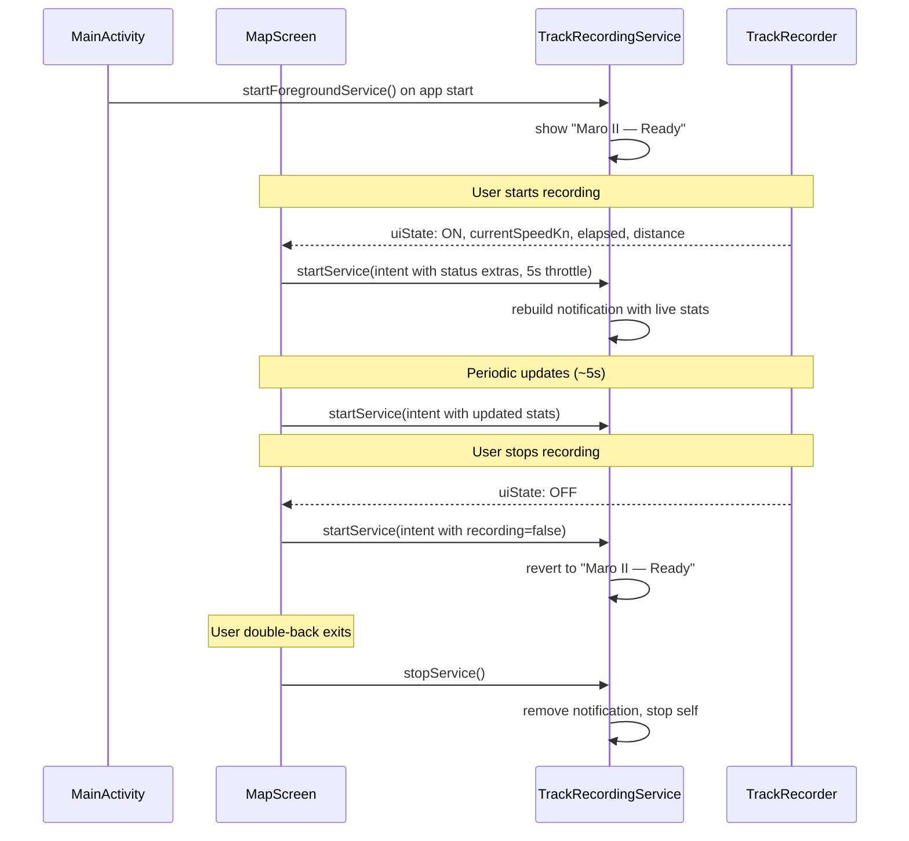

# GPS Background — Persistent Foreground Service

## Requirements
1. **Persistent notification** whenever Maro II is running (foreground or background)
2. **Not recording:** "Maro II — Ready" — GPS can sleep
3. **Recording:** "Maro II — Recording • 12.3 kn • 00:05:23 • 1.2 nm"
4. **Demo mode** (`gpsMode == false`): notification still shows, no GPS dependency
5. **Service lifecycle:** start when app opens, stop when user explicitly exits (double-back)

## Architecture

Repurpose existing [`TrackRecordingService`](app/src/main/java/ykws/android/maro/data/track/TrackRecordingService.kt) from "recording-only" to "always-on." All notification logic stays in the Service — no new files needed.

## Implementation

### Step 0 — Add `currentSpeedKn` to `TrackRecorderUiState` (prerequisite)

**File:** [`app/src/main/java/ykws/android/maro/data/track/TrackRecorder.kt`](app/src/main/java/ykws/android/maro/data/track/TrackRecorder.kt)

- Add `val currentSpeedKn: Float = 0f` to [`TrackRecorderUiState`](app/src/main/java/ykws/android/maro/data/track/TrackRecorder.kt:46) data class
- In [`addPoint()`](app/src/main/java/ykws/android/maro/data/track/TrackRecorder.kt:251), update `currentSpeedKn` alongside `maxSpeedKn` where `speedKn` is already computed

### Step 1 — Update `TrackRecordingService` (all notification logic)

**File:** [`app/src/main/java/ykws/android/maro/data/track/TrackRecordingService.kt`](app/src/main/java/ykws/android/maro/data/track/TrackRecordingService.kt)

- Add intent action constants: `ACTION_UPDATE`, `EXTRA_RECORDING`, `EXTRA_SPEED_KN`, `EXTRA_ELAPSED_SEC`, `EXTRA_DISTANCE_NM`, `EXTRA_IS_DEMO`
- `onStartCommand`: if `ACTION_UPDATE`, rebuild and update notification; otherwise show "Ready"
- Two notification builders:
  - `buildReadyNotification(isDemo)` — "Maro II — Ready" or "Maro II — Ready (Demo)", silent, low priority, ongoing
  - `buildRecordingNotification(speedKn, elapsedSec, distanceNm, isDemo)` — "Maro II — Recording • {speed} kn • {elapsed} • {distance} nm" or "Maro II — Recording (Demo) • {speed} kn • {elapsed} • {distance} nm"
- Update class doc to reflect always-on behavior

### Step 2 — Start service from `MainActivity`, stop from `MapScreen`

**File:** [`app/src/main/java/ykws/android/maro/MainActivity.kt`](app/src/main/java/ykws/android/maro/MainActivity.kt)

- In `onCreate`, after `setContent`, call `startForegroundService(Intent(this, TrackRecordingService::class.java))`

**File:** [`app/src/main/java/ykws/android/maro/ui/map/MapScreen.kt`](app/src/main/java/ykws/android/maro/ui/map/MapScreen.kt:~693)

- In the existing double-back `BackHandler`, add `context.stopService(Intent(context, TrackRecordingService::class.java))` before `finishAffinity()`

### Step 3 — Send periodic updates from `MapScreen`

**File:** [`app/src/main/java/ykws/android/maro/ui/map/MapScreen.kt`](app/src/main/java/ykws/android/maro/ui/map/MapScreen.kt)

- Add a `LaunchedEffect` keyed on `trackRecorderState` that sends update intents to the service
- When `recorderState.state == ON`: build intent with `currentSpeedKn`, `elapsedSeconds`, `distanceNm` extras
- When `recorderState.state == OFF`: build intent with `recording = false`
- Throttle updates to 5s intervals via `delay(5_000)` and a last-sent timestamp guard
- Include `isDemo = !appSettings.gpsMode` in every update

### Step 4 — Handle demo mode

- Demo mode = `appSettings.gpsMode == false`
- Notification always shows; suffix "(Demo)" on both ready and recording states
- Recording in demo: notification uses simulated speed/elapsed/distance (same values flowing through `TrackRecorderUiState`)

## Rules
- Service uses `START_STICKY` — if killed, Android restarts it and it rebuilds the notification
- Notification channel: `IMPORTANCE_LOW`, no sound, ongoing (non-dismissible)
- Notification updates use `startService(intent)` (not `startForegroundService` on re-entry) — safe because service is already running
- Throttle recording updates to 5s to avoid excessive `startService` calls
- Demo mode: notification content still updates but GPS is not required for it

## Key Files
- `app/src/main/java/ykws/android/maro/data/track/TrackRecordingService.kt`
- `app/src/main/java/ykws/android/maro/MainActivity.kt`
- `app/src/main/java/ykws/android/maro/ui/map/MapScreen.kt`
