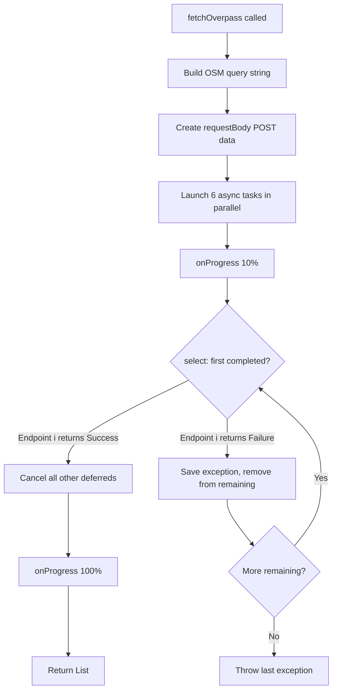

<!-- scope: feature -->
# Overpass API Race Fix Plan

## Problem Analysis

The [`CoastlineGenerator`](app/src/main/java/ykws/android/maro/data/coastline/CoastlineGenerator.kt:33) fetches coastline data from the Overpass API with three concurrent requests. However, there are three issues:

### 1. Timeout too long (30s)
At [line 62–63](app/src/main/java/ykws/android/maro/data/coastline/CoastlineGenerator.kt:62), both `connectTimeout` and `readTimeout` are set to **30 seconds**. The user reports this caused the Russian server (`overpass.openstreetmap.ru`) to hang the entire fetch for 30s.

### 2. No true race cancellation (pseudo-race)
At [lines 220–222](app/src/main/java/ykws/android/maro/data/coastline/CoastlineGenerator.kt:220), the current code does:

```kotlin
val results = deferredList.map { deferred ->
    runCatching { deferred.await() }
}
```

This calls `await()` on **all** deferreds sequentially, waiting for each to complete (success or failure). Even if endpoint A responds in 1 second, we still block on B and C until they finish/timeout. This is **not a true race** — it's a wait-for-all-then-pick-best pattern.

### 3. Problematic server
`overpass.openstreetmap.ru` is known to be unreliable from European locations. It should be deprioritized or removed.

---

## Proposed Changes

All changes target a single file: [`CoastlineGenerator.kt`](app/src/main/java/ykws/android/maro/data/coastline/CoastlineGenerator.kt)

### Change 1: Curated endpoint list

Replace the current 3 endpoints with an expanded, prioritized list:

```kotlin
private val OVERPASS_ENDPOINTS = listOf(
    "https://overpass-api.de/api/interpreter",        // 🇩🇪 Main instance, most reliable
    "https://overpass.kumi.systems/api/interpreter",   // 🇩🇪 Community instance
    "https://overpass-api.bbbike.org/api/interpreter", // 🇩🇪 BBBike instance
    "https://overpass.osm.vi-di.fr/api/interpreter",   // 🇫🇷 France instance (low latency for user)
    "https://overpass.kontur.io/api/interpreter",      // 🇺🇸 Kontur instance
    "https://overpass.openstreetmap.ru/api/interpreter" // 🇷🇺 Moved to last (known timeout issues)
)
```

Rationale:
- **`overpass-api.de`** — The canonical Overpass API instance, highly available, recommended as primary.
- **`overpass.kumi.systems`** — Maintained by the community, good fallback.
- **`overpass-api.bbbike.org`** — Long-standing public instance, very reliable.
- **`overpass.osm.vi-di.fr`** — French-based server; the user is in France (UTC+2, Europe/Paris), so this should have low latency.
- **`overpass.kontur.io`** — US-based diversity; useful if European instances are under load.
- **`overpass.openstreetmap.ru`** — Kept as last resort since it's known to time out.

### Change 2: Timeout → 10 seconds

At [line 62–63](app/src/main/java/ykws/android/maro/data/coastline/CoastlineGenerator.kt:62):

```kotlin
private val httpClient = OkHttpClient.Builder()
    .connectTimeout(10, TimeUnit.SECONDS)   // was 30
    .readTimeout(10, TimeUnit.SECONDS)      // was 30
    .build()
```

10 seconds is reasonable for a POST to an Overpass API:
- OSM data queries are CPU-bound on the server, not network-bound
- If a server can't respond in 10s, it's likely overloaded or unreachable
- With 6 parallel endpoints, probability of at least one responding in ≤10s is high
- Follows the principle of **fail fast, retry elsewhere**

### Change 3: True race mechanism with `select`

Replace lines ~161–230 with a proper race using [`kotlinx.coroutines.selects.select`](https://kotlinlang.org/api/kotlinx.coroutines/kotlinx-coroutines-core/kotlinx.coroutines.selects/select.html).

**Algorithm:**

```
1. Launch N async tasks (one per endpoint), each wrapping its result in
   runCatching { ... } so the Deferred<Result<List<JsonObject>>> never throws.

2. Enter a while(remaining.isNotEmpty()) loop with a select block:
   - Use onAwait on each remaining deferred
   - First one to complete:
       a) If Success → cancel all other deferreds, return immediately
       b) If Failure → remove from remaining list, try next

3. If all fail, throw the last exception.
```

**Why `select` is the correct primitive:**
- `select` with `onAwait` returns the **first completed** deferred, not the first successful
- By wrapping in `runCatching`, `onAwait` always succeeds (returns `Result<T>`), so `select` gives us the first completed endpoint
- We check `result.isSuccess` — if true, we cancel all others and return
- If false, we loop and wait for the next completion

```kotlin
private suspend fun fetchOverpass(
    onProgress: (Int) -> Unit
): List<JsonObject> = coroutineScope {
    // ... build query ...

    val deferreds = OVERPASS_ENDPOINTS.map { endpoint ->
        async {
            runCatching {
                // ... actual fetch logic (same as current) ...
            }
        }
    }

    onProgress(10)

    var lastException: Throwable? = null
    val remaining = deferreds.toMutableList()

    while (remaining.isNotEmpty()) {
        val (index, result) = select<Pair<Int, Result<List<JsonObject>>>> {
            remaining.forEachIndexed { i, deferred ->
                deferred.onAwait { value -> i to value }
            }
        }

        if (result.isSuccess) {
            // Cancel all other requests — they're no longer needed
            remaining.forEach { it.cancel() }
            onProgress(100)
            return@coroutineScope result.getOrThrow()
        }

        lastException = result.exceptionOrNull()
        remaining.removeAt(index)
    }

    throw lastException ?: IllegalStateException("All Overpass endpoints failed.")
}
```

**Cancellation behavior:**
- When the first successful result arrives, `cancel()` is called on all other deferreds
- Since the underlying I/O is OkHttp's synchronous `execute()` inside `async { ... }`, cancelling the coroutine will:
  - Interrupt the thread (via `isActive` check at OkHttp level)
  - The `runCatching` wrapping ensures the cancellation exception `CancellationException` is caught and converted to a failed `Result`
- This is safe and follows the structured concurrency pattern

### Change 4: Per-endpoint progress callback update

At [line 208](app/src/main/java/ykws/android/maro/data/coastline/CoastlineGenerator.kt:208), the progress callback `onProgress(50 + idx * 15)` is called inside the async block — this is misleading because it reports progress even for endpoints that lose the race and get cancelled. This should be simplified since the race selects the first successful response.

**Simplification:** Remove the per-endpoint progress reporting from inside the async block. Keep the simple:
- `onProgress(10)` before launching
- `onProgress(100)` when a result is obtained

---

## Flow Diagram



---

## Files Modified

| File | Change |
|------|--------|
| [`CoastlineGenerator.kt`](app/src/main/java/ykws/android/maro/data/coastline/CoastlineGenerator.kt) | Update endpoint list, timeout, race mechanism, progress callbacks |

**No other files need changes.** The repository, ViewModel, and UI are unaffected since the public API (`suspend fun generate(onProgress)`) remains identical.

---

## Testing

### Unit test approach
The `CoastlineGeneratorTest` currently uses **synthetic data** and bypasses Overpass entirely. The race mechanism is hard to unit test without mocking OkHttp, but we can:

1. Add a test that verifies the **timeout constant** changed to 10s by checking `httpClient.connectTimeoutMillis()` — though this is private. Instead, we can verify by code review.
2. The existing pipeline tests (assembly, orientation, clipping, simplification) remain untouched and should all pass.
3. If desired, add a simple isolated test for the `select` race logic by creating a test-only helper that simulates fast/slow endpoints.

### Manual testing
1. Build and run the APK
2. On the map screen, tap "Régénérer la côte"
3. Observe that:
   - If any server responds within 10s, data loads successfully
   - The request doesn't hang for 30s anymore
   - The error screen appears promptly if all servers fail

