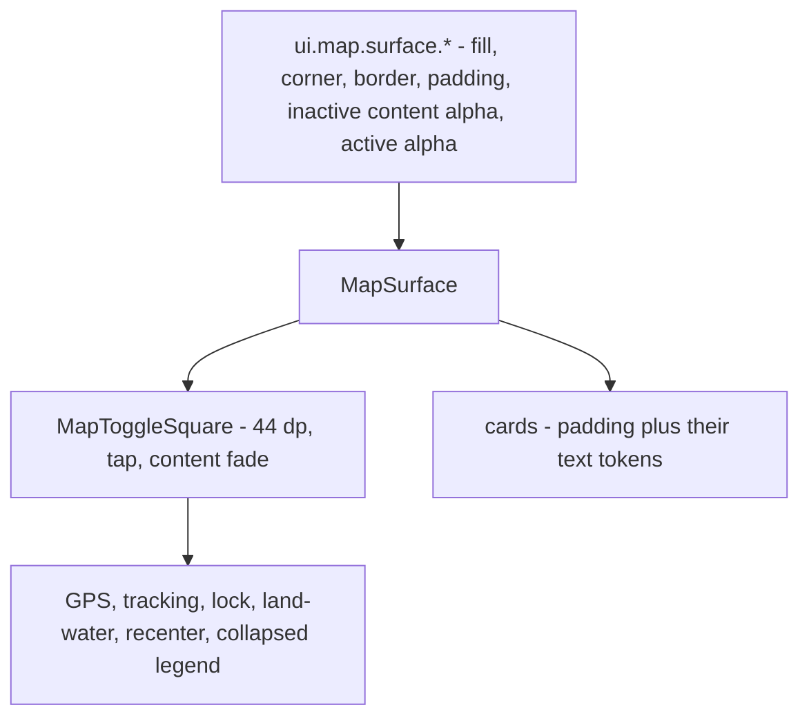

# 260916 — Map surface normalization

**Feature:** ColorManagement (owner) · **Consumers:** Tracks, ZoneTile, RegulatedZones, Ui_General
**Branch:** `feature/no-black-casing` · **Status:** in design

## 1. Request

Every surface on the map that paints a background — the top-left toggle row, the collapsed speed-scale
square, the speed-scale card and the zone-info card — must use exactly the same behaviour, the same code
and the same settings. One set of properties governs them all, the outlines and corners included, and the
two controls that were typed by hand join the family.

## 2. Decisions settled 2026-09-16

- **D1 — One path, one property set.** A single implementation paints every one of them and a single
  block of settings drives it. The duplicate keys go: `ui.map.toggle.inactive.background` and
  `ui.map.overlay.background` (two names for `ui.map.surface.inactive`) and the corner radius written
  once per family. One **colour accessor** survives and it is `uiMapSurfaceInactive`, which is already
  named for the job and today has no reader at all while the two family accessors do. What survives per
  family is only what is genuinely family-specific — the toggle's square, gutter, icon size and status
  colours; the overlay's text colour, weight, size and line spacing. The active alpha is a **surface**
  rule, because painting a face at a given weight when it is active is what a surface does — the cards
  simply never take an active face. `ui.map.overlay.gap` survives as the documented cross-family alias of
  `ui.map.toggle.gutter` it already is.
- **D2 — The off boxes brighten, accepted.** The tracking-OFF and lock-OFF squares stop fading their whole
  face and fade only their glyph, as the GPS one already does, so both read at the shared fill's own
  weight. The two whole-box `.alpha()` calls go, and the comments that claimed they dimmed the glyph
  alone go with them.
- **D3 — Same outline, same corner, same radius everywhere.** The squares and both cards take one corner
  radius and one border, so the zone-info card gains the outline the legend card already wears and the
  squares wear it too.
- **D4 — The recenter button joins the family.** It keeps one behaviour of its own: it is absent when
  there is nothing to recenter. Shown, it is a normal family square wearing the palette's accent,
  `ui.accent` (`${semantic.info}` = `#FF1565C0`, the value `status.lock.on` also holds), at the shared
  active alpha. The accent key is read rather than the lock's because the value is the app's accent blue
  while the lock's key names another control's state; the accepted cost is that the button now follows
  every switch, slider and tab that reads the accent. No new colour key is added, and the hand-typed
  `#2196F3` goes.
- **D5 — The land/water square keeps its behaviour.** It reports what is under the boat, water or land,
  and that does not change. Its unreachable inactive wing stops existing because the shared painting code
  takes one resolved face and leaves no branch for it — a consequence of the refactor, not an API cut.
- **D6 — ColorManagement owns it.** The plan is filed here because the token set and its doc are this
  feature's business, while the surfaces stay with the map features; Tracks' `## Docs` carries a pointer.

## 3. Shape

Two layers, so the squares and the cards share what they really share and nothing more:

- `MapSurface` paints the fill whole, clips the corner, draws the border and applies the padding.
- `MapToggleSquare` sits on it and adds the fixed size, the tap and the content fade; the glyph size
  stays the controls', read through one accessor in six places, which is what keeps it a single setting.
- Each control **resolves its own face** — fill colour, active or not, shown or not — in a small pure
  function, so the surface only paints and the states stay unit-testable.
- The GPS seven-state colours, the tracking dot and the water/land colours are passed in by their
  controls; they are not the surface's business.
- One content-level alpha fades every inactive face. The dim never touches the box, which is the bug
  D2 removes.

## 4. Implementation steps

1. `colors.properties` — write the `ui.map.surface.*` block (fill, corner radius, padding, border colour
   and width, inactive content alpha, active alpha) and retire the duplicates it replaces, leaving each
   family block with only its own keys; the comments naming the readers are corrected to match.
2. `AppConfig.kt` — the surviving surface accessors, the retired ones removed with their loader lines,
   and the defaults realigned with the file, starting with the glyph dim: **0.50** in the code against
   **0.45** in `colors.properties` today, a split this pass cannot leave standing when one set of
   settings is the whole point.
3. New `ui/map/MapSurface.kt` — the two composables, with the face resolution expressed as a small value
   each control returns. The glyph size stays the controls': a wrapper cannot set a child `Text`'s
   `fontSize` without providing the text style, and the token is read through one accessor in six places,
   so the property is still single.
4. Re-seat the five row squares and the collapsed legend square on `MapToggleSquare`; the GPS state table,
   the tracking dot and the lock's active tint move onto the shared tokens with no look change beyond D2.
   `LegendToggleButton` stops owning its paint — **settled:** the hop deleted it and its call site reads
   the shared square directly, the expand description and the `trackLegendExpanded` write going with it.
5. Re-seat the speed-scale and zone-info cards on `MapSurface`; the zone card gains the outline (D3).
6. Recenter — the palette's accent, `ui.accent`, at the shared active alpha, still rendered only while
   the map is suppressed (D4).
7. Land/water — one resolved face in place of the flag and its dead wing (D5).
8. Docs — `color-scheme.md` rows and alias chains, and the component guidelines' recipe, both rewritten
   onto the single block.
9. Build and scoped tests, then a device judgement of the three visual consequences: the outline on a
   44 dp square, the brighter off boxes, and the recenter button's new weight.

## 5. Files

- `app/src/main/assets/colors.properties` — the surface block and the retirements
- `app/src/main/java/ykws/android/maro/config/AppConfig.kt` — the accessors
- `app/src/main/java/ykws/android/maro/ui/map/MapSurface.kt` — the shared painting path (new)
- `app/src/main/java/ykws/android/maro/ui/map/MapControls.kt`, `TrackStatusIcon.kt` — the five squares
- `app/src/main/java/ykws/android/maro/ui/map/MapScreen.kt` — the row's own readers of the retired tokens (gutter, square, row height) and the recenter call site
- `app/src/main/java/ykws/android/maro/ui/map/TrackSpeedLegend.kt`, `RegulatedZoneComponents.kt` — the two cards
- `docs/color-scheme.md`, `docs/ui-component-guidelines.md` — the palette rows and the recipe
- `xTrack/Tracks/FEAT_DSC_Tracks.md` and this feature's own file — the pointers

## 6. Verification

- One fill, one corner, one border, one padding, one content alpha and one active alpha are read by every
  surface; no consumer types a colour or a geometry value of its own.
- The off boxes paint the fill whole and fade only their content — asserted by the code shape, not by
  trusting a modifier order, which is the ambiguity that produced both deviations.
- The cards and the squares share one corner radius and one border, and the cards still own their text.
- The recenter button is absent when the map is not suppressed, and its colour is a named property.
- `apk-build.bat` and the scoped `ui.map` + `config` run stay green, with no test that pinned the
  retired keys left behind.

## 7. Not in scope

- No behaviour change beyond D2, D3 and D4: the GPS states, the tracking dot, the water/land reading, the
  legend's display gate and the collapse behaviour are all untouched.
- No layout change to either card beyond the outline and the shared corner.
- No new icons, no new labels, no new strings.

## 8. Open points

- The outline on a 44 dp square beside a 22 sp glyph is the one visual risk in D3; if the device says it
  reads busy, the fix is a token value, not a second code path.
- The recenter button moves from 0.30 to the shared active alpha, so it will read far louder than today;
  the device decides whether that is the right prominence for an action.
- Whether the cards' padding belongs to the surface or stays a card-only key is deliberately left as the
  surface's, since both cards use the same value today — the first card that needs its own re-opens it.
- The `ui.map.toggle.square`, `.gutter` and `.icon.size` keys stay toggle-only by design; they describe a
  square, not a surface.
- **Sequencing — settled:** everything lands in one pass. The device run owed on the legend collapse is
  re-scoped to judge both changes together, the outline on a 44 dp square, the brighter off boxes and the
  recenter button's new weight included.
- **A survivor literal:** the zone-info line's `lineHeight = 14.sp` is hardcoded while D3 claims one set of
  props; the hop decides whether it becomes a property or is declared out of the surface's scope.
- **Verification honesty:** §6's first two bullets are code-review criteria, not tests, and should be
  read as such rather than counted as automated checks.
- **Card insets did not move:** the retired `ui.map.overlay.padding` and the surface's padding both hold
  6, so no card changed size, and the palette doc's converged-values row describes the earlier pass
  rather than this one.
- **A value cell the Ask hop logged instead of fixing:** the DEMO row claimed `#FFFFFF` while
  `status.gps.demo` resolves `${semantic.inactive}` = `#33FFFFFF` in the file and in `AppConfig`. The doc
  cell is corrected with this report; the key's value is untouched.
- **Two strings are now unreferenced in Kotlin:** `side_water` and `side_land` lost their only caller when
  the dead description went. They stay declared for now; removing them, or giving the land/water square a
  real label, is a separate decision.
- **The zone icon keeps its own literals:** `RegulatedZoneComponents.kt`'s 44 dp and 8 dp are outside the
  named family by design, and the values coincide today.
- **Open after the device report — the legend's label ceiling.** The card is 44 dp wide, so its content box
  is 32, and the 14 dp bar plus the 6 dp gap leave **12 dp** for a label that measures 11.2–11.4 dp at
  10 sp/700: it fits with under 1 dp spare and clips symmetrically above a font scale of about 1.06. The
  labels now span the whole bar-to-border space, centred, and `softWrap = false` stops Compose breaking a
  two-digit value inside the digit pair (which is what the device actually showed); neither change moves
  the ceiling. **Real room means moving the card's width** — `ui.map.toggle.square` at `MapScreen.kt:1434`
  — or the bar's width or the gap, and that is a decision for the next pass, not a silent widening here.

## 10. Ask-hop findings, 2026-09-16

The `#implement` Ask pass returned fourteen findings, one of them a real defect that was sent back and
fixed in a remediation hop. All in-scope findings are closed; the rest are recorded.

- **1 — Med-High — the tracking dot's inset was wrong.** `TopEnd` aligned it inside a wrapper sized to the
  glyph rather than to the padded box, so its 6 dp inset was true only if the paw measured exactly 32 dp,
  drifting with the emoji's metrics and the reader's font scale. **Fixed:** the wrapper now fills the fixed
  32 dp content box, so `6 + (32 − 10)` is the inset by arithmetic at any metric; the circle, its colour,
  its pulse and its visibility rule are untouched.
- **2 — Med — the palette doc's reader column contradicted its own alpha table.** **Fixed:** the four active
  GPS rows now name `ui.map.surface.active.alpha`, and the alpha table keeps `status.gps.alpha.active`
  against `RegulatedZoneIconProvider`.
- **3 — Med — the retirement record was incomplete.** **Fixed:** `ui.map.toggle.active.background.alpha` and
  `ui.map.toggle.inactive.icon.alpha` are now named with their successors.
- **4 — Med — one "No reader" was false.** **Fixed:** the DEMO row records that the key keeps a live reader
  in the menu drawer's GPS switch while no square reads it.
- **5 — Low-Med — the recenter button reads the accent, not the lock's blue.** **Settled in D4:** the accent
  is deliberate, with its coupling cost written down.
- **6 — Low-Med — the land/water description was dead.** **Fixed:** the parameter and its call-site
  `stringResource` pair are gone; nothing was ever exposed to accessibility.
- **7 — Low — the lock KDoc contradicted its code.** **Fixed:** it now states 📵 in both states.
- **8 — Low — a comment claimed a key that does not exist.** **Fixed:** ESTIMATING is named as a code default
  with no palette key, in both the composable and the `AppConfig` KDoc that repeated the claim.
- **9 — Low — an over-claimed universal.** **Fixed** at all four homes, including the `AppConfig` family
  comment the finding did not name.
- **10 — Low — a description without a click is silently dropped.** **Closed as documented:** a labelled tap
  or neither, because requiring both would mean inventing labels for three squares that pass a tap alone.
- **11 — Low — parameter order.** **Fixed:** `modifier` is second, with every call site on named arguments.
- **12 — Info — a stale justification.** **Fixed:** the square's KDoc now gives the true reason the glyph
  size stays single.
- **13 — Info — the zone card's inset.** **Recorded in §8:** no card changed size, both padding keys holding
  6.
- **14 — Info — the zone icon's own literals.** **Accepted**, recorded in §8.

## 9. Review findings, 2026-09-16

An independent `#review` pass over this plan. The four structural findings were corrected in place above;
the rest are recorded with their dispositions.

- **R1 — High — where the active alpha lives was self-contradictory.** §2 kept it in the toggle family while
  §3's diagram put it on the surface. **Fixed:** it is a surface rule in both, and D1 now says so.
- **R2 — High — the surviving colour accessor was unnamed, and the obvious one has no reader.**
  `AppConfig.uiMapSurfaceInactive` is declared and loaded yet read by nothing while the two family
  accessors do the reading. **Fixed:** D1 names it as the survivor.
- **R3 — Med-High — the code and the file already disagree on the glyph dim.** `ui.map.toggle.inactive.icon.alpha`
  is 0.45 in the file and 0.50 in the `AppConfig` default. **Fixed:** step 2 now realigns defaults, which
  is a behaviour change on the GPS DEMO, tracking OFF and lock OFF glyphs the hop must note. The setting
  itself already exists in `colors.properties` as `ui.map.toggle.inactive.icon.alpha`; nothing new is
  added there, and only its home moves if D1 gives it a surface-level name.
- **R4 — Med — the retirement surface is wider than the file list.** `MapScreen.kt` reads the gutter, the
  square size and the row height for its own chrome arithmetic. **Fixed:** it is in §5.
- **R5 — Med — `LegendToggleButton`'s fate was unnamed.** **Fixed:** step 4 now states the two acceptable
  outcomes.
- **R6 — Med — sequencing was unaddressed.** **Recorded in §8:** the owed device run overlaps four files.
- **R7 — Low — `ui.map.overlay.gap` is a live cross-family alias.** **Fixed:** D1 keeps it, named as such.
- **R8 — Low — the zone line's `lineHeight` literal survives the claim of one property set.** **Recorded in §8.**
- **R9 — Low — the verification section over-claimed.** **Recorded in §8.**
- **R10 — Info — the recenter button's action colour is described but not sourced.** **Closed:** it is the
  family's own active blue, the one the locked square paints, so the hop invents nothing and adds no key.
