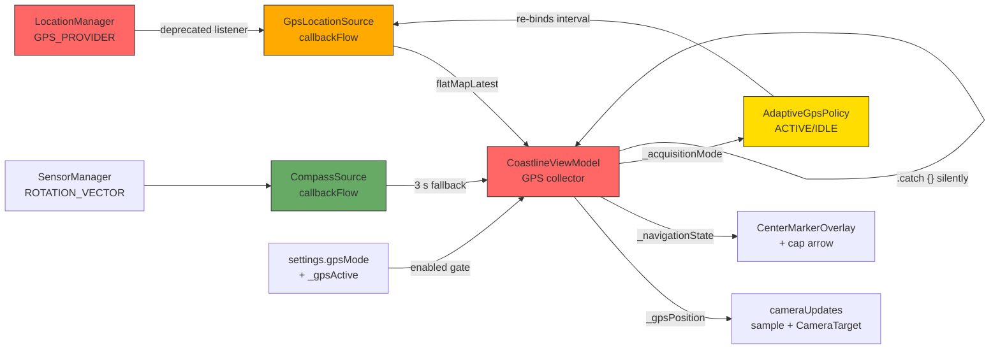

<!-- scope: feature -->
# GPS Tracking Loss Investigation

> Branch: `feature/GPS-Fix`  
> Active Feature: GPS  
> Subfeature: `gps-loss`  
> Date: 2026-06-11

## Code Examined

| File | Role |
|------|------|
| [`GpsLocationSource.kt`](app/src/main/java/ykws/android/maro/data/location/GpsLocationSource.kt) | Framework LocationManager → Flow<GpsFix> |
| [`CompassSource.kt`](app/src/main/java/ykws/android/maro/data/location/CompassSource.kt) | Rotation-vector sensor → Flow<Float> azimuth |
| [`AdaptiveGpsPolicy.kt`](app/src/main/java/ykws/android/maro/data/location/AdaptiveGpsPolicy.kt) | Stationary-detection → ACTIVE/IDLE cadence |
| [`CoastlineViewModel.kt`](app/src/main/java/ykws/android/maro/ui/map/CoastlineViewModel.kt) | GPS collector, compass fallback, adaptive policy wiring |
| [`MapScreen.kt`](app/src/main/java/ykws/android/maro/ui/map/MapScreen.kt) | GPS lifecycle gating, permission handling, auto-follow LaunchedEffect |
| [`AppSettings`](app/src/main/java/ykws/android/maro/data/settings/SettingsManager.kt:52) | GPS-related settings data class |

---

## Issue Summary

### 🔴 Critical

#### 1. Empty `onStatusChanged` — no reaction to GPS provider status changes

**File:** [`GpsLocationSource.kt:68`](app/src/main/java/ykws/android/maro/data/location/GpsLocationSource.kt:68)

```kotlin
override fun onStatusChanged(provider: String?, status: Int, extras: Bundle?) {}
```

The `LocationListener.onStatusChanged()` callback is completely empty. Android invokes this with:
- `LocationProvider.TEMPORARILY_UNAVAILABLE` (1) — GPS signal lost, may return
- `LocationProvider.OUT_OF_SERVICE` (2) — GPS disabled or permanently unavailable
- `LocationProvider.AVAILABLE` (0) — GPS back in service

**Impact:** When GPS signal drops (e.g., momentary obstruction, multipath), the app has zero visibility into the provider state. It keeps using the last known position without any indication the fix is stale. No reconnection or retry logic fires.

#### 2. No stale-fix watchdog — position held indefinitely after GPS loss

**File:** [`CoastlineViewModel.kt:386-416`](app/src/main/java/ykws/android/maro/ui/map/CoastlineViewModel.kt:386)

The GPS collector at lines 382-416 simply emits whatever fix arrives. If the GPS flow goes silent (provider lost but `onStatusChanged`/`onProviderDisabled` are empty), `_gpsPosition` retains its **last known value** indefinitely. There is:
- No timeout that detects "no fix for N seconds"
- No UI indicator that the position is stale
- No automatic attempt to re-register the provider

### 🟠 High

#### 3. Only `GPS_PROVIDER` — no fallback source

**File:** [`GpsLocationSource.kt:74`](app/src/main/java/ykws/android/maro/data/location/GpsLocationSource.kt:74)

```kotlin
lm.requestLocationUpdates(LocationManager.GPS_PROVIDER, minIntervalMs, minDistanceM, listener)
```

Only `GPS_PROVIDER` is used. No `NETWORK_PROVIDER` or `PASSIVE_PROVIDER` fallback. `PASSIVE_PROVIDER` in particular can provide fixes from any available source without additional battery cost — the system already delivers these updates to other apps.

#### 4. Empty `catch` swallows all GPS flow errors

**File:** [`CoastlineViewModel.kt:415`](app/src/main/java/ykws/android/maro/ui/map/CoastlineViewModel.kt:415)

```kotlin
.catch { /* permission revoked mid-stream → stop silently */ }
```

The comment says permission revocation only, but the catch block is blanket-empty. Any exception (system service crash, binder death, transient provider error) is silently swallowed with no logging, no reconnection, no user feedback.

#### 5. No GNSS status / satellite count monitoring

**File:** [`GpsLocationSource.kt`](app/src/main/java/ykws/android/maro/data/location/GpsLocationSource.kt)

The app never registers a `GnssStatus.Callback`. Without this:
- Cannot detect GPS lock weakening (fewer satellites) before complete loss
- Cannot provide diagnostic data (satellite count, SNR) for debugging
- Misses `GnssStatus.GNSS_EVENT_STARTED` / `GNSS_EVENT_STOPPED` signals

### 🟡 Medium

#### 6. Adaptive idle cadence may suppress updates during stationary periods

**Files:** [`AdaptiveGpsPolicy.kt`](app/src/main/java/ykws/android/maro/data/location/AdaptiveGpsPolicy.kt), [`CoastlineViewModel.kt:409-413`](app/src/main/java/ykws/android/maro/ui/map/CoastlineViewModel.kt:409)

The `AdaptiveGpsPolicy` switches to `AcquisitionMode.IDLE` when the device stays within `adaptiveDistanceM` (default 20 m) for `adaptiveWindowSec` (default 30 s). At idle cadence, the GPS fix interval changes to `adaptiveIdleIntervalSec` (default 6 s) and the distance threshold increases.

Default settings produce:
- **Active:** fix every 2 s / 5 m movement
- **Idle:** fix every 6 s (with same 5 m min distance)

This is **intentional** battery saving, but the longer interval may be perceived as "tracking loss" — especially combined with the 5 m min distance which suppresses small movements entirely while stationary.

#### 7. Full GPS re-subscription on any settings change

**File:** [`CoastlineViewModel.kt:369-384`](app/src/main/java/ykws/android/maro/ui/map/CoastlineViewModel.kt:369)

```kotlin
val gpsParams = combine(enabled, settings.distinctUntilChangedBy { ... }, _acquisitionMode) { ... }
gpsParams.flatMapLatest { p -> if (p.on) gpsSource.locationUpdates(p.intervalMs, p.minDistanceM) else emptyFlow() }
```

Changing any of `gpsActiveIntervalSec`, `gpsActiveMinDistanceM`, or `adaptiveIdleIntervalSec` triggers `distinctUntilChangedBy`, which causes `flatMapLatest` to cancel the current GPS subscription and create a new one. This brief tear-down/recreate gap is usually imperceptible but could drop a fix window.

#### 8. Deprecated `LocationListener` API (API 31+)

**File:** [`GpsLocationSource.kt:54-55`](app/src/main/java/ykws/android/maro/data/location/GpsLocationSource.kt:54)

```kotlin
@Suppress("DEPRECATION")
val listener = object : LocationListener { ... }
```

The `LocationListener` interface is deprecated in Android 12 (API 31). The modern approach is `LocationManager.requestLocationUpdates(LocationRequest, LocationCallback, Looper)`. While the deprecated API still works on API 34, its behavior may be less predictable on newer devices.

### 🟢 Low

#### 9. `trySend` may silently drop fixes on buffer overflow

**File:** [`GpsLocationSource.kt:58`](app/src/main/java/ykws/android/maro/data/location/GpsLocationSource.kt:58)

`callbackFlow` uses a buffer with default capacity. `trySend` returns `false` if the buffer is full, but the return value is ignored. In practice, GPS fixes at 1-6 s intervals are far slower than the channel can drain, so drops are extremely unlikely.

---

## Mermaid: GPS Data Flow



**Legend:** 🔴 = issue found, 🟡 = potential concern, 🟢 = ok

---

## Root Cause Analysis

The most likely cause of "GPS tracking loss under good reception" is a **combination of issues 1 + 2**: the app has no visibility into the GPS provider's status, and no timeout to detect stale fixes. When the GPS signal momentarily drops (even under good conditions, atmospheric effects, multipath from waves, or satellite geometry changes can cause brief outages):

1. `onStatusChanged(TEMPORARILY_UNAVAILABLE)` fires → but it's empty, no action taken
2. No more `onLocationChanged` calls → flow goes silent
3. `_gpsPosition` keeps the **last known position** → map appears frozen
4. User interprets as "tracking loss"
5. When GPS returns, `onLocationChanged` fires again → position updates resume

The user never sees a "GPS lost" indicator, just a frozen position that eventually starts moving again.

**Secondary contributor (issue 6):** If the user is stationary (anchored, moored, drifting very slowly), the adaptive policy drops to IDLE cadence (6 s between fixes). With the 5 m min distance filter, small drifts don't trigger updates → longer apparent gaps between position changes.

**Tertiary (issue 3):** No `PASSIVE_PROVIDER` means no supplemental fixes from other apps' GPS requests, which could bridge brief outages.

---

## Recommended Fixes

### Must-fix for tracking loss symptoms

1. **Add `GnssStatus.Callback`** to `GpsLocationSource` — monitor satellite count. When satellites drop below `MIN_SATELLITES` (e.g., 4), emit a `GpsFix` with `hasCourse = false` and a new `hasLock = false` flag so the UI can show "GPS lost".

2. **Implement stale-fix watchdog** in `CoastlineViewModel` — if no fix arrives within `GPS_STALE_TIMEOUT_MS` (e.g., `max(5_000L, intervalMs * 3)`), set a `_gpsStale` StateFlow that the UI reads to show a warning indicator and/or freeze the navigation state.

3. **Handle `onStatusChanged`** — log status changes and, on `TEMPORARILY_UNAVAILABLE`/`OUT_OF_SERVICE`, either emit a stale signal or trigger a re-registration.

### Should-fix for robustness

4. **Log GPS flow errors** in `.catch` instead of silent swallowing.
5. **Consider `PASSIVE_PROVIDER`** as a supplementary source — merge via `combine` with deduplication.
6. **Migrate to `LocationCallback`** when `Build.VERSION.SDK_INT >= 31` for better API 31+ compatibility.

### Nice-to-have

7. **Add GPS health to dashboard** — satellite count, HDOP, time since last fix.
8. **Reduce min distance while stationary** — use separate `gpsIdleMinDistanceM` setting (default 0 m, so even tiny drifts update position at idle cadence).

