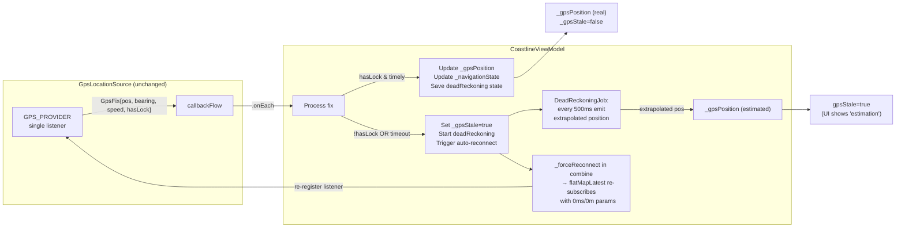
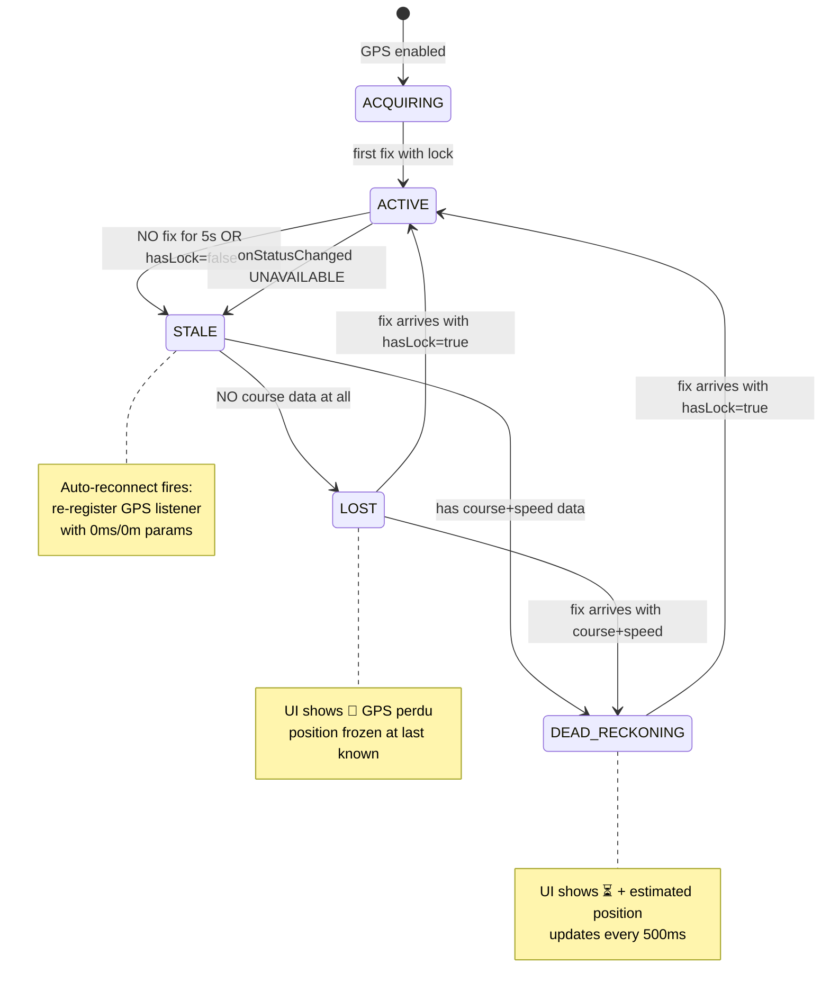

<!-- scope: feature -->
# GPS Single-Source Resilience — Dead Reckoning + Auto-Reconnect

> **Branch:** `feature/dev`
> **Active Feature:** GPS
> **Subfeature:** `single-source-resilience`

---

## Problem

The passive provider (`PASSIVE_PROVIDER`) fallback was removed from [`GpsLocationSource.kt`](app/src/main/java/ykws/android/maro/data/location/GpsLocationSource.kt) because it caused zigzag artifacts from dual-provider ordering races. Without it, brief `GPS_PROVIDER` dropouts leave the position frozen for up to 5 s (the stale watchdog timeout), making tracking appear paused.

## Design Principle

**Keep exactly one GPS source** (`GPS_PROVIDER` only) — no second provider. Instead, make the single source resilient through:

1. **Dead Reckoning**: extrapolate position from last known course+speed during brief dropouts
2. **Auto-Reconnect**: force listener re-registration when stale is detected, using minimal interval/distance for fast re-acquisition

---

## Architecture



## Detailed Changes

### 1. [`CoastlineViewModel.kt`](app/src/main/java/ykws/android/maro/ui/map/CoastlineViewModel.kt)

#### 1a. Dead Reckoning State

Add tracking fields and public StateFlows:

```kotlin
/** Last known position + motion vector for dead reckoning during GPS dropouts. */
private data class DeadReckoningState(
    val position: LatLng,
    val bearingDeg: Float,
    val speedMps: Float,
    val timestampElapsedMs: Long
)

private var deadReckoningState: DeadReckoningState? = null
private var deadReckoningJob: Job? = null

/** True when dead reckoning is actively extrapolating position. */
private val _isEstimating = MutableStateFlow(false)
val isEstimating: StateFlow<Boolean> = _isEstimating.asStateFlow()

/** Force-reconnect trigger: when true, gpsParams uses 0ms/0m for fastest re-acquisition. */
private val _forceReconnect = MutableStateFlow(false)
```

#### 1b. Save Dead Reckoning State on Each Fix

Inside `.onEach { fix -> ... }`, after `_navigationState.update`:

```kotlin
// Save dead reckoning state when we have valid course+speed
if (fix.hasCourse && fix.bearingDeg != null && fix.speedMps != null && fix.speedMps > 0f) {
    deadReckoningState = DeadReckoningState(
        position = fix.position,
        bearingDeg = fix.bearingDeg,
        speedMps = fix.speedMps,
        timestampElapsedMs = now
    )
}
```

#### 1c. Start Dead Reckoning on Stale

When stale is detected (`!fix.hasLock` or watchdog timeout), start a coroutine:

```kotlin
private fun startDeadReckoning() {
    deadReckoningJob?.cancel()
    val state = deadReckoningState ?: return  // No motion data → just freeze
    _isEstimating.value = true
    deadReckoningJob = viewModelScope.launch {
        val startMs = state.timestampElapsedMs
        var elapsedMs = 0L
        while (isActive && elapsedMs < DEAD_RECKONING_MAX_MS) {
            val elapsedSec = (SystemClock.elapsedRealtime() - startMs) / 1000f
            val distM = state.speedMps * elapsedSec
            val estimatedPos = SpatialOperations.pointAlongBearing(
                state.position.latitude, state.position.longitude,
                state.bearingDeg.toDouble(),
                distM
            )
            _gpsPosition.value = estimatedPos
            updateMapCenter(estimatedPos.latitude, estimatedPos.longitude)
            _navigationState.update { it.copy(bearingDeg = state.bearingDeg) }
            delay(DEAD_RECKONING_INTERVAL_MS)
            elapsedMs += DEAD_RECKONING_INTERVAL_MS
        }
        // DR timeout → fall back to LOST (no extrapolation)
        _isEstimating.value = false
    }
}
```

Key additions over the original plan:
- Calls `updateMapCenter()` so the map follows the extrapolated position in GPS mode
- Carries `bearingDeg` forward in `_navigationState` for consistent boat marker rotation
- Caps DR at `DEAD_RECKONING_MAX_MS` (30 s) — after which falls back to LOST (🔴)
- Sets `_isEstimating.value = true` on start, `false` on timeout

#### 1d. Use existing `pointAlongBearing()` from SpatialOperations

[`SpatialOperations.pointAlongBearing()`](app/src/main/java/ykws/android/maro/spatial/SpatialOperations.kt:836) already does spherical Earth extrapolation — "Compute a destination point along a great-circle bearing from a start point." No new function needed.

Usage in dead reckoning:
```kotlin
val estimatedPos = SpatialOperations.pointAlongBearing(
    state.position.latitude, state.position.longitude,
    state.bearingDeg.toDouble(),
    distM
)
```

#### 1e. Auto-Reconnect via `_forceReconnect`

Use a dedicated `_forceReconnect: MutableStateFlow<Boolean>` (not `_gpsStale`) to avoid double re-subscription at recovery. When stale fires, `_forceReconnect = true` triggers `flatMapLatest` to cancel the old subscription and request new one with 0ms/0m params.

```kotlin
val gpsParams = combine(
    enabled,
    settings.distinctUntilChangedBy { ... },
    _acquisitionMode,
    _forceReconnect   // ← NEW: triggers re-subscription on stale, NOT on recovery
) { on, s, mode, forceReconnect ->
    val intervalMs = when {
        forceReconnect -> 0L  // Fastest: GPS delivers fixes as hardware can
        mode == AcquisitionMode.IDLE && s.stopDetectionDelayGps ->
            s.stopDetectionTimeSec * 1000L * BuildConfig.STOP_DETECTION_GPS_DORMANT_PCT / 100
        else -> s.gpsActiveIntervalSec * 1_000L
    }
    val distM = when {
        forceReconnect -> 0f  // No distance filter during reconnect
        mode == AcquisitionMode.IDLE -> s.gpsIdleMinDistanceM
        else -> s.gpsActiveMinDistanceM
    }
    GpsParams(on, intervalMs, distM)
}.distinctUntilChanged()
```

When stale fires (in the watchdog timeout or `!hasLock` branch):
```kotlin
_forceReconnect.value = true
```

When the first fix with `hasLock=true` arrives after reconnect:
```kotlin
_forceReconnect.value = false  // Reverts to normal cadence
```

The `_forceReconnect.value = false` triggers one more `flatMapLatest` re-subscription (back to normal params), which is acceptable — it happens after the GPS has already recovered, so the sub-millisecond gap is irrelevant.

#### 1f. Cancel Dead Reckoning + Reset Force Reconnect on Real Fix

In the `fix.hasLock` branch:

```kotlin
if (fix.hasLock) {
    deadReckoningJob?.cancel()
    deadReckoningJob = null
    _isEstimating.value = false
    _forceReconnect.value = false
    _gpsStale.value = false
    lastFixMs = now
    staleWatchdogJob?.cancel()
    staleWatchdogJob = viewModelScope.launch {
        delay(GPS_STALE_TIMEOUT_MS)
        // On timeout: set stale + trigger reconnect + start dead reckoning
        _gpsStale.value = true
        _forceReconnect.value = true
        startDeadReckoning()
    }
}
```

And in the `!fix.hasLock` branch:
```kotlin
else {
    _gpsStale.value = true
    _forceReconnect.value = true
    startDeadReckoning()
}
```

### 2. [`GpsLocationSource.kt`](app/src/main/java/ykws/android/maro/data/location/GpsLocationSource.kt)

**No changes.** Single `GPS_PROVIDER` source remains untouched. The comment about passive provider removal is still accurate.

### 3. [`SpatialOperations.kt`](app/src/main/java/ykws/android/maro/spatial/SpatialOperations.kt)

**No changes.** Reuses existing [`pointAlongBearing()`](app/src/main/java/ykws/android/maro/spatial/SpatialOperations.kt:836) — no new function needed.

### 4. [`MapScreen.kt`](app/src/main/java/ykws/android/maro/ui/map/MapScreen.kt)

Read `isEstimating` from the ViewModel and add `ESTIMATING` to `GpsIconState`:

```kotlin
val isEstimating by viewModel.isEstimating.collectAsState()
```

Update the `GpsIconState` enum:
```kotlin
private enum class GpsIconState { DEMO, ACQUIRING, HEALTHY, IDLE, STALE, ESTIMATING }
```

Update the icon derivation:
```kotlin
val gpsIconState = remember(appSettings.gpsMode, gpsPosition, gpsStale, acquisitionMode, isEstimating) {
    when {
        !appSettings.gpsMode -> GpsIconState.DEMO
        gpsPosition == null -> GpsIconState.ACQUIRING
        isEstimating -> GpsIconState.ESTIMATING      // ⏳ dead reckoning active
        gpsStale -> GpsIconState.STALE                // 🔴 no fix + no course data
        acquisitionMode == IDLE -> GpsIconState.IDLE
        else -> GpsIconState.HEALTHY
    }
}
```

Add ESTIMATING to the color mapping in `GpsStatusIcon`:
```kotlin
GpsIconState.ESTIMATING -> {
    baseColor = ComposeColor(AppConfig.statusGpsEstimating)
    bgAlpha = AppConfig.statusGpsAlphaActive
    contentAlpha = 1f
}
```

Add `statusGpsEstimating` to `AppConfig` (a warm amber/yellow color — distinct from idle blue and stale red).

---

## State Machine



---

## Constants to Add

| Constant | Value | Location |
|----------|-------|----------|
| `DEAD_RECKONING_INTERVAL_MS` | `500L` | CoastlineViewModel companion |
| `DEAD_RECKONING_MAX_MS` | `30_000L` | CoastlineViewModel companion |
| `statusGpsEstimating` | amber/yellow hex | AppConfig (AppConfig.kt) |

---

## Files to Modify

| File | Changes |
|------|---------|
| [`CoastlineViewModel.kt`](app/src/main/java/ykws/android/maro/ui/map/CoastlineViewModel.kt) | Dead reckoning state/coroutine, `_isEstimating`/`_forceReconnect` StateFlows, auto-reconnect via gpsParams, cancel DR on fix |
| [`MapScreen.kt`](app/src/main/java/ykws/android/maro/ui/map/MapScreen.kt) | Read `isEstimating`, add `ESTIMATING` to `GpsIconState`, add color mapping |
| [`AppConfig.kt`](app/src/main/java/ykws/android/maro/data/settings/AppConfig.kt) | Add `statusGpsEstimating` color constant |
| [`GpsLocationSource.kt`](app/src/main/java/ykws/android/maro/data/location/GpsLocationSource.kt) | **No changes** — single source untouched |
| [`SpatialOperations.kt`](app/src/main/java/ykws/android/maro/spatial/SpatialOperations.kt) | **No changes** — reuse existing `pointAlongBearing()` |

---

## Why This Works

1. **Single source** — no ordering races, no zigzag artifacts
2. **Dead reckoning** keeps the boat marker moving (estimated) during brief dropouts instead of freezing
3. **Auto-reconnect** with 0ms/0m params forces the fastest possible re-acquisition from the hardware
4. **UI transparency** — shows ⏳ "estimating" vs 🔴 "lost" so user knows when position is interpolated
5. **No new permissions, no new dependencies** — pure Kotlin + existing Android LocationManager API
