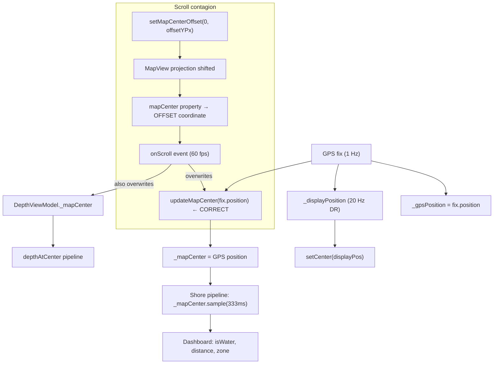
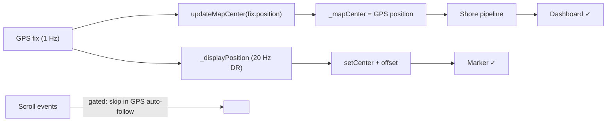

# Position Dash — Fix Dashboard vs Marker Position Mismatch

> **Feature:** GPS | **Branch:** feature/position-dash
> **Created:** 2026-08-08 15:14 | **Status:** Plan (reviewed — simplified to single-file gated-callback)

## Problem

Dashboard spatial values (isOnWater, distanceToShore, zoneSituation, depthAtCenter) disagree
with the map marker position. The marker is correct; the dashboard queries a different position.
Discrepancy can be 100s of meters — isOnWater flips incorrectly, distance/zone/depth are all off.

## Root Cause



### The chain

1. [MapScreen:3214](app/src/main/java/ykws/android/maro/ui/map/MapScreen.kt:3214):
   `setMapCenterOffset(0, centerOffsetYPx)` shifts osmdroid's internal projection.
   The native `mapCenter` property now returns the **offset** geo-coordinate.

2. [MapScreen:3112](app/src/main/java/ykws/android/maro/ui/map/MapScreen.kt:3112):
   `onScroll` fires → reads `this@apply.mapCenter` → offset coordinate.

3. [MapScreen:1417](app/src/main/java/ykws/android/maro/ui/map/MapScreen.kt:1417):
   `onCenterChanged` → `viewModel.updateMapCenter(offsetLat, offsetLon)` →
   overwrites `_mapCenter` with the offset value.

4. [NavigationViewModel:470](app/src/main/java/ykws/android/maro/ui/map/NavigationViewModel.kt:470):
   Shore pipeline samples `_mapCenter` → all dashboard values computed against
   the **offset** position, not the GPS position.

5. [DepthViewModel:68](app/src/main/java/ykws/android/maro/ui/map/DepthViewModel.kt:68):
   Same bug — `_mapCenter` fed from scroll events at [MapScreen:1419](app/src/main/java/ykws/android/maro/ui/map/MapScreen.kt:1419),
   contaminated by offset.

### Why the marker stays correct

The marker overlay is drawn with a matching `centerOffsetYDp` at [MapScreen:2608](app/src/main/java/ykws/android/maro/ui/map/MapScreen.kt:2608),
so it visually aligns with the GPS position despite the shifted map center.

## Fix Design (Simplified)

### Principle

The GPS fix handler at [NavigationViewModel:746](app/src/main/java/ykws/android/maro/ui/map/NavigationViewModel.kt:746)
already calls `updateMapCenter(fix.position)` with the correct GPS position on every fix.
The scroll events fired by `setCenter` + `setMapCenterOffset` are **artifacts** — they
carry the offset coordinate and serve no purpose during GPS auto-follow.

**Gate the scroll callback:** skip `updateMapCenter` from scroll/zoom events when
GPS auto-follow is active. The GPS handler already sets `_mapCenter` correctly.

### Single File Change

**`MapScreen.kt`** — gate [`onCenterChanged`](app/src/main/java/ykws/android/maro/ui/map/MapScreen.kt:1415)

```kotlin
// BEFORE (line 1416-1425):
val onCenterChanged: (Double, Double) -> Unit = remember(viewModel, depthViewModel, appSettings) {
    { lat, lon ->
        viewModel.updateMapCenter(lat, lon)
        depthViewModel.updateMapCenter(lat, lon)
        // In demo mode, feed map center into adaptive policy for stop detection
        if (!appSettings.gpsMode) {
            viewModel.feedDemoPosition(lat, lon)
        }
    }
}

// AFTER:
val onCenterChanged: (Double, Double) -> Unit = remember(viewModel, depthViewModel, appSettings) {
    { lat, lon ->
        // In GPS auto-follow mode, scroll events are artifacts of setCenter +
        // setMapCenterOffset — they carry the offset map-center and would
        // contaminate _mapCenter. The GPS fix handler (NavVM:746) already
        // sets _mapCenter to the correct GPS position on each fix.
        // Only accept scroll updates when the user is manually panning
        // (autoFollowSuppressed) or in demo mode (no GPS driving the map).
        if (!appSettings.gpsMode || viewModel.autoFollowSuppressed.value) {
            viewModel.updateMapCenter(lat, lon)
            depthViewModel.updateMapCenter(lat, lon)
            if (!appSettings.gpsMode) {
                viewModel.feedDemoPosition(lat, lon)
            }
        }
    }
}
```

### Why This Works

| Mode | Scroll events from | Accepted? | Reasoning |
|------|--------------------|-----------|-----------|
| GPS + auto-follow | `setCenter` + offset | **No** | GPS handler already updates `_mapCenter` every fix |
| GPS + user panning | Finger drag | **Yes** | `autoFollowSuppressed = true`, user is looking elsewhere |
| Demo mode | Finger drag | **Yes** | No GPS — map center IS the boat position |
| Zoom (any mode) | Pinch zoom | Depends | Only accepted when not in GPS auto-follow |

### Data Flow After Fix



### What stays unchanged

- `_mapCenter` — still updated from GPS handler and manual panning, stays clean
- `_displayPosition` (20 Hz DR) — unchanged, continues driving map centering
- `_gpsPosition` — unchanged, continues as GPS truth for track recording
- `setMapCenterOffset` — unchanged, continues providing the visual offset
- `NavigationViewModel.kt` — no changes
- `DepthViewModel.kt` — no changes

### Downside Check

| Consumer of `_mapCenter` | Impact |
|---------------------------|--------|
| Shore pipeline (dashboard) | ✅ Now queries correct GPS position |
| `uiMapCenter` (MapScreen:302) | ✅ Shows GPS position instead of offset center — **correction** |
| `savePosition()` (ON_PAUSE) | ✅ Saves GPS position, correct for app restart |
| Marker creation "at position" | ✅ Creates at GPS position, not visual center |
| Demo speed computation | ✅ Unaffected — offset only active in GPS mode |
| DepthViewModel pipeline | ✅ Stays at GPS position during auto-follow |

## Implementation Steps

1. Edit [`MapScreen.kt`](app/src/main/java/ykws/android/maro/ui/map/MapScreen.kt) — gate `onCenterChanged` callback at line 1417
2. Build (`apk-build.bat`)
3. On-device verification: GPS mode with offset active — check isOnWater, distance, depth match marker position
4. Verify manual panning still updates dashboard correctly (autoFollowSuppressed path)
5. Verify demo mode unaffected (offset not active in demo)
