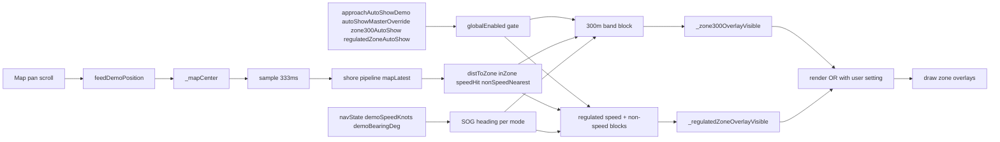

# Auto-Show Zones in Demo Mode — Validation & Fix Plan

> Task plan. Engine/settings/decision context (consolidated, single source):
> [`FEAT_DOC_Navigation_auto-show.md`](FEAT_DOC_Navigation_auto-show.md).

## Problem

User report: regulated zones and the 300 m band **do not auto-show in demo mode**, even when the
relevant settings are activated. GPS mode is reported to behave correctly. Goal: validate the
behavior for both modes and fix demo mode if confirmed broken.

## Where the logic lives (grounded)

The auto-show engine moved from the old `CoastlineViewModel` into `NavigationViewModel.kt` and now
uses **memory-only overlay StateFlows** OR'd with the user setting at render time (the open
`auto-show-settings-decoupling` design is already implemented):

| Concern | Location |
|---|---|
| Overlay flows `_zone300OverlayVisible` / `_regulatedZoneOverlayVisible` | `NavigationViewModel.kt:241-246` |
| Shore pipeline source `_mapCenter.sample(SHORE_SAMPLE_INTERVAL_MS)` | `NavigationViewModel.kt:461-464` |
| SOG source per mode (demo = `demoSpeedKnots ?: (inZone ? 0f : null)`) | `NavigationViewModel.kt:604-608` |
| Global gate `(gpsMode ? approachAutoShowGps : approachAutoShowDemo) && autoShowMasterOverride` | `NavigationViewModel.kt:610-611` |
| 300 m band auto-show block → `_zone300OverlayVisible` | `NavigationViewModel.kt:613-644` |
| Regulated speed + non-speed blocks → `_regulatedZoneOverlayVisible` | `NavigationViewModel.kt:647-673` |
| Demo pan-speed reset after `PAN_STOP_DELAY_MS` (500 ms idle) | `NavigationViewModel.kt:675-680`, `:1144`, `:1576` |
| Demo pan-speed set on scroll velocity | `NavigationViewModel.kt:1173` |
| `feedDemoPosition(lat, lon)` (drives `_mapCenter` in demo) | `NavigationViewModel.kt:1195`, call sites `MapScreen.kt:1672-1674`, `:1181-1183` |
| Pure decision `zoneAutoShowDecision` (armed/approaching/reveal/hide) | `NavigationViewModel.kt:1732-1802` |
| Render OR gate (user setting OR overlay flow) | `MapScreen.kt` — verify exact lines around the `filterRegulatedZones` gate |
| Settings fields `approachAutoShowGps/Demo`, `zone300AutoShow`, `speedZoneAutoShow`, `regulatedZoneAutoShow`, `autoShowMasterOverride`, `gpsMode` | `SettingsManager.kt:60-67`, load `:363-370`, save `:491-498` |

Demo-mode position = map centre; heading/speed come from pan motion (`demoBearingDeg` /
`demoSpeedKnots`) and are cleared 500 ms after the map stops scrolling.

## Likely root-cause candidates (ranked)

1. **H1 — Settings/master gate off in demo.** Reveal requires
   `approachAutoShowDemo && autoShowMasterOverride` (plus per-type switch). The drawer master switch
   ("Auto-show zones") is only *visible* when the feature is enabled for the current mode, so a stale
   `autoShowMasterOverride=false` silently kills all demo auto-show. Check persisted prefs + mode.
2. **H2 — Band reveal requires `armed`.** `zoneAutoShowDecision` only REVEALs while `armed`
   (`zone300ManuallyHidden`), which is set only when the user manually hides the band. Confirm
   whether default-hidden state ever arms; if GPS works and demo doesn't, compare arm flags per mode.
3. **H3 — Demo pipeline cadence/feed.** `_mapCenter` only advances on scroll events
   (`feedDemoPosition`); `sample` at ~333 ms. If drag stops just before the reveal threshold, the
   last sample may already be > `revealDistM` and `approaching` is false → no reveal. Also confirm
   `demoSpeedKnots` is non-null *during* the drag (needed for time-based reveal / compliance hide).
4. **H4 — Render OR gate gap.** Verify `MapScreen` combines `zone300Visible || zone300OverlayVisible`
   and `regulatedZonesVisible || regulatedZoneOverlayVisible` for the demo render path, matching the
   decoupling design's behaviour matrix.
5. **H5 — Mode misclassification.** `gpsMode` defaults false (demo is default). If a demo session
   somehow evaluates with `gpsMode=true`-derived branches while real demo flags are used elsewhere,
   the two settings sets diverge.

## Validation procedure

1. Build debug APK (`apk-build.bat`) on `feature/auto-show-zones`.
2. Fresh install → default state; record `gpsMode`, all five auto-show settings, `autoShowMasterOverride`.
3. Demo mode: drag the map toward a regulated zone (speed zone) and toward the 300 m band;
   watch logcat `SZI query ...` lines (`NavigationViewModel.kt:480-488`) and add temp logging for
   `globalEnabled`, `armed/autoRevealed`, `distToZone`, `sogKn`, and the two overlay flows.
4. Repeat in GPS mode as the control.
5. Compare decision inputs demo vs GPS and identify which candidate (H1–H5) reproduces.

## Out of scope

- Decoupling design (already implemented — overlay flows exist).
- Settings UI redesign (only the gate fix if a setting is the cause).

## Success criteria

- Regulated zones (speed + non-speed) and the 300 m band auto-show on approach in **both** demo and
  GPS mode with their respective settings enabled.
- Manual hide still wins (no re-reveal) and fan button state stays user-driven.
- Build green; Ask review of the change.

## Mermaid — demo auto-show data flow

## Files touched (implementation phase)

- `app/src/main/java/ykws/android/maro/ui/map/NavigationViewModel.kt`
- `app/src/main/java/ykws/android/maro/ui/map/MapScreen.kt` (render OR gate, if needed)
- `app/src/main/java/ykws/android/maro/data/settings/SettingsManager.kt` (only if a default is wrong)
