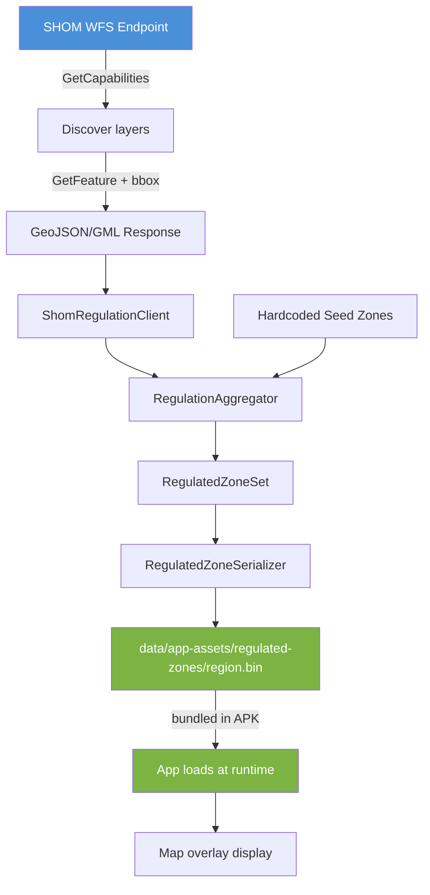

<!-- scope: feature -->
# Regulated Zones — Data Lookup Plan

## Overview

Gather maritime regulation zone data from French official sources (SHOM, DIRM, data.gouv.fr) for the Nice–Fréjus corridor, aggregate and model it, and serialize it as a bundled asset following the established prebake pipeline pattern.

## Architecture & Data Flow



## Project Pipeline Context

The app follows a strict **Gather → Process → Serialize** prebake pattern:

| Stage | Mechanism | Location |
|-------|-----------|----------|
| **Gather** | WFS GetFeature + bbox filter → GeoJSON | Computer (build time) |
| **Process** | Parse → classify → aggregate → deduplicate | Computer (build time) |
| **Serialize** | Protobuf/kotlinx-serialization → `.bin` | Computer (build time) |
| **Bundle** | `data/app-assets/regulated-zones/` → APK via `assets.srcDir` | Build time (Gradle) |
| **Load** | Read bundled `.bin` → deserialize → render | App runtime (on-device) |

This mirrors established pipelines: [`CoastlineGenerator`](app/src/main/java/ykws/android/maro/data/coastline/CoastlineGenerator.kt:39) → [`CoastlineSerializer`](app/src/main/java/ykws/android/maro/data/coastline/CoastlineSerializer.kt:24) for coastline, [`DepthPrebakeTest`](app/src/test/java/ykws/android/maro/data/prebake/DepthPrebakeTest.kt:21) for depth.

## Data Source Strategy

### Primary Source: SHOM WFS (preferred)

SHOM exposes maritime regulation zones via OGC WFS at a URL similar to:
- `https://services.data.shom.fr/wfs/reglementation` (candidate — needs `GetCapabilities` confirmation)
- `https://services.data.shom.fr/inspire/wfs` (INSPIRE-compliant fallback)

Expected layer names (to be confirmed via GetCapabilities):
- `reglementation:zone_vitesse` — speed limitation zones
- `reglementation:zone_mouillage` — anchoring restriction zones
- `reglementation:zone_acces_interdit` — prohibited access zones
- `reglementation:zone_protection` — environmental protection zones

**Action:** Run `GetCapabilities` against the candidate URLs, parse the response, and list available `typeName`s relevant to maritime regulations within the Nice–Fréjus bbox.

### Secondary / Fallback Sources

| Source | Type | Coverage |
|--------|------|----------|
| OSM Overpass (`boundary=maritime` + `access=*`/`maxspeed=*` on ways/relations) | Similar to existing [`CoastlineGenerator.fetchOverpass()`](app/src/main/java/ykws/android/maro/data/coastline/CoastlineGenerator.kt:656) | Good for basic speed limits, but incomplete |
| [`data.gouv.fr`](https://www.data.gouv.fr/fr/datasets/?q=reglementation+maritime+mediterranee) | CSV/GeoJSON downloads | DIRM arrêtés, may be manual |
| DIRM Méditerranée arrêtés | PDF/GeoJSON | Official speed/anchoring zones |

### Hardcoded Seed Fallback

Known zones that MUST always be present (hardcoded seeds, merged even if WFS fetch fails):

| Zone | Location | Regulation |
|------|----------|------------|
| Cap d'Antibes speed zone | Around Cap d'Antibes peninsula | 10 kn max speed |
| Îles de Lérins inter-îles | Between Sainte-Marguerite and Saint-Honorat | Size/engine restrictions |
| 300 m band | Along entire coastline (already covered by Zone300 feature) | 5 kn inside band |
| Baie des Anges | Nice harbour approach | Speed limitation |

These seeds ensure baseline coverage even when the remote WFS is unreachable (same best-effort pattern as [`HazardSeeds`](xTrack/Coastline/FEAT_DSC_Coastline.md:37)).

## Data Model

### `RegulatedZone.kt`

```kotlin
package ykws.android.maro.data.regulation

/**
 * A maritime regulatory zone with a polygon geometry and typed attributes.
 *
 * @property outerRing   Polygon outer boundary as closed LatLng list
 * @property holes       Zero or more interior holes (islands exempt from the regulation)
 * @property zoneType    Classification of the regulation (speed, anchoring, access, …)
 * @property speedLimitKn Speed limit in knots, null if not a speed zone
 * @property name        Human-readable name (e.g. "Cap d'Antibes — 10 nœuds")
 * @property source      Data source identifier ("SHOM", "SEED", "OSM", "DIRM")
 * @property sourceRef   Official reference ID or arrêté number
 * @property description Free-text description of the regulation
 */
data class RegulatedZone(
    val outerRing: List<LatLng>,
    val holes: List<List<LatLng>> = emptyList(),
    val zoneType: RegulatedZoneType,
    val speedLimitKn: Double? = null,
    val name: String = "",
    val source: String = "SHOM",
    val sourceRef: String = "",
    val description: String = ""
)

enum class RegulatedZoneType {
    SPEED_LIMIT,
    ANCHORING_PROHIBITED,
    ACCESS_PROHIBITED,
    ENVIRONMENTAL,
    MOORING,
    FISHING_PROHIBITED,
    NAVIGATION_RESTRICTION,
    OTHER
}

data class RegulatedZoneSet(
    val zones: List<RegulatedZone>,
    val metadata: RegulationMetadata
)

data class RegulationMetadata(
    val regionId: String = "nice-frejus",
    val fetchTimestampMs: Long,
    val sourceCount: Int,
    val totalZones: Int
)
```

This model uses [`LatLng`](app/src/main/java/ykws/android/maro/data/model/LatLng.kt:13) (kotlinx.serialization `@Serializable`) already in the project, keeping spatial primitives shared.

## SHOM WFS Client Design

### `ShomRegulationClient.kt`

Following the pattern from the planned (but not yet committed) [`ShomAtonClient`](xTrack/Coastline/FEAT_DSC_Coastline.md:52):

```kotlin
class ShomRegulationClient(
    private val httpClient: OkHttpClient = defaultClient(),
    private val baseUrl: String = DEFAULT_BASE_URL  // TBD after GetCapabilities
) {
    /**
     * Fetches SHOM regulation zones intersecting the bbox.
     * Best-effort: returns empty list on error (never throws).
     */
    suspend fun fetchZones(
        bbox: BoundingBox,
        onProgress: (Int) -> Unit = {}
    ): List<RegulatedZone>

    /**
     * Discovers available layer/typeName entries.
     * Called once to determine the real typeNames.
     */
    suspend fun getCapabilities(): List<LayerInfo>
}
```

**Key implementation details:**
- OkHttpClient (same [`OkHttpClient`](app/src/main/java/ykws/android/maro/data/coastline/CoastlineGenerator.kt:95) pattern already used project-wide)
- WFS `GetFeature` request with `bbox` filter and `outputFormat=application/json` (preferred) or `application/gml+xml` (fallback)
- Parse GeoJSON FeatureCollection → `List<RegulatedZone>` or parse GML → `List<RegulatedZone>`
- `getCapabilities()` for layer discovery (key-value pair parsing or XML parsing)

### GeoJSON-to-Model Mapping

Expected SHOM GeoJSON properties → `RegulatedZone` mapping:

```text
properties.type_reglementation → RegulatedZoneType (string→enum)
properties.vitesse_max        → speedLimitKn (double, nullable)
properties.nom                → name (string)
properties.id_reglementation  → sourceRef (string)
properties.description        → description (string)
geometry.coordinates[0]       → outerRing (List<LatLng>)
geometry.coordinates[1..N]    → holes (List<List<LatLng>>)
```

## Aggregation Strategy

### `RegulationAggregator.kt`

Merges zones from multiple sources into a single authoritative set:

1. **Collect** — gather from all sources (SHOM WFS, seeds, future OSM/DIRM)
2. **Deduplicate** — two zones within 25 m centroid distance + same type → merge (keep SHOM attributes, flag as `source="SHOM+SEED"`)
3. **Validate** — reject zones with centroids outside the Nice–Fréjus corridor
4. **Sort** — by zone type, then area descending

```kotlin
object RegulationAggregator {
    fun aggregate(
        shomZones: List<RegulatedZone>,
        seedZones: List<RegulatedZone>,
        bbox: BoundingBox
    ): RegulatedZoneSet
}
```

## Serialization

### `RegulatedZoneSerializer.kt`

Use **kotlinx.serialization** (already wired in the project via `libs.plugins.kotlin.serialization`) since the data model is straightforward:

```kotlin
@Serializable
data class RegulatedZoneSet(
    val zones: List<RegulatedZone>,
    val metadata: RegulationMetadata
)
```

Serialized to `data/app-assets/regulated-zones/nice-frejus.bin` using `kotlinx.serialization.protobuf.ProtoBuf` or `kotlinx.serialization.json.Json` → `ByteArray`. ProtoBuf is preferred for efficiency and consistency with the Protobuf-based [`CoastlineSerializer`](app/src/main/java/ykws/android/maro/data/coastline/CoastlineSerializer.kt:24).

## Prebake Test

### `RegulatedZonePrebakeTest.kt`

Following the exact pattern of [`DepthPrebakeTest`](app/src/test/java/ykws/android/maro/data/prebake/DepthPrebakeTest.kt:21) and [`Zone300AssetBaker`](app/src/test/java/ykws/android/maro/data/coastline/Zone300AssetBaker.kt:34):

```kotlin
class RegulatedZonePrebakeTest {
    @Test
    fun prebakeRegulatedZones() {
        Assume.assumeTrue("set -Dmaro.prebake=true to run",
            System.getProperty("maro.prebake") == "true")

        // 1. Fetch SHOM zones (best-effort, empty on failure)
        // 2. Merge with seed zones
        // 3. Serialize to data/app-assets/regulated-zones/nice-frejus.bin
        // 4. Print summary: N zones total, X per type, Y per source
    }
}
```

## Bake Script

### `tools/bake-regulated-zones.bat`

```batch
@echo off
REM Bake regulated zones from SHOM WFS + seeds into data/app-assets/regulated-zones/
echo [bake-regulated-zones] Fetching SHOM regulation zones + aggregating...
call gradlew testDebugUnitTest --tests "*RegulatedZonePrebakeTest*" -Dmaro.prebake=true --rerun-tasks
exit /b %ERRORLEVEL%
```

## Integration Points

### `apk-bake.bat`

Add `regulated-zones` to the interactive menu alongside coastlines/depth/litto3d/emodnet.

### `app/build.gradle.kts`

The `data/app-assets` source directory is already set as an asset source root:

```kotlin
assets.srcDir(rootProject.file("data/app-assets"))
```

So `data/app-assets/regulated-zones/nice-frejus.bin` will be automatically packaged into the APK as `assets/regulated-zones/nice-frejus.bin` with no additional configuration.

### Asset Ignore Patterns

Add `regulated-zones/` patterns to `ignoreAssetsPatterns` if any intermediate files need exclusion (not needed for now — only the `.bin` will be present).

## Execution Plan (Ordered Steps)

| # | Step | Description | Dependencies | Est. Files |
|---|------|-------------|--------------|------------|
| 1 | Source discovery | Run GetCapabilities on candidate SHOM WFS URLs, enumerate regulation layer typeNames | None | 0 (docs) |
| 2 | Data model | Create `RegulatedZone.kt` data classes + enum + serialization | None | 1 |
| 3 | WFS client | Build `ShomRegulationClient.kt` with GetFeature + bbox + GeoJSON parsing | Step 1 (layer names), Step 2 (model) | 1 |
| 4 | Seed zones | Hardcode known zones (Cap d'Antibes 10 kn, Lérins, etc.) | Step 2 (model) | 1 |
| 5 | Aggregator | Build `RegulationAggregator.kt` — merge, deduplicate, validate | Steps 2, 3, 4 | 1 |
| 6 | Serializer | Build `RegulatedZoneSerializer.kt` — .bin serialization | Step 2 (model) | 1 |
| 7 | Prebake test | Build `RegulatedZonePrebakeTest.kt` gated by `-Dmaro.prebake=true` | Steps 3, 5, 6 | 1 |
| 8 | Bake script | Create `tools/bake-regulated-zones.bat` | Step 7 | 1 |
| 9 | Integration | Wire into `apk-bake.bat` interactive menu | Step 8 | 1 |

## Nice–Fréjus Corridor Bbox

| Boundary | Value |
|----------|-------|
| West | 6.73°E |
| East | 7.31°E |
| South | 43.35°N |
| North | 43.73°N |

Reuses the same [`BoundingBox`](app/src/main/java/ykws/android/maro/data/model/BoundingBox.kt:11) model already in the project. All data outside this box is rejected at ingestion.

## Questions & Open Items

1. **SHOM WFS endpoint URL** — The exact URL and layer names need live confirmation. Candidates:
   - `https://services.data.shom.fr/wfs/reglementation`
   - `https://services.data.shom.fr/inspire/wfs`
   - These may need a `GetCapabilities` probe during implementation step 1.

2. **GML parsing** — If GeoJSON is not available from SHOM WFS, a GML parser will be needed. GML is XML-based; a simple XML pull parser (`XmlPullParser` from Android stdlib or a lightweight XML library) could handle it. This adds complexity but is a fallback path.

3. **OSM Overpass alternative** — OSM tagging for maritime zones is incomplete but could supplement the seed data. The existing Overpass HTTP infrastructure in [`CoastlineGenerator`](app/src/main/java/ykws/android/maro/data/coastline/CoastlineGenerator.kt:656) could be reused.

4. **Display layer integration** — Not in scope for `data-lookup`, but the serializer output must be designed for easy consumption by the future map renderer (polygon fill with per-type colours, optional labels).

---

*Plan prepared 2026-06-11. Review before implementation.*

