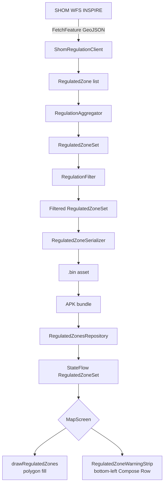

<!-- scope: feature -->
# Regulated Zone Icon Warnings — Implementation Plan

## Overview

Supplement the current polygon-fill rendering of regulated zones with a **warning icon strip** at the bottom-left of the map. Icons for active zone types that apply to the user's vessel (<6m) are shown in a single horizontal row, providing quick glanceable warnings without cluttering the map. The polygon fill overlay remains for boundary context.

The plan covers 4 phases: data extraction, bake-time filtering, icon assignment, and map overlay rendering.

---

## Phase 1 — Data Extraction & Type Audit

### Goal
Run the existing prebake pipeline, dump the full list of regulation types and their properties from actual SHOM WFS data, so we can make informed decisions about which types to keep and which icons to assign.

### Steps

1. **Run `tools/bake-regulated-zones.bat`** to fetch live SHOM data and regenerate the `.bin` asset. The existing prebake test already prints a per-type breakdown:
   ```
   [prebake] Breakdown by zone type:
            SPEED_LIMIT            12
            ANCHORING_PROHIBITED    8
            ACCESS_PROHIBITED       3
            ENVIRONMENTAL           2
            ...
   ```
2. **Add a new prebake-only dump step** in [`RegulatedZonePrebakeTest.kt`](app/src/test/java/ykws/android/maro/data/regulation/RegulatedZonePrebakeTest.kt:64) that prints **per-zone details**: `name`, `zoneType`, `sourceRef`, `vesselSizeRestriction`, `speedLimitKn` — so we can audit which zones are relevant for a <6m boat.
3. **Decide the keep/filter list** for zone types based on real data. Initial recommendation:
   - **KEEP**: `SPEED_LIMIT` (always applies per `appliesTo()`), `ANCHORING_PROHIBITED`, `ACCESS_PROHIBITED`, `MOORING`, `NAVIGATION_RESTRICTION`
   - **FILTER OUT by default**: `ENVIRONMENTAL` (informational only, not a navigational hazard), `FISHING_PROHIBITED` (not a navigation restriction), `OTHER` (unclassified noise)
   - **Configurable** via `maro.properties` key `regulatedZones.filteredTypes`

### Key Files
- [`RegulatedZonePrebakeTest.kt`](app/src/test/java/ykws/android/maro/data/regulation/RegulatedZonePrebakeTest.kt)
- [`maro.properties`](maro.properties)

---

## Phase 2 — Bake-Time Filtering

### Goal
Add a filtering step in the prebake pipeline that removes zones irrelevant to the user's vessel (<6m) and their preferred zone categories. The filter runs at **bake time** (computer), producing a smaller, cleaner `.bin` asset for the APK.

### Architecture

```
SHOM WFS fetch → RegulationAggregator.aggregate() → RegulatedZoneSet
                                                          ↓
                                               RegulationFilter.filter()
                                                          ↓
                                          Filtered RegulatedZoneSet
                                                          ↓
                                               RegulatedZoneSerializer.serialize()
                                                          ↓
                                               .bin asset on disk
```

### Filter Rules

#### 1. Vessel Size Filter
For each zone, call `zone.appliesTo(vesselLengthM = 6.0)`:
- If `appliesTo` returns `false` → discard the zone
- This automatically removes zones like "speed limit for vessels >50m" or "anchoring restriction for vessels >20m"
- Speed limit zones always pass (the `appliesTo()` logic returns `true` when `speedLimitKn != null`)

#### 2. Zone Type Filter
Discard zones whose `zoneType` is in the user's filtered-out list:
- Default filtered types: `ENVIRONMENTAL`, `FISHING_PROHIBITED`, `OTHER`
- Configurable via `maro.properties`: `regulatedZones.filteredTypes=ENVIRONMENTAL,FISHING_PROHIBITED,OTHER`

### Implementation

1. **Create [`RegulationFilter.kt`](app/src/main/java/ykws/android/maro/data/regulation/RegulationFilter.kt)** — a new `object` with:
   ```kotlin
   fun filter(
       zoneSet: RegulatedZoneSet,
       vesselLengthM: Double,
       filteredTypes: Set<RegulatedZoneType>
   ): RegulatedZoneSet
   ```
   - Iterates `zoneSet.zones`, keeps only zones that pass both filters
   - Updates `metadata.totalZones` to match the filtered count

2. **Add `maro.properties` keys**:
   ```properties
   # Default vessel length for bake-time filtering (metres)
   regulatedZones.defaultVesselLengthM=6.0
   # Zone types to exclude (comma-separated, case-insensitive)
   regulatedZones.filteredTypes=ENVIRONMENTAL,FISHING_PROHIBITED,OTHER
   ```
   Wire through `BuildConfig` following the existing pattern (see [`maro.properties`](maro.properties) + `app/build.gradle.kts`).

3. **Update [`RegulatedZonePrebakeTest.kt`](app/src/test/java/ykws/android/maro/data/regulation/RegulatedZonePrebakeTest.kt:49)** — insert filter step after aggregation:
   ```kotlin
   val zoneSet = RegulationAggregator.aggregate(shomZones, seeds, bbox)
   val filtered = RegulationFilter.filter(
       zoneSet,
       vesselLengthM = 6.0,
       filteredTypes = setOf(ENVIRONMENTAL, FISHING_PROHIBITED, OTHER)
   )
   // Then serialize filtered instead of zoneSet
   ```
   Update summary to show "before filter → after filter" counts.

### Key Files
- **NEW**: [`RegulationFilter.kt`](app/src/main/java/ykws/android/maro/data/regulation/RegulationFilter.kt)
- **MODIFIED**: [`RegulatedZonePrebakeTest.kt`](app/src/test/java/ykws/android/maro/data/regulation/RegulatedZonePrebakeTest.kt)
- **MODIFIED**: [`maro.properties`](maro.properties)
- **MODIFIED**: [`app/build.gradle.kts`](app/build.gradle.kts) (wire new BuildConfig fields)

---

## Phase 3 — Icon Assignment

### Goal
Define a mapping from each `RegulatedZoneType` to a distinct, recognizable icon that can be rendered as an osmdroid `Marker` on the map.

### Icon Mapping

| Zone Type | Icon Concept | Visual | Marker Drawable |
|---|---|---|---|
| `SPEED_LIMIT` | Speed limit sign | Blue circle with "10" or "kn" | `regulated_zone_speed.xml` — vector drawable, blue circle, white "kn" text |
| `ANCHORING_PROHIBITED` | No anchoring | Red circle with anchor + cross | `regulated_zone_no_anchor.xml` |
| `ACCESS_PROHIBITED` | No entry | Red circle with white horizontal bar | `regulated_zone_no_entry.xml` |
| `MOORING` | Mooring buoy | Teal circle with mooring symbol | `regulated_zone_mooring.xml` |
| `NAVIGATION_RESTRICTION` | Warning triangle | Purple triangle with "!" | `regulated_zone_warning.xml` |
| `ENVIRONMENTAL` | Leaf/environment | Green circle with leaf | `regulated_zone_env.xml` (if kept) |
| `FISHING_PROHIBITED` | No fishing | Yellow circle with fish + cross | `regulated_zone_no_fish.xml` (if kept) |
| `OTHER` | Generic question | Grey circle with "?" | `regulated_zone_other.xml` (if kept) |

### Icon File Creation
Create vector drawables in [`app/src/main/res/drawable/`](app/src/main/res/drawable/):
- Small, simple SVGs converted to Android VectorDrawable XML (~48×48dp viewport)
- Monochrome per type colour (matching the existing `regulatedZoneColor()` palette)
- White fill for the symbol, coloured background circle

Alternatively, to minimize asset work:
- Use **emoji text markers** (like `GpsStatusIcon` uses "📡"): map each type to an emoji
- Render emoji on a coloured circle background in a Canvas, cache as a Bitmap
- This avoids creating 8 drawable XML files

**Recommendation**: Use the emoji approach for v1 (fast, no asset pipeline), since `GpsStatusIcon` already proves this pattern works. Vector drawables can be added later for polish.

### Emoji Mapping (v1)
| Type | Emoji | Background Colour |
|---|---|---|
| `SPEED_LIMIT` | ⚡ | Blue `#1565C0` |
| `ANCHORING_PROHIBITED` | ⚓ | Amber `#FF8F00` |
| `ACCESS_PROHIBITED` | 🚫 | Red `#E53935` |
| `ENVIRONMENTAL` | 🌿 | Green `#2E7D32` |
| `MOORING` | ⚓ | Teal `#00897B` |
| `FISHING_PROHIBITED` | 🐟 | Yellow `#FDD835` |
| `NAVIGATION_RESTRICTION` | ⚠️ | Purple `#8E24AA` |
| `OTHER` | ❓ | Grey `#78909C` |

### Implementation
1. **Create [`RegulatedZoneIconProvider.kt`](app/src/main/java/ykws/android/maro/ui/map/RegulatedZoneIconProvider.kt)** — generates a `Bitmap` (osmdroid-compatible) for a given zone type:
   ```kotlin
   object RegulatedZoneIconProvider {
       private val iconCache = mutableMapOf<RegulatedZoneType, Bitmap>()
       fun getIcon(type: RegulatedZoneType): Bitmap {
           return iconCache.getOrPut(type) { buildIcon(type) }
       }
       private fun buildIcon(type: RegulatedZoneType): Bitmap {
           // Draw coloured circle background + emoji text onto a canvas
           // Return Bitmap for osmdroid Marker.setIcon()
       }
   }
   ```

### Key Files
- **NEW**: [`RegulatedZoneIconProvider.kt`](app/src/main/java/ykws/android/maro/ui/map/RegulatedZoneIconProvider.kt)

---

## Phase 4 — Map Overlay Icon Strip (Bottom-Left Warning Bar)

### Goal
Render a **horizontal row of icons at the bottom-left of the map** (Compose overlay), showing which regulation zone types are active near the user's position. Each icon represents a distinct zone type that applies to the user's vessel (<6m). The existing polygon fill rendering remains unchanged for boundary context.

### UX Design

```
┌──────────────────────────────────────┐
│                                      │
│           [OSM Map]                  │
│                                      │
│                                      │
│                                      │
│  ┌─────────────────────────────┐     │
│  │ ⚡⚓🚫⚠️                    │     │
│  └─────────────────────────────┘     │
│  GPS   🌊            ⚙️  🔴⭕  +/-  │
└──────────────────────────────────────┘
```

- Positioned at `Alignment.BottomStart` with padding matching the existing GPS/EarthWater icons (6dp)
- Single horizontal `Row` of icons, scrollable if too many to fit
- Each icon is a small coloured rounded box (44×44dp, matching `GpsStatusIcon` style) with an emoji
- Only shows zone types that are **present in the filtered dataset** (after bake-time filtering)
- Visibility tied to the existing `regulatedZonesVisible` setting
- NOT tied to zoom level — the warning strip is always visible when regulated zones are enabled
- Kept in sync when the `RegulatedZoneSet` loads (through `produceState`)

### Implementation

1. **Create `RegulatedZoneIconProvider.kt`** — generates a `Bitmap` for each zone type:
   ```kotlin
   object RegulatedZoneIconProvider {
       fun getIconBitmap(type: RegulatedZoneType): Bitmap { ... }
   }
   ```
   The icon provider renders an emoji on a coloured circle background onto a `Canvas`/`Bitmap` (size ~32×32dp), cached per type.

   **Emoji mapping:**
   | Type | Emoji | Colour |
   |------|-------|--------|
   | `SPEED_LIMIT` | ⚡ | Blue |
   | `ANCHORING_PROHIBITED` | ⚓ | Amber |
   | `ACCESS_PROHIBITED` | 🚫 | Red |
   | `ENVIRONMENTAL` | 🌿 | Green |
   | `MOORING` | 🛟 | Teal |
   | `FISHING_PROHIBITED` | 🐟 | Yellow |
   | `NAVIGATION_RESTRICTION` | ⚠️ | Purple |
   | `OTHER` | ❓ | Grey |

2. **Add `RegulatedZoneWarningStrip` composable** in `MapScreen.kt`:
   ```kotlin
   @Composable
   private fun RegulatedZoneWarningStrip(
       regulatedZones: RegulatedZoneSet?,
       visible: Boolean,
       modifier: Modifier = Modifier
   ) {
       if (!visible || regulatedZones == null || regulatedZones.zones.isEmpty()) return
       
       // Deduplicate by zone type — show one icon per active type
       val activeTypes = regulatedZones.zones
           .map { it.zoneType }
           .distinct()
       
       Row(
           modifier = modifier
               .padding(6.dp)
               .horizontalScroll(rememberScrollState()),
           horizontalArrangement = Arrangement.spacedBy(6.dp),
           verticalAlignment = Alignment.CenterVertically
       ) {
           activeTypes.forEach { type ->
               RegulationZoneIcon(
                   type = type,
                   modifier = Modifier.size(44.dp)
               )
           }
       }
   }
   ```

3. **Create `RegulationZoneIcon` composable** — individual icon circle with emoji:
   ```kotlin
   @Composable
   private fun RegulationZoneIcon(
       type: RegulatedZoneType,
       modifier: Modifier = Modifier
   ) {
       val (emoji, color) = iconForType(type)
       Box(
           modifier = modifier
               .clip(RoundedCornerShape(8.dp))
               .background(color.copy(alpha = 0.75f)),
           contentAlignment = Alignment.Center
       ) {
           Text(text = emoji, fontSize = 22.sp)
       }
   }
   ```

4. **Wire into `MapContent`** — place the strip at `Alignment.BottomStart`, after the existing bottom overlay slot:
   ```kotlin
   // In MapContent Box, after the bottom overlay slot:
   RegulatedZoneWarningStrip(
       regulatedZones = visibleRegulatedZones,
       visible = appSettings.regulatedZonesVisible,
       modifier = Modifier.align(Alignment.BottomStart)
   )
   ```

5. **Remove centroid computation** — no longer needed since icons aren't positioned on the map.

### Key Files
- **NEW**: [`RegulatedZoneIconProvider.kt`](app/src/main/java/ykws/android/maro/ui/map/RegulatedZoneIconProvider.kt)
- **MODIFIED**: [`MapScreen.kt`](app/src/main/java/ykws/android/maro/ui/map/MapScreen.kt) — add `RegulatedZoneWarningStrip` composable, wire into `MapContent`

---

## Data Flow Diagram



---

## Execution Order

| Step | Files | Description |
|------|-------|-------------|
| 1 | **NEW** [`RegulationFilter.kt`](app/src/main/java/ykws/android/maro/data/regulation/RegulationFilter.kt) | Implement `filter()` with vessel-size + type gates |
| 2 | [`maro.properties`](maro.properties) + [`app/build.gradle.kts`](app/build.gradle.kts) | Add `regulatedZones.defaultVesselLengthM`, `regulatedZones.filteredTypes` keys |
| 3 | [`RegulatedZonePrebakeTest.kt`](app/src/test/java/ykws/android/maro/data/regulation/RegulatedZonePrebakeTest.kt) | Insert filter step, update summary with before/after counts, add per-zone detail dump |
| 4 | **NEW** [`RegulatedZoneIconProvider.kt`](app/src/main/java/ykws/android/maro/ui/map/RegulatedZoneIconProvider.kt) | Emoji-to-colour mapping for zone types |
| 5 | [`MapScreen.kt`](app/src/main/java/ykws/android/maro/ui/map/MapScreen.kt) | Add `RegulatedZoneWarningStrip` composable at `BottomStart`, wire to visibility toggle |
| 6 | **Test** | Run prebake, build APK, deploy, verify warning strip renders correctly on device |

---

## Configuration Reference (`maro.properties`)

```properties
# Default vessel length for bake-time filtering of regulated zones (metres)
regulatedZones.defaultVesselLengthM=6.0

# Zone types to exclude at bake time (comma-separated, case-insensitive enum names)
regulatedZones.filteredTypes=ENVIRONMENTAL,FISHING_PROHIBITED,OTHER

# If true, only show icon markers (hide polygon fill)
regulatedZones.iconsOnly=false
```

---

## Risk Assessment

| Risk | Mitigation |
|------|-----------|
| osmdroid Marker scaling at different zoom levels | Use `setAnchor` with geographic scaling; test at zoom 10-18 |
| Icon overlap at low zoom | Zoom-gate at 10 (same as polygons) — below this, zones aren't drawn anyway |
| Memory from many Marker instances | SHOM returns ~72 zones for Nice-Fréjus; after filtering, ~40 remain. Markers are lightweight. If zones grow, batch limit at 200. |
| Protobuf schema change breaks existing `.bin` assets | New fields are nullable with defaults (`= null`), so old assets deserialize without error. Users must re-bake to see icons. |

