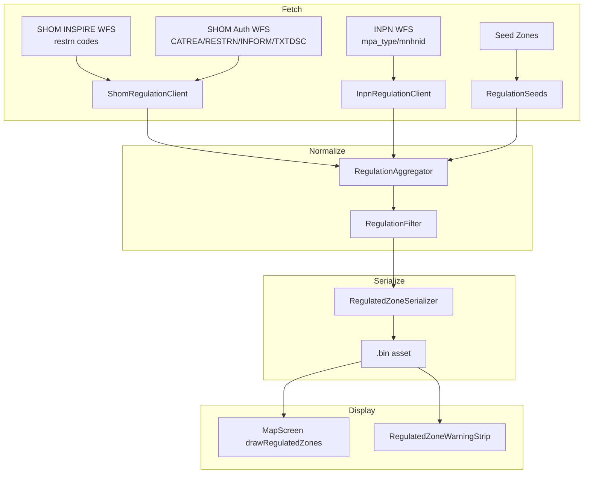

<!-- scope: feature -->
# Regulated Zones — Formalized Requirements

> Captured from design discussion 2026-06-12.
> Supersedes the flat-field approach in earlier plans.

---

## 1. Data Extraction Targets

### 1a. SHOM Maritime Regulations — `REGNAV_BDD_WFS:resare`

| Property | Value |
|----------|-------|
| WFS Endpoint | `https://services.data.shom.fr/INSPIRE/wfs` |
| Target Layer | `REGNAV_BDD_WFS:resare` (Restriction Area) |
| Output Format | `application/json` (GeoJSON) |
| Key Properties | `CATREA`, `RESTRN`, `INFORM`/`inform_fr`, `TXTDSC`, `longueur_hors_tout_mini/maxi` |

### 1b. INPN Environmental Protection — `wfs_inpn:amp_polygones`

| Property | Value |
|----------|-------|
| WFS Endpoint | `https://inpn-inspire.mnhn.fr/geoservices/ows` |
| Target Layer | `wfs_inpn:amp_polygones` (Marine Protected Areas) |
| Secondary Layer | `wfs_inpn:natura2000_sic` (Sites d'Intérêt Communautaire) |
| Output Format | `application/json` (GeoJSON) |
| Key Properties | `mpa_type`, `mpa_mnhnid`, `mpa_name` |

### 1c. Common Bounding Box (Menton to Fréjus)

```
BBOX = 6.7, 43.4, 7.6, 43.8   (lonWest, latSouth, lonEast, latNorth)
```

Applied as a WFS query parameter and post-fetch filter.

---

## 2. Classification — Two Distinct Systems

### 2a. SHOM S-57 CATREA (Category of Restricted Area)

Primary classifier on the `REGNAV_BDD_WFS:resare` layer:

| Code | Description | Maps To |
|------|-------------|---------|
| `12` | Navigational restriction area | `NAVIGATION_RESTRICTION` |
| `27` | Small craft restriction area | `SPEED_LIMIT` (primary speed zones) |

### 2b. SHOM S-57 RESTRN (Restriction Type)

Secondary classifier on the `REGNAV_BDD_WFS:resare` layer. Used when CATREA is absent:

| Code | Description | Maps To |
|------|-------------|---------|
| `1` | Anchoring prohibited | `ANCHORING_PROHIBITED` |
| `2` | Anchoring restricted | `ANCHORING_PROHIBITED` |
| `7` | Entry prohibited | `ACCESS_PROHIBITED` |
| `8` | Entry restricted | `ACCESS_PROHIBITED` |
| `10` | Diving prohibited | `OTHER` (display category `NO_DIVING`) |

### 2c. INPN `mpa_type` (French Legal Designation)

| Designation | Maps To | Implication |
|-------------|---------|-------------|
| `Natura 2000` | `ENVIRONMENTAL` | General environmental surveillance |
| `Arrêté de biotope` | `ACCESS_PROHIBITED` | High probability of complete engine/access bans |
| `Réserve Naturelle` | `NAVIGATION_RESTRICTION` | Strict localized navigation restrictions |
| Other | `ENVIRONMENTAL` | Conservative default |

### 2d. Zone `RegulatedZoneType` — Canonical Set

| Enum Value | Source(s) |
|------------|-----------|
| `SPEED_LIMIT` | SHOM CATREA 27, RESTRN n/a, INSPIRE restrn 1 |
| `ANCHORING_PROHIBITED` | SHOM RESTRN 1, 2 |
| `ACCESS_PROHIBITED` | SHOM RESTRN 7, 8; INPN Arrêté de biotope |
| `ENVIRONMENTAL` | INPN all mpa_types |
| `MOORING` | SHOM INSPIRE restrn 18 |
| `FISHING_PROHIBITED` | SHOM INSPIRE restrn 8, 9 |
| `NAVIGATION_RESTRICTION` | SHOM CATREA 12; INPN Réserve Naturelle |
| `OTHER` | Fallback; includes RESTRN 10 (diving) |

---

## 3. Speed Limit Extraction — Priority Chain

Speed limits are derived in this priority order:

```
1. STRUCTURED_FIELD    → "vitesse_max" GeoJSON property (double)
2. INFORM_TEXT         → Parse INFORM/inform_fr string for digit+keyword pairs
3. TXTDSC_MAP          → Cross-reference TXTDSC decree filename against known table
4. DEFAULT_RULE        → 5 kn (standard coastal 300m baseline, no decree tag)
```

### 3a. INFORM String Tokenization

Scan the `INFORM` / `inform_fr` property for patterns:

| Keyword variants | Example match | Extracted value |
|------------------|---------------|-----------------|
| `nœuds`, `noeud`, `nds`, `nd`, `kts`, `vitesse` | `"Vitesse max 10 kts"` | `10.0` |
| `nœuds`, `noeud`, `nds`, `nd`, `kts`, `vitesse` | `"Zone 10 nds"` | `10.0` |
| `nœuds`, `noeud`, `nds`, `nd`, `kts`, `vitesse` | `"5 nœuds max"` | `5.0` |

Look for digits preceding or following these keywords.

### 3b. TXTDSC Legal Reference Mapping

When no speed is found in INFORM, check the `TXTDSC` property (stores the arrêté préfectoral decree filename):

| TXTDSC Value | Speed | Context |
|--------------|-------|---------|
| `FR_PREMAR_MED_134_2021` | `10 kn` | Cap d'Antibes local speed extensions |
| `FR_PREMAR_MED_2012_064` | `5 kn` | Localized anchoring / mooring restrictions |
| No explicit decree tag | `5 kn` | Standard coastal 300m baseline rule |

---

## 4. Provenance Recording

Every zone must record **which classification system** produced it. This is the key clarity improvement over the current flat model.

### 4a. Classification Provenance

| System | Identifier | Raw Value(s) Stored |
|--------|-----------|---------------------|
| S-101 (INSPIRE `restrn`) | `S101` | `restrictionCode: Int?` (existing field) |
| S-57 CATREA (auth) | `CATREA` | `catreaCode: Int?` |
| S-57 RESTRN (auth) | `RESTRN` | `restrnCode: Int?` |
| INPN mpa_type | `INPN_MPA` | `mpaType: String?`, `mpaMnhnId: String?` |
| Seed (hardcoded) | `SEED` | none |

### 4b. Speed Extraction Provenance

| Method | Enum Value | Meaning |
|--------|-----------|---------|
| Structured property | `STRUCTURED_FIELD` | `vitesse_max` GeoJSON property |
| INFORM text parse | `INFORM_TEXT` | Parsed from INFORM string |
| TXTDSC cross-ref | `TXTDSC_MAP` | Looked up via TXTDSC decree name |
| Default baseline | `DEFAULT_RULE` | 5 kn default (300m band) |
| Not applicable | `NONE` | Zone has no speed limit |

### 4c. Model Suggestion (Discussion Point)

Rather than separate nullable raw-code fields, a sealed class captures provenance explicitly:

```kotlin
@Serializable
sealed class RegulationClassification {
    @Serializable data class S101(val code: Int) : RegulationClassification()
    @Serializable data class Catrea(val code: Int) : RegulationClassification()
    @Serializable data class Restrn(val code: Int) : RegulationClassification()
    @Serializable data class InpnMpa(val type: String, val mnhnId: String?) : RegulationClassification()
    @Serializable data object Seed : RegulationClassification()
}
```

This eliminates ambiguity between `restrn` (S-101) vs `RESTRN` (S-57) — they're different types.

---

## 5. Data Flow



**Authority during deduplication:** SHOM > INPN > SEED. If two sources describe the same zone (centroid within 50 m + same type), the higher-authority source's attributes win.

---

## 6. Backward Compatibility

- New classification fields are `null` by default
- Old `.bin` assets deserialize with `classification = null` and `speedSource = null`
- Display layer checks `null` → falls back to existing `zoneType` + `speedLimitKn` logic
- No display-layer changes needed for this phase

---

## 7. Files Affected

| File | Action |
|------|--------|
| `app/.../data/regulation/RegulatedZone.kt` | MODIFY — add `classification: RegulationClassification?` + `speedSource: SpeedSource?` |
| `app/.../data/regulation/ShomRegulationClient.kt` | MODIFY — add auth endpoint, CATREA/RESTRN parsing, INFORM tokenization, TXTDSC map |
| `app/.../data/regulation/InpnRegulationClient.kt` | NEW — WFS client for INPN layers |
| `app/.../data/regulation/RegulationAggregator.kt` | MODIFY — 3-way merge with authority rules |
| `app/.../data/regulation/RegulationFilter.kt` | MODIFY — minor: NO_DIVING in displayCategories |
| `app/.../data/regulation/RegulatedZonePrebakeTest.kt` | MODIFY — wire INPN, expand bbox |

