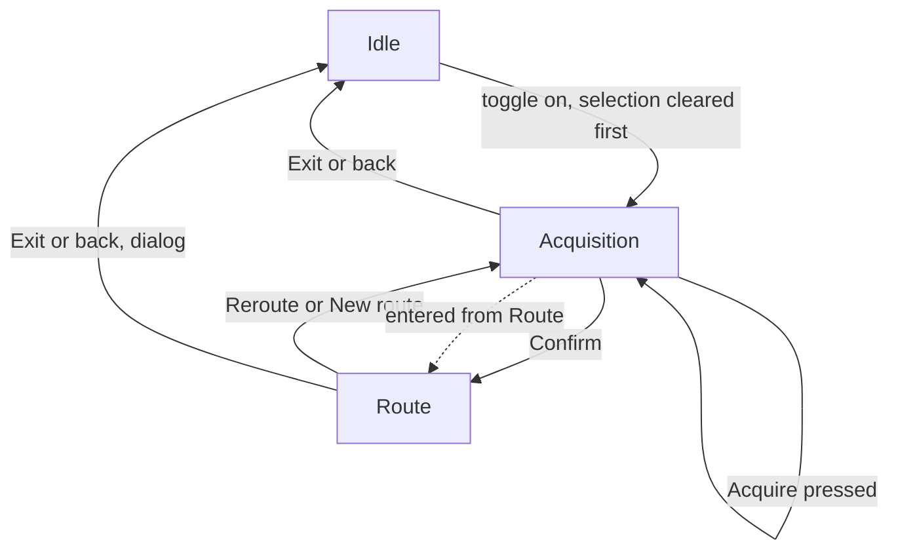

<!-- scope: feature -->
# Route — acquisition made explicit, and the automatic reroute removed

**Date:** 2026-09-24 · **Branch:** `feature/route-avoid-workflow` (renamed from `feature/route-avoid`) · **Status:** in design — discussion only, nothing built, no file outside this one and the focus stack touched
**Asked for:** the user's brief of 2026-09-24, verbatim in four parts: (1) an item selected on the dashboard is exited before the route mode activates; (2) destination acquisition loses its timer, gains an **Acquire route** action plus a **confirm that is disabled while acquiring**, a **Save track** that disables itself once written, an **Exit** that returns to route mode when the acquisition was entered from it, and a status line naming the **stage** of the acquisition; (3) route mode loses its **automatic reroute** and gains a **Reroute** button returning to acquisition, keeping **Save track** and an **Exit** that quits; (4) the back key asks for confirmation in route mode, and where the track is not yet saved that dialog offers **save track and exit**.

**It is a change to what the delivery does, so it is a change to the master book first.** [`260922_FEAT_PLN_Route_ask-policy-and-target-validity.md`](260922_FEAT_PLN_Route_ask-policy-and-target-validity.md) is the requirements' home and **wins any conflict** with the epic — its own rule is that the plans and the epic point at it rather than restating it. R2, R3, R10–R15, R16, R17, R22 and R23 are the rows this pass rewrites; the epic's `routing-engine`, `destination-ui` and `route-saving` rules follow, and `docs/ui-component-guidelines.md` §5.8 follows them.

## 1. What the brief changes, measured against what ships

| Brief item | What ships today | The change |
|---|---|---|
| An item selected is exited on mode entry | The selected-item dashboard closes only when the wizard or the *other* dashboard wants its slot; arming the route neither closes it nor is refused by it | Arming the route becomes another reason the slot is wanted, so the selection is cleared **before** the mode arms |
| Acquisition is on a timer after stopping | The ask is triggered by a 25 m ground move **plus** a 300 ms settle, both keys, with the trigger living in [`RouteHost`](../../app/src/main/java/ykws/android/maro/ui/map/RouteHost.kt:175) and the search driven from [`preview()`](../../app/src/main/java/ykws/android/maro/ui/map/RouteViewModel.kt:432) | The timer leaves; the search is asked by a **button** and by nothing else |
| — the live preview this implies | Moving the aim recomputes the line continuously, which is the mode's whole feedback while aiming | **Inference, to confirm:** with the trigger gone, a drag computes nothing — the aim ring moves and the standing line holds — so the preview becomes on-demand rather than live |
| An **Acquire route** action, staying active | No such action | One button, never disabled; each press acquires from the aim **at that instant**, and a newer answer becomes the front line |
| A **confirm**, disabled while acquiring | `Route` confirms the aimed route and is offered only once a plan stands | `Confirm` is always present and **enabled only when a plan stands**; `Confirm` leaves acquisition and enters route mode |
| **Save track** in acquisition, disabled once written | `Save track and Route` / `Save track and Exit` only | A `Save track` action in both phases, reading one shared "is the front route written" fact, which is the session's existing route-to-track link |
| Status naming the **stage** | The panel shows "Computing…" or nothing; the engine reports no stage at all | The engine publishes its **stage** as a closed set of `@StringRes` ids, and the panel prints it |
| Route mode loses the automatic reroute | A one-second clock in [`RouteHost`](../../app/src/main/java/ykws/android/maro/ui/map/RouteHost.kt:235) hands each tick to [`routeRefreshOrigin()`](../../app/src/main/java/ykws/android/maro/ui/map/RouteOverlay.kt:90), whose gate reads `route.refresh.intervalSec` **or** `route.refresh.offRouteM`, then calls [`refresh()`](../../app/src/main/java/ykws/android/maro/ui/map/RouteViewModel.kt:568) | The clock and both keys leave; nothing re-asks while a route runs |
| A **Reroute** button returning to acquisition | The trip card's own tap calls `refreshRouteNow()`; the panel's `Freeze/Resume` and `Abort` exist to hold and to stop the automatic gate | `Reroute` replaces all three: it returns the phase to acquisition, from where `Acquire` answers again |
| **Exit** quits route mode | `Exit` raises the one dialog; the draft's `Exit` ends the mode silently | Unchanged in route mode; the acquisition's Exit becomes **phase-aware** — back to route mode when the acquisition was entered from it, out of the mode when it was not |
| Back asks in route mode | Back ends the mode while armed, and the dialog is raised by the toggle's off and the panel's Exit | Back joins the same dialog in route mode; in acquisition it still asks nothing |
| The dialog offers save-and-exit when unsaved | The dialog is always `Save track and Exit` · `Continue` · `Discard route`, its save carrying last/all scope | The save action is **disabled when nothing is unwritten**, and the scope option's subject is the session set |

## 2. The machine as it becomes



- Two phases, and the acquisition is **re-enterable**: `Reroute` moves to acquisition and `Exit` inside it moves back to the route that was standing.
- **Reroute keeps the destination and asks the search itself — settled by the user, 2026-09-24.** The aim opens where the route was already going, and one acquisition fires from the new anchor so the line lands without a second press; the objection kept on the record is that a button doing two things reads as more than "go back", accepted because the press *is* the recompute.
- **`New route` is the same move with the destination cleared — settled by the user, 2026-09-24: a fourth action on the route panel, and the session set survives it.** Where Reroute recomputes the trip you were on, this one drops the destination and waits, computing nothing until `Acquire route` is pressed, while the earlier lines stay drawn on the ladder and stay offered to the all-scope save.
- **Both moves end the following.** The phase leaves route mode, so the boat stops following and the trip figure — that phase's own reading — goes with it until `Confirm` is pressed again, which is the consequence of a manual recompute named rather than discovered.
- That re-entry makes the **origin** a question today's machine never faces: [`beginDraft(start)`](../../app/src/main/java/ykws/android/maro/ui/map/RouteViewModel.kt:409) takes the start **once**, on the Idle → Choosing edge, and holds it for the whole phase by construction. A reroute must either re-freeze the anchor at the boat's current position or keep measuring from where the session began.
- **Settled by the user, 2026-09-24: the anchor is read on every entry into acquisition — the boat's own position, led by `route.anchor.leadSec`, 10 s by default.** An anchor held from the session's first arming would redraw the same line from the same point, which is not a recompute at all.

### 2.1 The anchor, and the lead

- **The rule that changes is one word.** The start is still taken **once** and held for the phase's whole life — that is what fixed the 2026-09-20 device defect, where a start re-read per preview tracked the aim and drew a degenerate wiggle between the last centre and the new one. What changes is the unit: once **per acquisition**, not once per session.
- **The lead is best-effort and never binding.** A predicted point that is not water falls back to the live fix, and the acquisition proceeds: a boat bearing down on a headland is precisely the case a reroute exists for, so refusing its own start would block the trip being re-planned.
- **The prediction is gated on a trustworthy velocity.** It applies in GPS mode with a fresh fix above a sensible speed, and never in demo mode, whose position is the map centre and whose pan-derived speed is suspended while aiming; the freshness question already has a home in the Performance feature's `SpeedFreshness`, which this pass has not read, so the gate's shape is that file's to say rather than this plan's to invent.
- **The pace feeding the lead is the boat's own speed over ground**, not the set free-water pace: the quantity is where the boat *will be*, not where it might sail.
- **One pure helper, one call site.** The projected anchor is arithmetic over the fix — position, course, speed and the lead — and it is read on the acquisition's own entry edge and nowhere else, so no frame can move it.
- **The key joins the route family** with its default, bounds, accessor and KDoc in `maro.properties`: `route.anchor.leadSec=10`, bounded 0–60, where 0 is the plain live fix and a device that answers no course or speed reads as 0.
- **The lead is a horizon, not a latency budget — settled by the user, 2026-09-24: a flat 10 s.** It does not absorb the acquisition's own compute time, which would make the value engine-dependent — a 500 ms desktop search and a 7.3 s device reading are different horizons — and two quantities under one key is what the one-home rule refuses.
- **The cost is one projection and one distance per entry**, and the value is scale-small on purpose: 10 s is about 50 m at 10 kn and 144 m at 28 kn, 1–3 % of the acceptance corridor, so the lead moves where the drawn line *starts* rather than where it goes.
- **The objection, stated:** this feature's defect history is a start that moved when it should not have, and a derived position is exactly that kind of value — the mitigation is that it is derived once, on the edge, by one helper, and that the remainder reading stays harmless to a lead that undershoots or overshoots. **Amended 2026-09-26** — the remainder is projected onto the nearest point on the line rather than snapped to the nearest vertex, so a lead's shortfall is measured from where the line actually is (`260926_FEAT_PLN_Route_menu-mode-summary.md` §4).

## 3. The two panels, phase by phase

Both keep §5.8's anatomy — header row with title left and status right, the card's divider, the data table on `StatCell`, the notes, the second divider, the pin, and actions **bottom-anchored** in the weighted content block. What changes is the action set, the status's vocabulary, and one new static line.

```
┌─ Acquisition ────────────────────────────── Acquiring… ─┐
│  Place the destination, then acquire the route          │  ← the phase's own comment
│  ─────────────────────────────────────────────────────  │
│  Searching the corridor · 50 m grid                     │  ← the stage, when one is running
│  ─────────────────────────────────────────────────────  │
│  Start        43.1234, 7.1234   │  Destination  …       │
│  Dist         4.2 NM            │  ETA          …       │  ← only once a plan stands
│  ─────────────────────────────────────────────────────  │
│  ☐ Pin this route                                       │
│  [ Acquire route ]            [ Confirm ]               │
│  [ Save track ]               [ Exit ]                  │
└─────────────────────────────────────────────────────────┘
```

- **Title and comment.** The title is the phase's name and the comment is one line of what the phase asks of you; the live sentence the panel already carries keeps its own slot, so the static comment and the searching/refused/stage sentence never stand together.
- **The status in the header's right corner** keeps its single-reading budget (§5.8): a short state word — `Acquiring…`, `Frozen`-less, `Route ready` — while the **stage detail** rides the sentence line under the divider, which is where the panel already prints longer prose at 13 sp.
- **The stage vocabulary** is a closed set, one `@StringRes` per stage, in both locales: corridor, raster, search, pull, snap — the five boundaries the pipeline already crosses in [`RouteAvoidEngine`](../../app/src/main/java/ykws/android/maro/spatial/RouteAvoidEngine.kt:109), so publishing them costs one emission each rather than a new computation.
- **The action matrix**, and the accent obeys §5.6's one-per-surface rule at every instant:

| Instant | Accent | Outlined | Disabled |
|---|---|---|---|
| Acquisition, nothing resolved | Acquire route | Exit | Confirm, Save track |
| Acquisition, a plan stands | Confirm | Acquire route · Save track · Exit | Save track, once the front route is written |
| Acquisition, computation in flight | Acquire route | Exit | Confirm, Save track |
| Route mode | Save track | Reroute · New route · Exit | Save track, once written |

- **The accent moves with the state** — Acquire while there is nothing to confirm, Confirm once there is. The objection: a button changing colour as a plan lands can read as instability rather than as a step; the alternative is a fixed accent on Confirm, which leaves the acquisition's own act unaccented while it is the only enabled forward action.
- **The route panel** keeps `Save track` in the accent and carries `Reroute`, `New route` and `Exit` outlined — four actions, which the acquisition's own four already read as two rows of two at §5.6's 8 dp gap, so both phases keep one action grid rather than two shapes. Nothing is red on either panel: §5.6 keeps the red for the action that withholds the work, which lives on the exit dialog alone.
- **A disabled action is a family rule, not a route-local trick — settled by the user, 2026-09-24.** §5.6 documents `ConfirmAction(label, role, onClick)` with no enabled state, so `ConfirmActionButton` gains `enabled` and the guidelines gain the face with it: **a disabled action reads as the outlined role with its label in `uiTextMuted`, and no accent survives a disabled state**, which is what keeps the accent meaning *the surface's own outcome* instead of being dimmed into ambiguity.
- **The face is composed of tokens that already exist**, which is how it fits the family rather than extending it: the label reads `uiTextMuted` and the outline reads `uiDividerColor`, the very colour §2.7's unselected segments are outlined with, so this pass adds a rule and a member rather than a palette entry. Compose announces `enabled = false` natively, so nothing custom rides accessibility.
- **The pin** stays where it is, in both phases.

## 4. The exit dialog, and the back key

| Door | Today | Becomes |
|---|---|---|
| Toggle off while following | The dialog | Unchanged |
| Toggle off while acquiring, a route standing behind | Ends the mode silently | **The same dialog** — settled by the user, 2026-09-24 |
| The panel's Exit while following | The dialog | Unchanged |
| Back while following | Ends the mode on the spot | **The dialog** |
| Back while acquiring | Silent exit | Silent exit, except that it honours the phase-aware exit below |
| The panel's Exit while acquiring | Ends the mode | Back to route mode when the acquisition was entered from it, otherwise out of the mode |
| Save track and Exit | Always offered | **Disabled when nothing is unwritten** — the session set holds no route without a track |
| The last/all scope option | Offered whenever the session holds two routes or more | **Withdrawn — not drawn at all** (settled by the user, 2026-09-24), with the question of its return parked as a todo on the feature |
| Continue · Discard route | Offered | Unchanged |

- **Three doors, one dialog** — settled by the user, 2026-09-24: the toggle, the panel's Exit and the back key raise the same dialog wherever the mode would end while the session holds something, a followed route or a line acquired and not yet written. The save action's own disabled rule is what keeps the dialog honest where only part of it is unwritten, and none of the three doors is special.
- **Two doors are phase moves rather than exits**, and ask nothing because nothing is lost: the acquisition's Exit and the back key while a route stands behind it, which put the mode back on that route with its line intact.
- One asymmetry stays on the record: inside a **fresh** acquisition, standing on nothing, Exit, back and the toggle still end the mode without asking, so an acquired-but-unwritten line goes silently. That is the brief's own shape, and tightening it is a one-line change if every door should ask.
- **The all-scope save is withdrawn rather than disabled — settled by the user, 2026-09-24: the dialog draws no scope row at all, and its save writes the front route.** The machinery that option needed goes with it — one save path, one name — so nothing unreachable is left behind waiting for a second write no surface can reach, which is the same ruling the feature applied when it deleted two engines rather than keep a baseline nobody measured.
- What the session set is still for, then, is the **drawing**: it survives every reroute and every new route so the ladder can paint it, while a parked todo on the feature holds the question of whether a multi-route save ever returns and, if it does, what names its files.

## 5. What leaves the tree

- The **ask policy**, both halves: the 25 m move and the 300 ms settle, their two keys (`route.ask.minTargetMoveM`, `route.ask.settleMs`), their accessors, bounds and KDocs, and the two KDocs that describe them. `preview()` survives as the function **Acquire** calls — it is the engine's door, not the trigger.
- The **refresh cycle**, settled by the user on 2026-09-24 and leaving whole: the clock in `RouteHost`, the gate in `RouteOverlay` (`routeRefreshDue`, `routeRefreshOrigin`), both keys (`route.refresh.intervalSec`, `route.refresh.offRouteM`), `RouteRefresh.FROZEN`, and the panel's `Freeze/Resume` and `Abort` — so no route-owned control survives the clock that gave it its subject, and `route_following_recomputing` and `route_status_frozen` leave with the readings that produced them.
- The **trip card's tap-to-recompute** (`refreshRouteNow`), which is a third door onto the same act Reroute now owns.
- **`isReadyToRecompute()`** loses its only caller. Keeping it costs nothing and it is the seam's own promise; retiring it touches the contract, two engines and the seam test — **recommendation: keep the member, and note in its KDoc that nothing calls it while no automatic recompute exists**, since a future automatic mode is exactly what it was written for.
- Every removal is a **deletion with its keys**, per the one-home rule: a key whose reader is gone is dead configuration, not a spare lever.

## 6. Open questions, each with a default

1. **Reroute's second effect** — settled 2026-09-24: it fires the acquisition itself, and the destination is kept.
2. **The ladder and the session set** — settled by the user, 2026-09-24: **the stack is kept**, so a superseded line stays drawn inside the existing caps of one oldest plus three latest, and the session set survives every reroute and every new route — for the drawing alone, the write it once fed having been withdrawn (§4).
3. **Freeze's fate** — settled by the user, 2026-09-24: `Freeze/Resume` and `Abort` both leave with the gate, so the route panel reads `Save track` · `Reroute` · `New route` · `Exit` and its status has one word to say rather than three.
4. **The acquisition's Exit before anything is confirmed** — settled by the user, 2026-09-24 on the wider reading: a line acquired and not yet confirmed **is** something held, so every door that would end the mode asks first, and only an acquisition standing on nothing leaves in silence.
5. **Save track in acquisition while a previous line stands** — settled by the user, 2026-09-24: it writes the **front line**, the newest answer, which is the line the panel's own table describes — save what you see — so the button greys once that line has a track and comes alive again with the next answer. Read as the front line rather than the acquisition's first answer; if that is the wrong reading, one clause here and one walk item change.
6. **Copy** — settled by the user on 2026-09-24, accepted as proposed in both locales: **acquisition panel** title `Route acquisition`, comment `Place the destination, then acquire the route`, status `Acquiring…` and `Route active`; **stages** `Corridor` · `Grid` · `Search` · `Pull` · `Snap`; **acquisition actions** `Acquire route` · `Confirm` · `Save track` · `Exit`; **route actions** `Save track` · `Reroute` · `New route` · `Exit`. In French, by the same keys: `Acquisition d'itinéraire`, `Placez la destination, puis acquérez la route`, `Acquisition…` and `Route active`, `Corridor` · `Grille` · `Recherche` · `Trait` · `Coins`, `Acquérir la route` · `Confirmer` · `Enregistrer le tracé` · `Quitter`, `Enregistrer le tracé` · `Recalculer` · `Nouvel itinéraire` · `Quitter`. `Save track` and `Exit` reuse the shipped keys, so the new ones are the title, the comment, two status words, five stages and **four** action labels, `Recalculer` standing as the drafted French for Reroute.
7. **The disabled treatment** — settled by the user, 2026-09-24: a family rule rather than a route-local trick, `ConfirmActionButton` gaining `enabled` while §5.6 gains the face itself, both built from tokens that already exist (§3). The objection kept: the corpus had no rule for a disabled action before this, so the rule is being written here first — and a greyed button promises nothing, saying only *not yet*.
8. **The restart control, and what it clears** — settled by the user, 2026-09-24: a fourth action on the route panel, `New route`, which clears the destination and **keeps the session set**, so the earlier lines stay drawn on the ladder and the all-scope save still writes them.

## 7. What this pass does not touch

- The avoid engine's **stages 2 and 3** — the 300 m band and the regulated speed zones — and the depth gate: the acquisition's line is still land-only, which stays the feature's known limit.
- The feature's open todos — the **duplicate save**, left standing by the user's word of 2026-09-24 to be resolved once the implementation lands, and the **multi-route save** this pass parks — beside the owed **device measurement** of the new line.
- The **engine seam's shape** beyond the stage channel: the two entry points, `validatePoint`, `prepare` and the readiness set stand as they are.

## 8. Order of landing, once the word comes

1. The **master book** — R2, R3, R10–R15, R16, R17, R22, R23 rewritten onto the two phases and the explicit acquisition.
2. The **seam's stage channel** with its closed set and its two locales, emitted at the pipeline's five boundaries.
3. **`RouteViewModel`** — the button-driven ask, the phase-aware exit, the saved-flag the two Save actions read, and the removals.
4. **`RouteHost`** — the clock deleted, the selection cleared on arming, back routed to the dialog.
5. **`RouteConfirmPanel`** — the action matrix, the comment line and the status vocabulary.
6. **`ConfirmActionButton`** — the `enabled` member, and §5.6's disabled face built from the muted label and the divider outline that already exist.
7. **Deletions and docs** — the four keys, the dead functions, `docs/ui-component-guidelines.md` §5.8, the epic's three sections and its `## Key Files`.
8. **Tests** — no timer asks a search; the anchor is re-read on each entry and the lead falls back when the predicted point is not water; the confirm is disabled without a plan; a written route disables both saves; reroute returns to acquisition, fires one acquisition and keeps the standing route; back raises the dialog in route mode alone; and the stage flow reports each boundary, cleared on every answer and on abort.

## 9. The plan's own review — 2026-09-24

Each finding carries its disposition: **settled** here, **open** for the user, or **named only**.

1. **The ladder stops being a place and becomes a history.** Nothing supersedes a line automatically any more, so every stale line was superseded by the user's own press, and after a reroute the drawn set holds lines that begin at different anchors and no longer stitch. *Settled by the user, 2026-09-24: the stack is kept unchanged*, its caps bounding it at four stale lines, and the all-scope save is withdrawn from the dialog rather than the drawing being trimmed.
2. **Nothing warns that a followed route has gone stale.** The gate that used to re-ask is gone, so the trip figure's own age is the only reading that says the line is old. *Named only*: the age still ticks and the ↻ mark goes with the deleted tap, while a louder cue is an addition the brief did not order.
3. **A standing route can be lost through the toggle.** Turning the toggle off while in acquisition ended the mode outright, and where a route stood behind that acquisition the line went silently with it. **Settled by the user's word of 2026-09-24: the toggle raises the same dialog**, so no door is special and §4's three-door rule is the whole of it.
4. **Back and Exit must not diverge inside acquisition.** Back ends the mode today, and with a phase-aware Exit the two doors would then mean different things. *Settled*: back follows the acquisition's Exit wherever that goes.
5. **The saved fact needs one home.** Two Save actions and one disabled rule all read *is the front route written*; the session's route-to-track map is that home, read through one predicate rather than a null check at each call site. *Settled.*
6. **The stage channel must be able to say nothing.** The dummy crosses no stage of a pipeline it does not have, and a stage left standing after an answer or an abort would be a lie on the panel. *Settled*: the stage is nullable, cleared on every answer and on abort, and the status falls back to the plain `Acquiring…` word.
7. **The origin's judgement moves with the anchor.** R7 judged it once at arming and never again, which was written for a session-frozen start; with an anchor per acquisition the judgement is asked again on each entry, and asked of the fallback point when the prediction is off water. *Settled.*
8. **`preview()` is now misnamed**, the word describing an unpressed state the machine no longer has. *Settled as a technical choice*: rename to `acquire(aim)`, with the worker, the pending slot and the cancellation unchanged behind the name.
9. **The copy's own count.** New keys are the acquisition's title and comment, the two status words, the five stage words and four action labels — `Acquire route`, `Confirm`, `Reroute` and `New route` — while `Save track` and `Exit` reuse what ships. *Settled by the user, 2026-09-24: the wording is accepted in both locales*, so the landing writes thirteen new strings rather than inventing any at the keyboard.

10. **Both moves end the following.** A reroute or a new route leaves route mode, so the boat stops following and the trip figure disappears until `Confirm` is pressed again. *Named only*: it follows from the two-phase machine the brief asks for, and keeping a followed route's figure alive while a new one is acquired would put two plan roles on the map at once, which no rule in this feature provides.
- **What this review did not find:** no breach of the layering, no new dependency, no second home for a value already owned, and nothing in the brief that the avoid engine's stage 1 cannot answer as it stands.
