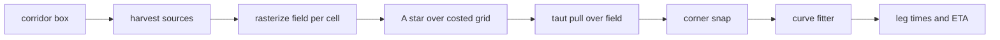

<!-- scope: feature -->
# Route — avoid engine phases 2–6: soft costs, depth gate, markers and curves

**Created:** 2026-09-24 · **Branch:** `feature/route-avoid` · **Status:** in design

## What this is for

The shipped avoid engine ([`RouteAvoidEngine`](../../app/src/main/java/ykws/android/maro/spatial/RouteAvoidEngine.kt)) clears land, islands and hazard rings. This plan adds the five behaviours the user asked for, over the same corridor grid: the 3 m depth gate, the 300 m band as a priced avoid area, the speed-limit zones as priced avoid areas with per-zone exclusion, the marker-zone weights (-10 … +10), and curve smoothing with turn rounding under a lateral-acceleration threshold. The cell already ships tagged and costed and the pull already ships source-parameterized — so every new source is additive, never rework. This is phase 2 (band), phase 3 (zones), plus depth, markers and curves as phases 4–6.

## The one architecture move — a unified cost field

Today the pipeline splits in two: the rasterizer knows land only, the A* reads a per-cell `sourceCostM`, and the pull reads a hardcoded clearance function `(LatLng) -> Double = distanceToCoastM`. Stages 2–6 force those three readers back onto one model, which is the common functionality the whole feature pulls in:

- `RouteCostSource` — one sealed shape per world source: `HARD` (impassable, a wall) or `SOFT` (priced, passable), answering `costM(p): Double` (metres-equivalent) and `blocked(p): Boolean`.
- `RouteCostField.evaluate(p)` — sums the soft sources at a point and reports the hard block. One evaluator, read by four consumers.
- The **rasterizer** samples the field once per cell centre and writes the tag + `sourceCostM` (the `AvoidCellState.BAND` / `ZONE` tags already exist, stage 1 uses only `FREE`/`LAND`).
- The **A\*** is unchanged in structure — it already reads `sourceCostM` with a metres-equivalent g so the haversine heuristic stays admissible.
- The **pull** changes in one place: instead of `(LatLng) -> Double` clearance it takes the field, and accepts a chord when no hard source is within the margin **and** the chord's summed soft cost does not exceed the A* cell path's cost over that same span. That guarantee is what stops the pull from shortcutting a corner through a priced zone the search just went around.
- The **curve fitter** (phase 6) reads the same field to water-test every emitted chord.

## The pipeline with sources

## Phase 2 — depth gate, hard wall at 3 m

- **Mechanism.** New key `route.avoid.minDepthM=3.0` (default 3, the user's number), read through `AppConfig` with a clamp. `AvoidWorld` gains `depthAt(lat, lon): DepthSample` and `depthReady: Boolean`; the live adapter takes a `DepthRepository` reference — the same seam widening stage 1 did for the coastline.
- **The gate.** One bilinear [`depthAt`](../../app/src/main/java/ykws/android/maro/data/model/DepthGrid.kt:117) per cell centre: a known depth `< minDepthM` paints the cell `LAND`. Everything not below the threshold is ignored — deeper water, coarse sources and NoData alike, with no confidence floor and no penalty (decided 2026-09-24: the gate is a coarse guard on the route being written, not a fine sounding).
- **Linked with the water.** The gate is ANDed with the coastline's `isWater`, so a NoData cell the depth mask erased on the land side is still blocked as land rather than passed as unsurveyed.
- **Readiness.** `DEPTH_NOT_LOADED` joins `COASTLINE_NOT_LOADED` as a `RouteUnavailableReason`, so a route armed before the depth grid lands is refused by name; with no grid loaded every cell reads unsurveyed and the gate would otherwise be silently inert.
- **Perf cost.** Depth is a raster, `depthAt` is an O(1) bilinear read over four cells; painting ~33 k cells is a few ms. **Difficulty: low.**

## Phase 3 — 300 m band, priced avoid area

- **Mechanism.** Soft source, never a wall: the boat may enter, it should spend as little time as possible. Cost in metres-equivalent while `distanceToCoastM <= 300 + margin`, reusing the land pass's cell-centre-to-segment distance — the distance is already computed for the margin band, so the band cost is a second write in the same loop, not a second pass.
- **Forced crossing.** A start or aim already inside the band, a marina basin, or a corridor with no way out is accepted and named in `forcedCrossingZoneNames` — never refused and never sent on an absurd detour.
- **Penalty magnitude (decided).** One shared multiplier, `route.avoid.softCostAversion` (default 1.5), scales the time spent in the band and in a priced zone alike — big enough to bend the line out of a 50 m strip, small enough not to send it kilometres around.
- **Perf cost.** Folds into the existing distance pass — negligible extra. **Difficulty: low-medium** — it is the first soft source through the field → rasterizer → A* → pull chain, so it proves the soft-cost path end to end before the heavier sources ride on it.

## Phase 4 — speed-limit zones, priced and excludable

- **Mechanism.** `AvoidWorld` gains `speedZonesIn(box)` returning zone polygons (outer ring, holes, `limitKn`, id) so the rasterizer even-odd-fills them — holes stay water, overlapping zones keep the strictest limit. No per-cell `SpeedZoneIndex.query`: the inside test scans every ring ([`PolygonIndexBase.status`](../../app/src/main/java/ykws/android/maro/spatial/PolygonIndexBase.kt:178)), so 33 k point queries is the exact explosion the stage-1 budget forbids.
- **Cost.** The zone's own time at its limit is the base price (decided 2026-09-24): a slower leg costs more metres-equivalent, which is what makes the line spend less time in a zone, while the band keeps the `softCostAversion` multiplier alone.
- **Cursor.** One key, `route.avoid.zoneTimePriceK` (default 1.0), scales the time a leg spends in a zone inside the routing cost: K = 1 is pure fastest and reproduces today's "no zone restriction", K rising bends the line out of zones even when the way around is longer. The cursor chooses the line and **never touches the ETA** — the clock stays physics, or the trip figure lies.
- **ETA.** No zone restriction term: outside a zone the boat accelerates gradually to the configured speed, inside one it obeys that zone's limit, and `success()` splits each leg where the limit in force changes so the trip figure reads what the boat must really do. A boundary crossing adds a vertex, so the drawn line gains a point there.
- **Saved speeds.** The computed per-leg speeds are **saved with the track** (decided 2026-09-24), so a saved route carries the planned speeds rather than a re-derived figure.
- **Exclusion (decided).** A persisted set of excluded zone ids, default empty, dropped before the fill, the ETA and the report alike.
- **Forced crossing.** No way around → the crossing is taken and reported by zone name.
- **Perf cost.** Polygon fill is cheap; leg splitting is O(waypoints × zones touching the leg). **Difficulty: medium-high** — the ETA integration and the exclusion filter are the real work.

## Phase 5 — marker-zone weights, avoid-only 0 to +10

- **Mechanism.** Soft source over the user's own markers (Circle radius, Corridor band), **avoid-only** (decided 2026-09-24): the weight w ∈ [0, +10] scales the per-metre price inside the zone by a factor ≥ 1, 0 being a neutral marker and +10 a steep avoid. A marker can only make the sea dearer, never cheaper.
- **No prefer, and why.** A negative per-metre price is not a stronger pull but a broken one: with a step that pays back, the cheapest path is undefined — the search would loop for unbounded gain — and even one negative edge forces re-opening settled cells, which the closed-set A\* cannot do. Free is the strongest well-posed pull, and a genuine go-through-this-place is a via, not a price.
- **The floor is a rule, not a sign.** The grid always writes a base cost and every source may only add to it, so no passable cell is ever below the base; the trap is [`AvoidCell.sourceCostM`](../../app/src/main/java/ykws/android/maro/spatial/avoid/AvoidGrid.kt:25), whose default is 0.0, so the base must be explicit and replacement forbidden.
- **Containment.** Markers are few and user-owned; a bbox pre-filter over the corridor is enough, no bake, read live at ask time.
- **Perf cost.** Low — a handful of markers. **Difficulty: medium** — newest source and live user data, the weight semantics now settled.

## Phase 6 — curve smoothing and turn rounding

- **Mechanism.** One post-processor, [`RouteCurveFitter`](../../app/src/main/java/ykws/android/maro/spatial/avoid/TangentCorners.kt) as its own file, over the pulled waypoints:
  - **Smooth** — corner-cutting or Chaikin over the waypoints to remove the grid's digitization jitter, so the line reads as a trajectory.
  - **Round** — at each remaining corner a circular transition of radius `r = v² / a_lat`, with `a_lat` from a new key `route.turn.lateralAccelMps2` (default 2.94, the 0.3 g ceiling the removed tracer used). At the 28 kn pace that is a ~70 m turn radius; where the water will not hold that radius the fit shortens the transition first, then reduces the radius, then keeps a sharp vertex and slows the boat — the archived rule, re-derived.
- **Emission.** Arcs emit as chords stepped ~10 m or ~10°, each chord water-tested against the unified field, so smoothing never introduces a clearance breach a vertex kept.
- **ETA.** The turn slowdown is charged on the drawn clock, shared with the cost model's turn price so search and display agree.
- **Perf cost.** O(waypoints) geometry plus clearance sampling along the emitted line — negligible. **Difficulty: medium** — geometry and ETA correctness, not performance.
- **Placement note.** The fitter water-tests against every source, so it lands after phases 2–5; it is otherwise independent and could be pulled earlier if visual quality is wanted before full avoidance.
- **Navigated, not display-only (decided).** The smoothed line is the route: ETA, distance and off-route checks follow the chorded arcs, so the screen and the clock describe one line.

## Logical implementation order

The order above is the technical dependency order: the unified field first, the hard walls (depth) before the soft costs, the cheapest soft source (band) proving the chain before the zone's ETA and filter work, markers last among sources, curves last because they re-verify against the finished source set.

## New keys

| Key | Default | Meaning |
|---|---|---|
| `route.avoid.minDepthM` | 3.0 | depth below which a cell is excluded |
| `route.turn.lateralAccelMps2` | 2.94 | turn-rounding lateral-acceleration ceiling |
| `route.avoid.softCostAversion` | 1.5 | multiplier on time spent in the 300 m band |
| `route.avoid.zoneTimePriceK` | 1.0 | cursor: a second in a speed zone counts as K seconds for routing |

All read through `AppConfig` with a clamp, one home each — no Settings row until one is asked for.

## Performance invariant

Budget stays ≤ 500 ms wall, re-priced per stage. The invariant the tests pin: **every source rasterizes once into the corridor grid; the pull and the curve fitter sample only along the emitted line, never per grid cell.** The stage-1 assertion that guards the full-grid `isWater` explosion generalizes to depth, band, zone and marker queries.

## Decisions (arbitrated 2026-09-24)

- Marker weight — an avoid-only dial w ∈ [0, +10] scaling the per-metre price by a factor ≥ 1; a marker can only make the sea dearer, and going through one is a via, not a price.
- Speed-zone exclusion — a persisted set of excluded zone ids, default empty.
- The smoothed curve is the navigated route — ETA, distance and off-route checks follow the chorded arcs.
- Depth — block a known depth below the threshold and ignore everything else, ANDed with the coastline's water test.
- Band aversion — one `route.avoid.softCostAversion`, default 1.5.
- ETA — obey the zone limit in force and accelerate gradually to the configured speed outside one; the computed speeds are saved with the track.
- Zone-avoidance cursor — the route bends away from zones by `route.avoid.zoneTimePriceK`, default 1 (no bending); the cursor chooses the line and never the ETA.

## Amendments (2026-09-25) — folded from the 2026-09-25 plan

Four changes designed after three independent reviews, folded here so the feature keeps one plan:

- **Phase 2 amendment — a switch for the depth gate.** `route.avoid.depthGate.enabled=true` (default) gates the depth source; with it off, `AvoidWorld.load()` becomes coastline-only and `prepare()` never calls `loadDepth()`, so arming succeeds on `coastlineReady` alone; a mid-session toggle applies at the next arming.
- **Phase 3 amendment — a switch for the band, one home for its price, and a tangent look-ahead.** `route.avoid.zone300.enabled=true` gates the band; the band price lives in the field's one soft source (the rasterize sweep's band args removed, so the pull's chord guard stays alive); and the band gains the coastline's tangent look-ahead — its convex corners offset by `bandReachM(bandWidthM, zone300MarginM)`, clamped, with per-set snap radii, so a concave band is chorded rather than dived.
- **A new precision phase — coarse-to-fine.** After the coarse grid A\* fixes the homotopy, a finer grid subdivides only the coarse path's own cells (each inheriting its coarse passability, so the side cannot flip) and a second A\* re-walks it; the pull then emits a near-smooth line with a collinearity merge, widened only on no-path. This replaces the corner-graph A\* that measured 7.3 s and sharpens the grid-A\* + corner-snap the taut pull settled on.

## Challenge findings (2026-09-25) — the corner fix and the budget, challenged

An adversarial challenge found the two sharpest holes and ten more, against the shipped code:

- **Corner fix.** `addTangent`'s miter is unbounded (`margin/sinHalf`) while the snap ball is fixed at 100 m, so a sharp cape's true corner is never reached; two neighbouring snapped corners are never leg-tested, so a sub-margin leg can ship; a concave coast yields no corner and stays grid-quantized; the second pull drops the cosmetic snaps; `MIN_SIN_HALF = 1e-6` admits notch noise; and a corridor-edge corner is dropped as ambiguous.
- **Performance.** The band is priced twice (sweep plus the field) and re-read live per cell (~33k `distanceToCoastM` reads); the double price breaks the pull's priced guarantee (the A\* pays 2×, the pull reads once); the snap is an unindexed O(P×C) scan; each pull sample is two live index reads; the worst case (widen plus the reach×2 retry) runs ~4 rasterize + 4 A\* passes at ~81k cells; and the 500 ms gate is an assertion, not a wall-time bound.

**Consequences folded in.** The coarse-to-fine pass and the collinearity merge become the primary corner mechanism, and the snap is retired or rebuilt — a clamped miter, a between-snaps leg test, a noise floor, and an indexed or dropped scan; the band price keeps its one home; and the budget gains a real wall-time gate with a measured worst case.

## Out of scope

Any Settings row, any bake or artifact, any new dependency, and any change to the `RouteEngine` seam itself — the sources arrive through `AvoidWorld`, exactly as stage 1's coastline did.
