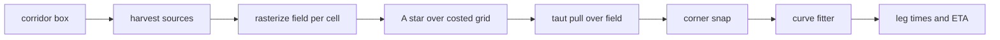

<!-- scope: feature -->
# Route — avoid engine phases 2–6: soft costs, depth gate, markers and curves

**Created:** 2026-09-24 · **Branch:** `feature/zones-avoid-fix` · **Status:** phases 2–5 shipped; Phase 6 in design — the targeted review's fixes being folded

## What this is for

The shipped avoid engine ([`RouteAvoidEngine`](../../app/src/main/java/ykws/android/maro/spatial/RouteAvoidEngine.kt)) clears land, islands and hazard rings. This plan adds the five behaviours the user asked for, over the same corridor grid: the 3 m depth gate, the 300 m band as a priced avoid area, the speed-limit zones as priced avoid areas with per-zone exclusion, the marker-zone weights (-10 … +10), and curve smoothing with turn rounding under a lateral-acceleration threshold. The cell already ships tagged and costed and the pull already ships source-parameterized — so every new source is additive, never rework. This is phase 2 (band), phase 3 (zones), plus depth, markers and curves as phases 4–6.

## The one architecture move — a unified cost field

Today the pipeline splits in two: the rasterizer knows land only, the A* reads a per-cell `sourceCostM`, and the pull reads a hardcoded clearance function `(LatLng) -> Double = distanceToCoastM`. Stages 2–6 force those three readers back onto one model, which is the common functionality the whole feature pulls in:

- `RouteCostSource` — one sealed shape per world source: `HARD` (impassable, a wall) or `SOFT` (priced, passable), answering `costM(p): Double` (metres-equivalent) and `blocked(p): Boolean`.
- `RouteCostField.evaluate(p)` — sums the soft sources at a point and reports the hard block. One evaluator, read by four consumers.
- The **rasterizer** samples the field once per cell centre and writes the tag + `sourceCostM` (the `AvoidCellState.BAND` / `ZONE` tags already exist, stage 1 uses only `FREE`/`LAND`).
- The **A\*** is unchanged in structure — it already reads `sourceCostM` with a metres-equivalent g so the haversine heuristic stays admissible.
- The **pull** changes in one place: instead of `(LatLng) -> Double` clearance it takes the field, and accepts a chord when no hard source is within the margin **and** the chord's summed soft cost does not exceed the A* cell path's cost over that same span. That guarantee is what stops the pull from shortcutting a corner through a priced zone the search just went around.
- The **curve fitter** (phase 6) reads the same field to water-test every emitted chord.

## The pipeline with sources

```mermaid
flowchart LR
    A[corridor box] --> B[harvest sources]
    B --> C[rasterize field per cell]
    C --> D[A star over costed grid]
    D --> E[taut pull over field]
    E --> F[corner snap]
    F --> G[curve fitter]
    G --> H[leg times and ETA]
```

## Phase 2 — depth gate, hard wall at 3 m

- **Mechanism.** New key `route.avoid.depthGate.minM=3.0` (default 3, the user's number), read through `AppConfig` with a clamp. `AvoidWorld` gains `depthAt(lat, lon): DepthSample` and `depthReady: Boolean`; the live adapter takes a `DepthRepository` reference — the same seam widening stage 1 did for the coastline.
- **The gate.** One bilinear [`depthAt`](../../app/src/main/java/ykws/android/maro/data/model/DepthGrid.kt:117) per cell centre: a known depth `< minDepthM` paints the cell `LAND`. Everything not below the threshold is ignored — deeper water, coarse sources and NoData alike, with no confidence floor and no penalty (decided 2026-09-24: the gate is a coarse guard on the route being written, not a fine sounding).
- **Linked with the water.** The gate is ANDed with the coastline's `isWater`, so a NoData cell the depth mask erased on the land side is still blocked as land rather than passed as unsurveyed.
- **Readiness.** `DEPTH_NOT_LOADED` joins `COASTLINE_NOT_LOADED` as a `RouteUnavailableReason`, so a route armed before the depth grid lands is refused by name; with no grid loaded every cell reads unsurveyed and the gate would otherwise be silently inert.
- **Perf cost.** Depth is a raster, `depthAt` is an O(1) bilinear read over four cells; painting ~33 k cells is a few ms. **Difficulty: low.**

## Phase 3 — 300 m band, priced avoid area

- **Mechanism.** Soft source, never a wall: the boat may enter, it should spend as little time as possible. Cost in metres-equivalent while `distanceToCoastM <= 300 + margin`, reusing the land pass's cell-centre-to-segment distance — the distance is already computed for the margin band, so the band cost is a second write in the same loop, not a second pass.
- **Forced crossing.** A start or aim already inside the band, a marina basin, or a corridor with no way out is accepted and named in `forcedCrossingZoneNames` — never refused and never sent on an absurd detour.
- **Penalty magnitude (decided).** One shared multiplier, `route.avoid.zone300.softCostAversion` (default 1.5), scales the time spent in the band and in a priced zone alike — big enough to bend the line out of a 50 m strip, small enough not to send it kilometres around.
- **Perf cost.** Folds into the existing distance pass — negligible extra. **Difficulty: low-medium** — it is the first soft source through the field → rasterizer → A* → pull chain, so it proves the soft-cost path end to end before the heavier sources ride on it.

## Phase 4 — speed-limit zones, priced and excludable

- **Mechanism.** `AvoidWorld` gains `speedZonesIn(box)` returning zone polygons (outer ring, holes, `limitKn`, id) so the rasterizer even-odd-fills them — holes stay water, overlapping zones keep the strictest limit. No per-cell `SpeedZoneIndex.query`: the inside test scans every ring ([`PolygonIndexBase.status`](../../app/src/main/java/ykws/android/maro/spatial/PolygonIndexBase.kt:178)), so 33 k point queries is the exact explosion the stage-1 budget forbids.
- **Armed (2026-09-25).** One key, `route.avoid.speedZone.enabled` (shipped **false**), gates the whole source on the depth-gate and band pattern: with it off the search reads no zone (no fill, no price), the clock reads the pace alone and no forced crossing is reported.
- **Cost.** The zone's own time at its limit is the base price (decided 2026-09-24): a slower leg costs more metres-equivalent, which is what makes the line spend less time in a zone, while the band keeps the `softCostAversion` multiplier alone.
- **Cursor.** One key, `route.avoid.speedZone.softCostAversion` (default 1.0), scales the time a leg spends in a zone inside the routing cost — a zone cell costs its base plus `(pace/limit − 1) × K` of that cell: K = 1 makes it cost its **true travel time**, so the search minimises real time and bends around a slow zone when the way around is faster; K = 0 prices the zone as open water and reproduces today's "no zone restriction"; K above 1 bends harder than real time warrants. The cursor chooses the line and **never touches the ETA** — the clock stays physics, or the trip figure lies.
- **ETA.** No zone restriction term: outside a zone the boat accelerates gradually to the configured speed, inside one it obeys that zone's limit, and `success()` splits each leg where the limit in force changes so the trip figure reads what the boat must really do. A boundary crossing adds a vertex, so the drawn line gains a point there.
- **Saved speeds.** The computed per-leg speeds are **saved with the track** (decided 2026-09-24), so a saved route carries the planned speeds rather than a re-derived figure.
- **Exclusion (decided).** A persisted set of excluded zone ids, default empty, dropped before the fill, the ETA and the report alike.
- **Forced crossing.** No way around → the crossing is taken and reported by zone name.
- **Perf cost.** Polygon fill is cheap; the ETA's leg splitting walks every non-excluded zone ring per sample along the drawn line — no bbox prefilter — so it is O(waypoints × zones × ring vertices), and when a priced zone stands in the corridor the forced-crossing probe **re-rasterizes and re-runs the search once with the restrictive zones blocked**, a second A\* pass. **Difficulty: medium-high** — the ETA integration and the exclusion filter are the real work.

## Phase 5 — marker-zone weights, avoid-only 0 to +10

- **Mechanism.** Soft source over the user's own markers (Circle radius, Corridor band), **avoid-only** (decided 2026-09-24): the weight w ∈ [0, +10] scales the per-metre price inside the zone by a factor ≥ 1, 0 being a neutral marker and +10 a steep avoid. A marker can only make the sea dearer, never cheaper.
- **No prefer, and why.** A negative per-metre price is not a stronger pull but a broken one: with a step that pays back, the cheapest path is undefined — the search would loop for unbounded gain — and even one negative edge forces re-opening settled cells, which the closed-set A\* cannot do. Free is the strongest well-posed pull, and a genuine go-through-this-place is a via, not a price.
- **The floor is a rule, not a sign.** The grid always writes a base cost and every source may only add to it, so no passable cell is ever below the base; the trap is [`AvoidCell.sourceCostM`](../../app/src/main/java/ykws/android/maro/spatial/avoid/AvoidGrid.kt:25), whose default is 0.0, so the base must be explicit and replacement forbidden.
- **Containment.** Markers are few and user-owned; a bbox pre-filter over the corridor is enough, no bake, read live at ask time.
- **Perf cost.** Low — a handful of markers. **Difficulty: medium** — newest source and live user data, the weight semantics now settled.

## Phase 6 — curve smoothing and turn rounding

- **What it is.** A post-processor over the settled line, running between the fine re-search and the clock, that turns the grid-shaped path into a navigable trajectory: it flattens the staircase jitter and fairs each bend into a curve the boat can steer, on water. It is a **post-search stage** — the A\* is untouched — and the faired line is the route **drawn and saved**.
- **Fair the bend, not the corner.** One curve spans a run of consecutive corners from the bend's entry tangent to its exit tangent. A run ends where the turn's **sign changes** (an S-bend is two bends) or where the separating leg is longer than twice its transition — the transition being the **floor speed's** own, the shortest a bend can have, since the bend's speed is not known until its radius is; so the join never depends on the radius it would need. Where a run's single curve cannot meet the legs, its corners are faired **individually** rather than the whole run dropped.
- **Curvature-continuous.** The curve runs straight → **spiral** → arc → spiral → straight. The spiral ramps curvature `0 → 1/r` over the transition length and consumes `L/(2r)` radians of the turn at each end, the circular middle sweeping what is left; where two spirals would meet or cross (the turn at or under `L/r`), the bend is a **spiral-only** curve, or its vertex is kept. A bare arc, or a trimmed one with a heading kink, is not a trajectory and is refused.
- **The transition is timed.** `route.turn.transitionSec` (**2.0 s**, clamped 0.5–5) gives the spiral length `L = v · transitionSec` at the bend's speed — ~29 m at 28 kn, ~10 m at 10 kn — so the entry inertia scales with speed; the curvature rate follows, `κ̇ = v / (r · L)`.
- **The radius comes from the water, capped by the pace.** A bend is drawn at the largest radius that clears the walls, `r_fit`, never wider than the pace's own radius `v_pace² / a_lat` — a gentler curve only bows further inside for no gain — with `a_lat` from `route.turn.lateralAccelMps2` (**1.0 m/s²**, ~0.1 g, clamped 0.1–2.94).
- **The corner speed is a cap with floors under it.** The cap is `min(v_pace, sqrt(a_lat · r_fit))` — the fastest the boat may take that radius without breaking the lateral ceiling. Two floors lift it: the deceleration floor the approach sets, `v ≥ sqrt(v_pace² − 2·a_long·L_approach)` with `a_long` the clock's own `route.speed.accelMps2` and `L_approach` the distance from the previous resolved bend's exit to this bend's entry, the radicand clamped at 0; and `route.turn.minSpeedKn` (**5 kn**, clamped 2–10), because a boat cannot crawl to zero. The one value is `v = min(cap, max(decelFloor, minSpeedKn))`; a floor above the cap means the radius is too tight for any legal speed, and the bend stays sharp. The corner speed never raises the boat above the limit in force: a 3 kn zone still runs at 3 kn.
- **The arc's intrusion is the lever.** The arc's apex stands `r · (1/sin(θ/2) − 1)` inside the corner's vertex, so a **slower corner shrinks `r` and with it the intrusion** — the one lever, trimming the sweep changing neither `r` nor `θ`. The ladder tries the full curve, then a slower corner, down to `route.turn.minSpeedKn`, each step easing the intrusion until the wall test clears.
- **One rule, with a stated end.** A bend is faired where a radius and a speed clear the walls; where no radius clears even at `route.turn.minSpeedKn`, that same slow bend is the answer — the search's vertices taken at the floor. **The radius is never reduced below `v² / a_lat`; the speed is** — and a curve the relaxation has **moved** re-derives its cap from its own minimum radius, so a moved bend can never claim a speed its geometry no longer holds. The clearing radius is found by **bisection, 24 steps**, not in a single pass.
- **The walls are absolute.** The water test reads the coast's `route.avoid.obstacle.marginM` (50 m), the depth gate's `route.avoid.depthGate.minM` (3 m) **and** its standoff `route.avoid.depthGate.marginM` (20 m), the grid's own blocked set, and the two carved approaches — on **every segment and every sample**. The engine hands the fitter the **coarse search grid** — it carries its own origin and box — and the two approaches **beside** the field, so a point resolves to a cell and the test sees what the search saw. The emitted line is walked at the pull's own step (`marginM / 2`), and the depth standoff is read as the **distance from the cell's centre to the nearest cell under the gate**, refused when it is within the standoff — so a 20 m offset is representable without a finer walk.
- **Inward relaxation, outside walls only.** Where the slowed ladder still grazes a wall on the **outside** of the turn, the intermediate control points may move **inward, toward the vertex** — tightening the curve away from that outside wall — bounded by the corridor box the engine hands the fitter, and re-tested. The verdict reads the blocked sample **nearest the vertex**, so an inside graze behind a flank block is not misread as outside. An **inside** wall is never answered by relaxation — the intrusion above is the lever there — and where both sides are walls the speed floor answers.
- **The soft price is waived.** A bow into a priced zone or band is accepted — the app cues zone proximity through `speedZone.distanceOutOfZoneInfoM` — so the fitter reads no soft price.
- **The clock carries the bend's speed.** A cap is emitted for **every arc point** of a resolved bend, strictest-wins, and charged beside the longitudinal ramp; the search stays turn-blind. The cap survives the clock's own boundary splitting, and every keyed point must survive the fitter's own duplicate collapse.
- **The base and the delta.** The route's **distance and clock are the pre-fairing line's own**; each resolved bend adds only its **cap's delta** — the same faired line timed with and without the caps — so the geometry is never re-costed and the slowdown is never hidden.
- **The budget.** The slow-water share is a verdict on the **drawn** line and is measured there; the λ loop runs before the fairing and cannot correct for a bow.
- **The probe.** The forced-crossing probe reads the pre-fairing search line, so the crossing report describes the search and not the drawn curve.
- **Every comparison is un-faired.** The fine pass's keep-only-where-faster rule and the offers' `savingSec` compare the un-faired durations on both sides.
- **Perf cost and its stage.** The fairing runs **after** the search has answered, so it spends none of the A\*'s budget: its cost is O(waypoints) geometry plus the wall test on every sample, timed as its own post-search stage. **Difficulty: medium-high** — geometry and the bisection, not performance.
- **Acceptance.** A GPX showing chorded arc points through a bend the geometry allows, and a sharp vertex only where the floor binds.

## Logical implementation order

The order above is the technical dependency order: the unified field first, the hard walls (depth) before the soft costs, the cheapest soft source (band) proving the chain before the zone's ETA and filter work, markers last among sources, curves last because they re-verify against the finished source set.

## New keys

| Key | Default | Meaning |
|---|---|---|
| `route.avoid.depthGate.minM` | 3.0 | depth below which a cell is excluded |
| `route.avoid.depthGate.marginM` | 20 | lateral standoff from the depth wall |
| `route.turn.lateralAccelMps2` | 1.0 (~0.1 g) | turn-rounding lateral-acceleration limit: `r = v² / a_lat`, clamped 0.1–2.94 |
| `route.turn.transitionSec` | 2.0 | spiral roll-in time, clamped 0.5–5; transition length `= v · this` |
| `route.turn.minSpeedKn` | 5 | the floor a bend's speed may not go below (clamped 2–10) — a boat cannot crawl to zero |
| `route.avoid.zone300.softCostAversion` | 1.5 | multiplier on time spent in the 300 m band |
| `route.avoid.speedZone.softCostAversion` | 1.0 | cursor on a zone cell's time-excess: 1 = true travel time, 0 = no zone pricing |
| `route.avoid.speedZone.enabled` | false | switch: false prices every speed zone as open water |

All read through `AppConfig` with a clamp, one home each — no Settings row until one is asked for.

## Performance invariant

Budget stays ≤ 500 ms wall, re-priced per stage, and the curve fitter is a **post-search stage** counted apart from the search's own wall. The invariant the tests pin: **every source rasterizes once into the corridor grid; the pull and the curve fitter sample only along the emitted line, never per grid cell.** The stage-1 assertion that guards the full-grid `isWater` explosion generalizes to depth, band, zone and marker queries.

## Decisions (arbitrated 2026-09-24)

- Marker weight — an avoid-only dial w ∈ [0, +10] scaling the per-metre price by a factor ≥ 1; a marker can only make the sea dearer, and going through one is a via, not a price.
- Speed-zone exclusion — a persisted set of excluded zone ids, default empty.
- The smoothed curve is the route drawn and saved; the route's figures keep the **search's base** with the bends' caps' deltas added — the geometry is never re-costed.
- Depth — block a known depth below the threshold, with `route.avoid.depthGate.marginM` (20 m) of standoff, ANDed with the coastline's water test; everything at or above the threshold is ignored.
- Band aversion — one `route.avoid.zone300.softCostAversion`, shipped at 5.
- ETA — obey the zone limit in force and accelerate gradually to the configured speed outside one; the computed speeds are saved with the track.
- Zone-avoidance cursor — the route bends away from zones by `route.avoid.speedZone.softCostAversion`, shipped at 4 (a zone cell costed at its true travel time at 1, so the search minimises real time; 0 is the no-zone-price line); the cursor chooses the line and never the ETA.

## Amendments (2026-09-25) — folded from the 2026-09-25 plan

Four changes designed after three independent reviews, folded here so the feature keeps one plan; the two switches shipped 2026-09-25, the tangent look-ahead and the coarse-to-fine phase remain:

- **Phase 2 amendment — a switch for the depth gate.** `route.avoid.depthGate.enabled=true` (default) gates the depth source; with it off, `AvoidWorld.load()` becomes coastline-only and `prepare()` never calls `loadDepth()`, so arming succeeds on `coastlineReady` alone; a mid-session toggle applies at the next arming. **Shipped 2026-09-25.**
- **Phase 3 amendment — a switch for the band, one home for its price, and a tangent look-ahead.** `route.avoid.zone300.enabled=true` gates the band; the band price lives in the field's one soft source (the rasterize sweep's band args removed, so the pull's chord guard stays alive); and the band gains the coastline's tangent look-ahead — its convex corners offset by `bandReachM(bandWidthM, zone300MarginM)`, clamped, with per-set snap radii, so a concave band is chorded rather than dived. **Switch and price home shipped 2026-09-25; the tangent look-ahead remains.**
- **A new precision phase — coarse-to-fine.** After the coarse grid A\* fixes the homotopy, a finer grid — `route.avoid.grid.cellM` × `route.avoid.fine.cellRatio`, set by the user to **0.40** on 2026-09-25, hence 20 m at today's 50 m — subdivides only the coarse path's own cells (each inheriting its coarse passability, so the side cannot flip) and a second A\* re-walks it; the pull then emits a near-smooth line with a collinearity merge, widened only on no-path. This replaces the corner-graph A\* that measured 7.3 s and sharpens the grid-A\* + corner-snap the taut pull settled on.

## Challenge findings (2026-09-25) — the corner fix and the budget, challenged

An adversarial challenge found the two sharpest holes and ten more, against the shipped code:

- **Corner fix.** `addTangent`'s miter is unbounded (`margin/sinHalf`) while the snap ball is fixed at 100 m, so a sharp cape's true corner is never reached; two neighbouring snapped corners are never leg-tested, so a sub-margin leg can ship; a concave coast yields no corner and stays grid-quantized; the second pull drops the cosmetic snaps; `MIN_SIN_HALF = 1e-6` admits notch noise; and a corridor-edge corner is dropped as ambiguous.
- **Performance.** The band is priced twice (sweep plus the field) and re-read live per cell (~33k `distanceToCoastM` reads); the double price breaks the pull's priced guarantee (the A\* pays 2×, the pull reads once); the snap is an unindexed O(P×C) scan; each pull sample is two live index reads; the worst case (widen plus the reach×2 retry) runs ~4 rasterize + 4 A\* passes at ~81k cells; and the 500 ms gate is an assertion, not a wall-time bound.

**Consequences folded in.** The coarse-to-fine pass and the collinearity merge become the primary corner mechanism, and the snap is retired or rebuilt — a clamped miter, a between-snaps leg test, a noise floor, and an indexed or dropped scan; the band price keeps its one home; and the budget gains a real wall-time gate with a measured worst case.

## Out of scope

Any Settings row, any bake or artifact, any new dependency, and any change to the `RouteEngine` seam itself — the sources arrive through `AvoidWorld`, exactly as stage 1's coastline did.
