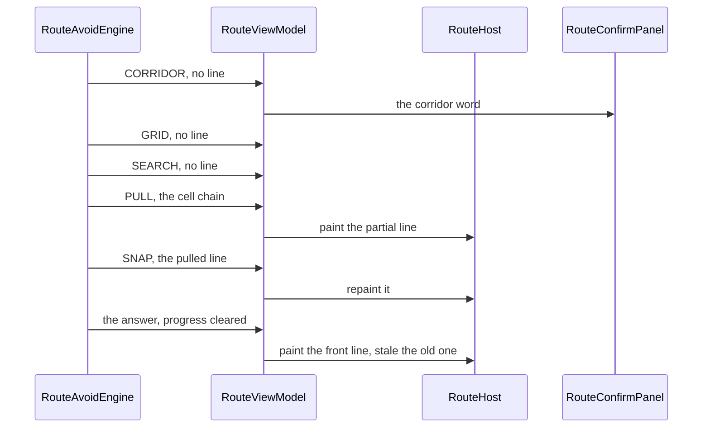

<!-- scope: feature -->
# Route — the line drawn as it is built

**Date:** 2026-09-25 · **Branch:** `feature/route-avoid-workflow` · **Status:** in design — nothing built, nothing outside this file touched
**Asked for:** the user's brief of 2026-09-25, in two parts: (1) *is it possible to draw the route as it builds?* (2) *we could pass an intermediary call back that gets invoked at each step and trigger a drawing of the track* — settled the same day at the user's word as **each of the steps**, meaning the five pipeline boundaries the engine already crosses, **not** every step of the A\*.

**It is a change to what the delivery does, so it is a change to the master book first.** [`260922_FEAT_PLN_Route_ask-policy-and-target-validity.md`](260922_FEAT_PLN_Route_ask-policy-and-target-validity.md) is the requirements' home and **wins any conflict** with the epic; this pass adds **R43** and amends **R15**, and the epic's `routing-engine` and `destination-ui` rules follow them.

## 1. What ships today, measured against the change

| Question | What ships today | The change |
|---|---|---|
| Can the engine speak mid-run? | Yes — but words only: [`RouteEngine.stage`](../../app/src/main/java/ykws/android/maro/spatial/RouteEngine.kt:63) is a `StateFlow<RouteStage?>` set at each boundary and cleared in `finally` ([`RouteAvoidEngine.kt:126`](../../app/src/main/java/ykws/android/maro/spatial/RouteAvoidEngine.kt:126)) | The same emission also carries **the line the pipeline holds at that instant** |
| Is there a line before the answer? | No: the partial geometry exists only inside the search ([`AvoidSearch.kt:55`](../../app/src/main/java/ykws/android/maro/spatial/avoid/AvoidSearch.kt:55), the `cameFrom` map) and the engine answers one `RouteResult.Success` at the end | Two boundaries hand their geometry out: **pull** carries the cell chain, **snap** the pulled line |
| Is there a drawing path for a line that is not the plan? | [`RouteHost`](../../app/src/main/java/ykws/android/maro/ui/map/RouteHost.kt:239) paints slot 0 from `state.plan` and the ladder from the session set; nothing else draws | One more overlay, `route_progress`, in the track band |
| Does the panel have words for it? | Yes — five `@StringRes` stage labels already ship ([`RouteEngine.kt:223`](../../app/src/main/java/ykws/android/maro/spatial/RouteEngine.kt:223)), in both locales | **No new copy at all**; the progress line adds no string |
| Does `Confirm`, the table or the ladder move? | All read `state.plan` alone ([`RouteHost.kt:220`](../../app/src/main/java/ykws/android/maro/ui/map/RouteHost.kt:220), [`RouteViewModel.kt:205`](../../app/src/main/java/ykws/android/maro/ui/map/RouteViewModel.kt:205)) | **Untouched**: a partial line is not a plan, so nothing downstream can see it |

## 2. The callback, and what each boundary can carry

The pipeline sets its stage **before** it does the work ([`RouteAvoidEngine.kt:140`](../../app/src/main/java/ykws/android/maro/spatial/RouteAvoidEngine.kt:140), `:147`, `:153`, `:162`, `:165`), so the honest reading of an emission is *the boundary just entered, and the geometry the previous work produced*. Three boundaries therefore have nothing to hand out, and saying so is the design rather than a gap:

| Boundary | Work about to run | The geometry the emission carries |
|---|---|---|
| `CORRIDOR` | cut the corridor box from the two ends | **none** — nothing has been computed |
| `GRID` | rasterize the corridor into the grid | **none** |
| `SEARCH` | A\* over the grid, to the aim cell | **none** — the A\* has not run yet |
| `PULL` | pull the cell path taut | **the raw cell chain**, the A\*'s own answer, mapped to points |
| `SNAP` | move each bend onto its tangent corner | **the pulled line**, minus its own end discs' bends |
| the answer | — | the snapped line, as `plan`; progress **cleared** |

- **Two intermediate draws per ask**, and the second replaces the first: the eye sees a staircase appear, then straighten, then the answer lands as the front line. That is what "drawn as it is built" means on this pipeline, and the plan states it rather than promising a growing line.
- **The frontier chain of the A\* is deliberately not drawn** — the user's word of 2026-09-25, and the reading behind it: an A\* expands by `f`-value, so the chain to the node it is expanding jumps across the water from one expansion to the next, and a per-expansion emission would need a throttle as well, each repaint invalidating the map on the main thread.
- **The named consequence, not hidden:** most of a long ask is spent *inside* the A\*, so the screen shows the stage word and the aim ring for that stretch and the first line arrives with `PULL`. On the Lérins-to-Salis corridor the whole ask is sub-second today, so both intermediate draws are a flicker; the case this feature is for is the long coastal route, where the retired corner search measured **7.3 s** on the phone.
- **The option kept, not taken:** firing inside `AvoidSearch` at its own cadence hook ([`AvoidSearch.kt:75`](../../app/src/main/java/ykws/android/maro/spatial/avoid/AvoidSearch.kt:75)) would draw the frontier chain while the A\* runs. It is one call site and it reopens the flicker, the throttle and the wandering line together; it resumes on the user's word.

## 3. The seam: one emission, one channel

- **`RouteProgress(stage, points)` replaces the bare stage** — `progress: StateFlow<RouteProgress?>` on [`RouteEngine`](../../app/src/main/java/ykws/android/maro/spatial/RouteEngine.kt:63), where `stage: RouteStage` is the word already published and `points: List<RoutePoint>?` is the line so far, null while there is none. One member rather than a second flow beside `stage`, because two flows would have to be cleared at the same two events and kept in step by hand — the twin bookkeeping the acquisition workflow's own review already flagged as a defect.
- **Cleared where the stage is cleared today** — `finally`, on every answer and every abort ([`RouteAvoidEngine.kt:126`](../../app/src/main/java/ykws/android/maro/spatial/RouteAvoidEngine.kt:126)) — so the rule that a stage never describes a search that has stopped extends to the line in the same sentence, with no second clearing site to forget.
- **`RouteDummyEngine` emits nothing**, as it already does: it crosses no boundary, so [`its stage flow`](../../app/src/main/java/ykws/android/maro/spatial/RouteDummyEngine.kt:64) becomes a null `progress` flow and the panel falls back on its plain searching word, and no line is ever drawn before its answer.
- **The chain is mapped once, by the home that already maps it** — the engine already turns the A\*'s cell path into points to build the list it pulls ([`RouteAvoidEngine.kt:155`](../../app/src/main/java/ykws/android/maro/spatial/RouteAvoidEngine.kt:155)); the `PULL` emission carries that same list, so the drawing and the pull cannot disagree about where the line is.
- **The two ends are the raw ends** — the chain's own first and last points are the frozen anchor and the aim, not the grid's cell centres, so the partial line starts and finishes where the final one does.
- **The reference type is the domain's**: `List<RoutePoint>` at the seam, never a `GeoPoint`, so osmdroid stays inside `RouteHost`.

## 4. The drawing: its own overlay, its own key

- **A fourth map object, `route_progress`, created in the attach-once effect** beside the pool, the pin and the ring ([`RouteHost.kt:159`](../../app/src/main/java/ykws/android/maro/ui/map/RouteHost.kt:159)), and removed by that effect's own disposal. A dedicated overlay rather than the front slot, because slot 0's meaning is *the line the panel's table describes*: reusing it would make a standing line and a partial one share a slot whose two states the paint effect would have to tell apart, and the pool's slots are already exactly filled by the front line plus the ladder's [`oldest + latest`](../../app/src/main/java/ykws/android/maro/ui/map/RouteHost.kt:157).
- **Its own paint effect, reading `progress?.points`** — so the existing repaint reads `state` and nothing about it changes, and the two writers touch different objects.
- **Hidden by its own flag, never by a null position** — the pin's device lesson of 2026-09-22: no progress means `isEnabled = false` and empty points, which is also what an abort and an answer leave behind.
- **The appearance is one new key, and no second copy of the colour or the width**: `route.progress.transparencyPct=55` behind `AppConfig`, joining [`route.line.*`](../../app/src/main/assets/maro.properties:61) in `maro.properties` — the line's own colour (`#FF2ECC71`) and width (6 dp) are reused, and the transparency is what makes the line read **provisional** beside a front line drawn at 15 % (0.85 alpha against 0.45). 55 is the plan's value, not a measurement; it is a starting value in one file, and the pair is expected on the device before it is settled.
- **The ring and the pin are untouched**, and the `route_` prefix keeps the new overlay in the track band with the lines, under every marker — the boat included.

## 5. What does not change, and why nothing new is needed for it

- **`Confirm` is already disabled while no plan stands** (R16): a partial line is not a plan, so the acquisition's action matrix, its accent and its disabled face are untouched.
- **Nothing is staled by a partial line** (R13, R14): stale means replaced, and a line the pipeline has not finished is replaced by nothing — the standing front line keeps its slot and its transparency, and the ladder does not move.
- **The panel's words are the shipped ones** (R15): the same five stage labels ride the same sentence line, in both locales; the table stays hidden while `plan` is null and appears on the answer exactly as it does today.
- **`searching`, the anchor, the saves and the session** are read off the state alone and are not touched by this pass.
- **No new dependency, no baked artifact, no key beyond the one drawing value**, and no Settings row: the appearance follows the rule that every drawing value has one home in `maro.properties` and gains no row until one is asked for.

## 6. Epics, rules and requirements to move — the build's own paperwork

- **Master book** ([`260922_FEAT_PLN_Route_ask-policy-and-target-validity.md`](260922_FEAT_PLN_Route_ask-policy-and-target-validity.md)): **R43** added — *the engine publishes, at each pipeline boundary, the line it holds, in the same emission as the stage; the line has no consumer but the map, is cleared on every answer and every abort, and is never the plan*; **R15** amended to say the emission is one value carrying both.
- **Epic** [`FEAT_DSC_Route.md`](FEAT_DSC_Route.md) `routing-engine`: the *publishes the stage* rule becomes *publishes the stage and the line*, and the `RouteEngine` Key File entry follows; `destination-ui`: one new rule — *the partial line is drawn in the track band, in its own overlay, and is not the plan*.
- **Epic Key Files**: `RouteEngine.kt`, `RouteAvoidEngine.kt`, `RouteHost.kt`, `RouteViewModel.kt`, `RouteConfirmPanel.kt` and the two test files named in §8 gain their new sentences; the feature's `## Docs` gains this plan.
- **`GLOBAL_CONTEXT.md`** Feature Summaries row and the epic's Description follow at the next `#bake`, not before.

## 7. Build order

1. **The seam** — `RouteProgress(stage, points)` beside [`RouteStage`](../../app/src/main/java/ykws/android/maro/spatial/RouteEngine.kt:223); `val progress: StateFlow<RouteProgress?>` replaces `val stage`; its KDoc names what each boundary carries and the two clearing events.
2. **The dummy** — [`RouteDummyEngine`](../../app/src/main/java/ykws/android/maro/spatial/RouteDummyEngine.kt:64) answers a null progress flow; nothing else about it changes.
3. **The avoid engine** — the five call sites of [`searchOnce`](../../app/src/main/java/ykws/android/maro/spatial/RouteAvoidEngine.kt:122) publish `progress`, `PULL` carrying the chain and `SNAP` the pulled line, with the `finally` the single clearing site.
4. **The ViewModel** — `_stage` becomes `_progress` ([`RouteViewModel.kt:321`](../../app/src/main/java/ykws/android/maro/ui/map/RouteViewModel.kt:321)) and the collector's shape is unchanged ([`RouteViewModel.kt:392`](../../app/src/main/java/ykws/android/maro/ui/map/RouteViewModel.kt:392)); the panel's parameter and its call site swap to `RouteProgress?`.
5. **The panel** — one parameter swap; `acquiringSentence` reads `progress?.stage`; **no copy, no layout, no action change** ([`RouteConfirmPanel.kt:509`](../../app/src/main/java/ykws/android/maro/ui/map/RouteConfirmPanel.kt:509)).
6. **The drawing** — the `route_progress` overlay in `RouteHost`'s attach-once effect, its own paint effect, its own key behind `AppConfig`, and the disposal line beside the pool's.
7. **The drawing value** — `route.progress.transparencyPct=55` in [`maro.properties`](../../app/src/main/assets/maro.properties:61) with its accessor, its bounds and its KDoc.
8. **The test pins** of §8, each shown red on its revert.
9. **The paperwork** of §6, then `apk-build.bat` and the route-filtered suite green.

## 8. Test pins

- **The flow per boundary** — a fake engine driven through the acquisition emits `CORRIDOR` · `GRID` · `SEARCH` · `PULL` with the chain · `SNAP` with the pulled line, and the state is read after each: the progress is non-null, its stage is that boundary's, its points are that boundary's, **[`RouteAcquisitionTest`](../../app/src/test/java/ykws/android/maro/ui/map/RouteAcquisitionTest.kt)** gaining the leg beside the stage flow it already pins.
- **Cleared on the answer and on the abort** — after the answer the progress is null and the plan carries the final line; after an abort mid-search the progress is null and the standing plan is untouched, the assertion reading both together because "no line outlives its search" and "nothing is staled" are one reading.
- **The partial line never becomes the plan** — with a non-null progress and a null plan, `Confirm` is disabled, the panel's table has nothing to show, and the session's saved predicate is false: the gate is the plan, and a line being drawn is not one.
- **The channel is one value** — the panel's sentence and the drawn line cannot disagree, asserted by reading the stage and the points off the same emission, **[`RouteEngineSeamTest`](../../app/src/test/java/ykws/android/maro/ui/map/RouteEngineSeamTest.kt)**'s gated foreign engine being the shape that can hold an emission while the test looks at it.
- **The device reading is owed** — whether the staircase reads as a line under construction or as a broken route, and whether the 55 % transparency is the right provisional face, are judgements no JVM suite can make and the project carries no instrumentation harness: they are the user's, on the phone.

## 9. Open points for the review

- **The flicker** — on a sub-second ask the two intermediate draws may be worth less than the paint they cost, and the stage word already says the same thing; the counter-argument is that the corridor's own budget is a desktop figure, the phone's reading is owed, and a long route is exactly when a line matters.
- **The staircase** — 50 m cells at 6 dp make a visibly angular line; the mitigation in this plan is the transparency alone, and a second one exists but is not taken: drawing the chain only from the `PULL` emission onward, which is already the case.
- **The mapping cost at the `PULL` boundary** — one array walk over the cell chain on the search's own dispatcher, unnamed in the ≤ 500 ms budget, and it should be measured rather than assumed at build time.
- **Whether the ring's own beat should stop while a partial line is drawn** — not proposed here: the ring is the aim's, the line is the route's, and the two read as one picture until the device says otherwise.
