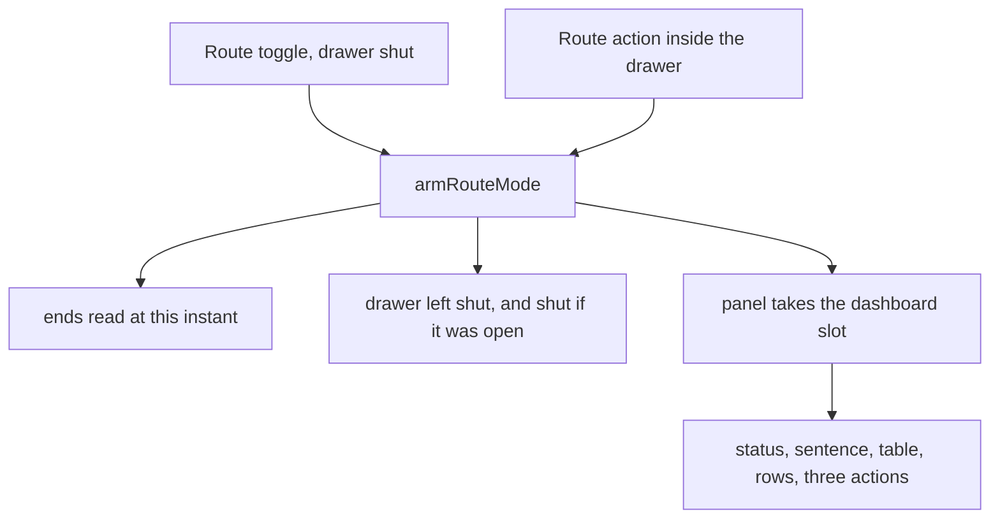
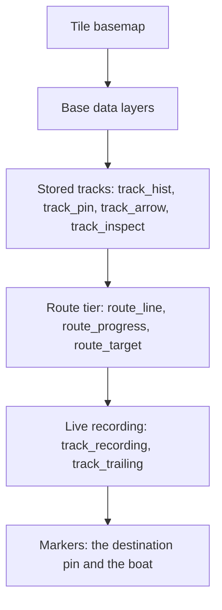

<!-- scope: feature -->
# Route — the acquisition's face, the toggle's door, and the paint order

**Date:** 2026-09-28 · **Branch:** `feature/route-w-markers` · **Status:** **shipped 2026-09-28** — the five changes built in one Code hop in §7's own order, `apk-build.bat` BUILD SUCCESSFUL and `:app:testDebugUnitTest` green; the device pass of §9 is owed.
**Asked for:** the user's brief of 2026-09-28, in its five parts: (1) the acquiring dialog should, in place of **Cancel**, carry a **Discard** in a **red** button; (2) **Save to track** and **Select route** take the **same row**, to leave more room for the status and the other requirements of that screen; (3) the top-right `Acquiring…` should read **`Acquiring ([stage])…`**; (4) the route toggle's **first press must not open the menu sidebar** — it starts the acquisition and opens the acquisition dashboard; (5) the **route's green paints on top of every other track, except the active track**.

**Reading of the brief, stated because one word is loose.** "The acquiring dialog" is taken as the **acquisition's own surface** — the route panel in the dashboard slot ([`RouteConfirmPanel.kt`](../../app/src/main/java/ykws/android/maro/ui/map/RouteConfirmPanel.kt:98)) — whose third action **is** `Cancel` today ([`:170`](../../app/src/main/java/ykws/android/maro/ui/map/RouteConfirmPanel.kt:170)). The only other dialog in the mode is the following phase's exit dialog, which already carries a red `Discard Route`; a change there would be a change to something already named.

## 1. The five changes, one home each

| # | Change | The one home that moves |
|---|---|---|
| A1 | The acquisition's abort reads **Discard**, **red** | the panel's third `ConfirmActionButton` — [`RouteConfirmPanel.kt:170`](../../app/src/main/java/ykws/android/maro/ui/map/RouteConfirmPanel.kt:170) |
| A2 | `Save to track` and `Select route` share **one row** | the panel's `actions` block — [`RouteConfirmPanel.kt:148`](../../app/src/main/java/ykws/android/maro/ui/map/RouteConfirmPanel.kt:148) |
| A3 | The corner reads **`Acquiring ([stage])…`** | the status the panel computes — [`RouteConfirmPanel.kt:116`](../../app/src/main/java/ykws/android/maro/ui/map/RouteConfirmPanel.kt:116), rendered by `PanelHeader` — [`RouteConfirmPanel.kt:227`](../../app/src/main/java/ykws/android/maro/ui/map/RouteConfirmPanel.kt:227) |
| A4 | The toggle arms **without the drawer** | `armRouteMode` — [`MapScreen.kt:1821`](../../app/src/main/java/ykws/android/maro/ui/map/MapScreen.kt:1821), its two call sites [`2492`](../../app/src/main/java/ykws/android/maro/ui/map/MapScreen.kt:2492) and [`3172`](../../app/src/main/java/ykws/android/maro/ui/map/MapScreen.kt:3172) |
| A5 | The route paints **over every track but the live one** | the band's own order — [`OverlayZOrder.kt:25`](../../app/src/main/java/ykws/android/maro/ui/map/OverlayZOrder.kt:25) |

Nothing else in the feature is touched, and no new dependency, key or token is introduced by any of the five.

## 2. A1 · the abort's word and face

- **The word.** The third action's label becomes the **`route_exit_discard`** key the exit dialog already owns — `Discard Route` / `Abandonner la route` ([`strings.xml:645`](../../app/src/main/res/values/strings.xml:645)) — rather than a second key carrying the same word, which the one-home rule refuses. `action_cancel` stays what it is, the app's generic abort, for the surfaces that still mean "nothing was decided".
- **The face.** `ConfirmActionRole.DANGER`, the red the exit dialog's own discard already wears. No new colour: the role's rendering is [`ConfirmActionButton`](../../app/src/main/java/ykws/android/maro/ui/components/ConfirmDialog.kt:327)'s, shared with every other surface.
- **The act is unchanged** — the same silent end the `Cancel` performed (R57): the acquisition is left, the toggle goes off, nothing is written and nothing is asked.
- **The callback's name moves with the word**: the panel's `onCancel` parameter becomes `onDiscard`, because the surface it renders no longer says "Cancel" — a rename inside the same edit, at the panel and its two call sites, not an adjacent improvement.
- **The named trade-off:** the exit dialog's key is title-case (`Discard Route`) while the panel's two siblings are sentence-case (`Save to track`, `Select route`). One key with one word beats two keys agreeing on a case; if the mixing reads wrong on the device, one string edit in one locale settles it, and that is the whole cost of the reading.

## 3. A2 · the row

- `Save to track` and `Select route` move into **one `Row`**, each `Modifier.weight(1f)`, the pair **8 dp apart**, and the discard stays **full width below** — the family's own geometry, which `ConfirmActionButton`'s KDoc already names as its reason for taking a `modifier`: "stacked full width by default, or weighted inside a `Row` where the slot is short" ([`ConfirmDialog.kt:324`](../../app/src/main/java/ykws/android/maro/ui/components/ConfirmDialog.kt:324)).
- The panel's actions column keeps its own 6 dp vertical rhythm ([`RouteConfirmPanel.kt:213`](../../app/src/main/java/ykws/android/maro/ui/map/RouteConfirmPanel.kt:213)); only the pair's horizontal gap is the family's 8 dp.
- **What the row buys** is the brief's own reason: one line of height returned to the content, which is where the status and the table live. No content block moves for it.
- **The named trade-off:** `Select route` is the longest label of the three and now shares its row with `Save to track`; at a narrow portrait width a weighted half may ellipsise. The check is the device's, and the fallback — the pair stacked again — is a one-line revert.

## 4. A3 · the corner carries the stage

- **The status becomes a pair.** A new key, `route_status_acquiring_stage`, `Acquiring (%1$s)…` / `Acquisition (%1$s)…`, formatted with the stage's own label — the `@StringRes` the closed set already carries (`RouteStage.labelResId`, [`RouteEngine.kt:246`](../../app/src/main/java/ykws/android/maro/spatial/RouteEngine.kt:246)). While a search runs with a stage published, the corner reads `Acquiring (Search)…`; while it runs with no stage — the dummy engine's own case — it reads the plain `route_status_acquiring`, unchanged.
- **The stage leaves the sentence line.** `acquiringSentence`'s `stage != null` arm goes ([`RouteConfirmPanel.kt:476`](../../app/src/main/java/ykws/android/maro/ui/map/RouteConfirmPanel.kt:476)), and with it the `acquiring.searching -> route_searching` arm below it, which said the same thing one line down; `route_searching` is deleted from both locales once `findstr` confirms the panel was its only reader. The sentence line then carries the two refusals and the asked-with-no-route word alone, and is null while a search simply runs.
- **This supersedes R15's placement, not its content**: the status still names the phase and its stage, but the stage now rides the corner **inside the phase's own word** rather than a line of its own. The rule's sentence, the panel's KDoc ([`RouteConfirmPanel.kt:47`](../../app/src/main/java/ykws/android/maro/ui/map/RouteConfirmPanel.kt:47), "the stage rides the sentence line, never the header's corner") and the two plans that repeat it move with the change.
- **The corner's budget is one line** (§5.8): the title already yields width (`weight(1f)`, ellipsised) and the status does not, so a longer status is what would clip first. The status gains `overflow = TextOverflow.Ellipsis` in the same edit so a clipped status reads as clipped rather than silently cut, at the existing 13 sp.
- **The named trade-off:** moving the stage up removes the one line that told a user *which* boundary a slow search stands at, in prose, at 13 sp; the corner says the same word smaller. If the short word proves hard to read on the device, the sentence arm is one line back.

## 5. A4 · the toggle no longer opens the drawer

- `armRouteMode(openDrawer: Boolean = true)` ([`MapScreen.kt:1821`](../../app/src/main/java/ykws/android/maro/ui/map/MapScreen.kt:1821)) **loses its parameter**: arming sets `showTrackDrawer = false` unconditionally, and both doors call `armRouteMode()` — the map's square ([`2492`](../../app/src/main/java/ykws/android/maro/ui/map/MapScreen.kt:2492)) and the drawer's Route sub-section ([`3172`](../../app/src/main/java/ykws/android/maro/ui/map/MapScreen.kt:3172)).
- `showTrackDrawer` **is** the menu sidebar — the flag the menu drawer's own dismissal clears (`onDismissMenu`, [`MapScreen.kt:2982`](../../app/src/main/java/ykws/android/maro/ui/map/MapScreen.kt:2982)) — so the two doors stop differing: pressed from the closed map, the acquisition opens and the sidebar stays shut; pressed inside the sidebar, the sidebar shuts with it (D5, which becomes the general rule rather than one door's).
- **The panel is what the user lands on** either way: it already owns the dashboard slot while the mode is armed, so "open the acquisition dashboard" is what arming does, with nothing added.
- The function's KDoc paragraph ([`MapScreen.kt:1802`](../../app/src/main/java/ykws/android/maro/ui/map/MapScreen.kt:1802)) is rewritten with the code — it is the sentence that states the two doors' difference, and that difference is what the brief removes.
- **The named trade-off:** the drawer's Route section is where the two ends are chosen, and a user who presses the toggle expecting to be shown them now lands on the panel instead. The ends were already read at that instant and the panel prints them in its table, so nothing is lost silently; and the drawer is one press away.

## 6. A5 · the paint order inside the track band

- **What is wrong today is the guarantee, not the intent.** `reorder` filters the band's overlays out of the list and appends them back in **the order they already had** ([`OverlayZOrder.kt:73`](../../app/src/main/java/ykws/android/maro/ui/map/OverlayZOrder.kt:73)), and every overlay mutation in the app appends to the end of the list. A track overlay written **after** the route's own objects — a stored track painted when the track list refreshes, for instance — therefore sits **above** the route green, which is exactly what the brief reports. The `route_` prefix is in the band's list, so the route is *in* the band; its place *inside* the band is left to whoever wrote last.
- **The fix is the order made explicit**, in three tiers instead of one list:

- **The tiers**, appended in that order by `reorder` with a **stable** sort so each tier keeps its own internal order: **stored** — `track_hist_`, `track_pin_`, `track_arrow_`, `track_inspect_`; **route** — `route_`; **live** — `track_recording`, `track_trailing`. The marker band is unchanged, so the boat and the destination pin still paint over everything.
- **The decision is factored out of the overlay types** into a pure function over the title — `trackTierOf(title: String?)` returning the tier — with `isTrackOverlay` and the sort both reading it. That is what makes the new rule **testable on the JVM**: [`RouteTargetBandTest`](../../app/src/test/java/ykws/android/maro/ui/map/RouteTargetBandTest.kt:20) records that the band's list cannot be reached from a JVM test because osmdroid overlays need `android.graphics.Paint`, and a title-to-tier function needs no overlay at all. Four cases: a stored prefix, `route_line`, `track_recording`, and a title in no band.
- **The ring follows the route tier**, being a `route_` title — so it paints above every stored track and under the live recording, where today it can land anywhere in the band.
- **Named trade-offs, both consequences of the rule rather than defects:**
  - The **live recording line now paints over the route green**. That is the brief's own exception, and it is the right way round: the line being drawn *now* is the one whose newest points matter.
  - `track_inspect_` lands in the **stored** tier, so a followed route paints over a highlighted track's line while both are on screen. Its own invariant was "the selection above every track"; with a route on the map that invariant is narrowed to "above every stored track". If that reads wrong on the device, moving that one prefix up a tier is a one-line change.

## 7. Build order

1. **A1 and A2 together** — the panel's actions block: the row, the red discard, the callback rename and its two call sites. One file plus `MapScreen`'s two lines.
2. **A3** — the panel's status pair, the sentence arms dropped, the new key in both locales, `route_searching` deleted once `findstr` clears it.
3. **A4** — `armRouteMode`'s signature, its body and its two call sites, and its KDoc.
4. **A5** — the tiers in `OverlayZOrder`, the pure `trackTierOf`, and its four test cases.
5. **The record** (§8), then the gates.

## 8. The record that moves with it

- **The master book** [`260922_FEAT_PLN_Route_ask-policy-and-target-validity.md`](260922_FEAT_PLN_Route_ask-policy-and-target-validity.md): **R15** — the stage rides the corner inside the acquiring word; **R55** — the acquisition's three actions read `Save to track` · `Select route` · `Discard route`, the first two on one row; **R57** — the abort's word is `Discard`, red, and the act is unchanged; **R73** — the acquisition opens **without** the drawer, both doors alike.
- **The epic** [`FEAT_DSC_Route.md`](FEAT_DSC_Route.md): the toggle rule ([`:62`](FEAT_DSC_Route.md:62)) loses its "the drawer opens with it"; the ordering rule ([`:61`](FEAT_DSC_Route.md:61)) becomes **above every track except the live recording**; the action rule ([`:79`](FEAT_DSC_Route.md:79)) carries the new word and the row; the Key Files row for `OverlayZOrder` ([`:104`](FEAT_DSC_Route.md:104)) states the three tiers rather than "the track band".
- **The docs**: [`docs/ui-component-guidelines.md`](../../docs/ui-component-guidelines.md) — §5.6's role bullet if it enumerates the route panel's three roles, and §5.8's sentence about the panel's status if it names the sentence line as the stage's home (both read before editing, then amended only where they state this surface). [`docs/ui-drawer-guidelines.md`](../../docs/ui-drawer-guidelines.md) §8a — the sentence that says the drawer opens on the trigger, which becomes "on neither door".
- **The plans that state the superseded placement** — [`260928_FEAT_PLN_Route_subsection-and-control-model.md`](260928_FEAT_PLN_Route_subsection-and-control-model.md) D5 (the two doors differ) and [`260928_FEAT_PLN_Route_drawer-refinements.md`](260928_FEAT_PLN_Route_drawer-refinements.md) where it repeats the sweep — gain one Rev line each naming what this plan changes, rather than being rewritten; the live statement is the epic's and the master book's.
- **The tests**: `RouteTargetBandTest`'s own sentence — "in the track band, above the tracks, below every marker" — becomes the route tier's.

## 9. Gates and what cannot be gated here

- `apk-build.bat` **BUILD SUCCESSFUL** and `gradlew.bat :app:testDebugUnitTest` green, the new `trackTierOf` cases included.
- **The drawing stays the device's**: that the route green really paints over a stored track and under the live recording is read on the map, because this project carries no instrumentation harness — the same limit `RouteTargetBandTest` already records.
- **The user's own device pass**, three readings: the panel's row and corner end to end, the toggle's first press with the sidebar shut, and the route line against a stored track and against a live recording.

## 10. What this does not touch

- The panel's content above the actions — the title, the comment, the sentence's refusals, the data table, the notes, the pin option and the candidate rows.
- The following phase: its exit dialog, its own three words and its `route_exit_discard` in the accent-last stack.
- The drawer's Route sub-section, and the summary's own status derivation, which keeps its two-word shape for the followed phase alone — the gate already keeps it off the screen while a search runs, so the two renderings of the status never meet.
- The candidate lines' own alphas, the provisional line's key and the pin's marker-band place.
- `action_cancel` and every other surface that uses it.
