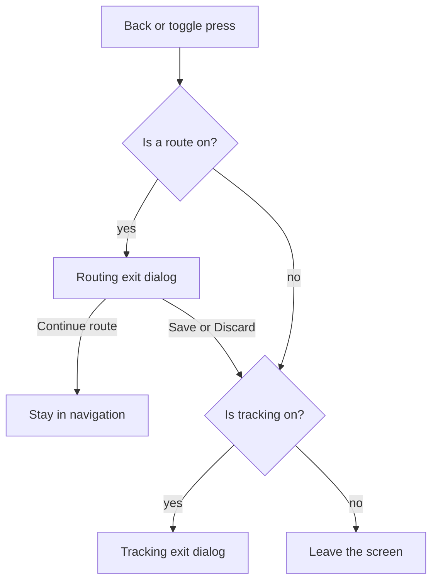

<!-- scope: feature -->
# Route — the drawer's two ends, and the candidates beside the line

**What this delivers.** The mode's two ends stop being placed on the map and become a pair the drawer holds,
one pair per navigation mode. The toggle and the section's own action arm the acquisition on that pair; the
engine's answer arrives with two candidates beside it, which the user steps through and picks; and the pick is
followed on the **ordinary dashboard**, the toggle and one exit dialog being the mode's whole presence.

**It is a change to the delivery, so it is a change to the master book first.**
[`260922_FEAT_PLN_Route_ask-policy-and-target-validity.md`](260922_FEAT_PLN_Route_ask-policy-and-target-validity.md)
is the requirements' home and **wins any conflict** with the epic; this pass adds **R44–R74** and supersedes
**R14** and **R16**. Every requirement below was settled by the user's word on 2026-09-28 and **none is open**;
§11 names what this pass deliberately does not do.

**Nothing here is built.** The pointer moves into the epic's `## Implemented` when the work ships.

## 1. The ground the change stands on

- **The ends are placed on the map today.** The aim is the screen centre and the acquisition asks once per
  press of **Acquire route**, the anchor read on the entry edge and led 10 s by `route.anchor.leadSec`
  (`maro.properties:88`). This is what R44–R50 replace.
- **The panel's grid is R16's** — **Acquire route · Confirm · Save track · Exit**, then **Save track ·
  Reroute · New route · Exit**. R55–R59 rewrite the first, the two moves of the second leave (R65's ground),
  and the save stays where it is.
- **The line already paints as it is built** — shipped, not designed:
  [`RouteEngine.progress`](../../app/src/main/java/ykws/android/maro/spatial/RouteEngine.kt:66) carries
  `RouteProgress(stage, points)`, `RouteAvoidEngine` publishes it at each boundary
  ([`RouteAvoidEngine.kt:1480`](../../app/src/main/java/ykws/android/maro/spatial/RouteAvoidEngine.kt:1480)),
  and `RouteHost` draws it in its own overlay named `route_progress`
  ([`RouteHost.kt:40`](../../app/src/main/java/ykws/android/maro/ui/map/RouteHost.kt:40)). R52 adds nothing.
- **The candidates are already computed and have no UI.** `RouteAvoidEngine.offers` re-runs the pass with a
  price dropped and keeps only what its own clock improves on
  ([`RouteAvoidEngine.kt:1052`](../../app/src/main/java/ykws/android/maro/spatial/RouteAvoidEngine.kt:1052)),
  published through [`RouteEngine.offers`](../../app/src/main/java/ykws/android/maro/spatial/RouteEngine.kt:77)
  and proxied by [`RouteViewModel.offers`](../../app/src/main/java/ykws/android/maro/ui/map/RouteViewModel.kt:350).
  `RouteOffer` carries the source, the line, its legs, its distance, its clock and `savingSec`
  ([`RouteOffer.kt:40`](../../app/src/main/java/ykws/android/maro/data/model/RouteOffer.kt:40)); the sources are
  `SPEED_ZONES` and `ZONE300`, **one price each, never two together** — which is what R53's cumulative pair
  changes. **Both passes already exist**: the zones one at λ = 0 over the **same** grid
  ([`RouteAvoidEngine.kt:1076`](../../app/src/main/java/ykws/android/maro/spatial/RouteAvoidEngine.kt:1076))
  and the band one over a freshly rasterised grid (`:1087`), so the cumulative pair is **λ = 0 passed to that
  second pass rather than a third solve**, and the guards already beside them — `zones.isNotEmpty()` and
  `routeAvoidZone300Enabled && world.bandWidthM > 0.0` — are the presence test §8's `skipAbsent` makes
  configurable. The missing half is the row and the selection.
- **The ends already exist as data**: `UserMarker.routeOrigin` and `.routeDestination` are independent
  booleans, shipped and read by nothing
  ([`UserMarker.kt:33`](../../app/src/main/java/ykws/android/maro/data/model/markers/UserMarker.kt:33)). This
  pass gives them their first reader.
- **The drawer's route surface is read-only today** — `RouteSummaryData`
  ([`OverlayLayerParams.kt:180`](../../app/src/main/java/ykws/android/maro/ui/map/OverlayLayerParams.kt:180))
  rendered as `RouteSummaryBlock`
  ([`MenuDrawerOverlay.kt:466`](../../app/src/main/java/ykws/android/maro/ui/map/MenuDrawerOverlay.kt:466)) and
  gated by `routeSummaryVisible`. R67 keeps it and adds the input beside it.
- **The stale ladder is removed whole** (R65): `route.ladder.oldest.nb` / `latest.nb`, the stale painting, its
  20–80 % band and the pathway they fed, together with R14 — the flow holds one answer per arming, so nothing
  can replace a line (§5).

## 2. The parameters, held in the drawer

A **Route** section joins the drawer under Navigation, carrying two selectors and one action.

- **The start selector** offers **Current position** — the boat's own fix, led `route.anchor.leadSec` in GPS
  mode and unled in demo — **Marker position** (R46), and **every marker whose `routeOrigin` is set**.
- **The destination selector** offers **Marker position** (R46) and **every marker whose `routeDestination`
  is set**.
- **The order is part of the contract**: a selection that stops resolving falls back to the list's **first**
  entry — Current position for the start, Marker position for the destination — the row showing what it
  actually holds and the dead id leaving the store (R66).
- **Each selection is persisted per navigation mode**, so GPS and demo remember their own; the drawer already
  receives the mode as `MenuOverlayData.gpsMode`.
- **A route action button arms the acquisition** on the pair standing in the two selectors, and the map's
  toggle does the same when no route is on — two doors, one meaning (R49).
- **The summary block is kept beside the section** (R67): its rows answer for the **selected** route, and
  where a candidate that saves time stands, a **status line above them** names it with its own saving (R68).

### The control

- A **new shared roller** (R70): one visible row, stepping on a **vertical drag**, which it claims inside its
  own bounds so the drawer's body keeps scrolling everywhere else — the claim landing inside
  `DrawerScaffold`'s body, which is where the scroll lives ([`MenuDrawerOverlay.kt:126`](../../app/src/main/java/ykws/android/maro/ui/map/MenuDrawerOverlay.kt:126)).
- **While the drag runs**, the neighbouring entries scroll inside the row's own bounds — the value slot is the
  viewport, one row tall and clipped to itself, so nothing is drawn outside the control and the drawer's body
  never reflows; the entry in the selection position wears a **clear marker**, the wheel **springs** onto
  it, and **lifting the thumb commits that entry**.
- A dropdown was declined (a tap-opened list, not the brief's interaction) and so was a stepped slider — its
  horizontal drag sidesteps the drawer's scroll, but it hides the set behind one value line.

## 3. The acquisition

- **The acquisition has its own dashboard** — the **route acquisition dashboard** in the dashboard slot carries
  the status, the candidate rows and the three actions, and the drawer stands above it for the parameters
  rather than instead of it (R74).
- **Arming computes at once**: the ends are the stored pair, so there is nothing to place, and no **Acquire
  route** press exists (R50).
- **The ends are read at the trigger** and the map is then **handed back** — pan and zoom free, with no effect
  on the search; the camera hold and the demo-mode pan-speed suspension the aim needed leave with it (R71).
- **The drawer is open for the acquisition** and closes with the selection (R73).
- **The toggle wears its acquiring face** — green with the pulsing red dot (R51), that dot being the one the
  recording toggle wears too (R69).
- **The line the engine holds is painted as it arrives** — R43's shipped overlay, transparency and all (R52).
- **The first answer lands and the controls appear**: **Save to track · Select route · Cancel** (R55).
- **Two further lines follow, in the background**, each painted as the front line and dimmed (R53) on the
  shared key (R64); **next/prev appears as each lands** and loops the set, the selected line at full strength
  (R54). Each row prints the engine's own saving and duration, in time and as a share of the trip's clock
  (R62), the UI asserting no basis of its own (R72).
- **A candidate is discarded unless it saves at least `minSavingPct`** of the trip's own clock — shipped at
  **15**, set below the budget's own 25 as a first working value, to be tuned from a device reading (R63).
- **Save to track** writes the **selected** line — save what you see (R55).
- **Select route** writes nothing, **discards the other candidates**, and enters navigation (R56).
- **Cancel** leaves the acquisition and turns the toggle off, asking nothing (R57).

## 4. The navigation phase

- **Nothing route-specific opens**: the app returns to the **ordinary dashboard**, the map carrying the line
  at the appearance it already has, and the drawer's summary stays the only route reading, shown when opened
  (R73, R67).
- **The toggle is blue with the pulsing red dot** while a route is followed (R58).
- **Leaving asks the one dialog**, the tracking exit's own shape: **Save Route to Track** (disabled while the
  route already has its track) · **Continue route** · **Discard Route** (R59).
- **Routing sits on top of tracking**: a back press or a toggle press resolves the **route** first, and only a
  second press, with the route gone, reaches the tracking exit (R60).



## 5. The requirements — R44 to R74

They continue the master book's numbering (R1–R28 the mode, R29–R42 the trace, R43 the progressive line),
and they are filed in
[`260922_FEAT_PLN_Route_ask-policy-and-target-validity.md`](260922_FEAT_PLN_Route_ask-policy-and-target-validity.md)
§1.3 as well — the book is the requirements' home and this table is this pass's own record of them, the two
carrying the same rows.

| # | Requirement |
|---|---|
| R44 | **The route's two ends are chosen in the drawer** — a Route section under Navigation holding a start selector, a destination selector and one action that arms the acquisition on the standing pair; the map supplies only the Marker-position entry, and only before the trigger |
| R45 | **The start selector offers the current position, the standing marker position and every marker flagged origin** — the current position reading the shipped anchor rule, led `route.anchor.leadSec` in GPS mode and unled in demo |
| R46 | **Marker position is where the map's own marker stands when the action is pressed** — the boat's own position in demo mode; in GPS mode the dragged map's own centre, falling back to the fix led 10 s where the map still sits on the boat; offered by both selectors |
| R47 | **One item shows at a time and the list rolls under a vertical drag** — the new shared component whose shape R70 carries |
| R48 | **The pair persists per navigation mode** — keyed on the mode the drawer already carries, so GPS and demo remember their own |
| R49 | **The section's action arms the acquisition with the stored pair**, and the route toggle does the same when no route is on |
| R50 | **Nothing is placed on the map any more** — the acquisition opens computing, so **Acquire route** leaves the grid, and the map is handed back the moment the ends are read (R71) |
| R51 | **The toggle shows three faces** — off, acquiring, navigating — green with a pulsing red dot while the search runs, that dot being shared with every other toggle (R69) |
| R52 | **The acquisition paints its progress as the engine publishes it** — R43's shipped overlay, no new path |
| R53 | **Two candidate lines are computed beside the settled one**, painted as it is at lower opacity — the pair **cumulative**: the zones' price dropped, then that price and the 300 m band's together |
| R54 | **Next/prev appears as candidates land and loops the set** — the selected line at full strength, the others dimmed |
| R55 | **The acquisition's controls are Save to track · Select route · Cancel** — the save writing the **selected** line, the one the panel's table describes |
| R56 | **Select route writes nothing and discards the rest** — it shows the selected line as the route, drops the other candidates, and enters navigation |
| R57 | **Cancel leaves the acquisition and turns the toggle off, asking nothing** |
| R58 | **The navigation phase closes the panel and shows the route clearly** — the toggle blue with the pulsing red dot, and nothing else route-specific on screen (R73) |
| R59 | **Leaving navigation raises the one dialog** — Save Route to Track, disabled while the route has its track · Continue route · Discard Route |
| R60 | **Routing confirms before tracking** — the route's exit answers first, the tracking exit only after it |
| R61 | **Which passes run, and what keeps their result, is configuration rather than code** — one row in `maro.properties` naming the passes in run order with the prices each drops, beside the conditions that keep their result (§8); the presence test is **already in code** (`zones.isNotEmpty()`, `routeAvoidZone300Enabled && world.bandWidthM > 0.0`), so that key makes an existing guard configurable rather than adding one |
| R62 | **A candidate's row states what it saves** — the absolute time and that time as a share of the settled trip's own clock, as `Route #2 saves 12 min (22 %)` |
| R63 | **A candidate is discarded unless it saves at least `minSavingPct` of the trip's own clock** — shipped at **15**, set below the budget's own 25 as a first working value, to be tuned from a device reading |
| R64 | **One key dims the lines drawn beside the plan** — the line a search is still building and the unpicked candidates share `route.dimmed.transparencyPct`, told apart by motion and replacement rather than by paleness |
| R65 | **The stale ladder and its code are removed** — `route.ladder.oldest.nb` and `route.ladder.latest.nb` with their fields and stored preferences, the stale painting and its 20–80 % band, and the staleness pathway they fed, all leaving with R14. The **polyline pool stays**: `RouteHost` keeps its lines attached once and mutated in place ([`RouteHost.kt:178`](../../app/src/main/java/ykws/android/maro/ui/map/RouteHost.kt:178)), and that pool is what a candidate line draws into — the removal takes the staleness and its band, never the drawing path |
| R66 | **A selection that stops resolving falls back to its list's first entry** — Current position for the start and Marker position for the destination, the row naming what it holds and the dead id leaving the store |
| R67 | **The standing info answers for the selected route** — `RouteSummaryBlock` is kept beside the new section and its rows follow the **selection**, not the settled answer |
| R68 | **A better alternative is reported as a status above those rows** — where a candidate that saves time stands, one line above the info names it with its own saving, the rows beneath it unmoved |
| R69 | **One pulsing dot serves every toggle** — a red mark of the UI's own rather than the mode's colour, so the recording toggle and the route toggle's two phases wear the same one; `MapPulseDot` keeps the geometry and reads that single colour, and the refused crosshair keeps `route.target.color`, unrelated to it |
| R70 | **A new shared roller selects both ends** — a list one visible row tall stepping on a vertical drag, rather than a dropdown or a slider; it claims the drag inside its own bounds so the body scrolls everywhere else, the drawer's screen-height limit being accepted, and its spec joins `docs/ui-component-guidelines.md`. While the drag runs the neighbouring entries scroll inside the row's own bounds, the value slot being the one-row-tall viewport they are clipped to; the entry in the selection position wears a clear marker, the wheel springs onto it, and lifting the thumb commits that entry |
| R71 | **The ends are read at the trigger and the map is handed back** — the pair is taken at the instant the action is pressed, after which pan and zoom are free and change nothing about the search; the camera hold and the demo-speed suspension the aim needed leave with the aim |
| R72 | **The rows print the engine's own figures** — a candidate's saving and duration are shown as the engine publishes them, the UI recomputing nothing and asserting no basis of its own; the faired-or-un-faired question belongs to the engine's finalization (§11) |
| R73 | **The navigation phase adds no surface** — selecting returns the app to the ordinary dashboard, the map carrying the line, the toggle's face and the exit dialog being the mode's whole presence, and the drawer's summary the only route reading and only when opened |
| R74 | **The acquisition's own surface is the route acquisition dashboard** — the panel in the dashboard slot carries the status, the candidate rows and the three actions, the drawer standing above it for the parameters rather than instead of it |

## 6. What this supersedes

- **R16's acquisition grid** — `Acquire route` leaves it (R50) and `Confirm` becomes `Select route` (R55), the
  save staying exactly where it was instead of folding into the selection (R56). The following phase's grid
  follows R58–R59.
- **The following phase's two moves leave** — **Reroute** and **New route** had their home on the panel the
  brief closes, and with no reroute the mode holds one answer per arming, so nothing inside it can stale a
  line.
- **The ask-policy rule that *Acquire route* is the only trigger** — the trigger is the toggle or the
  section's action, and it no longer places anything (R49–R50).
- **The draft's two couplings leave** — the camera hold and the demo-mode pan-speed suspension existed to stop
  an *aiming* pan from recentring the boat and from moving it; with the ends read at the trigger and the map
  handed back (R71), neither has a subject left.
- **R14's ladder, removed whole** (R65).
- **The isolation design's seam 2** — *one read-only summary of the mode, with no action of its own* — still
  holds: the summary is kept and the section is added beside it.

## 7. What is reused rather than built

- **The progressive line** — `RouteProgress` (R43), `RouteHost`'s `route_progress` overlay and its key.
- **The offers** — `RouteEngine.offers`, `RouteOffer`, `RouteOfferSource` and the background lane that
  computes them; the missing half is the row and the selection.
- **The anchor** — `route.anchor.leadSec` is the 10 s of the Current-position and Marker-position entries.
- **The marker flags** — `routeOrigin` and `routeDestination`, shipped and read by nothing until now.
- **The drawer's stencils** — `SectionHeader`, `SectionDivider`, `CardArea`, `NestedCard`, `SectionRow`.
- **The dialog and the disabled face** — `ConfirmDialog` and the `ConfirmActionButton` disabled rule
  (`docs/ui-component-guidelines.md` §5.6).
- **The menu seam** — `RouteSummaryData` and its `OverlayChrome` gate, widened rather than replaced.
- **The toggle's face today** — its active face is painted with `AppConfig.routeLineColor`
  ([`RouteOverlay.kt:229`](../../app/src/main/java/ykws/android/maro/ui/map/RouteOverlay.kt:229)), the route's
  own green, so R51's **acquiring** face needs no new key and keeps that colour; only the **navigating** blue
  is new, and the palette's `semantic.info` (`#FF1565C0`) is the value it can name.
  `colors.properties` holds exactly one red, `semantic.danger` (`#CCB71C1C`), whose role is compliance — which
  is why the shared dot takes a name of its own rather than that role.

## 8. The keys, with their values

```properties
# ── Candidate passes — the lines offered beside the settled answer ─────────
# The passes, in the order they run, `|` between them and `,` within one; each names the
# prices that pass leaves out, case-insensitive: `speedZone`, `zone300`.
#   `speedZone` prices the zones at lambda = 0 over the grid the solve already built —
#     one search and nothing else.
#   `zone300` re-rasterises that grid — one full solve, the dearer of the two.
# An empty value offers no candidate at all.
route.avoid.candidate.passes=speedZone|speedZone,zone300

# The floor a candidate must clear to be offered: its saving as a share of the settled
# trip's own clock, that clock being the denominator. 0 offers every saving; **15** is the
# value in force from 2026-09-28 — set below the budget's own 25 as a first working value,
# on the user's word — and it is expected to be tuned once a device reading shows what a
# real crossing saves.
route.avoid.candidate.minSavingPct=15

# Whether a pass whose source touches nothing in the corridor the solve already framed is
# skipped: with no priced zone in the box, dropping the zones' price changes no cell, and
# the pass would re-draw the settled line at the cost of a search. The test is free — the
# box and the zone set are both in hand — and it is made on the **source's presence**,
# never on whether the settled line pays it: a line that dodges every zone can still be
# beaten by one that crosses them once the price is off.
route.avoid.candidate.skipAbsent=true

# Every line drawn beside the plan wears this transparency (0 = opaque, 100 = invisible):
# the line a search is still building, and the candidates it offered that were not picked.
# One key, so the two are told apart by what they do rather than by how pale they are.
# Renamed from `route.progress.transparencyPct`; the plan itself is `route.line.transparencyPct`.
route.dimmed.transparencyPct=55
```

**What the toggle still needs: one key and one token.** The **acquiring** face already paints the route's own
green — `route.line.color`, [`RouteOverlay.kt:229`](../../app/src/main/java/ykws/android/maro/ui/map/RouteOverlay.kt:229)
— and keeps it, so only the **navigating** face adds a key, valued at the palette's `semantic.info`
(`#FF1565C0`); the shared dot adds one UI token, red and named for what it means rather than after the
compliance role, which `MapPulseDot` reads instead of the route line's colour. R51 also widens **when** the
dot shows: it is drawn only while `armed && following` today
([`RouteOverlay.kt:242`](../../app/src/main/java/ykws/android/maro/ui/map/RouteOverlay.kt:242)), and the
searching phase joins it.

**Why the pair is worth offering at all.** `route.avoid.speedZone.timeBudgetPct` is the share of a trip the
search may spend slowed, and the λ loop corrects once to aim at it. A pass that drops the zones' price draws
the line that **ignores that budget**, so what it saves is the budget's own price — which is why the rows
state a saving (R62) and why the floor is a share of the clock and deliberately **not** the loop's ±20 % band,
that band measuring the slowed share and not the trip.

**A condition considered and refused.** Gating a pass on the one before it saving anything reads as thrift and
is unsound here: the pair is cumulative, so the second pass drops a **different** price too, and the band may
be exactly what the first pass could not help.

## 9. Build order

1. **The pair's own home** — a persisted state holding two selections per navigation mode, with its pure
   tests and no UI.
2. **The roller** — the shared component with its drag claim, its in-place viewport, its marker and its spring, plus its
   spec in `docs/ui-component-guidelines.md`, its preview states and both locales' labels.
3. **The drawer section** — the two selectors and the action, `RouteSummaryData` widened into an input bundle
   with its callbacks, the summary kept with its alternative status above.
4. **Arming** — the toggle and the action resolving the stored pair, the acquisition opening without a
   placement press, R16's grid amended.
5. **The candidates** — the cumulative pair, which is **λ = 0 passed to the band pass that already exists**
   rather than a third solve, its `offers` KDoc moving with it (*one candidate per priced source* and *their
   UI waits* both stopping being true); then the row with its saving, the dimming, the selection, next/prev.
6. **The navigation phase** — the toggle's faces, the shared dot, the exit dialog's wording, the
   routing-over-tracking ordering.
7. **The ladder's removal** — the two keys, the stale painting, the band and the staleness pathway they fed,
   **keeping the polyline pool** a candidate draws into, and cut **with** the flow rather than before it,
   since a cut on its own would leave the shipped flow with a reroute nothing draws (R65).
8. **The record** — the master book's R44–R74 with R14 and R16 superseded, the epic's rules,
   `docs/ui-drawer-guidelines.md` and the two locales.

## 10. Test pins

- The pair's store: each mode's selection survives a switch and a restart; a dead marker's id resolves to the
  list's first entry and leaves the store.
- The selectors: the eligible sets are built from the flags alone, `routeOrigin` and `routeDestination`
  independently — the shipped `MarkerRouteRoleTest` already pins the flags' independence.
- Arming: no ask happens without a standing pair, and the anchor lead reads the mode (GPS led, demo not).
- The candidates: the row appears only as offers arrive, the selection moves the emphasis and not the
  drawing, the floor discards what it should, and the saved line is the selected one.
- The exit: the routing dialog answers first with tracking on, and the save action's enabled state follows the
  route's own track.

## 11. What this pass does not do

- **The offers' own basis** — whether a candidate's saving is measured on faired or un-faired clocks — is
  settled at the **engine's finalization**: the UI renders what it is given (R72) and asks nothing of it.
- **Phase 6's device pass** is owed and stays owed: the fairing, its four keys and the GPX acceptance live in
  `FEAT_HYD_Route.md`, and the user's word is that the phase is resumed after this one.
- **The fine band**, the progressive-draw review's remaining findings and the `GLOBAL_CONTEXT.md` Route
  summary row's rewrite are the feature's other standing items.
