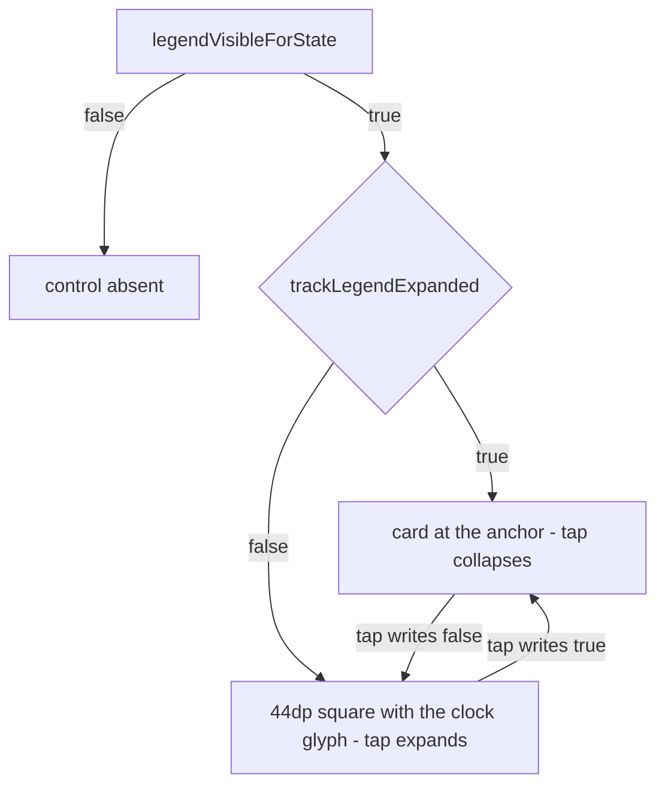

# 260916 — Speed-scale collapse toggle

**Feature:** Tracks · **Branch:** `feature/no-black-casing` · **Status:** shipped 2026-09-16
**Surface:** the speed scale on the map's top-left, below the toggle row

## 1. Request

Make the speed scale interactive: it keeps its display rules exactly as they are today, but it becomes
clickable — tapping it collapses it into one toggle-square button at the anchor it already occupies
(below the GPS square, on the row's gutter), and tapping that square expands it again. The collapsed
square follows the row's own toggle rendering with the ⏱ glyph and carries no active state, since
"active" is the scale being open. The collapsed-or-expanded value is persisted and permanent.

## 2. Decisions settled 2026-09-16

- **D1 — Two faces, one control.** Expanded is today's card, geometry untouched. Collapsed is one
  `TOP_TOGGLE_SQUARE` square built from the row's own recipe (`ui.map.toggle.square`,
  `.corner.radius`, `.icon.size`), painted with the row's inactive fill
  (`ui.map.toggle.inactive.background`, i.e. `ui.map.surface.inactive` at its own weight) and its dim
  glyph (`ui.map.toggle.inactive.icon.alpha`). No new palette key: this is what that family is for.
- **D2 — The card replaces the square.** While expanded the square does not exist, so there is no
  active styling anywhere — "active" is the card itself being on screen. The control therefore never
  shows two things at once.
- **D3 — The whole card is the collapse target.** No chevron handle, no separate affordance: the
  44 × ~150 dp card is one tap surface.
- **D4 — One persisted boolean.** New non-null `AppSettings.trackLegendExpanded: Boolean = true`, key
  `track_legend_expanded`, read with default `true`. An unwritten key means expanded, which is today's
  behaviour, so nothing migrates. Non-null is deliberate: `trackSelectionBanded` needed `contains()`
  because `null` meant "mirror the mode", and there is no third state here — the save chain already
  writes every non-null field unconditionally.
- **D5 — Glyph ⏱ (U+23F1 + U+FE0F), amended 2026-09-16.** The stopwatch is the instrument a tachymeter
  is engraved on, so it names the reading; the first choice, 🕛 (U+1F55B), was `Emoji_Presentation=Yes`
  and needed no selector, but it reads as noon, i.e. a time of day. U+23F1 is the opposite trade —
  `Emoji_Presentation=No`, so the U+FE0F selector is what asks for the colour emoji beside the row's
  four, and the thin text-style fallback that class can take, the very reason ⏲ was retired earlier the
  same day, is accepted on the user's own call.
- **D6 — The gate is untouched.** `legendVisibleForState` keeps deciding whether the control exists at
  all; the persisted flag decides only which face it wears. Shown faces: card when
  `allowed && expanded`, square when `allowed && !expanded`, nothing otherwise.

## 3. Shape

Both faces take the identical anchor expression the call site already has: start
`landscapeDashboardWidth + TOP_TOGGLE_GUTTER`, top `legendTopOffset(chromeTopInset(isLandscape))`, so
the square lands with the GPS square's left edge and the row's own 6 dp gap below it. No new geometry
constant, no new token.

## 4. Implementation steps

1. `SettingsManager.kt` — add `trackLegendExpanded: Boolean = true` to `AppSettings` with a KDoc
   stating the unwritten-means-expanded rule; add `KEY_TRACK_LEGEND_EXPANDED = "track_legend_expanded"`;
   read it as `prefs.getBoolean(KEY_TRACK_LEGEND_EXPANDED, true)`; add the write to the save chain
   beside `KEY_TRACKS_VISIBLE`.
2. `MapControls.kt` — add the collapsed face beside the other row squares: a 44 dp box on
   `TOP_TOGGLE_CORNER_RADIUS`, filled with `uiMapToggleInactiveBackground` at alpha 1, its glyph at
   `uiMapToggleInactiveIconAlpha`, `.clickable(onClick)`, and a `contentDescription` from a new string.
3. `TrackSpeedLegend.kt` — take `onToggle: () -> Unit` and apply `.clickable(onClick = onToggle)`
   inside the existing `.clip(...)` so the ripple is bounded by the card's corner, plus the same
   `contentDescription`. Content, ramp, ticks and labels stay untouched.
4. Strings — two new EN + FR pairs in `res/values/strings.xml` and `res/values-fr/strings.xml`:
   collapse and expand phrasings of "speed scale", i.e. what the tap will do, not the current state.
5. `MapScreen.kt` — replace the `if (legendVisible) { … }` block with the two-face branch on
   `appSettings.trackLegendExpanded`, both arms on the existing anchor modifier, each writing its new
   value through `viewModel.updateSettings { it.copy(trackLegendExpanded = …) }` — the same call the
   drawer eye already uses one screen above.
6. The gate was to stay the only guard. This step first added a named `legendFaceExpanded(allowed,
   expanded)` predicate beside `legendVisibleForState`, and the remediation hop deleted it: the branch
   already tests `legendVisible`, so its `legendAllowed` arm was dead and the two cases pinning it
   asserted a state the wiring cannot produce. The face is now a plain read of
   `appSettings.trackLegendExpanded` inside the existing guard — a persisted boolean carries no
   argument-order risk for the pinning convention to protect against.
7. Build + scoped tests: `apk-build.bat`, then the scoped `ui.map` + `config` run. It came back fully
   green at 128 tests, so the drift reds this step assumed do not appear — see §9 for what that means.
8. Device check: the ⏱ glyph's weight beside the row's four, and that the selector really yields the
   colour form rather than the thin one; the square's exact landing under the GPS
   square in both orientations; collapse and expand by tap; the value surviving a restart; the gate
   interplay (hide on mode change, keep the collapsed face when the gate reopens).
9. Docs and feature file — note the collapsed face as the toggle recipe's fifth consumer in
   `docs/ui-component-guidelines.md`, and add this plan to `## Docs` in `FEAT_DSC_Tracks.md`; the
   `## Implemented` entry follows the change itself.

## 5. Files

- `app/src/main/java/ykws/android/maro/data/settings/SettingsManager.kt` — the field, its key, its read and its write
- `app/src/main/java/ykws/android/maro/ui/map/MapControls.kt` — the collapsed square on the row recipe
- `app/src/main/java/ykws/android/maro/ui/map/TrackSpeedLegend.kt` — the card becomes the collapse target
- `app/src/main/java/ykws/android/maro/ui/map/MapScreen.kt` — the two-face branch at the existing anchor
- `app/src/main/java/ykws/android/maro/ui/map/MapTrackOverlayEffects.kt` — written and reverted: the two-face predicate was added, then deleted by the remediation hop
- `app/src/main/res/values/strings.xml`, `app/src/main/res/values-fr/strings.xml` — the two content descriptions
- `app/src/test/java/ykws/android/maro/ui/map/TrackRenderModePathTest.kt` — two cases added, then deleted with the predicate; the gate's own cases untouched throughout
- `docs/ui-component-guidelines.md`, `xTrack/Tracks/FEAT_DSC_Tracks.md` — the recipe consumer and the plan pointer

## 6. Reversal record

Item 8 of the 2026-09-14 render-modes walk resolved the legend's control question as **"Its own
control — dropped with the choice"**, alongside an auto-dismiss; the legend has since gained the eye as
a trigger and now gains a collapse toggle. This plan revives reading 4 of that item, so the walk line is
superseded by this file rather than left standing — the same treatment the 2026-09-15 casing item got.

## 7. Verification

- The gate is unchanged in behaviour, and `TrackRenderModePathTest` ends where it began: every case it
  asserted passes verbatim, and the two cases the first pass added for the face predicate went with it,
  so the class is back at its original 15 and the scoped run at 126 where the first pass reported 128.
- The expanded face is pixel-identical to today: same file, same modifier, same content.
- The expanded face takes the tap over its whole 44 × ~162 dp card, which is D3's intent. Two costs come
  with it: a drag starting on the card no longer pans the map, and the merged semantics turn the card
  into one node carrying the collapse description instead of readable tick values.
- Persistence: the first tap writes the key and a restart reads it back. The read defaults to `true`, so
  an untouched install shows the card — but the save chain also lands the key at that default on any
  later settings write, which is why only the eye's field is guarded by `contains()`, and exactly what
  D4 accepted when it chose a non-null field over the eye's nullable shape.

## 8. Not in scope

- No change to the ramp, the tick table, the labels or the banded-stroke planner.
- No new palette key: the square reuses `ui.map.toggle.*` and `ui.map.surface.inactive` as they are.
- No auto-dismiss, no memory of the state per track or per mode, and no second surface (menu, drawer or
  Settings) to reach the toggle.
- The screen-lock behaviour is inherited: the scrim sits above the control, so neither face is reachable
  while locked, exactly as today.

## 9. Open points

- The collapsed square is an affordance nobody can decode at first sight, since it hides the only
  explanation of the scale; the default-expanded decision and the permanence of the flag are the
  mitigations, and a first-run hint is explicitly out of scope.
- Whether the collapse should also be reflected in the drawer eye or the menu switch is not asked and
  not answered here — one control, one writer.
- The scoped run came back fully green, so the drift reds this plan first blamed on
  `HeatmapRampPropertiesTest` are not there: that class holds eight cases in the `config` package and
  passes 8/8, while `MarkerFilterMigrationTest` and `RegulationAggregatorTest` sit outside both scoped
  filters and were not run — the sentence was stale when written, and the reds' current home is
  unverified.
- The collapsed square hides the only explanation of the scale, so the device run should judge whether
  the stopwatch glyph reads as "the speed scale" without a first tap; a first-run hint stays out of scope.

## 10. Ask-hop findings and dispositions

The `#implement` Ask pass returned eight findings. Two are open remediation candidates, four are
comment- or doc-level, one is accepted as pattern-following, and one was a stale plan claim corrected
above.

- **F1 — Medium — the predicate's gate arm is dead at its only call site.** `MapScreen.kt` already
  guards with `if (legendVisible)`, so `legendFaceExpanded` can never receive `legendAllowed = false`,
  and the false-gate cases in `TrackRenderModePathTest` pin a state the wiring cannot produce.
  **Closed by the remediation hop:** the predicate went outright rather than having its parameter
  dropped, a one-boolean function deciding nothing, and the branch reads the persisted value inside the
  existing guard. The total three-way face type was weighed and rejected — a new type for a two-way
  branch whose gate already exists.
- **F2 — Medium — the card's tap surface and its merged semantics.** The card is roughly four row
  squares in area, so it captures more of the map's gestures, and the tick labels stop being individual
  accessibility nodes. **Accepted and recorded in §7**, with a tap-only pointer handler and a semantics
  split as the two repairs if the device run shows either cost matters.
- **F3 — Low-Med — the stale drift-red claim.** Corrected in §9.
- **F4 — Low — the anchor chain is duplicated across the two arms.** The identical `.align` and
  `.padding(start, top)` chain is copy-pasted, so "verbatim anchor" is held by hand and one arm's edit
  would silently misalign the faces. **Closed:** one `legendAnchor` value is built in the Box scope
  where `align` resolves, taken bare by the square and with `.width(TOP_TOGGLE_SQUARE)` by the card.
- **F5 — Low — `LegendToggleButton` is the fifth copy of the row's square.** No shared square exists, so
  the new face follows the pattern rather than reusing it. **Accepted:** extracting one is a refactor
  outside this task, logged as a post-task suggestion.
- **F6 — Low — "the row's one inactive fill" is not one rendering.** The GPS DEMO branch matches, but
  the lock square alphas its whole box and the recenter square hardcodes its own blue, so the KDoc's
  one-recipe claim is true of one branch alone. **Closed:** the KDoc now names the GPS DEMO branch as
  its model and gives both counterexamples, and the guidelines paragraph gained the same two halves.
- **F7 — Low — two statements did not match the code.** The call-site comment's "only the width differs
  between them" means the anchors rather than the faces, and the plan's untouched-key claim is corrected
  in §7. **Closed:** the call-site comment now says the arms share one anchor and differ only in the
  width the card asserts over the square's own size.
- **F8 — Info — the token comments still count four boxes** while `docs/ui-component-guidelines.md`
  calls the square the recipe's fifth consumer. **Closed:** both `colors.properties` comments were
  corrected, and a second sweep took the four same-class spots the first hop left standing — the
  properties file's shared-surface comment, `AppConfig`'s accessor KDoc, both `color-scheme.md` rows and
  the guidelines paragraph — each now naming the five readers rather than a count that drifts.

Verified sound by the same pass, so they stay as shipped: the gate's three functions carry no new
parameter and no body change, the expanded face gained only non-layout modifiers, the setting's read and
write sit where the plan put them, and the new field is absent from the overlay rebuild keys, so a tap
cannot rebuild the tracks layer.

- **Amended after the pass, 2026-09-16 — the glyph.** D5's first pick, 🕛, was swapped for ⏱ written
  `\u23F1\uFE0F` on the user's call, on the reading that a tachymeter is a stopwatch bezel and the clock
  face says noon instead. The change is one string literal and its KDoc in `LegendToggleButton`, nothing
  else in the composed control moving; `apk-build.bat` SUCCESS in 3 s with 4 tasks executed. This
  deliberately reinstates the glyph class ⏲ was retired on, so the thin fallback is the one thing the
  device glance has to settle.
- **Remediation and sweep, 2026-09-16.** Two Code hops closed F1, F4, F6, F7 and F8, then the four
  same-class comment spots the first of them left standing. No behaviour changed and no palette key was
  touched: `apk-build.bat` came back SUCCESSFUL in 7 s and 2 s, and the scoped run is green at 126
  cases — the first pass's 128 minus exactly the two the deleted predicate owned. F2 stays accepted as
  §7 records it and F5 stays a post-task suggestion.
