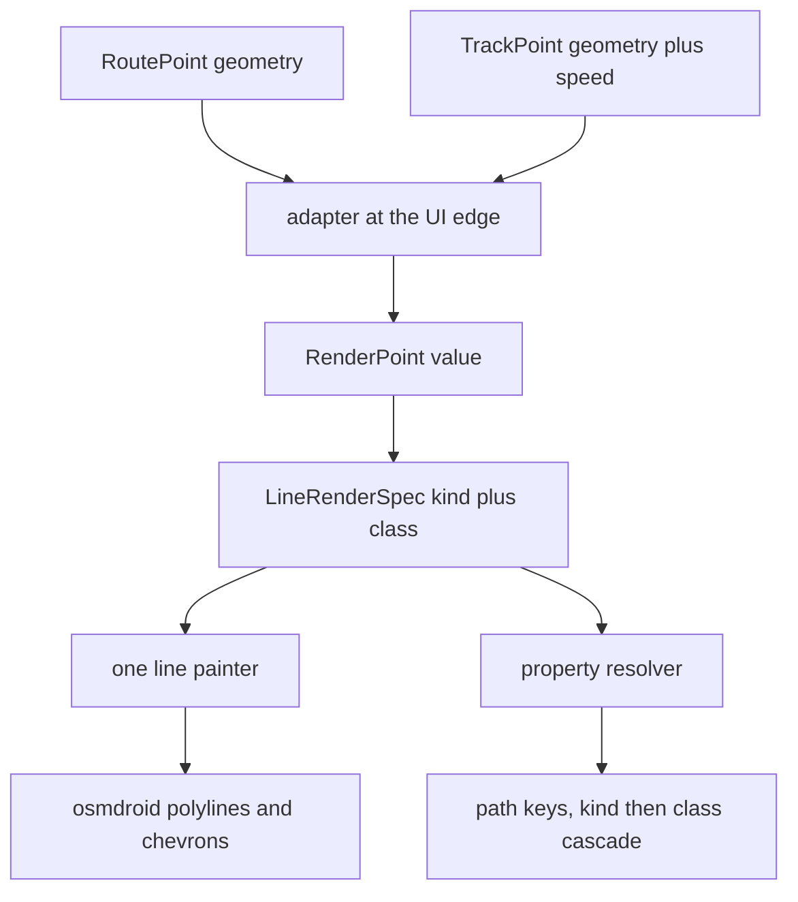

<!-- scope: feature -->

# Path render engine — one painter for tracks and routes

**Status:** shipped on `feature/tracks-rotes-norm`, uncommitted — the engine, the contract, the painter, the two migrations, the guards and the record all landed; the device pass is owed.
**Branch:** `feature/tracks-rotes-norm`, cut from `origin/develop` with `--no-track` (the issued `#new`). The name is as typed.
**Feature:** Tracks owns the engine; Route and Ui_Settings are consumers.

## Request

Normalise the rendering of tracks and routes so both use exactly the same engine, so every aspect of either kind's rendering is configurable in [`maro.properties`](../../app/src/main/assets/maro.properties). The user set the scope to **full parity**: the live route gains the features it lacks today — chevrons and speed-colour banding.

## Current state (as it stood before the pass — history)

- **Stored tracks and saved routes already share one pipeline** — [`trackRenderPlan()`](../../app/src/main/java/ykws/android/maro/ui/map/MapTrackOverlayEffects.kt:718) → [`storedTrackRendering()`](../../app/src/main/java/ykws/android/maro/ui/map/MapTrackOverlayEffects.kt:928) → [`buildSegmentOverlays()`](../../app/src/main/java/ykws/android/maro/ui/map/MapTrackSegments.kt:54), with chevrons ([`TrackDirectionOverlay.kt`](../../app/src/main/java/ykws/android/maro/ui/map/TrackDirectionOverlay.kt:1)) and the ramp ([`TrackSpeedHeatmap.kt`](../../app/src/main/java/ykws/android/maro/ui/map/TrackSpeedHeatmap.kt:1)).
- **The live route is a second engine** — [`RouteHost.kt`](../../app/src/main/java/ykws/android/maro/ui/map/RouteHost.kt:159) builds its own pool, casing, travelled and provisional polylines plus the destination pin, reading `route.line.*` / `route.dimmed.*` / `route.pin.*`, and drawing no chevrons, dash or bands.
- **Two property readers** — [`AppConfig.init()`](../../app/src/main/java/ykws/android/maro/config/AppConfig.kt:867) reads the asset at runtime; [`app/build.gradle.kts:103`](../../app/build.gradle.kts:103) bakes ~40 keys into `BuildConfig`. The rendering seeds are split across both.
- **Three hardcoded literals** survive the single-structure claim — the selection gold ([`MapTrackOverlayEffects.kt:1000`](../../app/src/main/java/ykws/android/maro/ui/map/MapTrackOverlayEffects.kt:1000), `0xFFFFD700`), the selection casing ([:663](../../app/src/main/java/ykws/android/maro/ui/map/MapTrackOverlayEffects.kt:663), `0xCC000000`) and the pin's white ring.

## Decisions

- **D1 — the seam is a value type, not an interface.** The painter needs data, not polymorphism, so a neutral `RenderPoint` (lat/lon/speed?/bearing?/break) and one `LineRenderSpec` are adapted to at the UI edge; `RoutePoint` and `TrackPoint` stay pure domain models and implement nothing. Layering (§2) forbids a domain-implemented rendering interface, and interface segregation would expose the whole domain for five fields.
- **D2 — one painter.** `storedTrackRendering` and the segment builders collapse behind one pure entry point taking a `LineRenderSpec` and returning overlays. The stored-track loops migrate first with no behaviour change, then the live route.
- **D3 — the plan carries the role.** `TrackRenderPlan` generalises to a kind-agnostic `LineRenderPlan` carrying the role; the legend gate and every reader follow.
- **D4 — the property root is `path.*`, with two override axes.** The **kind** prefixes (`path.track.*`, `path.route.*`) and the **class** qualifies (`live` | `selected` | `newest` | `history` | `pinned` | `casing` | `dimmed`). Segment order is kind then group then class then value; a class is never named after a kind.
- **D5 — precedence, most specific first:** `path.<kind>.<group>.<class>.<leaf>` → `path.<group>.<class>.<leaf>` → `path.<kind>.<group>.<leaf>` → `path.<group>.<leaf>` → the code default. **Class outranks kind** (a pinned route reads pinned first), settled by the user. The precedence is documented once in the file header, since a kind override can be beaten by a common class value.
- **D6 — runtime reading only.** The `path.*` emissions leave the build script so gradle and the app cannot fork; only pre-init values stay in `BuildConfig`. R42's unreadable-colour report moves from the `UNREADABLE_COLOUR_KEYS` field to the runtime colour parser.
- **D7 — only the heatmap *definition* is common.** The ramp — families, scale ticks, scale minimum, the unknown tint — carries no per-kind override; its `enabled` leaf **does** cascade across the three tiers like the arrows' does. The numbered-family question stays moot, the on/off switch does not.
- **D8 — the hierarchy is file-level.** The Settings screen does not gain a hierarchy view; no Settings UI pass.
- **D9 — the docs move with the file.** The four doc edits are owed to the implementation pass, never applied ahead of it, since the docs must follow the file.
- **D10 — the live route's lines are rebuilt; the pin stays attach-once.** Speed banding yields a stroke count a fixed pool cannot hold, so `RouteHost` tears its `route_*` line overlays down and re-adds the painter's output on each pass, while the destination pin — a marker, cheap to keep — is created once and mutated in place. The painter therefore keeps returning **overlays** rather than raw contents, which is what lets the stored loops and the live route share one function; the `OverlayZOrder` prefix titles ride on the rebuilt overlays, so the route tier's ordering is unchanged. The kind-agnostic door the painter exposes for this is `lineRendering(spec: LineRenderSpec, …)` (S9a), read by the stored loops and by `RouteHost` alike.
- **D11 — the live route's per-point speed comes from the plan's leg times.** A route has no stored speed, so its chevrons and its speed bands would read neutral; the seam derives each point's speed from the leg it leaves (its haversine length over the leg's seconds), and a plan whose legs do not line up — a partial or draft plan — yields a neutral speed rather than a wrong one.

## Property contract

```text
# ══════════════════════════════════════════════════════════════════════
# ▐▌ PATH — the boat's lines, taken or planned
# ══════════════════════════════════════════════════════════════════════
#     Set a value once here; a kind may override it under path.track.* or
#     path.route.*. Most specific first: path.<kind>.<group>.<class>.<leaf>,
#     path.<group>.<class>.<leaf>, path.<kind>.<group>.<leaf>,
#     path.<group>.<leaf>, then the code default. A class is never named
#     track or route. Widths and dashes are dp; fades run 0 opaque to 100
#     invisible; colours are #AARRGGBB. The heatmap group is common.

# ── path.line.* — the stroke
path.line.width.live=4                    # the live line
path.line.width.selected=3.3333333        # the selected line, either kind
path.line.width.newest=3.6666667          # the newest stored track
path.line.width.history=2.6666667         # every other stored track
path.line.width.pinned=3                  # a pinned item
path.line.casing.width=5.3333335          # the selected line's under-stroke
path.line.casing.color=#CC000000          # its colour
path.line.casing.darkenPct=30             # how far a user colour's edge is darkened
path.line.dash.on=8.0                     # route dash, drawn length
path.line.dash.off=2.0                    # route dash, gap length
path.line.color.from=#FF1565C0            # the set's pair, from newest
path.line.color.to=#FF0000FF              # the set's pair, to oldest
path.line.color.pinned.from=#FFFF6F00     # the pinned pair, from
path.line.color.pinned.to=#FFFF8F00       # the pinned pair, to
path.line.color.selected=#FFD700          # the selection gold, a key now
path.line.color.live=#FF2ECC71            # the followed line's own colour
path.line.fade.from=20                    # the set's fade, from newest
path.line.fade.to=80                      # the set's fade, to oldest
path.line.fade.pinned.from=0              # the pinned fade, from
path.line.fade.pinned.to=20               # the pinned fade, to
path.line.fade.live=15                    # the followed line's own transparency
path.line.fade.dimmed=55                  # the candidate lines' shared dimming

# ── path.arrow.* — the direction chevrons
path.arrow.enabled=true
path.arrow.speedFloorKn=3.0
path.arrow.speedCeilingKn=35.0
path.arrow.minSpacingDp=32
path.arrow.maxSpacingDp=400
path.arrow.scaleKnee=3.3333333
path.arrow.temper=0.5

# ── path.heatmap.* — the speed ramp, common to both kinds
path.heatmap.enabled=true
path.heatmap.familyN.maxKn=...            # ceiling of band N
path.heatmap.familyN.from=#...            # band N colour at its floor
path.heatmap.familyN.to=#...              # band N colour at its ceiling
path.heatmap.familyN.stepKn=...           # draw step inside band N
path.heatmap.unknown.color=#F5F5DC
path.heatmap.scaleTicks=7:5,13:10,22:20,30:30,35:35
path.heatmap.scaleMinKn=2

# ── path.* — the rest
path.count=5                              # how many items of one kind are drawn
path.gate.speedColor=false                # a route bands only while this and the chip are on
path.gate.speedArrows=true                # a route shows chevrons only while this and the chip are on
path.pin.color=#FF2ECC71
path.pin.ringWidthDp=3
```

Override examples, with the resolution trace:

```text
path.line.width=3.0                       # the common stroke
path.route.line.width=4.0                 # the route kind's own

resolve width, kind=TRACK, class=none      -> path.line.width              3.0
resolve width, kind=ROUTE, class=none      -> path.route.line.width       4.0

path.line.color.pinned.from=#FFFF6F00     # the common pinned pair
path.route.line.color.from=#FF2ECC71      # the route pair

resolve color.from, kind=ROUTE, class=pinned
  1 path.route.line.color.pinned.from  absent
  2 path.line.color.pinned.from        #FFFF6F00   <- class beats kind
  3 path.route.line.color.from         #FF2ECC71
  4 path.line.color.from               #FF1565C0
```

## Seam shape



- The route spec is built from a `RoutePlan` (points **plus leg times**), not bare `RoutePoint`, because a per-point speed has to be derived for the chevrons and the ramp.
- The painter returns **overlays** — the decision D10 records — so the stored loops and `RouteHost` share one function; the live route's lines are rebuilt on each pass while the destination pin stays attach-once.

## Steps

1. **S0 — the branch.** `feature/tracks-rotes-norm` from `origin/develop`, `--no-track`; run from Code.
2. **S1 — baseline.** `apk-build.bat` plus the scoped `ui.map` + `config` + `spatial` suite; record the known reds (the parked `route.avoid.fine.cellRatio` red, two `TrackOutlineTest` dash reds).
3. **S2 — the seam.** Write `RenderPoint` and `LineRenderSpec` with `PathKind { TRACK, ROUTE }`, and the `RoutePlan`/`TrackPoint` adapters.
4. **S3 — the contract.** Write the `path.*` block into the file with its header rule, add the selection gold, casing colour and pin-ring colour keys, and pin the leaf shape.
5. **S4 — the resolver.** One `AppConfig` resolver building the four candidates and falling through to the default.
6. **S5 — one reader.** Drop the `path.*` build fields, read the family at runtime, move R42's report to the runtime parser, and verify the asset still repackages.
7. **S6 — the painter.** Collapse `storedTrackRendering` + `MapTrackSegments` behind one pure entry point taking a `LineRenderSpec`.
8. **S7 — the plan.** Generalise `TrackRenderPlan` to `LineRenderPlan`; update the legend gate and every reader.
9. **S8 — stored tracks.** Migrate the history, route and pinned loops; confirm the output is unchanged.
10. **S9 — the live route.** Migrate `RouteHost` onto the painter once attach-once versus rebuild is recorded; keep the pin and the `OverlayZOrder` titles.
11. **S10 — parity.** Derive route speeds from the leg times so chevrons and banding run on the live line; the route dash reads its own rhythm.
12. **S11 — the rename.** Reconcile with the shipped `map.track.*` / `route.*` roots, one home per fact.
13. **S12 — the rebuild keys.** Cover both kinds.
14. **S13 — tests.** Painter and plan purity, the appearance and fade maths, the resolver at each precedence level, a both-kinds-equal case, and the properties guard.
15. **S14 — the docs.** `docs/maro-code.md`, `docs/color-scheme.md`, `docs/ui-component-guidelines.md`, `docs/ui-drawer-guidelines.md`, and the three feature `## Docs`.
16. **S15 — build and scoped suite**; the device pass stays the user's.
17. **S16 — the record.** `## Implemented` pointers, then `#bake`.

## Risks

- **The live route changes model** from attach-once to rebuild unless the painter returns contents; the pin and the `OverlayZOrder` prefix titles are the regression surface.
- **The resolver hides provenance**; the file header's one statement of the precedence is the mitigation.
- **The rename is wide** — nearly every rendering key moves — so the pass is mechanical and needs a grep guard for old literals.
- **Deriving route speed** depends on the leg times being present on every plan; a partial or draft plan must yield a neutral speed rather than a wrong one.

## Verification

- `apk-build.bat` clean and the scoped `ui.map` + `config` + `spatial` suite green, no properties test skipped.
- A test proves both kinds paint identically for one spec, and the resolver's four precedence levels are each pinned.
- A grep after the pass finds zero old key literals outside historical plans.

## Out of scope

- The Settings screen shows no hierarchy (D8); the hierarchy is a file structure only.
- No change to the `map.navigation.*` arrow and direction line, which are not path lines.
- No new dependency; no file deleted or renamed beyond the key renames; no commit, push or deploy.

## Outcome (2026-10-07)

Shipped on `feature/tracks-rotes-norm`, uncommitted; S0–S16 all ran.

- **The engine** — the seam is values in [`LineRenderSeam.kt`](../../app/src/main/java/ykws/android/maro/ui/map/LineRenderSeam.kt:23): `RenderPoint`, `LineRenderSpec` and `PathKind`. The render core (segment builder, band grouping, chevron overlay) and the dispatcher read `RenderPoint`, and the stored loops and inspect mode feed `.toRenderPoints()`.
- **The contract** — [`maro.properties`](../../app/src/main/assets/maro.properties:408) carries one `path.*` family with the kind prefix and the class qualifier; [`AppConfig`](../../app/src/main/java/ykws/android/maro/config/AppConfig.kt:2164) resolves the four candidates through [`PathProperties.kt`](../../app/src/main/java/ykws/android/maro/config/PathProperties.kt:46); the `path.*` build-field emissions left [`app/build.gradle.kts`](../../app/build.gradle.kts:133) and the family is read at runtime, R42's unreadable-colour report moving with it.
- **The plan type** — `TrackRenderPlan` / `TrackRenderPath` / `trackRenderPlan` are `LineRenderPlan` / `LineRenderPath` / `lineRenderPlan`.
- **The live route** — [`RouteHost.kt`](../../app/src/main/java/ykws/android/maro/ui/map/RouteHost.kt:331) builds its pool, derived casing, travelled run and provisional line through the painter, keeps the destination pin attach-once and every `OverlayZOrder` title, and gains leg-derived speed, chevrons and speed-colour banding.
- **Validation** — `apk-build.bat` green; the scoped `ui.map` + `config` + `spatial` suite at 653 tests, one parked red (`route.avoid.fine.cellRatio`) and two skipped. The device pass is the user's and is owed.
- **Guards repaired** — the rename and the point move had left twelve reds across `TrackSpeedHeatmapTest`, `HeatmapRampPropertiesTest`, `TrackOutlineTest`, `MapTrackSegmentsTest` and `TrackDirectionOverlayTest`; all are green, and the route dash's code default was aligned to the file's 8 / 2.

## Speed and arrow display — the next normalisation (shipped 2026-10-07)

The user's requirement: one global property per axis, a distinct setting per kind, per-line-type overrides, and the master gone.

**Shipped on `feature/tracks-rotes-norm`, uncommitted (2026-10-07).** The settled bullets below are the
built shape: both axes walk the three tiers on one `enabled` leaf, the per-kind pair is the persisted
setting, the `acquisition` class is silent on both axes, `path.gate.*` is retired to the route kind's own
leaves, the Settings surface names each kind, and the drawer eye is a card-local, non-persisted override.
The review findings R1–R5 below stand as written.

- The two axes are **arrows** and **speed colours**; the tiers are global, kind and class, resolved through the same cascade the family already walks.
- Keys: `path.arrow.enabled` / `path.heatmap.enabled` (global), `path.track.*` / `path.route.*` (kind, seeding each kind's setting) and `path.arrow.enabled.<class>` / `path.heatmap.enabled.<class>` (the line-type override).
- Resolution of a line: kind+class → class → the per-kind setting (seeded kind → global). The per-kind leaf **seeds** the setting; the per-class leaf **overrides** it.
- Retired: `path.gate.speedColor` / `path.gate.speedArrows` and the clause that makes the chips master and the route gates vetoes.
- **Settled 2026-10-07:** the two axes are **persisted settings, one pair per kind** — the keys already exist (`track_arrows`, `track_colours`, `route_speed_color`, `route_speed_arrows`), so **no value migrates**; only the meaning narrows, each pair governing its own kind. One visible consequence: an install that had the Colours chip off used to hide a route's colours too, and under the new model only the tracks setting does, so a route may start banding where it did not.
- **Settled 2026-10-07:** a new **class `acquisition`** joins the vocabulary, so the search can be silenced without a bespoke key. The rung under the selection takes `acquisition` while the mode is choosing and `live` once the route is followed, and `path.arrow.enabled.acquisition=false` then silences the search's chevrons through the ordinary cascade, the class leaf outranking the switches. The candidates keep `dimmed`, the derived casing keeps `casing`, and the provisional line stays arrowless — all three already are.
- **Settled 2026-10-07 — the Settings surface splits per kind.** Every appearance and speed-and-direction row for tracks lives in a tracks block and for routes in a routes block, and **no shared control governs both kinds**; a row is named for its own kind. The split is the **surface alone**: the file keeps its global tier, read as the seed each kind starts from rather than as a switch.
- **Settled 2026-10-07 — the count keeps one seed.** The tracks and routes counts already have their own Settings rows and stored keys (`tracking_render_nb`, `tracking_route_render_nb`), each keeping its own written value; only `path.count` seeds both, and it stays a single key, the file's global tier being that seed for both kinds.
- **Settled 2026-10-07 (review R1):** only the heatmap's *definition* is common — the ramp families, the scale ticks, the scale minimum and the unknown tint stay one; the `enabled` leaf cascades across the three tiers exactly as the arrows' does.
- **Settled 2026-10-07 — the scheme adopted:** two axes (`arrow`, `heatmap`) with three tiers on the `enabled` leaf — global → kind → class — the definitions common, the `acquisition` class silent on both axes, and `path.gate.*` retired to `path.route.heatmap.enabled` / `path.route.arrow.enabled`. The axis is *Speed colours* in the UI and `heatmap` in the file, stated once.
- **Settled 2026-10-07 (review R4–R7):** the plan helpers become kind-scoped — `routeLineRenderPlan` and `pinnedLineRenderPlan` read their kind's own axes with no master conjunction, and the drawer's twin box becomes the tracks kind's switches; the eye is hoisted in `MapScreen` as local state keyed on the open id, passed down where `eyeOverride` travels and cleared when the card closes; Ui_Settings owns the per-kind rows (Ui_Menu the drawer's pair if it moves, Route the Routing tab's); and the file header states once that the global and kind tiers **seed** the settings while only the class tier **overrides** at runtime.
- **Settled 2026-10-07:** the drawer eye is a **local override that lives only while that track's dashboard is open** — not persisted, cleared when the card closes, and topmost above the three tiers while it stands. `AppSettings.trackSelectionBanded`, the `track_selection_banded` key and its `contains()` read retire with it; the legend gate must read the same local value or the scale contradicts the stroke. This reverses the 2026-09-15 decision that the value persists.

## Review findings (2026-10-07)

A reading of this plan against the shipped tree, recorded rather than quietly tidied.

- **R1 — the header had gone stale.** Status read *in design, nothing implemented* and the branch *to be cut*, both false after the pass; corrected above.
- **R2 — the Seam-shape bullet contradicted D10.** It claimed the painter returns contents while D10 records overlays; corrected above.
- **R3 — two dead masters.** `path.arrow.enabled` and `path.heatmap.enabled` are declared and loaded but read by nothing, so the file's claimed mastery over the chips is inert — the normalisation above removes it by giving both axes a real cascade.
- **R4 — the step letters collided.** This plan's steps and the executed pass used the same letters for different work; the Outcome above is the executed set.
- **R5 — the baseline was mis-stated.** S1 named three reds; the rename left twelve, now repaired.

### Second pass — the normalisation's Ask hop (2026-10-07)

- **R6 — the legend gate holds a stale eye (medium).** `MapScreen`'s legend gate derives inside
  `remember(appSettings)`, while the eye's state is recreated by `remember(highlightedTrackId)`; the
  retained derivation therefore closes over the discarded state, so flipping the eye on an open card moves
  the stroke and not the scale — the contradiction the eye bullet above was written to avoid. The fix is
  to key the derivation on the eye as well (`remember(appSettings, eyeOverride)`) or to drop it.
- **R7 — the class-override application is untested (low).** `AppConfig.pathArrowEnabled` /
  `pathHeatmapEnabled` and `pathClassBool` are pinned by key shape (`PathKeyCandidatesTest`) and by the
  shipped file, not by a resolution test: the class leaf beating the persisted setting is asserted nowhere.
- **R8 — two parameters kept the old name (low).** `bandedStrokeOnMap` and `legendVisibleForState` still
  name their pair `trackArrows` / `trackColours` though the caller now hands them each id's own kind's pair.
- **R9 — a redundant key read (low).** The rebuild list tests `eyeOverride == true` for the ramp group a
  few lines after `eyeOverride` has already joined the list unconditionally.

### Fix pass — the four findings assessed (2026-10-07, planned, not built)

- **R6 — take it.** One line: key the legend derivation on the eye as well
  (`remember(appSettings, eyeOverride)`), so the retained state is rebuilt whenever the eye moves and the
  scale can no longer disagree with the stroke. It is a regression this pass introduced, so it is the one
  finding that must ship.
- **R9 — take it while in the same pass.** Drop the redundant `|| eyeOverride == true` arm: `eyeOverride`
  already joins the rebuild list unconditionally three lines above, so the arm changes nothing.
- **R8 — take it or park it.** Renaming `bandedStrokeOnMap`'s and `legendVisibleForState`'s pair to
  `arrowAxis` / `coloursAxis` makes the file honest about the values now arriving per id; it touches the
  two functions and the tests that name those arguments, so it rides the same pass or waits.
- **R7 — park it with the reason.** A resolution test needs the retained `Properties` bag, which only
  `AppConfig.init` fills; pinning it means either an init-backed test or a seam that takes the bag. The
  key shapes and the shipped file are already pinned, so the uncovered half is the three-line `?: setting`
  application — recorded rather than bought.
