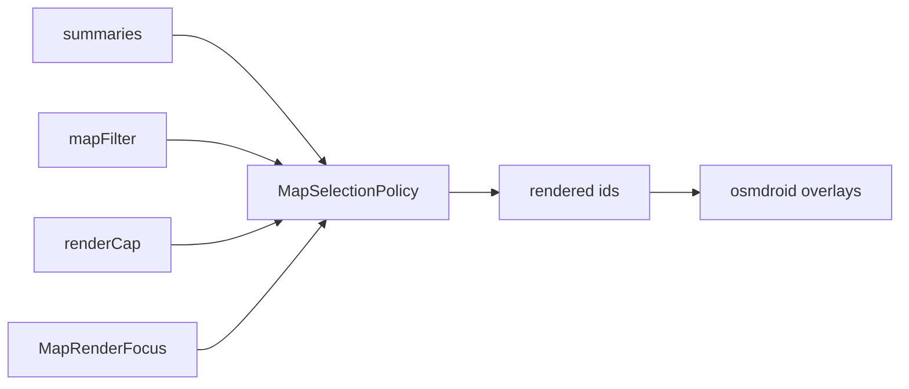

# FEAT_PLN — Map render visibility refactor (tracks + markers)

- **Feature:** TracksImport
- **Branch:** `feature/tracks-import`
- **Date:** 2026-09-11
- **Status:** IMPLEMENTED (2026-09-11) — see §11 for the outcome and deviations
- **Type:** defect fix + design refactor

---

## 1. Problem statement

**Observed:** an imported track appears in the track list but is **not drawn on the map**. It becomes visible only when the user opens/selects it, or pins it.

**Mechanism (verified in code):** the map history set mixes *derived* and *persisted* state:

- `MapTrackOverlayEffects.kt:60-77`
  - eligibility: `summary.matchesFilter(appSettings.trackMapFilter, midnight)` — derived, correct;
  - gate: `filter { (it.visibleOnMap || it.id == highlightedTrackId) && !it.pinned }` — **persisted flag**;
  - order: `sortedByDescending { it.startTimeMs }`; cap: `take(tracking.render.nb)`;
  - `pinned` bypasses the cap via a separate block; `highlightedTrackId` bypasses the gate.
- `Track.visibleOnMap` (`Track.kt:38`, `@ProtoNumber(11)`) and `TrackSummary.visibleOnMap` (`Track.kt:68`, `@ProtoNumber(8)`) persist on the object and therefore inside the `<maro:data>` blob; import copies it verbatim (`GpxImporter.kt:151`).

**Why it is a defect:** the field is a **dead remnant with no owner and no lifecycle**:

- nothing in the current code writes `false`; every writer sets `true` (`TrackRecorder.kt:1082`, `TrackMerger.kt:147`, `TrackRecordingService.kt:335`);
- there is **no UI toggle now** — but there *was*: `branch_history.txt:127-128` shows the eye toggle, and §1.4 of `xTrack/BoatTrace/FEAT_DOC_BoatTrace_decisions.md` documents it as the "hide individual tracks" feature;
- it was **superseded but never removed** — `xTrack/BoatTrace/260622_FEAT_PLN_BoatTrace_pinned-tracks.md:68` ("replace with `pinned`"); `pinned` shipped, the flag and its gate stayed;
- a `false` reaching the app from legacy/imported data **silently suppresses rendering** with no user-recoverable path.

**Principle:** visibility is a **projection** — a pure function of track data + filters + view state. It must not be persisted on the entity. Hiding a track is a **filter-layer** concern, not a property of the track.

---

## 2. Marker parity check

**Markers do not have this defect — they are the reference pattern.**

- `UserMarker` (`data/model/markers/UserMarker.kt:32-49`) has **no** visibility flag; its booleans are semantic (`confirmed`, `keepable`, `pinned`).
- Marker map set is already pure: `_mapMarkers = allMarkers.filter { it.matchesFilter(markerMapFilter) }` (`MarkersViewModel.kt:259-261`).
- Markers are **not coupled** to their owning track's rendering: `trackId` is used only for lifecycle (cascade delete `TrackRepository.kt:87-99`, merge re-parenting `TrackViewModel.kt:337-341`) and UI ("belongs to track" row + chevron, `MarkerDrawer.kt:233-235`).
- Counters are independent: track badge `MapScreen.kt:1491-1495` vs marker badge `mapMarkersState.size` (`MapScreen.kt:1538`).

**Consequence:** tracks are the outlier; the refactor makes tracks match markers, and (decided) extracts the shared policy so they cannot drift again.

*Asymmetry kept deliberately:* tracks carry a render **cap** (polyline performance); markers do not.

---

## 3. Target design

```
renderedIds = select(items, filter, cap, focus, nowMs)
```

Nothing about "is drawn" is stored. Three orthogonal concerns:

1. **Eligibility** — derived from the existing filter (`matchesFilter`); unchanged.
2. **Ranking + cap** — salience order, then `take(cap)`:
   **focus → session-boosted → `startTimeMs` desc, tie-break `lastPointTimeMs` desc**.
3. **Focus** — view state, in memory only:
   - `highlightedTrackId` (exists);
   - `recentlyTouchedIds` (new, session-scoped): ids touched by import / record / merge / update.



**Why this fixes the bug by construction:** a freshly imported track joins `recentlyTouchedIds`; the selector always includes focus ids, so no persisted flag and no "force true" hack is needed.

---

## 4. OO refactor — responsibilities

| Type | Kind | Responsibility | Change |
|---|---|---|---|
| `Track` | domain entity | the trip only | **remove** `visibleOnMap`; keep `pinned` |
| `TrackSummary` | read model | list + map projection data | **remove** `visibleOnMap` |
| `UserMarker` | domain entity | marker only | unchanged (reference) |
| `ListFilter` + `matchesFilter` | policy | eligibility predicate | unchanged |
| `MapRenderFocus` | view state | `highlightedId`, `recentlyTouchedIds`; `focus(id)`, `markTouched(id)`, `clearBoost()` | **new** |
| `MapSelectionPolicy<T>` | policy interface | `select(items, filter, cap, focus, now): List<T>` | **new — decided** |
| `TrackSelectionPolicy` | policy impl | ranked + capped selection | **new** |
| `MarkerSelectionPolicy` | policy impl | filter-only selection (no cap) | **new** |
| `MapTrackOverlayEffects` | imperative shell | apply selection to osmdroid overlays only | **slim to a shell** |
| `TrackViewModel` | app service | owns focus; marks touched on import/record/merge; clears boost on reset | **edit** |
| `MarkersViewModel` | app service | routes selection through the shared policy | **edit** |

Design intent: the **policy** owns "what the map draws"; shells only execute. Tracks and markers share the shape so the two cannot drift.

---

## 5. Protobuf + migration

- Stop reading **and** writing `visibleOnMap`.
- **Reserve permanently, closed-forever:** `@ProtoNumber(11)` on `Track`, `@ProtoNumber(8)` on `TrackSummary`.
  - Rationale: `Track` blobs live inside user-held GPX files — unenumerable and therefore unmigratable, so the tag can never be reused. The index tag is internal but reserved for uniformity/safety.
  - Cost of a hole: **zero** (no field, no bytes, no memory). The only cost is a comment.
  - Convention precedent: `BoatMarker.kt:61` (reserved field 8) and `TrackPoint.kt:23` (already non-contiguous: `1,2,3,4,5,15,10,11`).
  - Enforcement: a **comment** (`// 11 reserved — was visibleOnMap; never reuse`) plus a **legacy-blob decode test**.

---

## 6. Task breakdown (staged)

### Stage 0 — symptom fix (optional quick win) — implemented then REMOVED, see section 11
1. On single-track import, set `highlightedTrackId` to the new id (and optionally pan to its bbox).

### Stage 1 — defect removal
2. Remove `visibleOnMap` from `Track` and `TrackSummary`; add the reservation comments.
3. Delete the writes: `TrackRecorder` finalize, `TrackMerger`, `TrackRecordingService` resume.
4. Delete the copies: `TrackRepository` summary build, `OverlayLayer` drawer summaries.
5. Update the menu counter: `MapScreen.kt:1494-1495` → `!isLive && matchesFilter(...)`; update its comment.
6. Update the KDoc at `TrackViewModel.kt:180-181`.

### Stage 2 — structure
7. Add `MapRenderFocus` (in-memory: bound, ephemeral, never overrides layer toggles).
8. Add `MapSelectionPolicy` + `TrackSelectionPolicy`; port the ranking/cap order.
9. Add `MarkerSelectionPolicy`; route `MarkersViewModel` through it (no behaviour change).
10. Call the policy from `MapTrackOverlayEffects`; keep overlay add/remove and the GAP solid/dashed split in the shell.
11. Mark touched on import / record / merge / update; clear the boost on track-filter **reset**.

### Stage 3 — verification
12. Tests (see §7) + on-device check.

---

## 7. Tests

**Pure policy tests** (`MapSelectionPolicyTest`, no device, no IO):
- empty filter + count < cap ⇒ all eligible drawn;
- cap boundary ⇒ newest by `startTimeMs` kept; ties broken by `lastPointTimeMs`;
- focus id overrides cap **and** filter;
- session-boosted ids included even when the filter excludes them;
- **boost cleared** by the track-filter reset (map reset; list reset when `trackFilterLinked`);
- pinned excluded from the capped history set (drawn by the pinned path);
- `isLive` exempt from the date axis;
- markers: filter-only selection, no cap.

**Rendering regression (decided, added at Point 6):**
- GAP/dash split: a track containing `PointType.GAP` still renders solid segments + dashed gap segments after the policy refactor;
- empty/one-point tracks are skipped as today.

**Import regressions:**
- import a track with an **old** `startTimeMs` ⇒ it is in the rendered set without selecting or pinning;
- import a GPX containing a legacy `visibleOnMap=false` ⇒ rendering unaffected (field ignored);
- **legacy blob decode**: the existing `2026_09_06_15_52-Iles_de_Lerins_+_Bouée_à_4.gpx` (contains field 11) still decodes; guards against tag reuse.

---

## 8. Decisions

- **D1 — DECIDED:** the cap ranks by **`startTimeMs` desc**, tie-break **`lastPointTimeMs` desc** (keeps filter + list sort + auto-name on one definition of a track's date). Rationale: filter uses `startTimeMs` (`ListFilter.kt:64-67`), list default sort `CREATED` ≡ `startTimeMs` (`ListSortOrder.kt:50`, `Track.kt:80`), auto-name is the start timestamp.
- **D1a — DECIDED (addendum):** a **session boost** applies to `recentlyTouchedIds`, cleared when the **track-filter reset** is hit — the **map** reset, or the **list** reset when `trackFilterLinked` is true. Individual axis changes keep the boost. `highlightedTrackId` is unaffected by invalidation.
- **D2 — DECIDED:** no per-item hide. Hiding is **within the scope of filters**; no `hiddenTrackIds` preference and no per-item flag. A future "hide this specific track" affordance = a new **filter axis** (e.g. exclude-ids), keeping the entity pure. `pinned` remains the only per-item map-presence control.
- **D3 — DECIDED:** keep `pinned` on the entities (`Track` and `UserMarker`) — legitimate object feature with UI and lifecycle.
- **D5 — DECIDED:** reserve `Track.11` and `TrackSummary.8` **closed-forever** via comment + legacy decode test.
- **R5 — DECIDED:** **extract the shared selection policy now** (tracks + markers) so they cannot drift.
- **D4 — OPEN (routing):** this plan lives under `TracksImport`; run `#track`/`#focus` to wire `GLOBAL_CONTEXT.md` routing + hydration if this becomes the active work stream.

---

## 9. Review findings (2026-09-11)

Cross-checked against the whole repo (`visibleOnMap` appears in 8 production files, 0 tests, plus historical docs).

- **R1 — Historical supersession** (strongest justification): documented feature + a shipped-at-the-time eye toggle, replaced by `pinned` in `#260622` but never cleaned up. Removal *completes* an existing decision.
- **R2 — Blast radius enumerated**: `Track.kt` (2 fields), `TrackRepository.kt:286`, `OverlayLayer.kt:448,521`, `MapScreen.kt:1494-1495`, `MapTrackOverlayEffects.kt:71`, `TrackRecorder.kt:1082`, `TrackMerger.kt:147`, `TrackRecordingService.kt:335-336`, KDoc `TrackViewModel.kt:180-181`. No tests. No UI indicator.
- **R3 — Regression fixture exists**: the legacy export carries field 11.
- **R4 — "No import special-casing" corrected**: import still marks the id as session-recent; only **persisted** special-casing disappears.
- **R6 — Boost rules**: bounded, ephemeral (cleared on process death), never overrides the layer toggles (`tracksVisible`, `markerLayerState`).
- **R7 — Menu counter**: track badge becomes `!isLive && matchesFilter(...)`; marker badge untouched. Supersedes the `Ui_General/260909` hidden-exclusion note.
- **R8 — Doc hygiene**: supersede §1.4 of `FEAT_DOC_BoatTrace_decisions.md` with filter-scope wording + pointer here; leave historical plans untouched.
- **R9 — Cheap staging**: Stage 0 exists as a one-line symptom fix.

---

## 10. Confirmation log (2026-09-11)

| Ref | Decision |
|---|---|
| P1 | Import may mark the new track id as freshly added — **in memory only** |
| P2 | Freshness list: **bounded**, **ephemeral**, **never overrides layer toggles** |
| P3 | Badge change affects the **track** badge only; markers untouched (no coupling) |
| P4 | Supersede §1.4 with filter-scope wording + pointer to this plan |
| P5 | Reserve the two proto numbers (see D5) |
| P6 | No-touch list confirmed **and** GAP/dash rendering added to regression tests |
| D1 | Rank by `startTimeMs`, tie-break `lastPointTimeMs`; boost cleared on track-filter reset |
| D2 | No hide feature; hiding belongs to filters |
| D3 | Keep `pinned` on the objects |
| D5 | Reserve `Track.11` + `TrackSummary.8` closed-forever |
| R5 | Extract the shared selection policy now |

**No-touch list:** `pinned` (Track + UserMarker), master layer toggles (`tracksVisible`, `markerLayerState`), marker selection path, filter state + link toggles (`trackMapFilter`, `markerMapFilter`, `trackFilterLinked`, `markerFilterLinked`), render-cap value (`tracking.render.nb`), GAP/dash split rendering.

---

## 11. Implementation outcome (2026-09-11)

Implemented in one pass with per-stage validation (compile + tests), all green.

**Stage 1** — `visibleOnMap` removed from `Track` and `TrackSummary`; writes removed in `TrackRecorder`, `TrackMerger`, `TrackRecordingService`; copies removed in `TrackRepository`, `OverlayLayer`; `TrackViewModel` KDoc updated; `Track.11` / `TrackSummary.8` reserved with inline comments.

**Stage 2** — `MapRenderFocus` (bounded, ephemeral, never overrides layer toggles) plus `MapSelectionPolicy` with `TrackSelectionPolicy` (focus → boost → `startTimeMs` desc, tie-break `lastPointTimeMs`, capped) and `MarkerSelectionPolicy` (filter-only). `MapTrackOverlayEffects` reduced to a shell; `MarkersViewModel` routed through the shared policy. Boost marked on import / finalize / merge / update; cleared on the map reset, and on the list reset when `trackFilterLinked`.

**Stage 3** — `MapSelectionPolicyTest` (10), `MapTrackSegmentsTest` (4), `TrackLegacyBlobDecodeTest` (3); the real legacy GPX blob (carrying field 11) still decodes. `MapSelectionPolicyTest` also asserts the field is not declared on either entity.

**Menu counter** — now `!isLive && matchesFilter(...)`; marker badge untouched.

**Stage 0 — implemented then REMOVED (agreed).** `highlightedTrackId` drives both force-inclusion *and* the gold/halo selected appearance, so focusing the import made it *look selected*; the session boost already guarantees display. The import focus and its plumbing (`ImportResult.importedIds`) were deleted.

**Deviations from the drafted plan**
- `splitTrackSegments` extracted so the GAP/dash split is unit-testable (dash drawing stays in the shell).
- Reserved-tag comments placed inline at the gap rather than after the parameter list.
- Import regressions asserted at the policy/blob-decode boundary, because `GpxImporter` uses `android.util.Base64` (unavailable in JUnit).

**Verification** — `gradlew :app:assembleDebug :app:testDebugUnitTest --tests "*MapSelectionPolicy*" "*MapTrackSegmentsTest*" "*TrackLegacyBlobDecodeTest*"` → BUILD SUCCESSFUL, APK assembled, 17 tests pass.

**Outstanding (not code)**
- On-device confirmation of the import rendering.
- 3 pre-existing, unrelated suite failures: `MarkerFilterMigrationTest` ×2, `RegulationAggregatorTest`.
- Feature routing (`#track TracksImport`) not registered.
