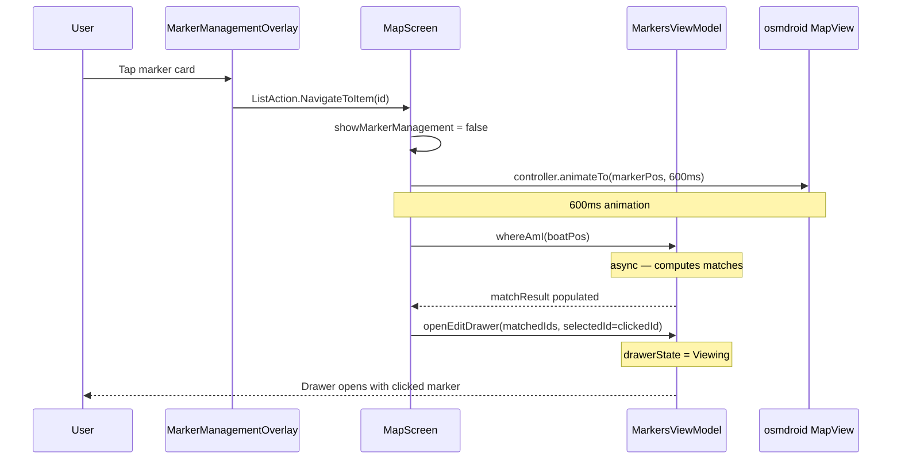

# Ui_General → click-N-move — Implementation Plan

**Created:** 2026-07-05 08:49 UTC+2
**Branch:** feature/click-n-move
**Status:** planned

## Design Decisions (Resolved)

| Decision | Resolution |
|----------|------------|
| Action | New `ListAction.NavigateToItem(id)` — `SelectItem` reserved for future batch selection |
| Drawer | Viewing drawer with clicked marker selected; prev/next scoped to whereAmI matches |
| Map movement | `animateTo` with 600ms duration |
| Corridor center | Midpoint of p1/p2 |
| Order | Sequential: close list → animate map → run whereAmI → open drawer |
| Multi-match | whereAmI runs at boat position; matched IDs become the drawer's navigation set; clicked marker is initial selection |

## Flow Diagram



## Implementation Steps

### Step 1: Add `NavigateToItem` to `ListAction`

**File:** [`app/src/main/java/ykws/android/maro/data/model/ListAction.kt`](app/src/main/java/ykws/android/maro/data/model/ListAction.kt)

Add new action variant in the "Item interaction" section:

```kotlin
/** Navigate to marker on map — dismiss list, animate map, open drawer. */
data class NavigateToItem(val id: String) : ListAction()
```

### Step 2: Compute Marker Center Point (Helper)

**File:** [`app/src/main/java/ykws/android/maro/data/model/markers/UserMarker.kt`](app/src/main/java/ykws/android/maro/data/model/markers/UserMarker.kt) (or a new extension in MapScreen.kt)

Add a computed property or extension to get the visual center of any marker geometry:

```kotlin
val UserMarker.centerPoint: LatLng get() = when (val g = geometry) {
    is MarkerGeometry.Pin -> g.position
    is MarkerGeometry.Circle -> g.center
    is MarkerGeometry.Corridor -> LatLng(
        (g.p1.latitude  + g.p2.latitude)  / 2.0,
        (g.p1.longitude + g.p2.longitude) / 2.0
    )
}
```

### Step 3: Emit `NavigateToItem` from Marker Card Tap

**File:** [`app/src/main/java/ykws/android/maro/ui/map/MarkerManagementOverlay.kt`](app/src/main/java/ykws/android/maro/ui/map/MarkerManagementOverlay.kt:106)

Change `onTap` callback — keep `SelectItem` emission intact for any other consumers, add `NavigateToItem`:

Option A: Replace `SelectItem` with `NavigateToItem` (if no other consumers use `SelectItem` from markers list).
Option B: Keep both — but only `NavigateToItem` triggers the full flow.

**Decision needed:** Is `SelectItem` on marker card tap used by anything else? Currently it's only wired to `openEditDrawer` in MapScreen. If we're replacing that wiring, we should replace the emission too.

→ Replace: `onTap = { onAction(ListAction.NavigateToItem(marker.id)) }`

### Step 4: Wire `NavigateToItem` in MapScreen

**File:** [`app/src/main/java/ykws/android/maro/ui/map/MapScreen.kt`](app/src/main/java/ykws/android/maro/ui/map/MapScreen.kt:1406-1417)

**Placement:** State + LaunchedEffect go in `MapContent` composable, same scope as `OverlayLayer(...)` call, where `mapView`, `showMarkerManagement`, `gpsPosition`, `mapCenter` are all accessible.

Add `NavigateToItem` case to `onMarkerAction` lambda:

```kotlin
is ListAction.NavigateToItem -> {
    showMarkerManagement = false
    val marker = mgmtMarkers.find { it.id == action.id } ?: return@run
    navigateToTarget = NavigateTarget(
        geoPoint = GeoPoint(marker.centerPoint.latitude, marker.centerPoint.longitude),
        markerId = action.id
    )
}
```

New state + data class in `MapContent`:
```kotlin
data class NavigateTarget(val geoPoint: GeoPoint, val markerId: String)
var navigateToTarget by remember { mutableStateOf<NavigateTarget?>(null) }
```

New `LaunchedEffect` (also in `MapContent`):
```kotlin
LaunchedEffect(navigateToTarget) {
    val target = navigateToTarget ?: return@LaunchedEffect
    val mv = mapView ?: return@LaunchedEffect

    // 1. Animate map to marker
    mv.controller.animateTo(target.geoPoint, null, GPS_ANIMATION_DURATION_MS)

    // 2. Wait for animation
    delay(GPS_ANIMATION_DURATION_MS + 50L)

    // 3. Run whereAmI on background thread (avoids main-thread jank)
    val boatPos = gpsPosition ?: mapCenter
    val result = withContext(Dispatchers.Default) {
        markersViewModel.whereAmISync(boatPos)
    }

    // 4. Build navigation set: whereAmI matches + clicked marker (always included)
    val whereAmIIds = result.allMatches.map { match ->
        when (match) {
            is WhereAmIMatch.ZoneMatch -> match.marker.id
            is WhereAmIMatch.LineOfSightMatch -> match.marker.id
        }
    }
    val matchedIds = (whereAmIIds + target.markerId).distinct()

    // 5. Open drawer
    markersViewModel.openEditDrawer(matchedIds, selectedId = target.markerId)

    navigateToTarget = null
}
```

> **Fix 1 (Issue 1):** `return@MarkerManagementOverlay` → `return@run` (or better: `?.let` guard)
> **Fix 2 (Issue 2):** `whereAmI()` async → `whereAmISync()` synchronous
> **Fix 3 (Issue 4):** `whereAmISync` wrapped in `withContext(Dispatchers.Default)` to avoid main-thread jank
> **Fix 4 (Issue 5):** Clicked marker always unioned into `matchedIds` via `+ target.markerId).distinct()`

### Step 5: Extend `openEditDrawer` to Accept Selected ID

**File:** [`app/src/main/java/ykws/android/maro/ui/map/MarkersViewModel.kt`](app/src/main/java/ykws/android/maro/ui/map/MarkersViewModel.kt:261-301)

Current signature: `fun openEditDrawer(markerIds: List<String>)` — sets `_selectedMarkerIndex = 0` and uses `markerIds.first()` for `_createForm` population.

Add optional `selectedId` parameter. Two changes needed:

1. `_selectedMarkerIndex` set to the index of `selectedId` (if provided)
2. `_createForm` populated from the selected marker, not `markerIds.first()`

```kotlin
fun openEditDrawer(markerIds: List<String>, selectedId: String? = null) {
    if (markerIds.isEmpty()) return
    _selectedMarkerIds.value = markerIds
    val index = if (selectedId != null) {
        markerIds.indexOf(selectedId).coerceAtLeast(0)
    } else {
        0
    }
    _selectedMarkerIndex.value = index
    // Look up the selected marker for form population, fall back to first
    val lookupId = markerIds[index]
    val marker = _markers.value.find { it.id == lookupId } ?: return
    _selectedMarkerId.value = lookupId
    // ... rest of existing _createForm population unchanged ...
    _drawerState.value = MarkerDrawerState.Viewing
}
```

> **Fix (Issue 3):** Form population uses `markerIds[index]` (selected marker) instead of `markerIds.first()`. `_selectedMarkerId` also updated to match.

### Step 6: Clean Up Old `SelectItem` Wiring

Remove the old `SelectItem → openEditDrawer` case from `onMarkerAction` since `NavigateToItem` replaces it. `SelectItem` is preserved in `ListAction` for future batch selection.

## Files Touched

| File | Change |
|------|--------|
| `ListAction.kt` | Add `NavigateToItem(id)` variant |
| `MarkerManagementOverlay.kt` | Emit `NavigateToItem` on card tap |
| `MapScreen.kt` | Wire navigate flow: dismiss + animate + whereAmI + drawer |
| `MarkersViewModel.kt` | Extend `openEditDrawer` with `selectedId` param |
| `UserMarker.kt` | Add `centerPoint` computed property |

## Rules

- Map animation: 600ms `animateTo`, matched to existing `GPS_ANIMATION_DURATION_MS`
- Corridor center = midpoint of p1/p2 (single-segment geometry)
- Sequential execution: dismiss list first, then animate, then open drawer
- `whereAmISync` for synchronous match computation (avoids async race with drawer open)
- `SelectItem` preserved as-is for future batch selection; no repurposing
- `openEditDrawer` backward compatible — `selectedId` defaults to null (preserves existing behavior)
