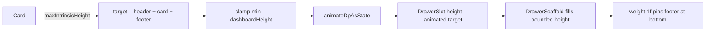

# FEAT_PLN Ui_General — drawer dynamic resizing (Phase 2)

**Status:** planned
**Branch:** feature/new-tghter-ui
**Depends on:** Phase 1 (fixed-height + pinned footer) in
`260903_FEAT_PLN_Ui_General_drawer-dynamic-height.md`

## Goal

On top of Phase 1's fixed-height drawer with pinned footer, make the portrait drawer grow to
fit its card when the card is taller than the dashboard — animated — and stay at the dashboard
height otherwise.

## Key insight

The earlier `VariableHeightBox` failed because it measured the whole `DrawerScaffold`
unbounded; `DrawerScaffold` uses `fillMaxSize`, so it fills any constraint instead of
reporting a natural height. The only part that varies is the **card**
(`TrackCardContent` / `MarkerCardContent`), which wraps its content
(`height(IntrinsicSize.Min)`) and therefore has a well-defined, measurable natural height via
**intrinsic measurement** — no second composition needed.

## Design

- Measure the card's natural height once via `maxIntrinsicHeight(width)`.
- `target = header + cardNatural + footer`, floored at `portraitDashboardHeight`
  (optional cap: screen height − status bar).
- Animate with `animateDpAsState`; apply to the portrait drawer slot height.
- The bounded height drives the existing `weight(1f)` body → footer stays pinned.

## Implementation outline

1. Phase 1 first (fixed height + footer + trimmed spacers + MarkerPrevNext).
2. New small `Layout`/`SubcomposeLayout` wrapper in `OverlayLayer.kt` (or `ui/components/`)
   that reads the card's intrinsic height and reports
   `max(dashboardHeight, header + cardIntrinsic + footer)`, animated.
3. Portrait track + marker drawer slots use the wrapper instead of the fixed
   `.height(portraitDashboardHeight)`.
4. Rebuild + device verify: drawer grows when card is taller, stays dashboard-height
   otherwise, footer pinned, no crash.

## Caveats

- Intrinsic height of a `Text` with `maxLines` is deterministic but simplified (reports the
  max-lines height). For cards capped at 2–3 lines this is the desired behavior.
- The card title/name has no `maxLines`, so a long title wraps to multiple lines. Intrinsic
  height does NOT account for a wrapped title (it reports single-line height for unbounded-
  width text). Phase 2 must measure the card's actual rendered height — the single-measure
  probe-frame pattern on the card — not intrinsic queries.
- The card must remain measurable by intrinsic height — keep its wrap-content structure.

## Verification

- `apk-build.bat` → BUILD SUCCESSFUL.
- Manual: open a track/marker drawer with a long comment in portrait — drawer grows past the
  dashboard height, animates, footer stays pinned; a short card keeps the dashboard height.
