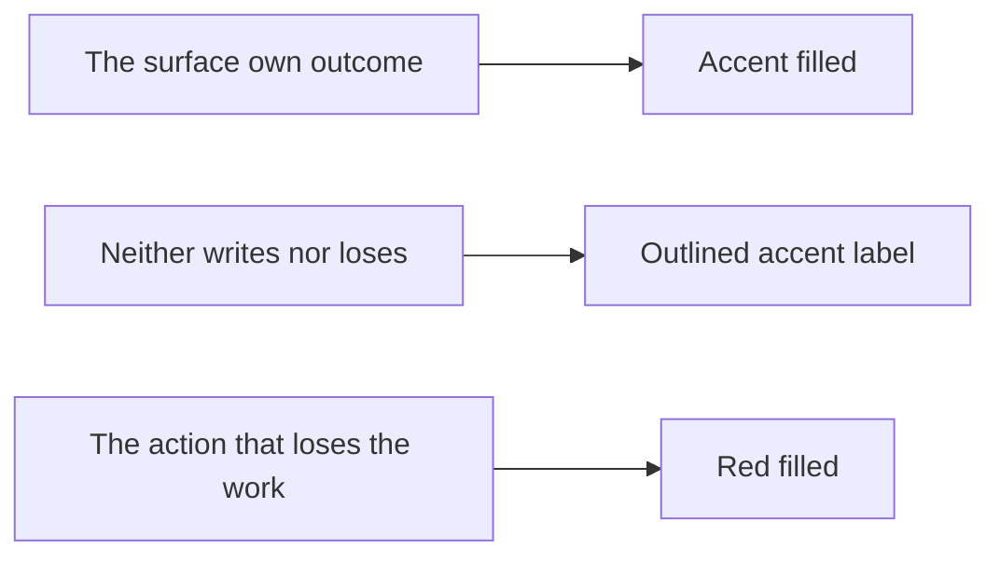
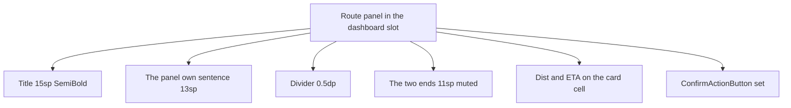
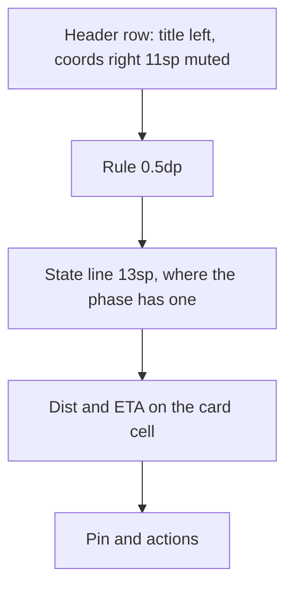

# 260923 · Ui_General — the route dialogs: one anatomy, one naming

**Status:** shipped 2026-09-23, uncommitted — `apk-build.bat` green and the `ui.map` suite green (28 classes, no failure); the device pass over both orientations stays owed. Built in Ui_General's own focus; the words and the roles it moves live in the Route feature's book (R16, R17, R23), which was updated with it.
**Focus:** Ui_General · general (`feature/filter-scroll`).
**Surfaces:** the panel that owns the dashboard slot in both phases ([`RouteConfirmPanel.kt`](../../app/src/main/java/ykws/android/maro/ui/map/RouteConfirmPanel.kt:63)) and the one exit dialog the screen hosts ([`MapScreen.kt`](../../app/src/main/java/ykws/android/maro/ui/map/MapScreen.kt:3241)).
**The model for the naming:** the recording exit dialog ([`MapDialogHost.kt`](../../app/src/main/java/ykws/android/maro/ui/map/MapDialogHost.kt:66)) — `Save track` accent · `Continue recording` outlined · `Discard track` red.
**Owner of the words:** the Route feature's requirement book — R16, R17, R23, R24 of [`260922_FEAT_PLN_Route_ask-policy-and-target-validity.md`](../Route/260922_FEAT_PLN_Route_ask-policy-and-target-validity.md:32) — so the book and the epic move with this change.

---

## 1. The doctrine — one sentence

A button's colour states its **role in the surface**, never its importance.

- **Accent (`PRIMARY`)** — the surface's own outcome: the action the surface exists for. One per surface.
- **Outlined (`SECONDARY`)** — neither: staying, continuing, freezing, or the door that leaves the mode — that door asking again only where the session holds something to withhold.
- **Red (`DANGER`)** — the loss: the action that ends by withholding the work.
- **Order, wherever a surface stacks more than one:** affirmative → neutral → destructive.

The recording exit dialog is the app's own answer to this question and is the model: the save takes the accent, the stay is the outline, the discard is red, and the destructive action is last. Nothing in this plan changes it.

## 2. What the doctrine yields, surface by surface

| Surface | Accent | Outlined | Red |
|---|---|---|---|
| Recording exit (unchanged, the model) | `Save track` | `Continue recording` | `Discard track` |
| Route exit dialog | `Save track and Exit` | `Continue` | `Discard route` |
| Route panel — choosing (R16's four) | `Route` | `Save track and Route` · `Save track and Exit` · `Exit` | — |
| Route panel — following (R17's three) | `Save track` | `Freeze`/`Resume` (or `Abort`) · `Exit` | — |

What that changes:

- **The exit dialog's order** becomes affirmative → neutral → destructive, where today it reads neutral → red → accent. Its roles already obeyed the doctrine; only the order and the words do not.
- **The following panel's `Exit` stops taking the accent.** Leaving is not the panel's outcome, and it writes nothing — the write happens in the dialog it raises. `Save track` takes the accent instead, being the one outcome the following panel owns.
- **The choosing panel's `Route` keeps the accent** — it is the mode's own outcome and R16's first word — and the two saves stay outlined. Nothing on this panel loses work: leaving the draft asks nothing (R23).
- **The red exists only on the exit dialog**, where the session's routes really are withheld.

### The words

The family gets one stem, so the same act reads the same wherever it appears:

- `Save track` — write the route as a track. The following panel's save, and the stem of the two choosing-phase saves.
- `Save track and Route` / `Save track and Exit` — the choosing phase's two saves (R16's `Save as Track and Route` / `Save as Track and Exit`).
- `Save track and Exit` — the exit dialog's accent; the only save that says it ends, because the panel's does not (R23, R25).
- `Continue` — the exit dialog's neutral stay.
- `Discard route` — the exit dialog's red.
- `Exit` — the door that leaves the mode, in **both** phases: the following panel's own door, and — in place of the generic `Cancel` — the draft's only way out, offered with no plan as well.

R23's negated pair (`End and save` / `End without saving`) gives way to naming each action's effect, which is the model's own shape: `Save track` / `Discard track`.

**`Cancel` leaves the route surfaces.** `action_cancel` is the app's generic dialog abort and reads as "abort a dialog", where this button ends a *mode*; `Exit` is the app's own word for that act, already carried by the following panel's door and by the dialog's title `Leave the route?`. Neither alternative fits: `End` collides with the saves' own `and End`, and `Quit` names nothing else in the app. R16's fourth word moves with the other three, so both phases read one door with one word — whether it asks first is the dialog's business, not the label's (R23).

## 3. The panel's anatomy — the card's lines, not the blob

Today the four details are one 13 sp string of four `Label : value` lines, two of them four-decimal coordinates ([`RouteConfirmPanel.kt`](../../app/src/main/java/ykws/android/maro/ui/map/RouteConfirmPanel.kt:334)). They become the list card's own anatomy ([`ui-drawer-guidelines.md` §9](../../docs/ui-drawer-guidelines.md:338)):

> **Revised 2026-09-23, after the layout read:** the ends line folds onto the title's own row and the state line crosses the rule — the settled shape is §10, and the table below stays as the record of what shipped.

| Line | Font / token | Source |
|---|---|---|
| Title | 15 sp SemiBold `uiDashboardTextPrimary` | `Destination` · `Routing active` — the card's Title line |
| The panel's sentence | 13 sp `uiDashboardTextPrimary` | one slot, two sources: the choosing phase's hint / refusal / `Computing Route…`, the following phase's status (`Up to date` · `Re-Computing Route…` · `Frozen`) |
| — divider | 0.5 dp `uiDividerColor` | the card's own divider weight, on the panel's 6 dp stack rhythm — shipped without a gap of its own |
| The ends, one line | 11 sp `uiTextMuted` | `[lat, lon] → [lat, lon]`, four decimals, the destination's `Nearest water point` note in parentheses — the marker card's own coordinate header |
| The reading, one row | the card's `StatCell` ×2 | `Dist` (`track_stat_dist`) · `ETA` (`route_label_eta`), each half width |
| The crossing, when there is one | 12 sp | `route_forced_crossing`, unchanged |
| The pin | checkbox + label | unchanged |
| The actions | `ConfirmActionButton` | the roles of §2; the choosing phase's 2×2 grid keeps its shape so the panel still fits the portrait slot, and its no-plan state offers the same `Exit` alone |

Tighter by subtraction: four 13 sp lines — `Start : 43.1234, 7.1234`, `Destination : 43.5678, 7.5678`, `Distance : 4.2 NM`, `ETA : 12:30 min` — become one muted line and one row. The panel's 16 dp / 12 dp gutters and its scroll are unchanged; the action grid is unchanged, so the portrait slot's height budget is not reopened.

## 4. One cell, one home

`StatCell` was private to [`TrackHistoryOverlay.kt`](../../app/src/main/java/ykws/android/maro/ui/map/TrackHistoryOverlay.kt:1001) (label 11 sp `uiTextMuted` right-aligned at 0.33, 3 dp gap, value 12 sp `uiTextPrimary` Medium at 0.66); it now lives in `app/src/main/java/ykws/android/maro/ui/components/StatCell.kt` and both readers point at it — the track card and the route panel — rather than the panel carrying a second copy. The ends line is built by two pure helpers in `RouteOverlay.kt` beside the feature's other rules — `routeCoordinate(point)` and `routeDestinationText(destination, movedNote)`, with the arrow, the label and the note's own words living in the resources — pinned by `RouteEndsTextTest` as the card's `fmtNm` / `fmtDuration` sit beside their readers today. The two cell values need no helper of their own: `route_trip_distance_nm` for the distance and the new bare `route_eta_value_fmt` for the time, the cell's own label being what says `ETA`.

## 5. Where the rule lives

- [`ui-component-guidelines.md` §5.6](../../docs/ui-component-guidelines.md:554) gains the doctrine — the colour states the role, the order is affirmative → neutral → destructive, the recording exit dialog is the model — beside the existing `Actions` bullet that already defines `PRIMARY` / `SECONDARY` / `DANGER`. One home for every `ConfirmAction` surface, the route panel included.
- A new **§5.8** records the route panel's anatomy and points at §9's card token table; the panel itself cites §5.6 for its actions. The panel is not a dialog and never becomes one — it is the dashboard slot's content, because a floating dialog cannot be aimed under (the epic's own rule).
- [`ui-drawer-guidelines.md` §9](../../docs/ui-drawer-guidelines.md:344) keeps the card's own row; only its Detail-text cell points at the hoisted `StatCell`.

## 6. Files the change touches

- `app/src/main/java/ykws/android/maro/ui/components/StatCell.kt` — new home for the cell.
- `app/src/main/java/ykws/android/maro/ui/map/TrackHistoryOverlay.kt` — the cell leaves; the card reads it.
- `app/src/main/java/ykws/android/maro/ui/map/RouteConfirmPanel.kt` — the anatomy of §3, the roles and the names of §2.
- `app/src/main/java/ykws/android/maro/ui/map/MapScreen.kt` — the exit dialog's order, roles and names.
- `app/src/main/res/values/strings.xml` and `values-fr/strings.xml` — the renamed keys, the ends format, the three label keys that lose their readers, and the route readers `action_cancel` gives up.
- `docs/ui-component-guidelines.md`, `docs/ui-drawer-guidelines.md` — §5.6, the new §5.8, §9's pointer.
- `xTrack/Route/260922_FEAT_PLN_Route_ask-policy-and-target-validity.md` (R16, R17, R23) and `xTrack/Route/FEAT_DSC_Route.md` (its four repeats).
- Test: the ends formatter's unit test, beside the card's formatters' own.

## 7. Strings

| Key | Today (EN) | After | Note |
|---|---|---|---|
| `route_action_route` | `Route` | `Route` | accent, unchanged |
| `route_action_save_route` | `Save and Route` | `Save track and Route` | FR already reads `Enregistrer la trace et router` |
| `route_action_save_only` | `Save and Exit` | `Save track and Exit` | FR already reads `Enregistrer la trace et quitter` |
| `route_action_save_track` | `Save` | `Save track` | becomes the following panel's accent |
| `route_action_exit` | `Exit` | `Exit` | outlined in both phases; now also the draft's only way out, in place of `action_cancel` |
| `action_cancel` | `Cancel` | `Cancel` | keeps its readers among the dialogs that really cancel, and loses its two route ones |
| `route_exit_end_save` | `End and save` | — | **deleted**: the dialog's accent reads `route_action_save_only`, so one act carries one key |
| `route_exit_end_no_save` | `End without saving` | `Discard route` | key renamed `route_exit_discard` (FR `Abandonner la route`), red, now last |
| `route_exit_continue` | `Continue` | `Continue` | outlined, unchanged |
| `route_header_ends_fmt` | — | `%1$s → %2$s` | new, both locales |
| `route_eta_value_fmt` | — | `%1$d:%2$02d min` | new, both locales — the bare value the `ETA` label completes |
| `route_label_start` · `route_label_destination` · `route_label_distance` | named the blob's lines | — | lose their readers and leave |
| `route_label_eta` | `ETA` | `ETA` | reused by the grid cell |
| `route_destination_moved` | `Nearest water point` | unchanged | now reads in the ends line's parentheses |
| `track_stat_dist` | `Dist` | `Dist` | the cell's label, reused from the card's family |

Both locales carry every key, and the French is written for the surface rather than transliterated (`Discard route` → `Abandonner la route`).

## 8. Weighed against itself

- The strongest objection to the accent leaving `Exit`: a user who wants to leave the mode may read an outlined `Exit` as the lesser, uninvited action while `Save track` invites a save they did not ask for. It is answered by the doctrine holding on the exit dialog too — leaving is never the loss, and the dialog the outline raises is where the write and the discard both live.
- The strongest objection to `Exit` where `Cancel` stood: `Cancel` states that nothing was decided, where `Exit` names an end and may read as heavier than a draft deserves. It is answered by the act being an end of the mode either way, and by the draft asking nothing — nothing is written, so nothing is withheld, and the door needs no dialog to hold it (R23).
- The strongest objection to `Discard route`: the scope choice can hold several routes, and the singular reads as the front one alone. It is the model's own shape (`Discard track` names the thing discarded), and the checkbox above the actions is what says how many the accent would write.
- The one place the change is silent: the writing of the panel's refusal sentence at 13 sp is unchanged — a refusal is the panel's content, not a stat, and the bold red crosshair on the aim still carries the weight.

## 9. Findings — recorded, not this change's work

- The buttons say **track** where the lists call a saved route a **route** (R29, R31, R39) — the pair the 2026-09-23 rename settled: a **Track** is a recording, a **Route** is a line the mode saved. The mode's own words name the file its save writes and were left as they stood; the lists, the flag and the keys moved onto the pair.
- The route mode's **device pass is still owed** (the epic's item 6), and it lands on exactly these two surfaces — the panel at both lengths of its content and the dialog's new order.
- The trip figure's own words (`route_trip_title`, `route_trip_distance_nm`) belong to the dashboard cell and are untouched.

## 10. Revision — the header folds to one row (settled 2026-09-23, shipped)

The panel's first line carries the two of them: the title on the left, the two ends right-aligned in the font they already wear — 11 sp `uiTextMuted`, four decimals. The rule follows, then the panel's state, then `Dist · ETA`, then the pin and the actions.

- **One line lighter** than the shipped panel, in both phases: the ends leave their own row.
- **The state line crosses the rule.** The refusal / hint / `Computing Route…` sentence and the refresh status sit under the rule with the figures, where they sat above it — the route's identity stands over the rule, its state and its numbers below.
- **The rule is drawn only where a plan stands.** The no-plan states have no coordinates to put over it, so the panel there is the title, the sentence and the single `Exit` — the shipped shape unchanged.
- **The figures stay** (the user's word): the header row does not absorb them, and `Dist · ETA` keeps its own row between the state and the actions — the two of R24's four details the ends do not carry.
- **The row fits both slots**: the panel's content is a portrait screen's width less its 32 dp of gutters, the landscape slot being the screen's height. The ends take no weight and are therefore **never truncated** — a coordinate is data and must not be cut — while the title, on `Modifier.weight(1f)` with `maxLines = 1` and ellipsis, is what absorbs a short width; on a narrow device the destination's parenthesised note is the extra width that can put it under pressure.
- The two homes followed with it: §5.8's table in `docs/ui-component-guidelines.md` carries the header row and the divider's place, and §3 above stays as the record of what shipped.

## 11. Revision — the status moves up, the coordinates move in, the actions move down (2026-09-23, applied)

Five instructions from the user, each landing as the panel's own shape:

- **The coordinates join the data table as its own columns** (settled the same day, at the user's words): the table is the tracks card's own grid at **two columns** — `Start` beside `Destination`, then `Dist` beside `ETA`, each reading on a cell of the card's shape and the rows touching — so the four details R24 names stand as one tidy block. The coordinates print to **three decimals**, the precision that column's width allows, since a four-decimal pair beside its label would not fit; that precision lives once, in `routeCoordinate`, pinned by `RouteEndsTextTest`. The engine's moved-destination note leaves the value for a **bracketed footnote under the table**, so no coordinate can ever be cut.
- **The status moves to the header's right corner.** The following phase's `Up to date` · `Re-Computing Route…` · `Frozen` reads right-aligned beside the title, costing no line of its own; the choosing phase carries none — what it has to say while nothing has resolved is the sentence, and once a route stands there is nothing left to report about it.
- **The actions are bottom-anchored.** `PanelColumn` scrolls its content in a weighted block and stacks the actions under it, so the outcomes sit at the panel's foot however short the table is; the choosing phase's single `Exit` is anchored the same way.
- **A second rule closes the table.** 0.5 dp of `uiDividerColor`, drawn between the table and the controls (the pin) and the actions.
- **The checkbox's gap is validated rather than moved.** `OptionRow` states no gap of its own, and the box's 48 dp target inset is the distance a reader sees at each of its five call sites — 14 dp between the drawn box and the label. Tightening it would mean measuring the box below Material's own target, which is why it stands.
