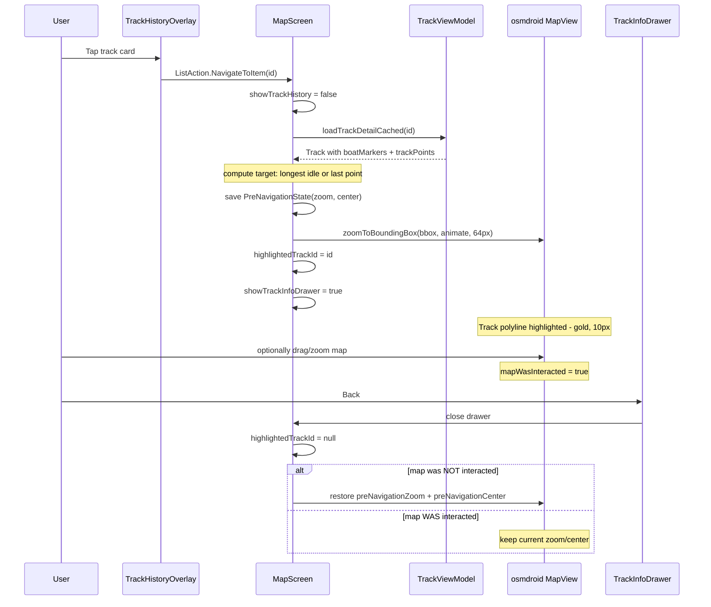

# Ui_General → Track Click-N-Move — Implementation Plan

**Created:** 2026-07-05 09:45 UTC+2
**Modified:** 2026-07-05 12:19 UTC+2
**Status:** implemented
**Parent:** Click-N-Move (see [`FEAT_PLN_Ui_General_click-n-move.md`](FEAT_PLN_Ui_General_click-n-move.md) for markers implementation)

## Summary

Replicate the markers click-n-move on the tracks list. Tap a track card → dismiss list → navigate map to the most interesting track point → zoom to fit the track → highlight the polyline → open track info drawer. Back closes drawer, un-highlights, and restores pre-navigation zoom (unless user dragged map).

## Design Decisions

| Decision | Resolution |
|----------|------------|
| Target point | Longest-idle `BoatMarker` position, fallback to `trackPoints.last()` |
| Zoom | `zoomToBoundingBox` (fit entire track) with 64px padding |
| Highlight | Gold `0xFFFFD700`, 10px stroke — applied in rendering loop |
| Drawer | `DrawerSlot` with `TrackCardContent` (same code as list) — **no scrim** |
| Drawer close | `BackHandler` closes; un-highlight + restore pre-nav zoom/center unless user interacted |
| Map interaction detection | Explicit boolean flag set on any `mapCenter` change after navigation settles |
| NavigateTarget | **Separate** `TrackNavigateState` — does NOT overload marker `NavigateTarget` |
| State grouping | `PreNavigationState`, `TrackDrawerState`, `TrackNavigateState` data classes |
| Error handling | try/catch on track load; guard against single-point tracks |
| `TrackCardContent` visibility | `private` → `internal` for drawer reuse |

## Flow Diagram



## Implementation Steps

### Step 1: Add `onNavigateToTrack` to TrackHistoryOverlay

**File:** [`app/src/main/java/ykws/android/maro/ui/map/TrackHistoryOverlay.kt`](app/src/main/java/ykws/android/maro/ui/map/TrackHistoryOverlay.kt)

- Add parameter: `onNavigateToTrack: (String) -> Unit = {}`
- Pass through to `TrackCardContent` as `onTap: (() -> Unit)? = null`
- In `ListOverlayScaffold` call, wire: `onNavigateToTrack = { onAction(ListAction.NavigateToItem(summary.id)) }`

### Step 2: Make `TrackCardContent` accessible + add card tap

**File:** [`app/src/main/java/ykws/android/maro/ui/map/TrackHistoryOverlay.kt`](app/src/main/java/ykws/android/maro/ui/map/TrackHistoryOverlay.kt:251)

- Change: `private fun TrackCardContent` → `internal fun TrackCardContent`
- Add parameter: `onTap: (() -> Unit)? = null`
- Add `.clickable { onTap?.invoke() }` on outer `Row` (IconButtons and name `.clickable` consume events first — no conflict)

### Step 3: New state data classes in MapScreen

**File:** [`app/src/main/java/ykws/android/maro/ui/map/MapScreen.kt`](app/src/main/java/ykws/android/maro/ui/map/MapScreen.kt:200-201)

```kotlin
/** Pre-navigation snapshot — captured before zooming to track. */
private data class PreNavigationState(val zoom: Double, val center: org.osmdroid.util.GeoPoint)

/** One-shot trigger for track click-N-move navigation flow. */
private data class TrackNavigateState(
    val geoPoint: org.osmdroid.util.GeoPoint,
    val bbox: org.osmdroid.util.BoundingBox,
    val trackId: String
)

/** Track info drawer state. */
private data class TrackDrawerState(
    val isOpen: Boolean = false,
    val track: ykws.android.maro.data.track.Track? = null,
    val mapWasInteracted: Boolean = false
)
```

State variables in `MapContent`:
```kotlin
var highlightedTrackId by remember { mutableStateOf<String?>(null) }
var preNavigationState by remember { mutableStateOf<PreNavigationState?>(null) }
var trackNavigateState by remember { mutableStateOf<TrackNavigateState?>(null) }
var trackDrawerState by remember { mutableStateOf(TrackDrawerState()) }
```

### Step 4: Handle `NavigateToItem` in `onTrackAction`

**File:** [`app/src/main/java/ykws/android/maro/ui/map/MapScreen.kt`](app/src/main/java/ykws/android/maro/ui/map/MapScreen.kt:1403)

Add case before `else -> {}`:

```kotlin
is ykws.android.maro.data.model.ListAction.NavigateToItem -> {
    showTrackHistory = false
    trackScope.launch {
        try {
            val track = trackViewModel.loadTrackDetailCached(action.id)
            if (track == null || track.trackPoints.isEmpty()) return@launch

            val targetPoint = computeTrackNavigateTarget(track)
            val geoPoint = org.osmdroid.util.GeoPoint(targetPoint.first, targetPoint.second)

            val bbox = if (track.trackPoints.size >= 2) {
                org.osmdroid.util.BoundingBox(
                    track.trackPoints.maxOf { it.lat },
                    track.trackPoints.maxOf { it.lon },
                    track.trackPoints.minOf { it.lat },
                    track.trackPoints.minOf { it.lon }
                )
            } else null

            preNavigationState = mapView?.let { mv ->
                PreNavigationState(mv.zoomLevelDouble, mv.mapCenter)
            }

            highlightedTrackId = action.id
            trackDrawerState = TrackDrawerState(
                isOpen = true,
                track = track,
                mapWasInteracted = false
            )

            if (bbox != null) {
                trackNavigateState = TrackNavigateState(geoPoint, bbox, action.id)
            } else {
                // Single-point track: just animate, no bounding box zoom
                mapView?.controller?.animateTo(geoPoint, null, GPS_ANIMATION_DURATION_MS)
            }
        } catch (_: Exception) {
            // Silently fail — track data unavailable
        }
    }
}
```

### Step 5: Target computation helper

```kotlin
/**
 * Compute the navigation target for a track.
 * Priority: longest-idle BoatMarker position, fallback to last track point.
 */
private fun computeTrackNavigateTarget(track: ykws.android.maro.data.track.Track): Pair<Double, Double> {
    val idleMarkers = track.boatMarkers.filter {
        it.trigger == ykws.android.maro.data.track.BoatMarkerTrigger.IDLE
    }
    if (idleMarkers.isNotEmpty()) {
        val longest = idleMarkers.maxBy {
            (it.endTimeMs ?: System.currentTimeMillis()) - it.startTimeMs
        }
        return Pair(longest.boatLat, longest.boatLon)
    }
    val last = track.trackPoints.last()
    return Pair(last.lat, last.lon)
}
```

Placement: top-level private function in `MapScreen.kt`.

### Step 6: New `LaunchedEffect` for track navigation

**File:** [`app/src/main/java/ykws/android/maro/ui/map/MapScreen.kt`](app/src/main/java/ykws/android/maro/ui/map/MapScreen.kt)

New `LaunchedEffect` placed near the existing `LaunchedEffect(navigateToTarget)`:

```kotlin
// ── Track Click-N-Move: zoom-to-fit flow ──────────────────────────
LaunchedEffect(trackNavigateState) {
    val state = trackNavigateState ?: return@LaunchedEffect
    val mv = mapView ?: return@LaunchedEffect

    delay(100L) // small settle after list dismiss
    mv.zoomToBoundingBox(state.bbox, true, 64)
    delay(GPS_ANIMATION_DURATION_MS + 50L)

    trackNavigateState = null
}
```

The existing `LaunchedEffect(navigateToTarget)` stays **unchanged** — no nullable `markerId` overloading.

### Step 7: Map interaction detection

Watch `mapCenter` state — any change after navigation settles = user interaction:

```kotlin
val mapCenterState by viewModel.mapCenter.collectAsState()
LaunchedEffect(mapCenterState) {
    if (trackDrawerState.isOpen && trackNavigateState == null) {
        trackDrawerState = trackDrawerState.copy(mapWasInteracted = true)
    }
}
```

> **Important:** The first `mapCenter` emission after navigation animation completes triggers this ONCE. Subsequent emissions are idempotent (already `true`). No epsilon comparison needed.

### Step 8: BackHandler for track info drawer close

```kotlin
if (trackDrawerState.isOpen) {
    BackHandler {
        if (!trackDrawerState.mapWasInteracted) {
            preNavigationState?.let { pre ->
                mapView?.controller?.setZoom(pre.zoom)
                mapView?.controller?.setCenter(pre.center)
            }
        }
        highlightedTrackId = null
        trackDrawerState = TrackDrawerState()
        preNavigationState = null
    }
}
```

> **BackHandler guard:** The existing default BackHandler in `MapScreen.kt` at ~line 1080 (`if (showMarkerManagement) { BackHandler { showMarkerManagement = false } }`) needs `&& !trackDrawerState.isOpen` added to its `enabled` condition to prevent double-back-to-exit from firing instead of closing the track info drawer.

### Step 9: Highlight rendering in track polyline loop

**File:** [`app/src/main/java/ykws/android/maro/ui/map/MapScreen.kt`](app/src/main/java/ykwl/android/maro/ui/map/MapScreen.kt:784)

In the history track loop, check highlight:

```kotlin
val appearance = if (summary.id == highlightedTrackId) {
    TrackPolylineAppearance(0xFFFFD700.toInt() or (0xFF shl 24), 10f)
} else {
    computeTrackPolylineAppearance(index, total, ...)
}
```

Same check in the pinned track loop (around line 842).

**Note:** The rendering function already rebuilds all overlays on each call (removes + re-adds). The highlighted track gets the special appearance; on the next rebuild (when `highlightedTrackId` is cleared), it returns to normal appearance. No separate overlay management needed.

### Step 10: Track info drawer in OverlayLayer

**File:** [`app/src/main/java/ykws/android/maro/ui/map/OverlayLayer.kt`](app/src/main/java/ykws/android/maro/ui/map/OverlayLayer.kt)

New parameters:
```kotlin
showTrackInfoDrawer: Boolean = false,
trackInfoDrawerData: ykws.android.maro.data.track.Track? = null,
```

New drawer slot (after section 4 MarkerDrawer, before section 5 TrackHistory). **No scrim** — does NOT add to `showScrim`:

```kotlin
// ── 4b. TrackInfoDrawer (no scrim — map stays interactive) ────────
if (isLandscape) {
    DrawerSlot(
        visible = showTrackInfoDrawer,
        modifier = Modifier
            .align(Alignment.CenterStart)
            .width(landscapeDashboardWidth)
            .fillMaxHeight(),
        slideDirection = SlideDirection.FROM_LEFT,
        shadowEdge = ShadowEdge.RIGHT
    ) {
        trackInfoDrawerData?.let { track ->
            val summary = ykws.android.maro.data.track.TrackSummary(
                id = track.id,
                name = track.name,
                comment = track.comment,
                startTimeMs = track.startTimeMs,
                endTimeMs = track.endTimeMs,
                fastestSpeedMps = track.fastestSpeedMps,
                distanceNm = track.distanceNm,
                visibleOnMap = track.visibleOnMap,
                navigatingDurationSec = track.navigatingDurationSec,
                pausedDurationSec = track.pausedDurationSec,
                averageSpeedMps = track.averageSpeedMps,
                pinned = track.pinned,
                pointCount = track.trackPoints.size,
                idleDurationSec = track.idleDurationSec
            )
            TrackCardContent(
                summary = summary,
                dateFormat = java.text.SimpleDateFormat("yyyy-MM-dd HH:mm", java.util.Locale.US),
                accentColor = Color(0xFFFFD700.toInt()),
                onUpdateTrack = { id, name, comment, pinned ->
                    pinned?.let { trackViewModel.setPinned(id, it) }
                    trackViewModel.updateTrack(id, name, comment)
                },
                onShareGpx = { /* no-op in drawer */ },
                onTap = null  // no navigation — already here
            )
        }
    }
} else {
    // Portrait: bottom sheet
    DrawerSlot(
        visible = showTrackInfoDrawer,
        modifier = Modifier
            .align(Alignment.BottomCenter)
            .fillMaxWidth()
            .height(portraitDashboardHeight),
        slideDirection = SlideDirection.FROM_BOTTOM,
        shadowEdge = ShadowEdge.TOP
    ) {
        // Same content as above
    }
}
```

> **Note:** `TrackCardContent` currently accepts `TrackSummary`, not `Track`. The drawer will construct a `TrackSummary` from the loaded `Track`. Alternatively, if full track data is needed (e.g., idle markers display), consider a separate drawer composable. For now, reuse the card as-is per requirement.

### Step 11: Wire through MapScreen → OverlayLayer

**File:** [`app/src/main/java/ykws/android/maro/ui/map/OverlayLayer.kt`](app/src/main/java/ykws/android/maro/ui/map/OverlayLayer.kt)

Add `onNavigateToTrack` to OverlayLayer's signature:

```kotlin
onNavigateToTrack: (String) -> Unit = {},
```

Then pass it through to `TrackHistoryOverlay` call (around line 301):

```kotlin
TrackHistoryOverlay(
    trackSummaries = trackSummaries,
    // ... existing params ...
    onNavigateToTrack = onNavigateToTrack
)
```

**File:** [`app/src/main/java/ykws/android/maro/ui/map/MapScreen.kt`](app/src/main/java/ykws/android/maro/ui/map/MapScreen.kt)

In `MapScreen`'s `OverlayLayer(...)` call, add the new parameters:

```kotlin
showTrackInfoDrawer = trackDrawerState.isOpen,
trackInfoDrawerData = trackDrawerState.track,
onNavigateToTrack = { id -> onTrackAction(ListAction.NavigateToItem(id)) },
```

## Files Touched

| File | Change |
|------|--------|
| [`TrackHistoryOverlay.kt`](app/src/main/java/ykws/android/maro/ui/map/TrackHistoryOverlay.kt) | Add `onNavigateToTrack` param; `TrackCardContent`: `private→internal`, add `onTap` param, add `.clickable` on Row |
| [`MapScreen.kt`](app/src/main/java/ykws/android/maro/ui/map/MapScreen.kt) | Add `PreNavigationState`, `TrackNavigateState`, `TrackDrawerState`; `onTrackAction` NavigateToItem handler; `LaunchedEffect(trackNavigateState)`; BackHandler; highlight logic in render loop; `computeTrackNavigateTarget` helper |
| [`OverlayLayer.kt`](app/src/main/java/ykws/android/maro/ui/map/OverlayLayer.kt) | Add track info `DrawerSlot`; new params: `showTrackInfoDrawer`, `trackInfoDrawerData` |
| [`ListAction.kt`](app/src/main/java/ykws/android/maro/data/model/ListAction.kt) | **No change** — reuses existing `NavigateToItem` |

## Rules

- **Separate state:** Track navigation uses its own `TrackNavigateState` + `LaunchedEffect` — does NOT touch the marker `NavigateTarget` mechanism
- **No scrim:** Track drawer has no scrim; map stays interactive behind it
- **BackHandler close:** Drawer closes on Back; no tap-outside-to-dismiss (no scrim)
- **Zoom restore:** Only restores if `mapWasInteracted == false` (flag set on any mapCenter change after navigation settles)
- **Single-point guard:** Tracks with <2 points skip `zoomToBoundingBox`, just `animateTo` the single point
- **Error handling:** try/catch around track load; silent failure on corrupt data
- **TrackCardContent reuse:** Changed to `internal` visibility; same card content as list, rendered in drawer

## Implemented

**Branch:** `feature/view-track`
**Commit:** `d757d4d`

### What was built

| File | Change |
|------|--------|
| [`TrackHistoryOverlay.kt`](app/src/main/java/ykws/android/maro/ui/map/TrackHistoryOverlay.kt) | `onNavigateToTrack` param; `TrackCardContent` `private→internal`; chevron `KeyboardArrowRight` icon at `BottomEnd`; `.clickable { onTap?.invoke() }` on card Row |
| [`MapScreen.kt`](app/src/main/java/ykws/android/maro/ui/map/MapScreen.kt) | `PreNavigationState`/`TrackNavigateState`/`TrackDrawerState` data classes; `highlightedTrackId`/`highlightedMarkerId`/`previousMarkerZonesVisible` state; `computeTrackNavigateTarget` helper (longest-idle or last point); `NavigateToItem` handlers in `onTrackAction` + `onMarkerAction`; `onNavigateToTrack` inline handler; `LaunchedEffect(trackNavigateState)` for `zoomToBoundingBox`; `LaunchedEffect(mapCenterState)` interaction detection; track drawer `BackHandler` with zoom/center restore; `onTrackDrawerClose` callback; `onMarkerDrawerClose` restores `markerZonesVisible`; gold highlight in polyline rendering loop (`highlightedTrackId`); BackHandler guard on default exit handler; auto-toggle `tracksVisible` before list dismiss; auto-toggle `markerZonesVisible` + `markersViewModel.showLayer()` before list dismiss |
| [`OverlayLayer.kt`](app/src/main/java/ykws/android/maro/ui/map/OverlayLayer.kt) | `showTrackInfoDrawer`/`trackInfoDrawerData`/`onTrackDrawerClose`/`onNavigateToTrack` params; track info `DrawerSlot` (landscape/portrait, no scrim) with `DrawerScaffold` header (back arrow + track name); `TrackCardContent` reused via `TrackSummary` construction |
| [`MarkerOverlay.kt`](app/src/main/java/ykws/android/maro/ui/map/MarkerOverlay.kt) | `highlightedMarkerId` param + `COLOR_HIGHLIGHT` gold; gold dot + zone for highlighted marker; zone forced visible for highlighted marker regardless of `markerZonesVisible` |

### Deviations from plan

- **Marker auto-toggle:** Uses `markersViewModel.showLayer()` (layer visibility) + `markerZonesVisible = true` (zone visibility), not just `markerZonesVisible` alone
- **Marker highlight:** Added `highlightedMarkerId` gold rendering in `MarkerOverlay` — not in original plan
- **Track auto-toggle:** `updateSettings` runs *before* `showTrackHistory = false` to avoid race
- **Marker zone restore:** `previousMarkerZonesVisible` saved on tap, restored on drawer close via `onMarkerDrawerClose` callback
