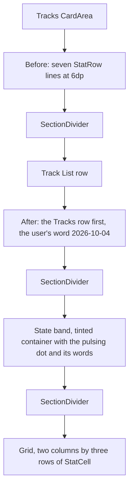

<!-- scope: feature -->
# Menu live card — the compass readings in a two-column grid

Owner: **Ui_Menu** (the drawer surface). Pattern source: **Tracks** (`LiveTrackCard`, §9 of [`docs/ui-drawer-guidelines.md`](../../docs/ui-drawer-guidelines.md)).
Branch: `feature/menu-live-cards` (cut from `origin/develop` at `d575c99`, 2026-10-04).

## 1. The problem

The TRACKS card's head is a live stats block, and it is seven full-width rows tall. Each row is the private
`StatRow` in [`MenuDrawerOverlay.kt`](../../app/src/main/java/ykws/android/maro/ui/map/MenuDrawerOverlay.kt:488) —
a 13sp muted label left, a 14sp Medium value right, `SpaceBetween` — stacked at 6dp apart
([`:210–216`](../../app/src/main/java/ykws/android/maro/ui/map/MenuDrawerOverlay.kt:210)) and closed by a
`SectionDivider()` before the Track List row ([`:218`](../../app/src/main/java/ykws/android/maro/ui/map/MenuDrawerOverlay.kt:218)).

Readings carried today, in order: State, Elapsed, Points, Distance, Max speed, Avg speed, Idle.

## 2. The decision — the user's word, 2026-10-04

- The block keeps its place as the Tracks card's head; **no shell of its own** is added — no accent bar, no
  second card surface, so the block stays flat inside `CardArea`.
- The readings move from stacked label-right rows to the app's shared reading cell, laid out in **two columns by
  three rows** — six readings once the state leaves the grid, so the grid closes full with no empty cell and no
  new reading smuggled in.
- The **state leaves the grid** and heads the block as its own line, and that line **wears the state as a subdued
  background**: green while the recording moves, blue while it drifts idle — the two colours the map's tracking
  square is painted with.
- The subdued level is the **taken-choice container's own** — the accent at 30 %, the face a `SegmentedRow`'s
  selected segment and a `MultiSelectRow`'s on half both wear.
- The band's container takes that face's **shape**: the fill above and a **1dp edge** (the user's word, 2026-10-04,
  after the first build) — the edge in the **state's own colour**, light green on the green band and blue on the blue
  one (the user's word, same day), so the edge belongs to the state rather than to the accent.
- The mark beside the state word is the **shared red pulsing dot** every toggle wears — the same disc, the same
  colour, the same beat, so the drawer's mark and the map square's mark cannot drift apart.
- The band's **read** is the notification's own, the user's word of 2026-10-04: `[pulsing dot] Recording • Idle|Moving`
  — the record state, the notification title's own bullet, then the sub-state its middle segment names.
- The **order is the Tracks row first, the live block below it** (the user's word, 2026-10-04). That reverses D5
  of the Tracks render-modes plan, which settled the card's order as the live card, then the track list row, so
  the drawer no longer follows that decision on this point — named here as the contradiction it is.

## 3. Layers, before and after

The layered reading matches the track card's own arrangement in
[`TrackHistoryOverlay.kt`](../../app/src/main/java/ykws/android/maro/ui/map/TrackHistoryOverlay.kt:474) — a header
band over a hairline, then readings as weighted cells — with the card shell and the accent bar left out, since the
drawer's block is already inside `CardArea`. What the band adds over the track card's plain header is the state's
own tint, which is this block's alone.

## 4. The cell

[`StatCell`](../../app/src/main/java/ykws/android/maro/ui/components/StatCell.kt:32) is already the app's one
rendering of a reading: an 11sp `uiTextMuted` label right-aligned at weight 0.33 with a trailing colon the cell
itself writes, a 3dp gap, then a 12sp `uiTextPrimary` Medium value left-aligned at weight 0.66, each held to one
line. The cell is `fillMaxWidth` inside whatever box the caller weights (`StatCell.kt:28`), so the grid is a caller
concern: each reading sits in its own `Box(Modifier.weight(1f))` inside a `Row`, exactly the shape the track card's
stats use.

No component is extracted beyond the cell's own file — the label, the separator and the value are private
composables inside it since 2026-10-04 (`StatLabel`, `StatValue`, one `SEPARATOR` constant), composed by both
shapes so no part of the reading is stated twice — and no dependency enters; the cell's own documentation already
names the caller as the owner of the grid (`StatCell.kt:22–26`).

**Withdrawn 2026-10-04, the same day it was tried:** a `compact` shape on this cell — label and value packed from
the cell's start, no fixed column — was put under the drawer's grid and reverted by the user's word, because it
broke the values' alignment.

**The settled shape is the cell's columned one** (the user's word, 2026-10-04): the label right-aligned at a width
the table measures once, from its widest label; the colon alone centred in a 6 dp slot; the value left-aligned and
taking the rest. That is `labelWidth` non-null, and the default keeps the cards' 33/66 split byte-for-byte. One
label column shared by the whole table is what keeps the values aligned while the fixed share of empty space is
gone — the two things the earlier attempts each broke. The card's and the page's insets were left alone, and the
card inset 16 dp → 12 dp the user first picked is recorded but unapplied.

## 5. The state band

- **The mark:** the shared [`MapPulseDot`](../../app/src/main/java/ykws/android/maro/ui/map/MapPulseDot.kt:69) —
  10dp, alpha 1 → 0.3 over 800 ms, reading `ui.map.pulse.dot` (`#FFD32F2F`,
  [`colors.properties:91`](../../app/src/main/assets/colors.properties:91)) — stands **leading**, where the `●`
  stands today, with 6dp between it and the word, the gap the history card uses at
  [`TrackHistoryOverlay.kt:870`](../../app/src/main/java/ykws/android/maro/ui/map/TrackHistoryOverlay.kt:870).
- **The words:** `state_recording`, then the notification title's own bullet (`STATE_SEPARATOR = "•"`, 14sp
  `uiTextMuted`), then `state_moving` while the recording moves and `state_idle` while it drifts. Both words stand
  at 14sp `uiTextPrimary` Medium — the size and weight the state value carried before the reword — so the band
  introduces no new type, and all three come from the `state_*` family the notification's title already composes.
- **The mark keeps its place:** `MapPulseDot()` stays the band's leading element, so the drawer's live mark is still
  the app's one disc and R69 needs no exception.
- **The tint:** the band's own container, `RoundedCornerShape(AppConfig.uiRadiusCard.dp)` — 12dp — filled with
  `statusTrackingContainerRecording` while `recorderState.isMoving`, `statusTrackingContainerIdle` otherwise.
  Vertical padding is `BAR_CELL_PAD_VERTICAL_DP` (10dp), the bars' own cell padding, since the band is the same
  kind of one-line container the multi-choice bars are.
- **The band wears a 1dp edge in its own state colour** — `statusTrackingHealthy` (light green) on the recording
  band, `statusTrackingIdle` (blue) on the idle one: the very pair the map's tracking square is painted with, so the
  edge and the toggle's face are one colour and only their weights differ (1dp edge over the 30 % fill, the face's
  65 % over the map). The plan first left the border off on the argument that the edge means *chosen*, then took the
  accent edge; the user's word settled it on the state's own colour, so the accent stays the taken choice's alone.
  The `SectionDivider()` below the block keeps its meaning untouched.
- **R69 is honoured, not bent.** The dot is the app's one mark in the app's one colour, read by `MapPulseDot`
  itself, so this change adds no second pulsing colour and no exception is asked of the requirement
  ([`260928_FEAT_PLN_Route_ui-flow-and-candidate-routes.md:169`](../Route/xxArchive/260928_FEAT_PLN_Route_ui-flow-and-candidate-routes.md:169)).
  The state rides the band's fill instead, which is what keeps one colour for every toggle.

## 6. The two colour tokens the tint needs

- **Stated so the count is not a surprise:** the blue at 30 % already exists as `ui.select.container`
  (`#4D1565C0`), but its subject is *a taken choice*, not a status, so it is not re-used here. Two keys enter
  `colors.properties` in the tracking-status block beside `status.tracking.dot.*`
  ([`colors.properties:160`](../../app/src/main/assets/colors.properties:160)):
  `status.tracking.container.recording` — `semantic.compliant` green at 30 % — and
  `status.tracking.container.idle` — `semantic.info` blue at 30 %.
- Both are literal hex values with the alpha baked in, which is how the level is expressed everywhere in that file:
  the token *is* the subdued colour, and the 0.30 share is never a literal in Kotlin.
- Each key gets its `AppConfig` accessor beside `statusTrackingDotRecording` / `statusTrackingDotIdle`
  ([`AppConfig.kt:938`](../../app/src/main/java/ykws/android/maro/config/AppConfig.kt:938)) and its read in the
  properties loader — two properties, two accessors, and both default to the same 30 % share the file carries.

## 7. The grid

- Row 1: Elapsed, Points. Row 2: Distance, Max speed. Row 3: Avg speed, Idle.
- Two readings per row, each in its own weighted `Box`, holding the cell in its columned shape (§4) with the one
  measured label width. Values keep their existing
  formats — `menu_stat_distance_nm` and `menu_stat_speed_kn` for the two unit-bearing readings, the local
  `formatDuration` ([`:508`](../../app/src/main/java/ykws/android/maro/ui/map/MenuDrawerOverlay.kt:508)) for the
  three time readings — and points print as the bare count, exactly as they do today.

## 8. The status strings, and what the reword retired

- The band first printed `track_status_recording` / `track_status_idle`, whose leading `●` was stripped so the drawn
  disc could stand as the mark; both had the band's own line as their only reader.
- The reword of 2026-10-04 moved the band onto the notification's vocabulary — `state_recording`, `state_idle` and
  `state_moving`, the three the notification's title composes its recording and middle segments from
  ([`TrackRecordingService.kt:363`](../../app/src/main/java/ykws/android/maro/data/track/TrackRecordingService.kt:363))
  — so the earlier pair lost its reader and is deleted from both locales, exactly as `track_stat_state` went before
  it with the row that printed it.
- No string is added, and no other string moves. Both locales are edited together, as the no-hardcoded-strings rule
  requires.
- One consequence worth knowing: the French band now reads **"Arrêt"** for the idle half rather than the retired
  "En attente", because the two surfaces share one vocabulary — the drawer follows the notification.

## 9. What enters, and what does not

- **Dependencies:** none. `StatCell` is `internal` in the same module, and `MapPulseDot` and
  `BAR_CELL_PAD_VERTICAL_DP` are `internal` in the drawer's own package and its components package, so all three
  are reachable unchanged.
- **Components:** none extracted, none renamed, and neither `MapPulseDot` nor `TrackStatusIcon` is touched.
  `LiveTrackCard` keeps its own pulsing border, red pair and editable name and comment.
- **Colours:** the two status tokens of §6 enter, and nothing else moves — `ui.map.pulse.dot`,
  `status.tracking.dot.*` and `ui.select.container` are read or left alone, never re-purposed.
- **Layout constants:** none invented. The radius is `uiRadiusCard`, the band padding is the bars'
  `BAR_CELL_PAD_VERTICAL_DP`, the dot's size and beat come from `MapPulseDot`'s own constants, and the marker gap is
  the live card's 6dp.

## 10. Guideline consequence

[`docs/ui-drawer-guidelines.md`](../../docs/ui-drawer-guidelines.md) §9 specifies the 3-column × 2-row grid as the
card pattern's detail text, and §10's Content row names "live stats" as an example. The live block becomes a
second wearer of the cell with a different column count, a tinted state band and the shared pulse mark, so the
drawer page owes it one sentence naming the two-column variant, the band's two status tokens and the dot's origin;
otherwise the next reader takes §9's "three columns" for the pattern's only shape and the band's fill for a
stray decoration.

## 11. Out of scope, named so it is not smuggled in

- The history list's own [`LiveTrackCard`](../../app/src/main/java/ykws/android/maro/ui/map/TrackHistoryOverlay.kt:784)
  is untouched; this plan moves the drawer's block only.
- No new reading is added: `currentSpeedKn` is available in the state but is not shown today, and showing it would
  be new content, not a compaction.
- No accent bar, no second card surface, no change to the Track List row, no change to the map's tracking square
  and no change to `MapPulseDot`.
- The map's own surface alpha (`ui.map.surface.active.alpha`, 65 %) is **not** the level used here: the user named
  the multi-choice container's 30 %, and the two levels stay independent, each with its own subject.

## 12. Verification

- **In reach:** a build through the module's APK pipeline, and the compiler as the only automatic check — the
  existing unit tests under `app/src/test/.../ui/map/` cover map policy and rendering rules, not drawer layout, so
  none of them can see this change.
- **In reach, since it is text:** both locale files carry the edited strings, so the French line must read
  "Enregistrement" and "En attente" without a leading bullet, and no file may still reference `track_stat_state`;
  `colors.properties` must carry both new keys and `AppConfig` both accessors, each read once.
- **Not in reach:** how the two-column grid reads at arm's length, in sunlight, on the device, and whether a 30 %
  green or blue band makes the red disc read as clearly as it does on the map square's own face. The smaller cell
  type is what buys the height, and the drawer's 14sp value size was a legibility decision, so the block gets
  shorter at the cost of the reading the drawer currently keeps large. The user runs this check.

## Outcome

**Shipped 2026-10-04** on `feature/menu-live-cards`, built green over two passes (`gradlew assembleDebug`, BUILD
SUCCESSFUL both times, no new warning): the TRACKS card's head is now a tinted state band — `MapPulseDot` leading,
the state word beside it, the fill the tracking status colour at the taken-choice 30 % with a 1dp edge in that same
state's colour, added on the second pass — over a hairline and the six readings in a two-column by
three-row `StatCell` grid. The two container tokens entered `colors.properties` with their accessors and loader
reads, the two state strings lost their bullet in both locales, `track_stat_state` retired with the row that
printed it, and §9 of the drawer guidelines names the block as the pattern's second wearer. Left unverified: the
on-device read at arm's length, which is the user's own check.
