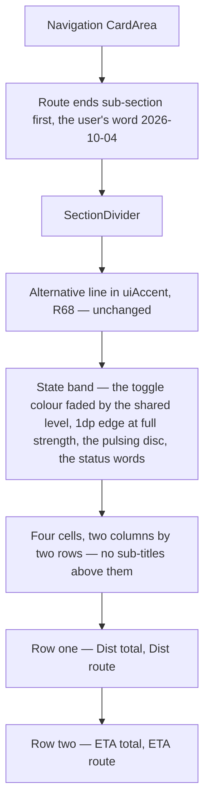

<!-- scope: feature -->
# Route's active card in the drawer — the live block's treatment, applied

Owner: **Ui_Menu** (the drawer surface). Content owner: **Route** (the summary is the mode's own echo; its plan is
[`260926_FEAT_PLN_Route_menu-mode-summary.md`](../Route/260926_FEAT_PLN_Route_menu-mode-summary.md)).
Pattern source: the shipped live block of the TRACKS card, [`261004_FEAT_PLN_Ui_Menu_live-card-compact.md`](261004_FEAT_PLN_Ui_Menu_live-card-compact.md).
Branch: **`feature/menu-live-cards`** (the user's word, 2026-10-04) — the same drawer work, so no new cut is made.

> **Status: plan only, every point settled by the user's word on 2026-10-04.** Nothing here is implemented; §4 is
> the record of what was settled, and §5 names the two choices left to whoever writes it.

## 1. The card today — the facts

- The Navigation card's route block is [`RouteSummaryBlock`](../../app/src/main/java/ykws/android/maro/ui/map/MenuDrawerOverlay.kt:519),
  gated by `routeSummaryVisible` — the routing phase alone until 2026-10-04, when the user's word widened the gate to
  the search as well — and it stands **below** the ends sub-section since that same day, having been above it.
- It holds, in order: the alternative line in `uiAccent` when a saving candidate exists (R68), the status word, the
  plan's sub-title and its two readings, then the remaining sub-title and its two readings.
- Every reading is the private [`StatRow`](../../app/src/main/java/ykws/android/maro/ui/map/MenuDrawerOverlay.kt:595):
  a muted label left, a 14sp `uiTextPrimary` Medium value right, `SpaceBetween`. Its two call sites in this block are
  its last in the app, so this change retires the helper.
- Four readings stand today: Dist and ETA of the plan, from `route_trip_distance_nm` and `routeEtaText`
  (`track_stat_dist`, `route_label_eta`), then the same two for what is left to travel.
- The acquisition panel already marks a figure it does not have: [`RouteConfirmPanel.kt:417`](../../app/src/main/java/ykws/android/maro/ui/map/RouteConfirmPanel.kt:417)
  and `:423` pass `value = "--"` besides the unit, as a literal in Kotlin.

## 2. The decisions — the user's word, 2026-10-04

- **One faded level for every band** — one shared number for how see-through a band's colour is, read by both the
  tracking band and this one. The tracking band's two baked hex tokens go with it.
- **The band wears the route toggle's own colour** and **the same pulsing dot**, so the drawer reads as the mode's
  square does.
- **R68's alternative line stays** and the **two sub-titles go**, because the four cell labels now say which figure
  is which.
- **The band carries two messages and only those** (the user's word, 2026-10-04): `Acquiring • <stage>` while the
  engine searches, and `Routing • ETA: <whole minutes> min` — `ETA: <seconds> sec` below a minute — while a route is
  followed. Its acquisition word is a key of its own, **without the ellipsis** the shared `route_status_acquiring`
  keeps for the route panel's header, and its routing word moved `route_status_active` from "Route active" to
  "Routing" / "En route", the band being that string's only reader.
- **The block moved to the card's foot** (the user's word, 2026-10-04): the ends sub-section and its head stand
  first, the summary follows them, and the divider that separated the two moves with it.
- **The readings become four cells, two columns by two rows**: the plan's figures on the left, the route's own on the
  right — `Dist total` beside `Dist route`, then `ETA total` beside `ETA route`.
- **The card stands in acquisition too**, not only while a route is followed, and the right cells hold the mark the
  panel already uses until figures exist.
- **The mark is `--`, held in one word in the string files** that all three places read: the panel's two call sites
  stop writing it in Kotlin, and the UI guidelines name the key rather than describe a literal.
- **The four labels are `Dist total`, `Dist route`, `ETA total`, `ETA route`** — sentence case, matching the
  drawer's other labels, as new keys in both locales.
- **The branch is `feature/menu-live-cards`.** One consequence worth knowing: the name says the live card while the
  branch now carries the route card too — a drift only `#rename` can answer, and no upstream exists yet.

## 3. The mapping — what the route's card becomes

- **The band's hue follows the toggle's faces** ([`RouteOverlay.kt:471-473`](../../app/src/main/java/ykws/android/maro/ui/map/RouteOverlay.kt:471)):
  the acquiring face is the route line's own colour — the user's `routeLineColor`, R51 — and the following face is
  `routeNavigateColor`. Its faded weight is the shared number, so the drawer and the square cannot disagree.
- **The mark is the same disc**: the square wears `MapPulseDot` while armed and following *or* searching
  ([`:487-488`](../../app/src/main/java/ykws/android/maro/ui/map/RouteOverlay.kt:487)), and the card now stands in
  both those states, so it leads with the disc in both.
- **The cells are the app's one reading cell** in its columned shape — that is what four cells buys: no header row
  and no second value column are needed, because each cell carries its own label and its own figure, and the four
  labels share one measured column width exactly as the live block's six do.

## 4. What was settled, and what follows from it

- **The tracking band's level moves to the shared number** and its two hex tokens are deleted, so the app ends with
  one statement of the level instead of two.
- **`route_trip_remaining` retires** with the sub-title it printed, having no other reader, while `route_trip_title`
  survives on the dashboard's own trip card
  ([`DashboardPanel.kt:455`](../../app/src/main/java/ykws/android/maro/ui/map/DashboardPanel.kt:455)).
- **The panel loses two literals** and gains nothing visible: the two marks it prints when no plan stands come from
  the shared word, so its layout, colours and wording are unmoved.
- **The sub-title texts the drawer stops printing are not otherwise touched**, and no other card in the drawer moves.

## 5. What enters, and what is left to the writer

- **Dependencies:** none. `StatCell`, `MapPulseDot` and the `CardArea` stencils are reachable as they are.
- **Colours:** one new value — the shared faded level — and two deleted in its favour. No route colour of its own:
  the band's hue is read at runtime.
- **Strings, both locales:** four label keys, one key for the mark, and `route_trip_remaining` retired. The two
  sub-titles the card stops printing are the only wording removed.
- **Docs:** [`docs/ui-component-guidelines.md`](../../docs/ui-component-guidelines.md) gains the pending-value rule —
  the mark and the key that holds it — stated once in the route panel's own section, with the drawer's section
  pointing at it rather than repeating it.
- **Left to the writer, and it is a code-health choice, not a visible one:** how the shared level is held — one key
  in the properties read through a new `AppConfig` accessor, which is the shape the map's own surface alpha already
  uses ([`MapSurface.kt:57`](../../app/src/main/java/ykws/android/maro/ui/map/MapSurface.kt:57)), is the route this
  plan recommends over baking two more hexes.
- **Left to the writer too:** the band's exact hue while the engine searches and while it follows is the toggle's two
  faces, so nothing is invented; but the moment the card shows in acquisition and the search has not yet produced a
  plan, the left cells are the ones without figures — the plan reads the acquisition case as the right cells empty,
  which is the state that exists today; if the left ones can empty too, the writer follows the same mark.

## 6. Steps

1. Add the shared faded level and rebuild the tracking band on it, deleting its two tokens.
2. Put the status words into the band: the mode's own face colour at the shared level, the 1dp edge at full
   strength, `uiRadiusCard`, the bars' cell padding, `MapPulseDot` leading.
3. Add the mark's word to both locales and move the panel's two call sites onto it, so the app holds one statement
   of the mark.
4. Lay the four cells out two by two in the columned `StatCell` grid, left the plan's figures and right the route's,
   with the mark filled in while nothing is followed.
5. Keep R68's alternative line exactly where it is, above the band.
6. Retire the private `StatRow`, which has no call site left, and `route_trip_remaining` with it.
7. Write the pending-value rule into the UI guidelines, once, naming the key, and point the drawer's own section at
   it.
8. Rebuild, then check both locales for a label wider than the measured column, and the acquisition case for the
   mark's rendering.

## 7. Verification

- **In reach:** the build, and the compiler as the only automatic check — no test in `app/src/test/.../ui/map/`
  covers the drawer's layout, as the live-card plan already records.
- **Not in reach:** whether four cells of two columns fit the drawer's 75 % width at the smallest shipped font scale,
  and whether a band in the user's own line colour is distinguishable from the card's surface. The user runs this.

## 8. Out of scope, named so it is not smuggled in

- The route **panel** on the map keeps its own three-column table and its rows; the only thing of it that moves is
  the source of the two marks.
- The route **toggle's** faces, the fan and the disc's behaviour are untouched; the band copies them.
- The live block's own contents are untouched beyond the shared level of step 1.

## Outcome

**Shipped 2026-10-04** on `feature/menu-live-cards`, built green (`gradlew assembleDebug`, BUILD SUCCESSFUL, the one
compile error of the pass being the missing `AppConfig` import on the params bundle, fixed at once): the route card
wears the live block's treatment — a band in the toggle's own colour, filled at the shared level
(`ui.band.fill.alpha`, 0.3) with a 1dp edge of that colour at full strength and the shared disc leading, over four
cells in two columns (`Dist total` · `Dist route`, `ETA total` · `ETA route`), the pending mark standing wherever a
figure is missing. The card now stands while the engine searches as well as while a route is followed, widening D5's
"routing phase alone", and `RouteSummaryData` carries the line's own colour for the band. The pending mark is one
word, `route_value_pending`, read by the panel's two cells and the drawer's cells alike. The tracking band's two
baked hexes are replaced by the shared level; `route_trip_remaining` and the private `StatRow` are retired; and
`docs/ui-component-guidelines.md` §5.8 states the mark's rule with §5.1 pointing at it. A second pass the same day
gave the band its **two messages**: `Acquiring • <stage>` and `Routing • <route ETA> / <plan ETA total>`, the ETA
pair divided by `ROUTE_ETA_PAIR_SEPARATOR`, with the words, the bullet and the pair all reading the same three-part
row the tracking band uses. The acquisition word is the band's own key, `route_status_acquiring_bare`, set without
the ellipsis the shared string carries for the route panel's header — the user's word. A third pass the same day put
the block at the card's foot, below the ends sub-section, and gave the routing band its tail: `ETA: <whole minutes>
min`, or `ETA: <seconds> sec` below a minute, from two keys in both locales, with the pair separator deleted. Left
unverified: the on-device read at arm's length, which is the user's own check.
