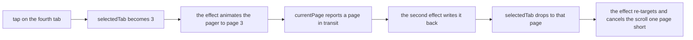

<!-- scope: feature -->
# Settings tab strip — the fourth tab stops one short

**Branch:** `feature/fix-settings-tab`, created from `origin/develop` on 2026-09-19 · **Status:** shipped 2026-09-19, uncommitted — see `## Outcome`; the device pass is still owed.

## 1. Symptom

Tapping the fourth settings tab (System) leaves both the strip and the page on the third.

- The user confirmed on 2026-09-19 that the **page content lands on the third too**, which places the fault in the pager and makes the strip's position a consequence — `SecondaryScrollableTabRow` is driven by `selectedTabIndex` alone.
- The end state is stable, not a flicker: the tap's intent is overwritten and nothing restores it.
- Tabs: Layers · Navigation · Position · System — `settingsTabLabels` at `MapScreen.kt:3480`.

## 2. Code under review

| Anchor | What it holds |
|--------|---------------|
| `app/src/main/java/ykws/android/maro/ui/map/MapScreenSettingsOverlay.kt:83` | `SettingsOverlay` — the whole surface |
| `…MapScreenSettingsOverlay.kt:96-111` | the tab↔pager sync: `pagerState`, `pagerSyncSettled`, both `LaunchedEffect`s |
| `…MapScreenSettingsOverlay.kt:132-159` | `SecondaryScrollableTabRow`, custom content-sized cells, `edgePadding = 24.dp` |
| `…MapScreenSettingsOverlay.kt:164-183` | `HorizontalPager`, `userScrollEnabled = false`, `when (page)` over 0..3 |
| `app/src/main/java/ykws/android/maro/ui/map/MapScreen.kt:726` | `var selectedTab by rememberSaveable { mutableIntStateOf(0) }` — the hoisted index |
| `app/src/main/java/ykws/android/maro/ui/map/MapScreen.kt:2502` | `onTabChange = { selectedTab = it }` — the only writer |
| `app/src/main/java/ykws/android/maro/ui/map/OverlayLayerParams.kt:72` | `SettingsOverlayData`, carrying the index down the ladder |

## 3. Evidence gathered

- `animateScrollToPage` has **one call site** in the package (`…MapScreenSettingsOverlay.kt:104`); `pagerState` is read nowhere else but the write-back at `:107-109`.
- `selectedTab` has exactly **two feeders**: the cell's `onClick` at `:145` and the write-back at `:109`. Nothing else writes it — this retires the risk that deleting the write-back breaks a hidden caller.
- `userScrollEnabled = false` (`:166`) — the pager cannot be dragged, so the write-back has no legitimate motion to report.
- `rememberPagerState(pageCount = { 4 })` (`:96`) — the count is a literal, not derived from `settingsTabLabels`; the `when (page)` at `:176-181` enumerates 0..3 with no `else`.
- `app/src` carries `main/` and `test/` only — **no `androidTest/`**, so no Compose UI harness exists and a tap-level regression test is not available in this repo.
- Precedent: `fix-status-persistance` in this feature's `## Implemented` already reads *`selectedTab` hoisted to MapScreen with `rememberSaveable`; pager–tab sync race fixed* — the same handshake has been repaired once before.

## 4. Mechanism — hypothesis, not proven

The tap sets the index to 3 and starts a scroll across two intermediate pages; a page the pager is **merely passing through** is written back into `selectedTab`, and that lower index re-targets the effect, cancelling the scroll one page short.

The chain needs two Compose behaviours to hold, and **neither has been read in this session**:

- that `pagerState.currentPage` advances while `animateScrollToPage` runs, rather than only on settle,
- that the write-back's own `animateScrollToPage` cancels the animation already in flight.

What would falsify it: a tap that crosses no intermediate page (first → second) mis-landing, or the third tab behaving differently from the fourth. What confirms it: one read of `currentPage` / `settledPage` semantics for the resolved Compose version in `gradle/libs.versions.toml`, or one instrumented run.

## 5. Options

### Option A — one-way sync (recommended)

Delete the write-back `LaunchedEffect` (`:107-111`), the `pagerSyncSettled` flag (`:102`) and the comment block that explains it (`:98-101`). `selectedTab` becomes the single source of truth and the pager follows it.

- Health: one writer for one fact, and a `remember`-ed boolean plus its four-line apology leave the file.
- Objection, strongest: it removes the net a future swipe between tabs would need — with the write-back gone, a returned `userScrollEnabled = true` would show a page the strip no longer follows, silently.
- Cost: the deletion is four lines and a comment; no other file changes.

### Option B — settled-page write-back

Keep the second direction but read `pagerState.settledPage` instead of `currentPage`, so only a **stopped** page is reported.

- Health: keeps a handshake whose only trigger does not currently exist, and the flag survives to guard it.
- Objection: it fixes the symptom by narrowing a value rather than removing an unneeded direction, and a cancelled animation can still settle on a page nobody asked for.

### Option C — leave the sync alone and slow the pager

Rejected: it treats the timing rather than the cause, and the race stays reachable.

## 6. Code health, inside the touched surface

- **H1 — one source of truth (with Option A).** The index is written once, by the tap. One home per fact.
- **H2 — derive the page count.** `rememberPagerState(pageCount = { settingsTabLabels.size })` replaces the literal `4`, so the strip, the pager and the `when (page)` cannot disagree about how many tabs exist. This is the same defect class as the reported one — an index outliving the list it indexes — and it is invisible to the user, so it is decided here rather than asked: **include it**.
- **H3 — testability.** The repo's pattern is a pure helper under `app/src/test` with `MapPanDetectorTest` / `DashboardPositionTest` as models. With Option A no decision logic survives to extract, so the honest outcome is that the fix ships with **no automated guard**; with Option B the predicate can be extracted pure and unit-tested. The verification below must not pretend otherwise.
- **H4 — the bare `when (page)`.** `:176-181` renders nothing for a page outside 0..3. H2 makes that unreachable; an `else` guard would be belt-and-braces over a dead branch, so **leave it out** and record the reasoning here.

Recorded as findings, **not** in scope: the four hoisted `ScrollState` parameters at `:92-94` that could travel as one bundle, and the file's 1834-line length.

## 7. Open question for the user

- **Q1 — the open animation.** Opening the overlay on a restored tab animates from the first tab to it (`animateScrollToPage` on first composition), today and after Option A. Snapping on open instead is a visible change and is not part of this fix; it is the user's call and stays out unless named.

## 8. Verification

- **Confirm the mechanism first** — read the `currentPage` / `settledPage` semantics for the resolved Compose version, or instrument the sync; §4's chain is not to be asserted unread.
- **Baseline on the device before the change**, then repeat after: tap each of the four tabs and record where the strip and the page each settle, plus reopening the overlay on System. The baseline is what lets the fix be judged by what moved.
- **Build gate:** `apk-build.bat` → SUCCESS, no new warnings.
- **No automated guard** — see H3; `gradlew testDebugUnitTest` is not touched by this change.

## 9. Files to touch

- `app/src/main/java/ykws/android/maro/ui/map/MapScreenSettingsOverlay.kt` — the sync and H2
- `docs/ui-component-guidelines.md` §2.11 — one row stating that the tab index is the single source of truth while the pager is not user-scrollable, and that a returning swipe needs a settled-page write-back
- `xTrack/Ui_Settings/FEAT_DSC_Ui_Settings.md` and `FEAT_HYD_Ui_Settings.md` — at the bake that closes this work, never before

## 10. Risks

- If the mechanism is wrong, Option A is still defensible — a direction with no trigger — but the symptom may survive; the baseline catches that.
- Deleting the flag also deletes the guard that protected the persisted tab during restore, so **Q1's path and the reopen-on-System case are checked on device** even though the reasoning says both stay sound.
- The §2.11 note documents a constraint the fix creates; it is the plan's most trimmable item if the user wants the docs untouched.

## Outcome

**Shipped 2026-09-19 on `feature/fix-settings-tab`**, uncommitted. Option A landed in full: the pager→tab write-back effect, the `pagerSyncSettled` flag and their four-line comment are deleted from `SettingsOverlay`, so `selectedTab` keeps a single writer — the tap — and the pager follows it. H2 landed with them, `pageCount` now deriving from `settingsTabLabels.size` instead of the literal `4`. One row was added to `docs/ui-component-guidelines.md` §2.11 stating the source of truth and the `settledPage` requirement a returning swipe would carry. `apk-build.bat` BUILD SUCCESSFUL in 1m with no warning in the touched file, and `MapScreen.kt`, `OverlayLayer.kt` and `OverlayLayerParams.kt` were not touched — the composable's signature did not change.

- **Deviation — the mechanism was never confirmed, and cannot now be confirmed differentially.** §4's chain needed either the Compose Foundation sources, which the local Gradle cache does not hold — only `foundation.aar` for 1.11.1 — or the pre-fix device baseline, and the Code hop built the fix instead of stopping for that measurement, so the before half of §8's differential no longer exists on this branch. What replaces it: the chain stays **unasserted in every report**, the fix was chosen so the outcome does not depend on it — with the only writer removed, no library behaviour can retarget the tap — and what the device pass can still show is the after state alone.
- **Deviation — no automated guard, as §6 anticipated.** `app/src` carries `main/` and `test/` only, and Option A leaves no decision logic to extract, so nothing was added under `test/` and no test run was attempted.
- **Named, deliberately not fixed.** `MapScreenSettingsOverlay.kt` is missing from the feature's `## Key Files` although it holds the whole settings page; `selectedTab` is not clamped to `settingsTabLabels.indices`, a coupling H2 has just made live since the count now follows the list; the five-line comment beside the surviving effect restates part of the §2.11 row and could shed two lines; and the bare `when (page)` stands as §6 decided.
- **Still open.** The device pass — all four tabs, and reopening the overlay on System — plus Q1, the animation on open, which remains the user's call. The `#bake` that would rewrite this feature's Focus History entry, summary, front-matter date and hydration has not run, so the focus stack still describes this work as planned rather than shipped.
