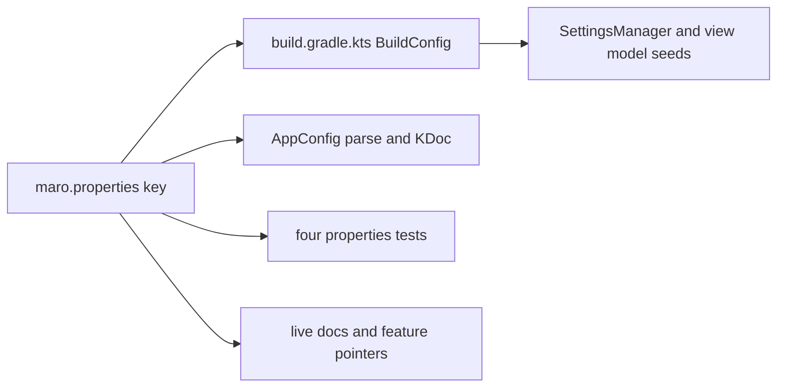

<!-- scope: feature -->

# `maro.properties` — documentation, taxonomy and consistency pass

**Status:** in design — nothing implemented, nothing committed.
**Branch:** `feature/maro-props`, cut from `origin/develop` at `8672e64`.
**Revision note:** the first draft of this plan was written against the copy of the file that `feature/marker-tile` carried, which is 384 lines. The branch's real file is **574 lines** and carries a `route.*` family and a `title.sort.*` block the draft never saw, so every finding, line number and block name below was re-derived from this branch. Two findings from the draft were dropped or withdrawn on re-reading, and they stay in the record rather than being deleted.

## Request

Document and clean [`maro.properties`](../../app/src/main/assets/maro.properties):

1. Review the overall taxonomy of the entries and improve, fix or clean what it exposes.
2. Above each functional block: white space plus a clean header carrying ASCII art naming the section and a one-line description of it.
3. Address the consistency issues.

The user's rulings: **full pass**, renames included (2026-09-30); decisions **D2–D8 approved as proposed** (2026-09-30).

## Context — why the file is not just a key list

- Two readers. [`AppConfig.init()`](../../app/src/main/java/ykws/android/maro/config/AppConfig.kt:867) reads it at runtime from the packaged asset; [`build.gradle.kts`](../../app/build.gradle.kts:40) reads it at configure time through a `providers.fileContents` provider and turns some of it into `BuildConfig` fields. The gradle KDoc is explicit that only a value landing on a `buildConfigField` can change `BuildConfig`, and that the runtime keys — every `route.*` among them — never reach the compiler.
- Gradle's parser skips any line whose trimmed form starts with `#` and splits on the first `=`, requiring `eq > 0` ([`build.gradle.kts:46`](../../app/build.gradle.kts:46)). Banner art is therefore safe with `#` in column 0, and a comment line is inert to both readers.
- `propInt` coerces to `0..100` and drops anything above `Int.MAX_VALUE` via `toIntOrNull()`. `propColor` exists to carry `#AARRGGBB` and to report what it could not read through `UNREADABLE_COLOUR_KEYS` ([`build.gradle.kts:80`](../../app/build.gradle.kts:80)) — R42's own fix, and it is applied to the route colour pair **only**.
- Four test classes read the shipped file and pin key names: [`TrackOutlineTest`](../../app/src/test/java/ykws/android/maro/ui/map/TrackOutlineTest.kt:29), [`HeatmapRampPropertiesTest`](../../app/src/test/java/ykws/android/maro/config/HeatmapRampPropertiesTest.kt:22), [`CoastlineAppearancePropertiesTest`](../../app/src/test/java/ykws/android/maro/config/CoastlineAppearancePropertiesTest.kt:139), [`MapMarkerTapFlashColorPropertiesTest`](../../app/src/test/java/ykws/android/maro/config/MapMarkerTapFlashColorPropertiesTest.kt:27). [`TrackSpeedHeatmapTest`](../../app/src/test/java/ykws/android/maro/ui/map/TrackSpeedHeatmapTest.kt:274) is **not** one of them for the ramp: its family cases drive `parseHeatmapFamilies` from a synthetic `familyLookup`, so it pins the parser's bound and never the shipped grid.
- Three `.properties` files exist; `zone.properties` is named in `AppConfig` and `MainActivity` comments but no such asset exists — re-verify the sites on this branch before repairing them.

## Baseline

Measured 2026-09-30 on this branch before any edit: `gradlew :app:testDebugUnitTest --tests "ykws.android.maro.config.*" --tests "ykws.android.maro.ui.map.*"` returned BUILD SUCCESSFUL in 27s with every properties test **running** rather than skipped — `CoastlineAppearancePropertiesTest` 5, `HeatmapRampPropertiesTest` 8, `MapMarkerTapFlashColorPropertiesTest` 2, `TrackOutlineTest` 9, `TrackSpeedHeatmapTest` 32, all zero failures. The red set is **empty**; the five and six drift reds older sessions carried have since been fixed on `origin/develop`. The first red after this pass is this pass's own.

## Findings

### Withdrawn on re-reading

- **F2 — withdrawn.** The draft read a three-way disagreement between the file's ramp, the code bound of 9 (`HEATMAP_MAX_FAMILIES`) and [`TrackSpeedHeatmapTest.kt:279`](../../app/src/test/java/ykws/android/maro/ui/map/TrackSpeedHeatmapTest.kt:279). Both halves are false: that test asserts the bound on a synthetic `familyLookup { it * 5 }`, so its 45 kn is the fixture's own arithmetic, and [`HeatmapRampPropertiesTest.kt:53`](../../app/src/test/java/ykws/android/maro/config/HeatmapRampPropertiesTest.kt:53) pins the shipped 7 families, their steps and their colours and is green. The ramp is not touched by this pass.
- **F6 — withdrawn.** The draft flagged `tracking.color.active=4279236544` as a value gradle's `propInt` cannot parse. On this branch those four keys are **retired** — [`build.gradle.kts:139`](../../app/build.gradle.kts:139) records that the active colour's property key went with three dead siblings — and `propColor` now carries `#AARRGGBB` with a report channel. What survives is F6b below.

### Confirmed

- **F1 — duplicate comment.** Two consecutive `Family 1` lines at [`:303`](../../app/src/main/assets/maro.properties:303) and `:304`, the first narrating the pre-recut grid.
- **F3 — a comment contradicting its value.** `speedZone.maxSearchM` reads 750 at [`:37`](../../app/src/main/assets/maro.properties:37) while its comment says "Default 500m". The value is also what gradle's own fallback states, so the prose is the stale half.
- **F4 — a packed alpha against the file's own rule, and a key with no reader.** `map.zone300.fill=#30E53935` ([`:549`](../../app/src/main/assets/maro.properties:549)) carries ~19 % alpha in the literal while the block two above states an alpha has one home in the transparency key, and its own comment calls the packed alpha vestigial. Stronger than the draft's "verify first": the key has exactly two hits in `app/src` — its `AppConfig` field ([`AppConfig.kt:1034`](../../app/src/main/java/ykws/android/maro/config/AppConfig.kt:1034)) and its parse ([:1770](../../app/src/main/java/ykws/android/maro/config/AppConfig.kt:1770)) — so it is parsed and drawn from nowhere. The drawn fill's transparency comes from `zone300FillTransparencyPct`.
- **F5 — four colour-literal styles in one file.** 6-digit uppercase (`#E53935`), 6-digit lowercase (`#1a6b1a`, `#f5f5dc`), 8-digit ARGB (`#30E53935`), and `${semantic.*}` interpolation ([`:525`](../../app/src/main/assets/maro.properties:525), `:543`), with a packed alpha on one leaf and nowhere else.
- **F7 — workspace drift.** Four consecutive blank lines at [`:44`](../../app/src/main/assets/maro.properties:44), three at `:215` and `:349`, two raw rules that match nothing else in the file ([`:47`](../../app/src/main/assets/maro.properties:47) `####…####`, `:208` `# ------`), the `──` banner glyph used by most blocks against `---` at `:477` and `:493`, the navigation block glued to the overlay-colours block with no blank line ([`:520`](../../app/src/main/assets/maro.properties:520) → `:521`), and the file ending on two blank lines.
- **F8 — the 3× reference density is stated twice**, at [`:379`](../../app/src/main/assets/maro.properties:379) and `:502`.
- **F9 — value drift against the code defaults.** `map.marker.tap.flashDurationMs=666` ([`:433`](../../app/src/main/assets/maro.properties:433)) against `AppConfig`'s `540L` ([`AppConfig.kt:1066`](../../app/src/main/java/ykws/android/maro/config/AppConfig.kt:1066)), and `map.marker.tap.flashPeakRatio=0.20` ([`:435`](../../app/src/main/assets/maro.properties:435)) against its `0.3333f` ([:1071](../../app/src/main/java/ykws/android/maro/config/AppConfig.kt:1071)). Both are read from the file at start ([:1533](../../app/src/main/java/ykws/android/maro/config/AppConfig.kt:1533)), so the shipped behaviour is the file's and only a missing key falls back — the code defaults are the wrong half and the file wins, per the standing rule that `*.properties` is the source of truth for every value.
- **F10 — stale references to this file elsewhere.** Re-verify on this branch: `zone.properties` in the `AppConfig` and `MainActivity` comments, and `widthPx` where the file now ships `widthDp`.

### New on this revision

- **F6b — the same overflow trap `propColor` was built to close is still open on the four past/pinned colour keys.** `tracking.color.pastFrom`, `.pastTo`, `.pinnedFrom` and `.pinnedTo` are read through `propInt` with ARGB fallbacks ([`build.gradle.kts:142`](../../app/build.gradle.kts:142)–`:149`), so an ARGB value written into the file above `Int.MAX_VALUE` is dropped and clamped the same silent way R42 exists to prevent — the route pair beside them already uses `propColor`.
- **F11 — one route role, three prefixes.** The route's drawing lives under `route.*` (`route.line.*`, `route.pin.*`, `route.navigate.color`), its list role under `tracking.color.routeFrom` / `tracking.transparency.routeFrom`, and its count and two gates under `tracking.route.*` ([`:356`](../../app/src/main/assets/maro.properties:356)–`:374`). Three homes for one feature, and the route count sits under `tracking.route.render.nb` while the track count sits under `tracking.render.nb`.
- **F12 — the colour word is spelled both ways.** `map.navigation.arrow.followSpeedColour` ([`:531`](../../app/src/main/assets/maro.properties:531)) against `tracking.route.allowSpeedColor` ([`:373`](../../app/src/main/assets/maro.properties:373)) and every `…color` key in the file.
- **F13 — `nb` is a French abbreviation in an English key set**, used twice (`tracking.render.nb`, `tracking.route.render.nb`).
- **F14 — keys that no longer exist and keys that never did.** `icon.back.active.transparency` and `icon.back.inactive.transparency` are read by gradle ([`build.gradle.kts:109`](../../app/build.gradle.kts:109)) and are absent from the file, and `ICON_BACK_*` has **zero** consumers in `app/src` — a build field with no reader and a key with no home. `stopDetection.gpsDormantPct` is the opposite case: read by gradle at [:173](../../app/build.gradle.kts:173) and by the app through `BuildConfig`, and absent from the file.

### Taxonomy — what the review exposes

| Group | Exposes |
|---|---|
| Prefix split | `track.*` and `tracking.*` both cover recording; `track.width.*`, `track.direction.*`, `track.arrow.*` and `track.heatmap.*` are rendering in a file where every other rendering key is under `map.*` |
| Marker split | `marker.*` (user markers) beside `map.marker.*`, which is not a user marker: it is the boat tap zone and the centre sprite |
| Route split | F11 above |
| Plural/singular | `regulatedZones.*` and `layer.regulatedZones.default` beside `map.regulatedZone.*` |
| `.default` suffix | means "this is a startup seed" in `layer.*` and `track.*`, and means something else inside `power.screen.grace.defaultMinutes` |
| Unit suffixes | `Ms` against `.ms` in `ui.map.inspect.dwell.ms`; `M` for metres against `_m` in `marker.proximity.pin_m` and `marker.focus.pin_footprint_m`; `maxspeedKn` against `maxSpeedKn`; `nb` (F13) |
| snake_case islands | `pin_m`, `zone_multiplier`, `corridor_share`, `zone_share`, `pin_footprint_m` in an otherwise camelCase file |
| Colour leaves | three spellings of one concept — `.color` (`map.coastline.mainland.color`), none (`map.zone300.fill`, `map.hazard.outline`), and a `Color` suffix (`track.heatmap.unknownColor`) |
| Leaf and namespace on one key | `map.zone300.boundary` is a colour while `map.zone300.boundary.widthDp` is a width, so one name is both a leaf and a namespace |

## Decisions

| # | Decision | Status |
|---|---|---|
| D1 | heatmap grid | **withdrawn** — see F2 |
| D2 | `map.marker.*` becomes `map.sprite.*` | **approved 2026-09-30** |
| D3 | the two dead `icon.back.*` gradle fields and their keys go | **approved 2026-09-30** |
| D4 | the missing seed keys are written into the file at their gradle defaults | **approved 2026-09-30** |
| D5 | the `.default` suffix is dropped | **approved 2026-09-30** |
| D6 | every colour leaf ends in `.color` | **approved 2026-09-30** |
| D7 | `track.boatMarker.autoMarker.*` moves to `marker.autoMarker.*` | **approved 2026-09-30** |
| D8 | the banner recipe below | **approved 2026-09-30** |
| D9 | F11: unify the route role on one prefix | **approved 2026-09-30** — the `route.*` domain takes it, per R13 |
| D10 | F12: standardise on `color`, so `followSpeedColour` becomes `followSpeedColor` | **approved 2026-09-30** |
| D11 | F4: delete the dead `map.zone300.fill` key with its field and parse | **approved 2026-09-30** — the fill's colour is the `zone300Color` setting and its transparency the user pair, so the key draws nothing |
| D12 | F6b: move the past/pinned colour keys to `propColor` like their route siblings | **approved 2026-09-30** |

## Target file shape

Banner recipe — a rule, a name line, a rule, then the description, then one blank line before the keys:

```
# ══════════════════════════════════════════════════════════════════════
# ▐▌ GPS POSITION PROCESSING
# ══════════════════════════════════════════════════════════════════════
#     Fix cadence and the accuracy gate the adaptive policy reads.
```

- Rule width: 72 characters including the leading `#` and one space.
- One blank line before a banner and one after the description line; never two, never none.
- `#` in column 0 on every banner line, so the gradle parser still skips it.
- The two raw rules at `:47` and `:208` are replaced by banners, as are the four headerless blocks and the two `---` headings.
- **Block order is the file's current order.** The taxonomy would group the three marker blocks together and lift the tap target beside the sprite, but reordering blocks is a large diff for no reader benefit, so the pass renames and heads the blocks where they stand and leaves the order as a noted follow-up.
- The route family is the one block needing sub-headings: it is 160 lines and 13 distinct subjects, so the parent banner is followed by `# ── <name> ─────` sub-rules for pacing and turns · engine, anchor and gate · line appearance · dimmed lines · navigating face · destination pin · invalid-end repair · avoid engine · depth gate · band and zone prices · candidate passes · candidate pruning · trip time budget.

Banner text per block, so the wording is decided here rather than improvised at the write:

| Block (file order) | Banner name line | One-line description |
|---|---|---|
| — | *file header* | the conventions, once, ahead of the first banner |
| `layer.*` | `LAYER VISIBILITY` | Which overlays are visible on first launch — read by the build and by the app. |
| `gps.*` | `GPS POSITION PROCESSING` | Fix cadence and the accuracy gate the adaptive policy reads. |
| `regulatedZone.*` | `REGULATED ZONE BAKE FILTER` | What the bake drops before the app ever sees a zone. |
| `speedZone.*` | `SPEED ZONE` | The hysteresis band and the search window the zone-ahead tile reads. |
| `route.*` | `ROUTE` | The trip's plan, its line, and the search that finds it. |
| `track.*` | `TRACK RECORDING` | Where a recording starts, and whether it starts at all. |
| `tracking.*` gates | `RECORDING GATES` | The accuracy and speed a fix must clear to be stored. |
| `marker.autoMarker.*` | `IDLE AUTO-MARKERS` | When an idle stop becomes a pin, and how close an existing pin must be to merge. |
| `tracking.gap*` | `TRACK GAP DETECTION` | The distance and time that open a GAP seam after a crash. |
| `track.direction.*` | `DIRECTION ARROWS` | The chevron spacing and the speed window it reads. |
| `track.arrow.*` | `CHEVRON TEMPERING` | How hard a chevron's metrics are pulled toward the knee. |
| `track.heatmap.*` | `SPEED HEATMAP RAMP` | The ramp a banded track paints with, and the legend scale it is read against. |
| `tracking.render.nb` + route role | `TRACK RENDERING ON MAP` | How many stored tracks and routes are drawn, and the route role's own pair and gates. |
| `track.width.*` | `TRACK OUTLINES` | One stroke table, per track type, against the reference density. |
| `marker.proximity.*`, `marker.focus.*` | `USER MARKERS` | Default proximity ranges, and how much of the map a selected marker frames. |
| `map.sprite.tap.*` | `MAP TAP TARGET` | The boat's tap zone and the accepted tap's flash. |
| `title.sort.*` | `LIST TITLE SORT` | The leading words an alphabetical title sort ignores. |
| `map.sprite.size.*` | `SPRITE AND CAP ARROW` | The zoom scaling the centre sprite and the cap arrow share. |
| `map.offset.*` | `MAP OFFSET` | The look-ahead camera offset and the modes that arm it. |
| `map.inspect.*` | `INSPECT MODE` | How long the map must stand still before a pick is taken. |
| `map.coastline.*`, `map.zone300.*`, `map.regulatedZone.*`, `map.isobar.*` | `MAP STROKES` | Stroke widths and one stroke transparency, in dp, against the reference density. |
| the re-homed colours | `MAP OVERLAY COLOURS` | Render colours that parameterise a behaviour rather than naming a palette role. |
| `map.isobar.*.widthDp` | `ISOBATH WIDTH BONUSES` | Extra dp on the major/minor base, per data source. |
| `power.screen.*` | `POWER MANAGEMENT` | The screen-hold policy's bounds, its default, and the staleness bound. |

File header carries the conventions once — the two readers, the load order, the unit-suffix rule, the colour-literal form, the transparency scale (0 = opaque, 100 = invisible), and the 3× reference density that F8 states twice.

## Rename table

| Rule | Old | New |
|---|---|---|
| R1 recording prefix | `track.originLat.default`, `track.originLon.default`, `track.geofenceRadiusM`, `track.enabled.default` | `tracking.originLat`, `tracking.originLon`, `tracking.geofenceRadiusM`, `tracking.enabled` |
| R2 rendering prefix | `track.width.*` (6), `track.direction.*` (4), `track.arrow.*` (2), `track.heatmap.*` (all), `tracking.render.nb` | `map.track.width.*`, `map.track.direction.*`, `map.track.arrow.*`, `map.track.heatmap.*`, `map.track.renderCount` |
| R3 idle markers | `track.boatMarker.autoMarker.*` (6), its `.transparency` | `marker.autoMarker.*`, `.transparencyPct` |
| R4 unit case | `map.offset.lookahead.maxspeedKn` | `map.offset.lookahead.maxSpeedKn` |
| R5 snake_case | `marker.proximity.pin_m`, `marker.proximity.zone_multiplier`, `marker.focus.corridor_share`, `marker.focus.zone_share`, `marker.focus.pin_footprint_m` | `pinM`, `zoneMultiplier`, `corridorShare`, `zoneShare`, `pinFootprintM` |
| R6 sprite | `map.marker.tap.*` (6), `map.marker.size.*` (3) | `map.sprite.tap.*`, `map.sprite.size.*` |
| R7 zone singular | `regulatedZones.defaultVesselLengthM`, `regulatedZones.filteredTypes`, `layer.regulatedZones.default` | `regulatedZone.*`, `layer.regulatedZone` |
| R8 layer suffix | the four `layer.*.default` keys, and `layer.lowDepthWarning` | suffix dropped, `layer.lowDepth` |
| R9 colour leaves | `map.zone300.fill`, `map.zone300.boundary`, `map.hazard.disc.fill`, `map.hazard.outline`, `map.zoneAhead.line`, `map.zoneAhead.cone.fill`, `map.zoneAhead.cone.outline`, `track.heatmap.unknownColor` | each gains `.color`, the last becoming `map.track.heatmap.unknown.color` |
| R10 inspect | `ui.map.inspect.dwell.ms` | `map.inspect.dwellMs` |
| R11 missing keys | — | `stopDetection.gpsDormantPct` written in at 80 (D4); the two `icon.back.*` fields and their reads deleted (D3) |
| R12 code follows the file | `AppConfig` flash defaults `540L` and `0.3333f` | `666L` and `0.20f` |
| R13 route role | `tracking.color.routeFrom`, `.routeTo`, `tracking.transparency.routeFrom`, `.routeTo`, `tracking.route.render.nb`, `tracking.route.allowSpeedColor`, `.allowSpeedArrows` | `route.color.from`, `route.color.to`, `route.transparency.from`, `route.transparency.to`, `route.renderCount`, `route.allowSpeedColor`, `route.allowSpeedArrows` |
| R14 colour spelling | `map.navigation.arrow.followSpeedColour` | `map.navigation.arrow.followSpeedColor` |
| R15 past/pinned colours | `propInt` reads at [`build.gradle.kts:142`](../../app/build.gradle.kts:142) | `propColor`, so an ARGB value written here is read rather than dropped |
| R16 heatmap grid | **withdrawn** — the file's grid stands; see F2 | — |

Every rename lands in five places: the file, the key string in [`build.gradle.kts`](../../app/build.gradle.kts:103), the `AppConfig` accessor's KDoc and parse, the four properties tests, and any live doc that restates the key.



## Regression review

| Vector | Why it could regress | Guard |
|---|---|---|
| Comment, banner and blank-line edits | Nothing: the gradle reader skips every `#` line and a comment is inert at runtime | none needed — the parser was read at [`build.gradle.kts:46`](../../app/build.gradle.kts:46) |
| A renamed key gradle still asks for under its old name | `BuildConfig` falls back to its hard-coded default silently, so a wrong value ships with a green build | the post-pass grep for every old literal, plus the four Properties tests |
| A renamed key `AppConfig` parses | A missed parse line leaves the colour or value unread and the code default stands | the same grep, plus the four tests |
| R9's `.color` suffixes | A missed KDoc or parse site reads a key that no longer exists | the same grep, plus `CoastlineAppearancePropertiesTest` |
| R12, the flash defaults | Nothing in the shipped app: the file carries 666 and 0.20 and `AppConfig` reads the file, so the code default only decides what happens when the key is absent | the parse was read at [`AppConfig.kt:1533`](../../app/src/main/java/ykws/android/maro/config/AppConfig.kt:1533) |
| R15, the past/pinned colours | Moving them to `propColor` changes nothing today, because the four keys are absent from the file and both helpers return the same fallback | the four keys stay absent unless D4 writes them in |
| D11, the dead fill key | Deleting `map.zone300.fill` changes nothing drawn — the field has no consumer | the two-hit grep is the evidence |
| D3, the two `icon.back.*` fields | Deleting a `BuildConfig` field breaks the build if anything reads it | 0 hits in `app/src`; the build is the second guard |
| D1/R16, the ramp | Untouched, so no colour, band count or legend row moves | [`HeatmapRampPropertiesTest.kt:53`](../../app/src/test/java/ykws/android/maro/config/HeatmapRampPropertiesTest.kt:53) pins it either way |

**No-regression verdict:** the pass is regression-neutral for the comment, banner, whitespace and rename steps, each with its guard named above, and the two items that could have moved a drawn value — F4's packed alpha and the ramp — are settled as dead-key and untouched rather than fixed blind. The empirical half of the claim is the post-pass run against the measured empty baseline; until that run exists, nothing here is proof.

## Open points

- **O1** — the `tracking.color.*` / `tracking.route.*` leaf names are only re-prefixed where D9 settles it. What `past`, `pinned` and `history` each mean is not readable from the file, so re-meaning them needs a read of the track overlay first.
- **O2** — `ui.map.inspect.dwell.ms=999` ([`:499`](../../app/src/main/assets/maro.properties:499)) looks like a debug constant rather than a shipped value; confirming needs the inspect-mode plan.
- **O3** — the block order is deliberately left as it stands (see the Target section).
- **O4** — F10's stale-reference sites must be re-grepped on this branch before they are repaired.

## Execution order

1. Cut the branch — **done**: `feature/maro-props`, `--no-track`, from `origin/develop` at `8672e64`.
2. Record the baseline — **done 2026-09-30**: green, empty red set (see Baseline).
3. Inventory the keys with their readers, so no key is renamed from a guess; this plan's Findings and Rename sections carry what that inventory produced.
4. Write the file header's conventions and the block banners, in the block order above, touching no key.
5. Apply the whitespace repairs: F7's blank runs, the two raw rules, the glued blocks, the trailing blanks.
6. Apply the comment-versus-value repairs: F1, F3, F5, F8, F9.
7. Apply the renames R1–R10 across all five places per key.
8. Settle and apply D9–D12, then R11, R13–R15.
9. Repair F10's stale references.
10. Verify: `apk-build.bat`, the scoped run compared against the empty baseline, then a grep for every old key literal across `app/`, `docs/` and the live feature files.
11. Add the `## Implemented` pointer in [`FEAT_DSC_Ui_Settings.md`](FEAT_DSC_Ui_Settings.md) and bake.

## Verification

- Gate: `apk-build.bat`. A missed rename does **not** fail the build, gradle falling back to its hard-coded default silently, so the properties tests and the post-pass grep are the real guards and both are mandatory.
- The scoped `config` + `ui.map` run must stay at zero failures. A properties test that is **skipped** rather than run counts as a failure of this plan, not a pass.
- Grep after the pass: zero hits for each old key literal outside historical plan files.

## Out of scope

- No value changes beyond F9's code-default alignment, and no new key beyond R11.
- No dependency, no file deleted or renamed, no commit and no push.
- Block reordering (O3), and re-meaning the track colour leaves (O1).
- Historical plan and feature text that names an old key stays as history; only live docs and pointers are repaired.

## Files affected

- [`app/src/main/assets/maro.properties`](../../app/src/main/assets/maro.properties) — the pass itself
- [`app/build.gradle.kts`](../../app/build.gradle.kts) — key strings, the `ICON_BACK_*` fields per D3, and the past/pinned reads per D12
- [`app/src/main/java/ykws/android/maro/config/AppConfig.kt`](../../app/src/main/java/ykws/android/maro/config/AppConfig.kt) — accessors, KDoc key names, the flash defaults, the dead fill field per D11
- [`MainActivity.kt`](../../app/src/main/java/ykws/android/maro/MainActivity.kt) — the phantom `.properties` comment
- the four properties test classes — key literals
- [`docs/color-scheme.md`](../../docs/color-scheme.md), [`docs/maro-code.md`](../../docs/maro-code.md), [`FEAT_DSC_Ui_Settings.md`](FEAT_DSC_Ui_Settings.md) — key names and pointers

## Outcome (2026-09-30)

Built on `feature/maro-props`, not committed. Steps 1–10 of the execution order ran; the file, both readers, four test classes and two live docs moved together.

- **The file** — [`maro.properties`](../../app/src/main/assets/maro.properties) rewritten in one write: a conventions header naming both readers, the load order, the unit/colour/transparency rules and the 3× reference; 24 block banners in the pinned wording; the route family headed with 13 sub-rules; the two raw rules at the old `:47` and `:208` replaced; the blank runs, the glued navigation block and the trailing blanks repaired (F7); F1's duplicate Family 1 line collapsed into one, F3's "Default 500m" corrected to 750, F5's literals normalised to uppercase, and F8's second 3× statement replaced by a pointer to the header. The ramp's values, steps and colours are untouched.
- **Renames** — R1–R10 and R13–R14 applied across the file, [`build.gradle.kts`](../../app/build.gradle.kts), [`AppConfig.kt`](../../app/src/main/java/ykws/android/maro/config/AppConfig.kt), [`HeatmapRamp.kt`](../../app/src/main/java/ykws/android/maro/config/HeatmapRamp.kt), [`SettingsManager.kt`](../../app/src/main/java/ykws/android/maro/data/settings/SettingsManager.kt), the four properties tests, `TrackSpeedHeatmapTest`'s fixture lookups, [`docs/color-scheme.md`](../../docs/color-scheme.md) and [`docs/maro-code.md`](../../docs/maro-code.md).
- **Reader reconciliation** — the two dead `ICON_BACK_*` fields and their keys deleted (D3); `stopDetection.gpsDormantPct=80` written in; the past/pinned colour pair moved to `propColor` (R15); R12's flash defaults set to the file's 666 and 0.20; D11's dead `map.zone300.fill` deleted with its field and parse, its colour key becoming `map.zone300.boundary.color`.
- **The headings, regrouped — the pass's own second half.** A first attempt put a block-letter banner on each of the 24 sections, and the user reverted it: art belongs on the high-level subjects alone. The file was therefore rewritten as **eight subject domains**, in this order — `LAYERS AND GPS` · `ZONES` · `ROUTE` · `TRACK` · `MARKER` · `MAP` · `MISC` · `POWER` — each opening on a five-row block-letter banner with a one-line description, while the finer sections came down to plain `# ── name ──` sub-headings. `MARO PROPERTIES` keeps a banner as the file's own header, and `title.sort.*` sits in `MISC` on the user's call rather than a domain of its own.
- **That grouping moved blocks**, since a subject has to be contiguous to be one domain: idle auto-markers left their place between the recording gates and the gap keys for `MARKER`; the sprite, offset and inspect blocks left the map's strokes and colours to lead `MAP`; and the track rendering keys moved up beside the recorder in `TRACK`. Key order is inert to both readers — gradle builds a map and `Properties` is a hashtable — so only the narrative moved, and the file stands at 800 lines against the 574 it started from.
- **The art is generated, not hand-typed** — a one-off [`maro-banners.ps1`](../../maro-banners.ps1) in the repo root renders a name from a 5-row font, ASCII-safe by construction: the solid is built from its code point and the name-line prefix from the two half-block code points, so the script assumes nothing about its own encoding, and it writes UTF-8 without a BOM. It stays untracked and deleting it is the user's call.
- **Verified** — `gradlew :app:testDebugUnitTest` scoped to `config` and `ui.map` BUILD SUCCESSFUL in 31s, no new warning, the five properties suites running rather than skipped with 0 failures (`CoastlineAppearancePropertiesTest` 5, `HeatmapRampPropertiesTest` 8, `MapMarkerTapFlashColorPropertiesTest` 2, `TrackOutlineTest` 9, `TrackSpeedHeatmapTest` 32), and a sweep of `app/src` and `docs` for every old key literal clean of survivors. Historical plans and `## Implemented` entries still name old keys and stay as history.
- **Re-verified after the art** — the first run after the banners rendered reported the test task `UP-TO-DATE`, so it proved nothing about the edited file; forced with `--rerun`, the five suites re-read it at 20:40:52 UTC with 0 failures and 0 skipped.
- **Outstanding, and the user's:** (a) D4's other half — the eight gradle-only seed keys (`tracking.color.pastFrom`, `.pastTo`, `.pinnedFrom`, `.pinnedTo`, `tracking.transparency.from`, `.to`, `.pinnedFrom`, `.pinnedTo`) are still absent from the file, so their names were left alone rather than moved; (b) **F15**, found during the write — `route.avoid.speedZone.outsideMargin.costFraction`'s comment said the fraction was 0.66 while the shipped value is 0.33, the sibling 300 m band's own 0.66 being the likely source of the drift, and the comment now reads 0.33; (c) **F16** — `route.avoid.speedZone.timeBudgetPct` ships 25 while its comment says "default 33", left untouched because whether 33 is the code default or stale prose was not readable from the file; (d) the Kotlin identifiers `followSpeedColour` and `navigationArrowFollowSpeedColour` still carry the UK spelling — D10 renamed the property key, not the Kotlin API.
