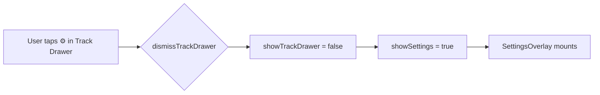

<!-- scope: feature -->
# Track Drawer — Add Settings Button to Maro II Header Row

## Current State

The [`TrackDrawerOverlay`](app/src/main/java/ykws/android/maro/ui/map/TrackDrawerOverlay.kt:108) header currently has only a back button + "Maro II" title:

```
[ ← back ]   Maro II
```

The Settings overlay is only reachable via the gear icon button on the right-edge control stack of the map. There is no Settings entry point from within the Track Drawer.

## Request

> "In the menu on the same row than the title 'Maro II' right align, add a Settings button"

## Proposed Layout

The header `Row` becomes:

```
[ ← back ]   Maro II  ·············· [ ⚙ Settings ]
```

Where:

- `← back` — existing `IconButton` (unchanged)
- `Maro II` — existing `Text` (unchanged)
- `··············` — `Spacer(Modifier.weight(1f))` to right-align
- `[ ⚙ Settings ]` — new gear icon button (same style as [`SettingsButton`](app/src/main/java/ykws/android/maro/ui/map/MapScreen.kt:1841) in the map controls, or a text "Settings" link)

## Wire Touch



When the user taps the Settings button in the Track Drawer:

1. The Track Drawer dismisses (`showTrackDrawer = false`)
2. The Settings overlay opens (`showSettings = true`)

This keeps the UX consistent: the Settings overlay is always a full-screen page, not a sub-page inside the drawer.

## Files to Modify

### 1. [`TrackDrawerOverlay.kt`](app/src/main/java/ykws/android/maro/ui/map/TrackDrawerOverlay.kt)

**Add parameter:**

```kotlin
onOpenSettings: () -> Unit,
```

**Modify header Row** (lines 108–132):

```kotlin
// ── Header: back button + "Maro II" title + Settings button ───
Row(
    modifier = Modifier.fillMaxWidth(),
    verticalAlignment = Alignment.CenterVertically
) {
    // ← Back button (existing)
    IconButton(onClick = onDismiss, ...) { Icon(ArrowBack, ...) }
    
    Spacer(Modifier.width(16.dp))
    
    // "Maro II" title (existing)
    Text(text = "Maro II", ...)
    
    // Right-align spacer
    Spacer(Modifier.weight(1f))
    
    // ⚙ Settings button (new)
    IconButton(onClick = onOpenSettings, ...) {
        Icon(Icons.Default.Settings, ...)
    }
}
```

**Add import:**
```kotlin
import androidx.compose.material.icons.filled.Settings
```

### 2. [`MapScreen.kt`](app/src/main/java/ykws/android/maro/ui/map/MapScreen.kt)

**Update `TrackDrawerOverlay` call** (line 841–851) — pass `onOpenSettings` that both dismisses the drawer and opens settings:

```kotlin
TrackDrawerOverlay(
    ...
    onDismiss = { showTrackDrawer = false },
    onOpenSettings = {
        showTrackDrawer = false
        showSettings = true
    },
    ...
)
```

## Button Style Options

| Option | Style | Pros | Cons |
|--------|-------|------|------|
| **A — Gear icon** | Same `IconButton` as back button | Matches existing SettingsButton style on map; compact | Icon-only, less discoverable |
| **B — Text link** | `"Settings"` text with clickable modifier | More explicit | Longer, pushes layout |
| **C — Icon + text** | Gear icon + "Settings" label | Most explicit | Needs more horizontal space |

**Recommendation: Option A** (gear icon) — it's the same icon already used for the Settings button on the map controls ([`MapScreen.kt:1841-1861`](app/src/main/java/ykws/android/maro/ui/map/MapScreen.kt:1841)), maintaining visual consistency.

The gear icon button would use the same styling as the existing back button: same size (48dp), same circle background, same icon tint from `AppConfig.uiSettingsTextPrimary`.

## Constraints & Edge Cases

1. **BackHandler** — already intercepts system back when the drawer is open (line 80). No change needed.
2. **Settings button during GPS recording** — the settings button is always available; the Settings overlay already works during recording.
3. **Animation** — the drawer's enter/exit animations (`slideInHorizontally` + `fadeIn`) are unaffected.
4. **Small screens** — the header row has `fillMaxWidth()` with 24dp horizontal padding. Adding a right-aligned icon is well within available space.

## Acceptance Criteria

1. TrackDrawerOverlay header shows: `[←][Maro II]········[⚙]`
2. Tapping `⚙` closes the drawer and opens the Settings overlay
3. Settings overlay works identically to opening it from the map gear button
4. No regressions in drawer animation, back handling, or existing controls
