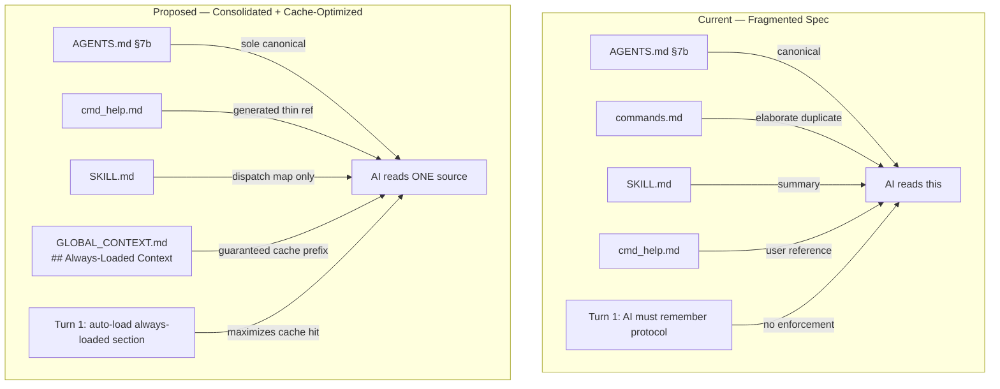

<!-- scope: feature -->
# xTrack System Review — Analysis & Proposed Improvements

**Date:** 2026-06-08
**Context:** Review of the xTrack `#`-command system against its two primary design goals:
1. **Self-documentation** — the system documents itself, its commands, and its features
2. **Context capturing for AI cache maximization** — minimize tokens, maximize prefix-cache hits

---

## Current Architecture (as-is)

```
xTrack/
├── GLOBAL_CONTEXT.md            ← routing map, active pointers, global rules
├── GLOBAL_TODOS.md              ← cross-cutting todos
├── FEATURE_SCOPE_*.md (×12)    ← feature epics with YAML front-matter
├── hydration/
│   └── CONTEXT_HYDRATION_*.md  ← per-feature ~200-word micro-state (×8)
AGENTS.md                        ← canonical rulebook (§7a/7b = xTrack spec)
.claude/skills/xtrack/
├── SKILL.md                     ← skill trigger + dispatch overview
├── references/
│   ├── commands.md              ← elaborate command spec (duplicates AGENTS.md)
│   ├── fuzzy-resolve.md         ← fuzzy resolution cascade
│   └── templates.md             ← file templates
docs/
├── cmd_help.md                  ← command reference (—help output)
├── *.md (×16)                   ← feature/design docs (varying attachment status)
```

---

## Findings & Issues

### 🔴 High Priority

#### H1. Spec Fragmentation — Same rules in 4+ places
The xTrack command spec lives in:
1. `AGENTS.md §7b` — canonical
2. `.claude/skills/xtrack/references/commands.md` — elaborate duplicate
3. `.claude/skills/xtrack/SKILL.md` — condensed summary
4. `docs/cmd_help.md` — user-facing reference

**Problem:** Any change to the command system requires touching 4 files. Drift is inevitable. The `#feature` spec in commands.md says to show git branch/worktree, but AGENTS.md says NOT to — this contradiction already exists.

**Proposal:** Consolidate to a single spec. Make `AGENTS.md §7b` the sole canonical source. Eliminate `commands.md`. Keep `cmd_help.md` as a generated thin reference. Keep `SKILL.md` as a dispatch map only.

#### H2. Hydration auto-load on Turn 1 is manual
AGENTS.md §7a says: "On first turn, read GLOBAL_CONTEXT.md, match intent against routing table, open feature file + hydration." But this relies on the AI remembering this protocol. There's no enforcement mechanism and no explicit "critical context" that's always loaded.

**Proposal:** Add a `## Always-Loaded Context` section to `GLOBAL_CONTEXT.md` containing links/pointers to the most cache-critical files (AGENTS.md, SKILL.md, cmd_help.md, templates.md, fuzzy-resolve.md). This guarantees these files are loaded every session, maximizing the prefix-cache discount without needing the AI to "remember" to load them.

#### H3. Orphan docs — no feature attachment
From `#doc list`: 16 docs exist but many have no feature attachment. Docs without attachment are invisible to the routing system.

| Doc | Attached To |
|-----|------------|
| `300MLineDesign.md` | ? |
| `300MLinePlan.md` | ? |
| `DepthMappingBake.md` | DepthMapping |
| `DepthMappingDesign.md` | DepthMapping |
| `DepthMappingPlan.md` | DepthMapping |
| `depthMappingSources.md` | DepthMapping |
| `FAQ.md` | ? |
| `GIT_WORKFLOW.md` | ? |
| `isOnWater-nearest-segment-design.md` | isOnWaterAgain |
| `MARKER_SIZING.md` | ? |
| `MARO_ARCHITECTURE.md` | ? |
| `PerformanceBatteryDesign.md` | Performance |
| `SETUP.md` | ? |
| `cmd_help.md` | WorkflowImprovement |
| `oZer/*.md` (×5) | ? |

**Proposal:** Audit and attach all docs to appropriate features. Add a `#doc audit` command that reports unattached docs.

#### H4. Several feature files lack `## Docs` sections
Features without `## Docs`: Coastline, Dashboard, CodeReview, GpsPlugin, MapDisplay, Performance, UiThingies, Zone300, ProjectDocumentation. Can't attach docs without this section.

**Proposal:** Auto-add `## Docs` section to all feature files that lack it (as part of `#doctor fix` or a dedicated `#doctor fix-docs`).

### 🟡 Medium Priority

#### M1. `#doc list attachment column` subfeature is [ ] but nested todos are [x]
The last remaining subfeature of WorkflowImprovement is unchecked, yet its 2 nested todos are both done. Just needs the parent checkbox flipped.

#### M2. Active feature is `isOnWaterAgain` (status: done) — stale pointer
Should be pivoted to `WorkflowImprovement` (which has the most recent activity, is the current focus of this review, and is `active`).

#### M3. Self-documentation gap: No `#doc generate` or `#doc sync`
The system can manage docs but cannot create or update a feature's profile doc from its YAML front-matter. A `#doc sync` command could:
- Read the feature's front-matter
- Generate/update a `docs/feature-SCOPE_NAME.md` with latest status, subfeature completion %, key file list
- Keep the doc in sync with the epic

#### M4. Template drift — GLOBAL_CONTEXT.md has `## Global Instructions` in template, but real file doesn't
The template in `references/templates.md` includes a `## Global Instructions` section that the actual `GLOBAL_CONTEXT.md` doesn't have.

### 🟢 Low Priority / Nice-to-Have

#### L1. `#bake` should auto-attach any docs referenced in `## Docs` that aren't yet created
Currently `#doc create` and `#doc attach` are manual two-step processes.

#### L2. Add `#diff` command to show what changed since last bake
A lightweight "since last session" view would help an AI quickly orient without re-reading the entire feature file.

#### L3. Document scope tags consistently across all docs
Currently `<!-- scope: ... -->` tags exist but aren't verified for consistency. A `#doctor` check for missing/invalid scope tags would help.

---

## Proposed Roadmap

### Phase 1 — Quick Fixes (low effort, high impact)
1. Flip `#doc list attachment column` subfeature `[ ]` → `[x]`
2. Pivot active feature from `isOnWaterAgain` → `WorkflowImprovement`
3. Add `## Docs` to all feature files that lack one (via `#doctor fix-docs`)
4. Attach orphan docs to their likely features

### Phase 2 — Spec Consolidation (medium effort)
5. Remove `references/commands.md` — keep only `AGENTS.md §7b` as canonical
6. Update `SKILL.md` to reference AGENTS.md only (no inline spec duplication)
7. Add `## Always-Loaded Context` to `GLOBAL_CONTEXT.md`
8. Fix template drift and AGENTS.md/commands.md contradictions

### Phase 3 — New Capabilities (higher effort)
9. `#doc sync` — generate/update feature profile docs from front-matter
10. `#doc audit` — report unattached docs and missing scope tags
11. `#diff` — lightweight "since last bake" view
12. Verify all hydration files are current (some may be stale)

---

## Mermaid: Current vs Proposed Architecture



---

## Key Metrics for Success

| Metric | Current | Target |
|--------|---------|--------|
| Spec locations to update per change | 4 files | 1 file (AGENTS.md) |
| Orphan docs | ~10 unattached | 0 unattached |
| Feature files with `## Docs` | 3/12 | 12/12 |
| Turn 1 cache prefix files loaded | depends on AI memory | guaranteed via Always-Loaded section |
| Subfeatures done | 18/19 | 19/19 (flip pending checkbox) |

