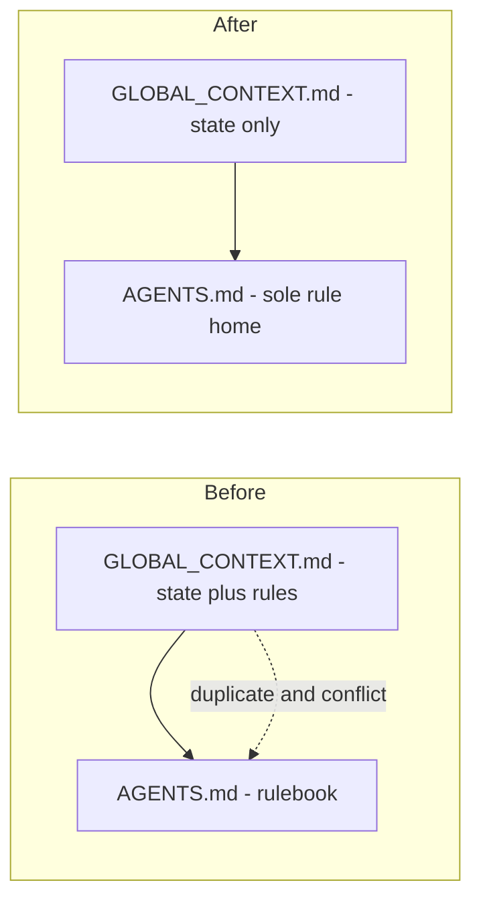

# FEAT_PLN — Global Context Rules Migration

**Feature:** WorkflowImprovement | **Branch:** `feature/global` | **Created:** 2026-09-11 19:40 UTC
**Goal:** `xTrack/GLOBAL_CONTEXT.md` becomes state-only. Every rule/instruction currently living in it is consolidated into `AGENTS.md` (the single source of truth).

## Problem

GLOBAL_CONTEXT.md holds two competing roles: **state** (routing, summaries, history) and a **second rulebook**. Consequences:

- Verbatim duplicates of AGENTS.md (`## Global Rules` 73/76/80, `## Global Instructions` 103/105).
- One hard conflict — line 79 instructs autonomous `switch_mode(code)` for shell commands while AGENTS.md MODE LOCK forbids it.
- Unique fragments exist only here (74, the `#implement` clause in 77, 78), so the section cannot be deleted wholesale.
- `#rule global:` writes into this section by design — the migration is not complete unless the command target moves too.

## Migration map

### `## Global Rules` — lines 70-80

| Line | Bullet | Status vs AGENTS.md | Action |
|---|---|---|---|
| 71 | CMD not PowerShell | unique | move to AGENTS §9 Environment and Tooling |
| 72 | `adb` on PATH | unique | move to AGENTS §9 |
| 73 | LOGCAT workflow | duplicate of Core Directives DEVICE LOGCAT | delete |
| 74 | Auto-refine wording on `#rule` add | already in `docs/cmd_help_rule.md` | delete |
| 75 | `apk-build.bat` builds APK | duplicate of `README.md` line 53 and `docs/MARO_ARCHITECTURE.md` line 25; real contract owned by BakeNormalization | replace with a one-line APK-pipeline pointer in AGENTS §9 — do not create a fourth copy |
| 76 | Git allowed on `#`-command invocation | duplicate of Core Directives exception | delete; GLOBAL_CONTEXT version diverges by naming `#checkout` — AGENTS wording already wins |
| 77 | MODE LOCK | duplicate of Core Directives MODE LOCK | fold unique clause Never suggest ready for `#implement` into AGENTS MODE LOCK, then delete |
| 78 | QUESTIONS: answer before acting | unique | move to AGENTS Core Directives |
| 79 | Auto-switch to Code for shell commands | conflicts with AGENTS MODE LOCK which gives Architect shell and git | delete; record rationale in this plan |
| 80 | PLAN FILE PLACEMENT | duplicate of AGENTS §7a | delete |

### `## Global Instructions` — lines 101-105

| Line | Bullet | Action |
|---|---|---|
| 102 | `#`-command system is canonical workflow | merge into AGENTS §7b intro |
| 103 | Turn 1 protocol | duplicate of AGENTS §7a Turn 1 Protocol — delete |
| 104 | Route docs/key files/todos to feature scope | move to AGENTS §7a |
| 105 | Reference docs lazy-loaded | duplicate of AGENTS Lazy-Load Index — delete |

### `## Always-Loaded Context` — lines 95-99

Process metadata, not state. Substance already owned by AGENTS §7a/§8a and `SKILL.md` (which is a thin adapter). Its descriptor of GLOBAL_CONTEXT.md becomes stale post-migration. **Action:** replace with one AGENTS §7a bullet listing the always-loaded files, then delete the section.

### Sections that stay (state, not rules)

| Section | Lines | Keep |
|---|---|---|
| Focus History | 3-13 | yes |
| Routing Map | 15-41 | yes |
| Feature Summaries | 43-68 | yes |
| Global Todos | 82-85 | yes — `#todo global:` target unchanged |
| Cross-Reference Docs | 87-93 | yes |

## AGENTS.md changes

1. New section **`# 9. Environment & Tooling`** — CMD over PowerShell, `adb` on PATH, and a one-line APK-pipeline pointer (`apk-build.bat` packages, `apk-bake.bat` bakes data, `apk-deploy.bat` installs). Mechanics stay authoritative in `README.md` and the BakeNormalization feature file; §9 carries imperatives and pointers only. Appended, so stable §1-§8 numbering is preserved — other docs cite those numbers.
2. **Core Directives** — add QUESTIONS bullet; extend MODE LOCK with the anti-`#implement`-prompt clause.
3. **§7a** — add invariant: GLOBAL_CONTEXT.md is state-only, all rules live in AGENTS.md; add docs/key-file/todo routing bullet; add always-loaded-files bullet.
4. **§7b** — retarget the `#rule` global scope to the new append target.

## Decisions (resolved 2026-09-11)

| ID | Decision |
|---|---|
| D1 | Env/tooling facts live in AGENTS.md §9 — always in context, needed to run commands. SETUP.md keeps device workflow detail only. |
| D2 | `#rule global:` appends to AGENTS.md Core Directives. No separate Project Rules section — an empty-slate section is a worse home than the existing directives list. |
| D3 | Tracked under WorkflowImprovement. Branch `feature/global`. |

## Downstream sync — required in the same commit

| File | Change |
|---|---|
| `docs/cmd_help_rule.md` | global target no longer points at GLOBAL_CONTEXT.md |
| `docs/cmd_help.md` | audit reference table for the same target mention |
| `.claude/skills/xtrack/references/templates.md` | strip Global Rules, Always-Loaded Context, Global Instructions from the GLOBAL_CONTEXT template — otherwise the next bootstrap recreates the drift |
| `docs/cmd_help_doctor.md` | add regression lint: GLOBAL_CONTEXT.md must not contain rule sections |
| `xTrack/WorkflowImprovement/FEAT_DSC_WorkflowImprovement.md` | key-file line references Always-Loaded Context plus Global Instructions |

Historical plan files that reference the old location are **not** rewritten — they are snapshots.

## Verification

1. Grep `Global Rules`, `Global Instructions`, `Always-Loaded` — remaining hits must be historical plans plus intentional references only.
2. No live command doc instructs writing rules into GLOBAL_CONTEXT.md.
3. GLOBAL_CONTEXT.md section list equals: Focus History, Routing Map, Feature Summaries, Global Todos, Cross-Reference Docs.
4. AGENTS.md diff is additive and minimal; §1-§8 numbering unchanged.

## Risks

| Risk | Mitigation |
|---|---|
| `#rule global:` behaviour change | document the new target in `#help rule` in the same commit |
| AGENTS.md is the always-loaded prefix — a malformed edit has session-wide blast radius | minimal patch, verify list nesting before commit |
| §9 becomes a fourth copy of README and build docs | §9 holds imperatives and pointers only; mechanics stay in README, BakeNormalization stays authoritative |
| Template not updated → drift resurrects on next bootstrap | template change is part of the same commit |

## Out of scope

Logging only, not fixing:

- Feature Summaries one-liners have become changelogs; the Ui_Settings cell is truncated mid-word.
- Focus History entries exceed the one-liner spec.
- Feature Summaries table is not Modified-desc sorted.

## Outcome

Implemented 2026-09-11 on `feature/global` — GLOBAL_CONTEXT.md is state-only.

- **AGENTS.md:** new §9 Environment & Tooling; QUESTIONS directive added to Core Directives; MODE LOCK gained the anti-`ready for #implement` clause; §7a gained the state-only invariant, feature-scoping and always-loaded bullets; §7b `#rule` retargeted to Core Directives; dead `§7b.16` pointer fixed in §8b; header adapter line tightened; the malformed `Maro_II_b` context rule repaired (wrong repo name, unterminated bold).
- **GLOBAL_CONTEXT.md:** `## Global Rules` (10 bullets), `## Global Instructions` (4 bullets) and `## Always-Loaded Context` deleted; state-only banner added at the top; `## Global Todos` and `## Cross-Reference Docs` retained.
- **Command and doc sync:** `docs/cmd_help_rule.md` (global target), `docs/cmd_help_doctor.md` (new lint class, report-only), `.claude/skills/xtrack/references/templates.md` (template can no longer recreate the sections), `docs/cmd_help_implement.md` (dead `§7b.16`), WorkflowImprovement FEAT_DSC (key-file line + two dead doc references dropped).
- **Verification:** case-insensitive sweep for the removed vocabulary returns hits only inside historical plan files.

Notes: bullet 75 (`apk-build.bat`) became a pointer, not a fourth copy of a fact already in README and BakeNormalization. Bullet 79 (auto-switch to Code) was deleted as a MODE LOCK conflict. Deferred, not fixed: Feature Summaries truncation and changelog bloat, Focus History verbosity, summaries table not Modified-desc sorted.
