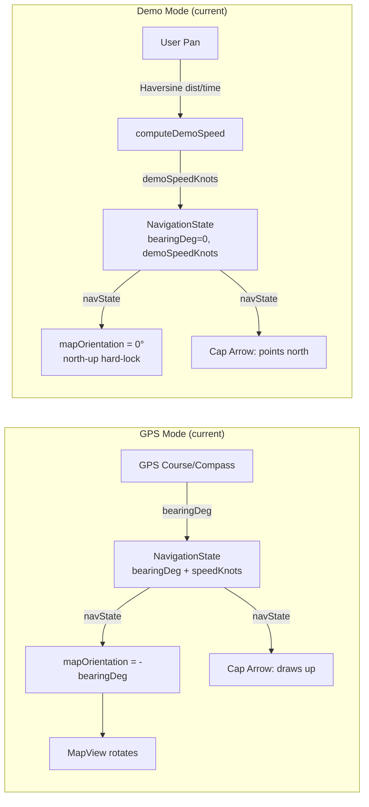
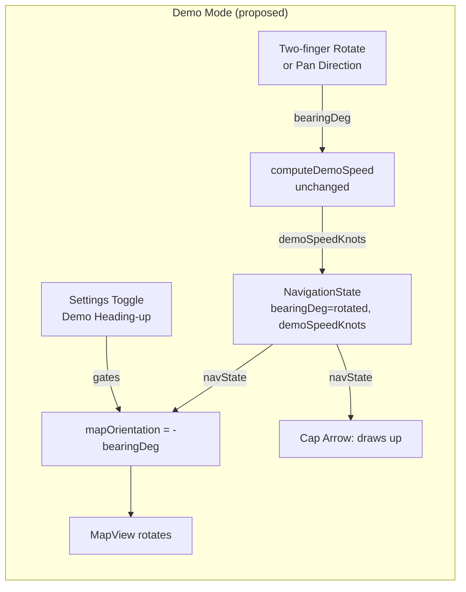

<!-- scope: feature -->
# Rotate Map in Demo Mode — Implications Analysis

> Feature: [`UI_Map`](xTrack/UI_Map/FEAT_DSC_UI_Map.md) → subfeature `rotate`
> Branch: `feature/rotate-map-demo-mode`

---

## 1. Problem Statement

Currently in **demo mode** (`gpsMode == false`):

- The map is **hard-locked to north-up**: [`MapScreen.kt:262`](../app/src/main/java/ykws/android/maro/ui/map/MapScreen.kt:262)
  ```kotlin
  if (!appSettings.gpsMode) { mv.mapOrientation = 0f; mv.invalidate(); return@LaunchedEffect }
  ```
- [`NavigationState.bearingDeg`](../app/src/main/java/ykws/android/maro/ui/map/CoastlineViewModel.kt:63) stays at `0f` (default) because [`setMapBearing()`](../app/src/main/java/ykws/android/maro/ui/map/CoastlineViewModel.kt:290) is only called from GPS course or compass fallback
- The cap arrow always draws **straight up (screen-top)** ([MapScreen.kt:1189-1201](../app/src/main/java/ykws/android/maro/ui/map/MapScreen.kt:1189)), so in north-up demo mode it points to geographic north
- Demo pan-speed is computed from Haversine distance ÷ elapsed time ([CoastlineViewModel.kt:624-652](../app/src/main/java/ykws/android/maro/ui/map/CoastlineViewModel.kt:624))

### Proposal
Allow map rotation in demo mode, deriving the heading/bearing from:
1. **Two-finger rotation gesture** on the MapView (osmdroid or custom), OR
2. **Pan direction** (the vector the user is dragging toward)

The rotated bearing updates [`NavigationState.bearingDeg`](../app/src/main/java/ykws/android/maro/ui/map/CoastlineViewModel.kt:63), which drives both `mapOrientation` and the cap arrow.

---

## 2. Current Architecture (Data Flow)



### Key invariant
The cap arrow **always draws straight up (screen-top)** ([Navigation rule](xTrack/Navigation/FEAT_DSC_Navigation.md:38)):
> "Arrow always draws straight up (screen-top) — heading-up map rotation aligns heading with screen-up via `mapOrientation = -bearingDeg`."

The perceived heading direction comes from map rotation, not arrow rotation. This invariant must be preserved.

---

## 3. Proposed Architecture (Demo Rotation)



### Bearing source options

| Source | Pros | Cons |
|--------|------|------|
| **Two-finger rotation gesture** | Full manual control; user rotates to any angle; intuitive on touch | Requires gesture plumbing; osmdroid has limited rotation support; must not interfere with pinch-zoom |
| **Pan-direction-derived** | Automatic; no extra gesture needed; heading follows where user looks | Hard to define "direction" from free-form pan; flings create erratic heading; less precise |
| **Compass (device magnetometer)** | Accurate heading without GPS | Consumes sensor; works anywhere; but demo mode is meant to be free of real-world constraints |

**Recommendation: Two-finger rotation gesture** as the primary bearing source, with the option to derive from pan direction as a secondary mode. Compass is out of scope — demo mode should stay synthetic.

---

## 4. Per-Feature Impact Analysis

### 4.1 [`UI_Map`](xTrack/UI_Map/FEAT_DSC_UI_Map.md) — Direct owner

| Subfeature | Impact |
|-----------|--------|
| **layer refresh** | No impact — orientation change triggers `invalidate()` at same cadence as GPS mode |
| **depth color** | No impact — `GroundOverlay` renders correctly at any orientation |
| **zone proximity auto-reveal** | No impact — uses map-center distance, not orientation |
| **speed in demo** | Independent — pan-velocity speed computation is orthogonal to rotation |
| **layer-zone** | No impact — `DepthZoneMask` is baked data, orientation-agnostic |
| **config 300m auto display** | No impact — per-mode toggles are gating logic, not orientation |
| **layer-lowdepth** | No impact — `GroundOverlay` renders correctly at any orientation |
| **toggle-danger-layer** | No impact — button position is Compose layout, not map orientation |
| **rotate (new)** | **Direct impact** — this is the feature |

**Changes needed in UI_Map:**
- [`MapScreen.kt:262`](../app/src/main/java/ykws/android/maro/ui/map/MapScreen.kt:262): Relax the `mv.mapOrientation = 0f` hard reset — apply rotation when demo heading-up is enabled
- Add rotation gesture handler to MapView in demo mode
- Thread demo bearing through to `NavigationState.bearingDeg`

### 4.2 [`Navigation`](xTrack/Navigation/FEAT_DSC_Navigation.md) — Cap arrow

| Component | Impact |
|-----------|--------|
| **Cap arrow** | **Directly affected** — arrow always draws up; with rotated map the arrow now points in demo heading direction. Same behavior as GPS mode. |
| **Direction line** (dashed line to top edge) | **Directly affected** — draws from center straight to top edge. With rotated map, the line extends in the map-up (heading) direction. Works as intended. |
| **Arrow length** (speed-proportional) | No impact — uses `effectiveSpeedKn` which already merges `speedKnots ?: demoSpeedKnots` |
| **Variable Arrow toggle** | No impact — controls visibility, not direction |
| **Heading line toggle** | No impact — controls visibility, not direction |

**Key insight:** The Navigation feature is already designed for this exact scenario. The invariant "arrow draws straight up, map rotates under it" is the same as GPS mode. **No changes needed in Navigation.**

### 4.3 [`GPS`](xTrack/GPS/FEAT_DSC_GPS.md) — Demo mode

| Component | Impact |
|-----------|--------|
| **demo speed computation** | No impact — `computeDemoSpeed()` is orthogonal to rotation |
| **demo mode north-up** | **Changes** — north-up is no longer guaranteed when rotation is active |
| **GPS↔demo toggle** | No impact — toggling resets state via the `gpsMode` change handler ([CoastlineViewModel.kt:478-495](../app/src/main/java/ykws/android/maro/ui/map/CoastlineViewModel.kt:478)) |
| **dashboard** | No impact — dashboard speed card merges GPS/demo speed correctly already |

**Risk:** When toggling from GPS (rotated) to demo (now also rotatable), the map should not "jump" orientation if the last demo rotation was 0°. Solution: persist demo bearing separately or reset to north-up on mode switch.

**Changes needed:**
- [`CoastlineViewModel.kt`](../app/src/main/java/ykws/android/maro/ui/map/CoastlineViewModel.kt): Add path for demo bearing to update `NavigationState.bearingDeg`
- Reset demo bearing when the rotation feature is disabled or mode switches

### 4.4 [`Performance`](xTrack/Performance/FEAT_DOC_Performance_battery-design.md)

| Concern | Impact |
|---------|--------|
| **Map repaint cost** | **Moderate risk** — each rotation gesture fires `invalidate()`. In GPS mode this is throttled via `cameraUpdates` (5-50 fps). In demo mode, raw touch events could exceed this |
| **Battery** | **Low risk** — demo usage is typically short (planning/demonstration). GPS mode already rotates maps |
| **animateTo interaction** | No impact — demo mode doesn't use `animateTo` |

**Mitigation:** Throttle rotation-induced invalidations to match the GPS mode cadence (`mapRefreshFps` setting) even in demo mode.

### 4.5 [`DepthMapping`](xTrack/DepthMapping/FEAT_DSC_DepthMapping.md)

| Concern | Impact |
|---------|--------|
| Depth overlays (`GroundOverlay`) | **No impact** — osmdroid handles map rotation for tile and overlay layers automatically |
| Isobaths | **No impact** — drawn as map overlays, orientation-independent |
| Color ramp | **No impact** — color is by depth value, not orientation |

### 4.6 [`Coastline`](xTrack/Coastline/FEAT_DSC_Coastline.md)

| Concern | Impact |
|---------|--------|
| Distance-to-coast computation | **No impact** — uses `_mapCenter` LatLng, which is independent of orientation |
| 300m zone proximity auto-reveal | **No impact** — uses distance from center, not orientation |
| Water/land detection | **No impact** — point-in-polygon, orientation-agnostic |

### 4.7 [`RegulatedZones`](xTrack/RegulatedZones/FEAT_DSC_RegulatedZones.md)

| Concern | Impact |
|---------|--------|
| Regulated zone overlays | **No impact** — `GroundOverlay` orientation-independent |
| Zone icon mapping | **No impact** — based on data classification |
| Speed enforcement | **No impact** — demo mode uses synthetic speed already |

### 4.8 [`DepthSafety`](xTrack/DepthSafety/FEAT_DSC_DepthSafety.md)

| Concern | Impact |
|---------|--------|
| Low-depth warning overlay | **No impact** — `GroundOverlay`, orientation-independent |
| Depth alerts | **No impact** — depth value from grid, not orientation |

### 4.9 [`ArcLayout`](xTrack/ArcLayout/FEAT_DSC_ArcLayout.md)

| Concern | Impact |
|---------|--------|
| Layer toggle arc menu | **No impact** — Compose overlay, completely independent of map orientation |

### 4.10 [`Ui_Settings`](xTrack/Ui_Settings/FEAT_DSC_Ui_Settings.md)

| Concern | Impact |
|---------|--------|
| **New toggle** | **New setting needed** — "Demo mode heading-up" toggle in Settings → Display |
| Scroll persistence | No impact — new toggle is a standard boolean setting |

### 4.11 [`Ui_Dashboard`](xTrack/Ui_Dashboard/FEAT_DSC_Ui_Dashboard.md)

| Concern | Impact |
|---------|--------|
| Dashboard layout | **No impact** — fixed-position Compose panel, unaffected by map rotation |
| Speed card | **No impact** — reads `speedKnots ?: demoSpeedKnots`, already works in demo mode |

### 4.12 [`BakeNormalization`](xTrack/BakeNormalization/FEAT_DSC_BakeNormalization.md)

| Concern | Impact |
|---------|--------|
| Build pipeline | **No impact** — pure runtime feature, no data changes |

---

## 5. Implementation Summary

```mermaid
flowchart TD
    A[Add Settings toggle<br/>Demo heading-up] --> B[Relax mapOrientation<br/>reset in MapScreen.kt:262]
    B --> C[Add rotation gesture<br/>handler to MapView]
    C --> D[Wire demo bearing<br/>→ NavigationState.bearingDeg]
    D --> E[Throttle invalidate()<br/>in demo rotation]
    E --> F[Verify all overlays<br/>at rotated angles]
    F --> G[Build + on-device test]
```

### Files to modify

| File | Change |
|------|--------|
| [`MapScreen.kt`](../app/src/main/java/ykws/android/maro/ui/map/MapScreen.kt) | Line 262: gate `mv.mapOrientation = 0f` behind setting; add rotation gesture; thread demo bearing |
| [`CoastlineViewModel.kt`](../app/src/main/java/ykws/android/maro/ui/map/CoastlineViewModel.kt) | Add demo-bearing update path; reset on mode switch |
| [`SettingsManager.kt`](../app/src/main/java/ykws/android/maro/data/settings/SettingsManager.kt) | Add `demoHeadingUp` boolean (default false) |
| [`strings.xml`](../app/src/main/res/values/strings.xml) + [`strings-fr.xml`](../app/src/main/res/values-fr/strings.xml) | Toggle labels EN/FR |
| [`maro.properties`](../app/src/main/assets/maro.properties) | Optional: default rotation degrees |

### Files with no changes needed

All overlay-based features (depth, isobaths, 300m zone, regulated zones, low-depth warning) — osmdroid handles rotation natively. The Navigation cap arrow and direction line already work correctly because they draw screen-relative.

---

## 6. Risks & Mitigations

| Risk | Likelihood | Impact | Mitigation |
|------|-----------|--------|------------|
| Rotation gesture conflicts with pinch-zoom | Medium | High | Use osmdroid's built-in rotation support or detect 2-finger rotation separately from zoom |
| `invalidate()` churn from raw touch events | Medium | Medium | Throttle to `mapRefreshFps` cadence (same as GPS mode) |
| Map jumps when toggling GPS↔Demo | Low | Low | Reset demo bearing to 0° on mode switch or persist separately |
| osmdroid rotation support is limited | Low | Medium | Fall back to custom Canvas rotation or use Compose gesture + set `mapOrientation` directly |
| North-up users confused by rotated demo map | Medium | Low | Feature is opt-in via Settings toggle, default OFF |

---

## 7. Open Questions

1. **Bearing source in demo mode** — Two-finger rotation (pure gesture) vs pan-direction-derived? The former is more intentional; the latter is more automatic but erratic.
2. **Should demo rotation persist across sessions?** Or reset to north-up each time? Recommendation: persist only when the toggle is on and user explicitly rotated (store last demo bearing in SharedPreferences).
3. **Should the direction line (dashed line) still draw to the rotated "top"?** Yes — it already draws to screen-top, which in heading-up mode IS the heading direction.

